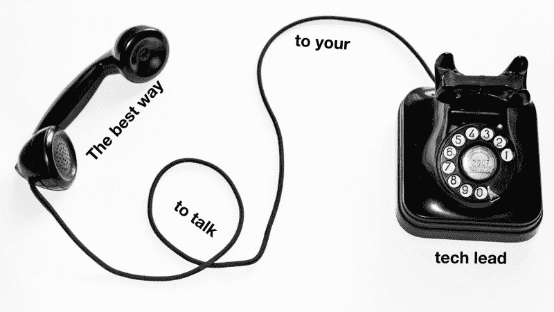

# 如何与你的技术主管交谈并解决你的沟通问题

> 原文：<https://www.freecodecamp.org/news/the-best-way-to-talk-to-your-tech-lead-fc6e7adb1e55/>

格雷格·萨博

# 如何与你的技术主管交谈并解决你的沟通问题



这就是你搞砸的地方。

您的技术主管告诉您为即将到来的特性构建一个新的 API 端点。本来应该很简单:只需返回当前用户的电子邮件地址列表。

你从通常的样板开始。您注册了新的端点。你把它和控制器联系起来。您添加一个解释性注释。

然后你发现查询是不可能的。用户的电子邮件地址都存在于不同的数据库碎片中。

脚灯打开了。帷幕升起。这是你成为软件巨星的时候了！你会用你的努力和创造力找到解决这个独特问题的方法。

您开始构建一个非规范化的表来将数据保存在用户的分片中，并构建一个包装层来保持副本的同步。您的解决方案具有可扩展性和高性能。看你走了！

问题来了。你没有和你的技术主管谈过。从他们的角度来看，他们给了你一个简单的工作，而你花的时间是预期的三倍。不管你是否在创造完美的建筑。你已经侵蚀了与团队领导之间的信任。

最好的工程师可以创建优雅的系统，但他们也要以正确的方式与他们的技术领导交流。以下是我的推荐。

### 1.在会议中，关注你是如何解决问题的

该是单口相声的时候了。你会对你的团队和你的老师说什么？

“我昨天在这件事上取得了一些进展。我遇到了一些测试失败，我现在正在修复它们。我希望今天就能发货。”

那是状态更新。这毫无意义。

状态更新是除了“好，听起来不错”之外没有任何回应的交流那为什么还要花时间亲自更新这些信息呢？

举行站立会议的目的是鼓励团队成员相互沟通。传统的三个问题是:

```
1\. What did you finish yesterday?2\. What will you finish today?3\. What's blocking you?
```

人们经常关注前两个，而完全忽略最后一个。但这是最重要的！

人们经常把“是什么阻碍了你”解释为“是什么完全阻止了你工作？”这就是为什么我更喜欢问“你的红旗是什么？”相反。

危险信号是任何会让你慢下来的事情。以下是一些危险信号的例子:

*   "我不知道如何开始这个测试."
*   “我需要弄清楚移动团队需要我在这里做什么。”
*   "我需要重构这个组件来让它工作."

这些都不是完全阻止你工作的事情。但是它们会占用你相当多的时间。

这是你的技术主管想听到的。这是他们做好本职工作的最好机会，帮助你加快速度，为你最棘手的问题提出解决方案。

关于危险信号的一个重要注意事项:当你表明你的危险信号时，你应该始终对你的项目保持清晰的责任。你不应该习惯于把危险信号作为不完成工作的借口。

大多数人想在站立时听起来令人印象深刻。他们想说，“看看我昨天做的这些东西！你看我多牛逼。”抵制这种诱惑，把注意力放在如何加快未来的工作上。

### 2.在会议间隙，主动沟通

当你作为团队领导或技术领导工作时，你会有这种持续的偏执，认为你的团队完全陷入困境，而你却不知道。

你走进团队的工作舱，每个人都在自己的办公桌前。但是他们在做什么呢？他们进展顺利吗？他们是否花费时间以完全错误的方式实现某些东西？很难说。

当然，技术领导绝对必须与他们的团队建立信任关系。他们不能让这种偏执时刻控制自己的行为。所以他们最终没有问。

这是您满足技术主管需求的机会。你应该每天至少两次主动交流你在做什么。

我说的主动沟通是什么意思？我是指任何由你发起的谈话。由您的技术主管发起的签到和预定会议不算主动。

主动沟通的方法示例:

*   发送时差消息
*   评论他们正在进行的体式任务
*   当他们回到办公桌前时抓住他们

主动沟通有时采取[寻求帮助](https://hackernoon.com/how-awesome-engineers-ask-for-help-93bcb2c7dbb7)的形式。“我无法导入此模块，也不知道出了什么问题。能帮忙吗？”这些都是技术领导做他们工作的机会，如果你真的受阻，那么这是值得花时间。

主动沟通的另一种形式是检查点。比如，“我正在开发这个特性，我发现我需要将这个状态提升到根组件才能工作。如果你想讨论这个问题，请告诉我。”这是暴露潜在架构分歧的好方法。严肃地说，不要再等着代码审查再讨论这些东西了。

主动沟通似乎很容易。实际上，每个人在用这种交流方式“打扰”别人之前都会犹豫。试着在你的待办事项列表中加入一项日常任务来主动交流，你就会明白我的意思了。

像所有的交流模式一样，值得你花时间与你的技术主管就他们的偏好进行公开讨论。他们讨厌懈怠吗？每天更新多少次状态太多了？你过去一周的交流对团队有没有好处？

### 3.在技术讨论中，重复并总结

重要的是，您和您的技术负责人至少要在您做出的技术决策上保持一致。您实现这种一致的机会是技术对话。

技术对话可能看起来像是你的技术主管与你坐下来开始一个新项目。您的技术主管对如何实施有一些初步想法，他们正在与您分享。

通常，你的技术领导可能比你有更多的历史背景。所以他们可能会说至少一件让你觉得“嗯？”

你的技术主管知道这一点。但是他们不知道他们说的哪些话会让你“嗯？”除非你真的说“啊？”

总是澄清你做的事情和 T2 不觉得困惑的事情。与其说“我迷路了”，不如澄清“我理解 X，但我不理解 y。”

最终，你希望你的技术主管带着很大的信心离开谈话，因为你听到并理解了他们要说的话。很多人试图通过微笑和点头来达到这个目的。那会产生相反的效果。

当你理解时，不要微笑和点头，**重复和总结**你所听到的。

例如:

> “明白了。我听到的是，我应该在服务器上计算这个值以减少往返次数，并在页面加载期间将其发送到客户端。”

这很好地向你的技术主管证明了你在倾听他们。这实际上迫使你更好地倾听。

当尝试这种方法时，一开始你会有抵触情绪。感觉你有点专横和爱插嘴。这也有点像你只是在以高人一等的态度复制他们所说的话。

不要让这阻止你。想想技术领导会有什么感觉。我可以告诉你，看到对方主动重复总结，真的是一种解脱。

这些摘要通常是行动项目。你的下一步应该是把它们写在某个地方。把它们放在你的技术负责人可以看到的地方，如果你错了，可以提供纠正。

### 做一个超级合作者

技术领导希望与有责任心的工程师一起工作。如果您不熟悉正在使用的系统，这在技术层面上可能很难做到。

但是你**能**负责的是你**如何与**沟通你的工作。想想你可以如何改变与你的技术领导的沟通模式，你会很容易发现强大的新习惯来建立。

#### 如果你热衷于帮助团队有效合作，你应该[在 Asana](https://asana.com/jobs/engineering?utm_source=medium&utm_medium=blog&utm_content=talk-to-tech-lead) 和我一起工作。