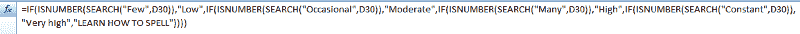

# 我是如何在编程中从失败走向成功的，是什么让我成功的

> 原文：<https://www.freecodecamp.org/news/how-i-went-from-failure-to-success-in-programming-and-what-got-me-there-7bfe151b30ef/>

在过去的 10 年里，我有过三次尝试学习编程的经历。我想知道为什么我会有如此不同的结果。是什么让我既失败又成功？

我终于有答案了！

在这三次经历中，有三个因素影响最大。

我将带你经历每一次经历，并向你展示每一个因素是如何在我的成败中发挥作用的。

### 初期故障

我第一次尝试编程是在我 18 岁的时候。刚从高中毕业。

大学一年级。

这不是一个计算机科学或软件工程项目。我是土木工程专业的。想想建筑和桥梁。

Photo Credit: [Peter-Lomas](https://pixabay.com/en/users/Peter-Lomas-5966639/) ([Pixabay](https://pixabay.com/en/construction-building-berlin-2530759/))

这是一门用 Matlab 教授的计算机科学入门课程。所有的工程师都必须接受。

平心而论，如果不是因为我的编程朋友，我想我在班里不会做得很好。有许多概念我根本无法理解。即使有外部的帮助。

我可以回过头来责怪一百万件事，为什么我没有学会所有的概念。为什么我离开了那门讨厌编程的课。然而，这只是一堆借口。

那么为什么会这样呢？为什么我失败了？

#### 太酷了

我学编程失败是因为我没有学习的欲望。对，欲望！这只是对我的一个要求。这样我才能拿到学位。

不多不少。

我不想上这门课。我不得不接受。这种心态让你对待学习的方式大不相同。

我认为上这门课的唯一好处是我可以拿到学位。不是为了扩展我的知识，或者学习新的东西。我对学习如何编程持封闭态度。

难怪最后的结果很糟糕。我已经离开了那个讨厌编程的班级，再也不想编程了。这让我很沮丧，因为我从来没有得到那些初学者的概念。

但是我已经看到了编程的力量和一些人能够用它做什么。所以我至少带着对编程的尊重离开了这个班级。

我只是觉得这不适合我。

#### 没有光

没有目标是决定我失败的第二个因素。对我来说，除了要求之外，我没有别的目的。

我的目的只是想取得一个好成绩，这一点已经表现出来了。在我结束这门课的几年后，我几乎忘记了所有的事情。它只是没有留在我的脑海里。它没有理由。

我只是为了现在的而学习它，而不是为了 T2 未来的。

我的计划是永远不学编程。是为了完成课程。我想拿到学位，我必须做任何需要做的事情。

如果我有这样的目的，它会有助于创造最后一个因素。因为光有目标是不会让你成功的。

#### 不够重要

最后一个因素是动机。这也是我所缺失的，也是导致我失败的原因。

当我被激励去做某事时，我不会放弃。我会一次又一次地尝试，直到我弄明白为止。直到我做对为止。我就是这样的人。

那么为什么在我连几个编程概念都把握不住的情况下，我没有应用这个座右铭呢？

那是因为我没有动力。

为什么我要花更多的时间和精力去学习编程，而这甚至与我的学位无关？我有其他更重要的课。

即使我有学习编程的愿望和目的，我也没有动力。无论如何我都不会成功。我早就放弃了。我不愿意花时间和精力去学习它。

在我的下一次尝试中，这些因素有多大的不同？

### 首次成功

快进到八年后。这大概是我再次尝试编程所花的时间。是的…八年了！

我花了很长时间才回来。

与此同时，我拿到了学位。抽出一点时间去旅行，工作了几年。

然后我终于到了我**想要**重新尝试编程的地步。

是的，我想！

你可能会想…什么？你不是说你讨厌编程吗？

是的，我做到了，但时间会治愈一切创伤。情况变了。

这一次情况有所不同。

为什么？

这一切都与这三个因素有关。

#### 极限

这一次，我学习编程的愿望完全不同。我是有原因的。我**想让**学编程。

我是怎么开始想学习的？

嗯，在这之前一点点，我已经开始进入创业和阅读商业书籍。我慢慢意识到，有一天我想拥有自己的在线业务。

我知道如果我想在网上做些什么，我可能应该学习编程。

尽管这不是原因的驱动因素。

这个因素其实来自于我的一个**痛点**。在那八年里，我变得非常擅长 Excel。我是工作中的电子表格员。

然而，在 Excel 中编写长 if 语句很快就成了一件麻烦事。

Sample of how Excel if statements can get ugly, and become quite long very quickly.

它开始让我沮丧。

我知道如果我知道如何编程，我可以做得更多。我可以制作更好、更强大、更简单的电子表格。

我最近才意识到宏的力量。我很久以前就知道宏，但从来没有真正费心去弄清楚它们是干什么用的。所以我把这些想法放在一起，研究宏。

这让我意识到，我需要学习 VBA Excel。这也意味着学习如何编程。

所以回到编程，但这一次我有了欲望。

它来自于不能在 Excel 中做我想要的事情的痛苦。我想做得更多，但是我做不到，因为我没有技能。

#### 做得更多

我的目的很简单。

我想创建更强大、更简单的电子表格。因为这会对我的工作有帮助。这不是出于某种纯粹自私的原因。这是为了让我的工作生活更轻松。

我知道我有一个项目，如果我使用宏，事情会简单得多。

我也真正开始意识到继续教育的重要性，并认为这将是增加我技能的一个很好的方式。

有了这个，和一个大致的时间表，我开始学习 Excel 的 VBA。

我做了些调查。找到了一个很好的免费在线课程可以学习。一切都准备好了。

我的目的是在我的下一个 Excel 项目中使用编程。

#### 寻找快乐

我全职工作，每天大部分时间都在电脑屏幕前度过。我最不想做的事就是在家做更多的工作。

我的工作让我心力交瘁，我不想让自己更加疲惫。我想休息，恢复，享受我的空闲时间。

但那是不可能的。

我从读书中发现，为了成功，我需要改变自己的心态。

我改变了我的优先事项和目标。我把学习 VBA Excel 作为重中之重。其他一切对我没有帮助的都是浪费。

我也认为这是我想要并喜欢的东西。作为一个挑战。这不像是家庭作业、工作或学习。我让它变得令人愉快。只有那时，建立良好的习惯和一致性才变得容易。

有了这种持续的学习动力，我完成了课程。

赢了！

有些主题/概念确实花了我更多的时间去理解，但我只是在上面花了更多的时间。

在工作中，我还编写了一些小的 VBA 程序来巩固我的知识。当这个项目最终来到我身边时，我能够利用我的技能构建一个漂亮、易用的电子表格。

我为自己的能力感到骄傲！

### 第二次成功

虽然这个还在进行中，但我认为它是成功的。尽管这并不容易。实际上有一段时间我认为我会失败。

在我第一次与 VBA 成功合作后，我意识到了它的局限性。一个很大的问题是它受到 Excel 环境的限制。

也是在我人生的这个阶段，我更加迷恋创业。我知道我想创建一个在线业务，这样我就可以最终有能力制作自己的网站。

我意识到继续留在 VBA 不是最好的主意。我需要学习另一种编程语言。

在做了大量的研究后，我选定了 JavaScript。

我发现这是一种很好的初学者语言。此外，还有很多很棒的免费资源可供学习，比如 T2 免费代码营。

在 VBA 获得成功的九个月后，我下定决心要学习 JavaScript。我选择从免费代码营课程开始。

#### **两条路径**

这次我继续学习编程的愿望是双重的。一个是，我最终可以建立一个网站，开始网上业务。这个愿望是一个**想要**。

另一个来源于看了很多励志的书，最后只想**做**点什么。我只是厌倦了学习，想演戏。

这两个原因是我继续学习编程的动力。

#### 一片空白

这一次，我真的没有特定的目的——比如，我想学编程来做 X。或者我想在学完编程后做 X。

我只是认为知道这些会很有用，这样我有一天可以做一个网站。我没有什么特别的想法。

#### 为什么不

我的动力实际上有点弱。它来自两件事:

一个是因为没有更好的事情可做。另一个是不断学习，以便有一天我可以建立一个网站，或一个网络应用程序。

如果你注意到了，这是我生活中反复出现的主题——建立一个网站。

这次我没有那种超高的动力。我认为部分动机是因为我在 VBA 编程的成功。

我建立了一些信心，并以此作为我的动力。

我把这三个因素都考虑进去了。我以为这样就足以获得成功了。然而，在 freeCodeCamp 中积累了 190 分左右后，我遇到了一个难题。

#### 挫折

我发现 freeCodeCamp 课程的早期课程很容易掌握。然而，很快这些小练习花费的时间越来越长。它们变得越来越具有挑战性。

当练习变得太有挑战性时，我转而从事我的第一个项目。

这只让我感到不知所措。失落。气馁。我不知道该做什么或如何开始。

与此同时，我也在推动自己走上企业家之路。我最近想出了一个发明的主意。

这是我开始对编程和创业产生内心冲突的时候。

随着编程变得越来越困难，我对自己发明的渴望占了上风。所以我放弃了编程。

我追求这项发明，几个月后，我也失败了。我甚至做了一个原型。直到我开始和人们谈论这个想法，我才发现了一些令人震惊的消息。

有人告诉我，这个发明已经存在了！

我不敢相信。我查了一下，果然是真的。我心碎了。

我回到了绘图板。回到阅读/学习关于企业家精神的话题。

六个月过去了，我才决定开始另一项工作。这是另一个商业想法。又一次失败。

#### 回到正轨

事实上，在我决定通过 freeCodeCamp 课程重新学习 JavaScript 之前，花了整整一年的时间。

我到处学了一点东西，但没有一样东西是一致的。这些尝试都不是认真的。

也就是说，直到我的心态改变。

#### 利用我的挫败感

我的欲望并没有改变太多，但却产生了重大影响。

我不再有强烈的欲望去做事情。我不想强迫自己去追求(做)另一个商业想法。我希望它来的更自然。

所以我把“做点什么”(就业务而言)的优先级往下推。

不过，不要误会我的意思。我仍然有做某事的欲望，但它似乎总是归结为一个借口。

我不知道**如何**。如何做一个网站？如何编程？

这就是我新的欲望的来源。

挫败感！

沮丧的是，我不能设计自己的网站，这样我就可以测试未来的商业想法。这个限制因素真的让我很烦。

所以我开始改变这种状况。我用挫折给自己提供了回去继续编程的动力。

### 展望未来

这一次，我有了目标。我花了一段时间才想明白。这很简单，但是很强大。

我的目的是回去继续学习编程，这样我就可以转行了。

我不想继续从事我的工程领域。我想拥有自己的网上生意。然而，如果我达不到那个目标，我想把编程作为我的新职业。因为我知道我做程序员或者前端 web 开发人员会比做工程师更开心。

所以现在我有两个理由。

*   我无法制作自己的网站的痛苦愿望。
*   假设我在网上生意不成功，我发现我想把编程作为后备职业的目的。

无论哪种方式，我都需要编程。

这使得学习如何编程(用 JavaScript)在我的生活中变得至关重要。

#### 不要回头

我现在的动力来自对美好未来的渴望。一个我会更开心的地方。我会喜欢的。

毕竟，没有幸福的生活是什么？

我认为学习如何编程是引领我实现这一目标的一种方式。我有了新的视角。我也改变了心态。这不是我想做的事情，而是我需要做的事情。

这一个词让一切变得不同。必须做意味着没有其他选择。

虽然我还没有完全达到这个目标，但我知道我已经克服了最大的困难，我会成功的。这只是时间问题。

第二次我还使用了几个额外的资源来参加免费代码营。

这让我能够获得我没有完全掌握的不同信息。使用多种资源仅仅帮助我巩固了我的学习。

我目前仍在努力获得我的前端开发证书。我已经完成了所有的算法问题，只剩下七个项目。

### 结论

总而言之，下次你想获得成功的时候，记住这三个因素。

#### 欲望

*   一种**痛苦**的欲望比一种**想要**的欲望更强大。利用这一点。

#### 目的

*   有一个有价值的目的。去帮助别人，去做一些改善自己生活的事情，或者为自己/他人创造一种利益。

这有助于最后一个因素。

#### 动机

*   做对你来说足够重要的事情，所以你必须做，而不仅仅是 T2 想让 T3 做。
*   让朝着你的目标努力成为一种持续的习惯。
*   消除浪费或阻碍你实现目标的事情。

你觉得这篇文章有帮助吗？你目前渴望拥有自己的网上生意吗？那么我很乐意在 [**推特**](https://twitter.com/davidpnowak) 上与你联系。

你可能也想看看我的 [**CreateYourTale**](https://davidpnowak.com) 社区。这是一个有抱负的网络企业家互相帮助的地方。每个人都在努力实现他们的目标，创造一个成功的在线业务。