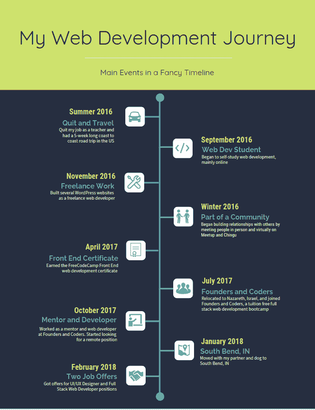
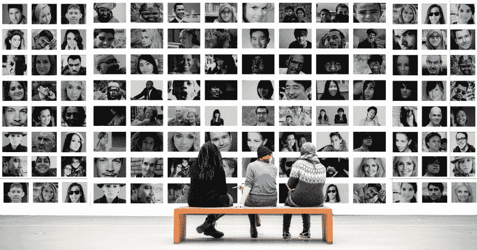

# 我如何从 33 岁的博物馆导游成为专业的网页开发人员和 UX 设计师:我的…

> 原文：<https://www.freecodecamp.org/news/the-post-i-hoped-to-write-for-18-months-2902d074f5ba/>

作者:vered recanati mordechai

# 我如何从 33 岁的博物馆导游成为专业的网页开发人员和 UX 设计师:我 18 个月的编码之旅

A journey happens one step at a time. Image: [PublicDomainArchive](https://pixabay.com/en/users/PublicDomainArchive-262011/)

我的故事和你读过那么多次的故事有点不一样。我没有在 3 个月内得到我的第一份网络开发工作。六个月内不会。一年都没有。我的旅程花了 18 个月，这是艰难和令人沮丧的，但也令人兴奋和惊叹。

我的背景，像许多其他自学成才的开发人员一样，似乎离任何类型的技术都很远。我有历史学硕士学位。我在一家博物馆当过导游，在一家非营利组织当过小组辅导员，也当过老师。我喜欢所有这些角色。否则，我不会选择花时间去做它们。

在某种程度上，我决定改变这一切。我想通过我的工作产生更大的影响，尤其是在非营利组织。此外，在 3 个国家(3 个大洲)生活了 6 年后，我想开始一份不需要每次搬家都找新工作甚至新领域的职业。

我不需要太多的研究就可以得出结论，技术可以满足这两个目标。它可以让我充满激情，以一种(可能是最有意义的)方式做出贡献，它可以让我在继续工作的同时自由移动和重新安置。

我辞去了教师的好工作，放弃了高薪和稳定的工作，开始成为一名“全职网络开发自学者”这是我很长一段时间的头衔。

我开始自学网页开发，心想(在这里读了一些令人印象深刻的故事后)只要努力工作和 3 到 4 个月的学习，我就会被聘为全职网页开发员。

摆在我面前的旅程与我预想的大不相同。这比我想象的要困难得多。这令人困惑，充满挑战，让我一遍又一遍地怀疑我是否选择了正确的道路，或者我是否应该承认这不适合我。

很难甚至不可能指出到底是什么让我的旅程与我读过的所有令人惊叹的成功故事不同，但有几件事立即浮现在脑海中。

### **不是所有的人都能独自茁壮成长**

我是一个喜欢交际的人。我喜欢和别人在一起，一起合作，一起交谈，一起奋斗。长时间一个人的时候我不太开心，因为我喜欢别人的陪伴。

大部分时间，大部分时间都是自己学习，这是我不会错过的事情之一。

### 不是所有人都喜欢挑战

我需要非常勇敢的承认，并不是所有的挑战都让我快乐，推动我提升自己。有些人肯定知道。

我跑了两个半程马拉松(那算不算完成一个全程马拉松？？)而且很有挑战性。我完成了一项艰难的任务，很有挑战性。我搬家了，包括搬到我不会说这种语言的地方，这很有挑战性。

尽管这些挑战令人惊奇和愉快，但许多其他的挑战却不是。当我选择挑战，理解挑战，知道自己在接受什么的时候，我渴望去战胜挑战。在 web 开发的案例中，我没有充分意识到我将要面临的挑战是什么。我只是后来才明白这些挑战的范围，这是一个艰难的发现。我没有变得兴奋，反而变得沮丧。

### **不是每个人都适合编码**

等一下。别把我生吞活剥了。我并不是说，不是每个人都可以学习如何编码，如果他们愿意，并投入时间和精力。我只是说，我们没有相同的背景、相同的思维方式和相同的直觉，所以学习过程会因人而异。毫无疑问。

当我决定学习 web 开发时，我没有任何背景。除了像其他人一样消费技术，我从来没有见过自己做任何与技术相关的事情。

对我来说，学习 web 开发就像一下子跳进了深海。我记得在我开始学习 JavaScript 几周后，我和我的伙伴进行了一次对话。他在编程方面有一些高中和基础大学背景，他试图向我解释如何解决早期的 freeCodeCamp 挑战。我不明白拥有一个元素数组是什么意思，把一个项目推到数组里又是什么意思。这个概念对我来说完全陌生。

后来我意识到，并不是每个人都是为编码而生的。有些人天生如此。其他人在很小的时候就已经了解了基本的编码概念和思维方式。

但是对于我们中的一些人来说，它第一次出现是在 33 岁，那时我们甚至从未听说过与编程概念在同一个宇宙中的任何东西。

对，就是我。我是说，那是我。我想出了推的方法，从此过了 34 岁。？

### 我无怨无悔地潜入 web 开发的海洋

现在，我必须停下来，确保我正确地解释了自己。我不后悔这一切。如果可以重新决定，我会走同样的路。但是我也要确保我知道我实际上在承诺什么。我会让我的期望与现实一致。

没有一种方法或一个答案，但是在投入之前，对这个旅程进行更好的研究，可能会对我体验事物的方式产生巨大的影响。

Major milestones in my personal web development journey

那么我最终是怎么做到的呢？回想起来，有几件事帮助我克服了这些挑战。在我列出它们之前，我必须承认我已经读过很多类似的清单，我也试着密切关注其中的一些，但是没有一个对我完全一样。

### 漫长道路的教训

在一天结束时，这是一次个人的旅程，所以你读的一些东西可以帮助你，而其他人可以让你失望或只是浪费你的时间。我在分享我的经历，但我并不是说这就是你成功的秘诀或秘密魔法。

#### **有目标**

提醒自己你的目标是什么。你这周的目标是什么？这个月吗？今年的吗？最重要的是——为了你的旅程。

如果你没有一个明确的目标，一个值得期待的东西，你是做不到的。我并不是说我一直都很清楚——我也希望如此。但是“你的目标是什么”这个问题不断出现，我不得不向自己解释为什么我要这样做。这些时候，我的目标和终点线变得更加清晰。

#### 对自己诚实

我知道这有点奇怪，但这是我意识到的最重要的事情之一。你会多次听到在 web 开发中什么被认为是*更好的*。后端对前端，React 对 Vue，Visual Studio 代码对 Atom，Vanilla JS 对 jQuery，Express 对哈比神，等等。这么多观点和信仰。可能会很混乱。这让我很困惑。

我想证明我什么都能做，什么都懂，什么都擅长。你猜怎么着？我是在跟随别人的意见，而不是创造我自己的。

我更喜欢 web 开发的某些方面。与其他概念相比，我更纠结于一些概念。比起其他语言和库，我更乐意用一些语言和库来写代码。所以为什么不创造我自己的道路呢？如果人们认为 X 比 Y 更好，是否意味着 Y 是我的最佳选择？

诚实是一种解脱。它帮助我享受我所做的事情。我努力应对我面临的挑战，但那些是我的挑战——不是别人的。我能够通过使用让我个人兴奋的工具和技术来发挥我的创造力。

#### **加入社区**

很难表达成为开发人员社区的一部分，并让那些开发人员在你身边是多么重要。

就我而言，它主要是一个由来自世界各地的人组成的虚拟社区。有时我很幸运能亲自见到人们，甚至成为我生活过的社区的一员。

你的社区是什么样的形状或形式并不重要。只要你认识其他和你一起奋斗的人，其他和你有着相似激情的人，其他你可以看着并告诉自己:“这就是我未来想要成为的人。”当你有问题时你可以寻求帮助的人，当他们为你已经弄明白的事情而挣扎时你可以帮助的人，当你需要一些动力时你可以依靠的人。

#### **而且就是不放弃**

到最后，你必须相信你能做到。

很长一段时间里，我都心存疑虑，但从来没有哪一次我觉得自己已经尝试完了。我一直知道我可以做得更好，不断改进，不断学习，最终找到成功的方法。

It’s all about the people. image: [geralt](https://pixabay.com/en/users/geralt-9301/)

我在两个重要方面非常幸运。(没错，运气是另一大因素！)首先是我沿途发现的**人和社区**。第二个是我最后居住的**地方**。

### 我加入的社区(按加入顺序)

*   freeCodeCamp:我从 freeCodeCamp 开始了我的旅程，这是一个学习 web 开发的极好的平台，是免费的，有一个丰富和专注的在线社区。加入并学习 freeCodeCamp 帮助我的梦想开始看起来像是可能成为现实。
*   Chingu 是一个伟大的在线社区，面向世界各地拥有相似最终目标、致力于帮助他人并在此过程中相互协作的人们。它曾经是(现在仍然是)我可以作为远程团队的一员创建项目的地方，也是一个一起提问、回答、阅读和思考的地方。
*   Meetup.com 是一把保护伞，它让我有机会学到很多东西，并亲自见到许多专业人士和新手，这与虚拟社区不同，并导致了一些伟大的友谊。
*   [Central NJ Design](https://www.meetup.com/Central-NJ-Design-Meetup/) 是我参与的主要 meetup，它为我打开了用户体验设计的大门。最后这竟然成了我现在的职业选择。
*   创始人和程序员是一个网络开发(免学费)训练营，我有机会成为它的一员，在以色列的拿撒勒。参与全职、全栈的网络开发项目给了我飞翔的翅膀。我有机会和其他人一起创建团队项目，向更有经验的导师学习，会见专业人士，并成为社区的一部分，该社区的目标是通过深思熟虑的课程和所有相关人员的辛勤工作，使其成员成为开发人员。

我很幸运有机会指导并作为课程的下一批开发者工作。众所周知，教导他人是加深你的知识的最有意义的方式之一。再次阅读这些材料——这次是以导师的身份——让我更好地理解了我想要和需要掌握的概念和工具。它改变了我的整个形象，并鼓励我开始寻找一份全职工作。

### 搬到印第安纳州的南本德

正如我提到的，我成功找工作的另一个原因是——令人惊讶的是——我大约 3 个月前搬到的地方。我用“惊喜”这个词是因为就我的职业生涯而言，搬到中西部的老工业城市似乎不是最好的选择。所以我想我唯一的选择就是远程工作。

我申请了 146 份工作(！)但其中只有 9 家是去通勤距离内的公司。从这 9 份申请中，我得到了 2 份工作机会，但没有从远程工作中得到任何工作机会。

我认为这有两个原因:首先，在我申请最后两个职位时，我比以往任何时候都准备得更充分，这是在我的申请过程接近尾声时，我向几位专业人士和朋友征求了关于我申请的建议和反馈。

当我知道并相信自己有价值时，我的信心会更高(当我开始申请时，情况并非如此)。我的作品集、GitHub 和项目都要先进得多——所以总的来说，我是一个更强的申请者。

但是第二点可能更令人惊讶。我搬到的中西部城市南本德显然是一个科技繁荣的地方，那里有令人兴奋的新创业公司和年轻公司，在那里你可以感受到创业、创新和技术的最佳形式。

即使作为一个经验很少的初级 web 开发人员，我也可以找到一个适合我的地方，在那里我可以贡献我的技能，同时在专业上得到发展。

我最终得到了两个很好的工作机会，一个是用户体验设计师，另一个是全栈网站开发者，我希望我能同时接受这两个工作。

### 我编码之旅的下一步

我的旅程花了很长时间，给我、我的人际关系和我的伴侣带来了很大压力。但我相信这是值得的。它把我推向新的地方，让我看到自己新的一面，给我想要的技能和力量。

One of the peaks I’ve reached. I mean, physically.

旅程仍在继续。它没有终点线。好的一面是有许多山峰要攀登。我很高兴知道我已经完成了其中的一些目标，我也为即将到来的其他目标感到兴奋。