# 如何给你的 Rails 后端添加一个强大的搜索引擎

> 原文：<https://www.freecodecamp.org/news/how-to-add-a-powerful-search-engine-to-your-rails-backend-57bced889032/>

作者:多梅尼科·安吉莱塔

在我作为 Ruby on Rails 开发人员的经历中，我经常不得不处理向 web 应用程序添加搜索功能的问题。事实上，我曾经工作过的几乎所有应用程序都需要搜索引擎功能，而它们中的许多都将搜索引擎作为最重要的核心功能。

如果没有一个好的搜索引擎作为核心，我们日常使用的许多应用程序将毫无用处。例如，在亚马逊上，你可以在几秒钟内从网站上超过 5 . 5 亿种产品中找到一种特定的产品——这都要归功于结合了类别过滤器、方面和推荐系统的全文搜索。

在 Airbnb 上，你可以通过结合地理空间搜索和房屋特征过滤器(如尺寸、价格、可用日期等)来搜索公寓。

还有 Spotify、网飞、Ebay、Youtube……所有这些都严重依赖搜索引擎。

在本文中，我将描述如何用 Elasticsearch 开发一个 Ruby on Rails 5 API 后端。[根据 DB Engines 排名](https://db-engines.com/en/ranking/search+engine)，Elasticsearch 是目前最受欢迎的开源搜索平台。

本文不会深入讨论 Elasticsearch 的细节，以及它与 Sphinx 和 Solr 等竞争对手相比如何。相反，这将是一个分步指南，介绍如何使用测试驱动的开发方法，用 Ruby on Rails 和 Elasticsearch 实现 JSON API 后端。

本文将涵盖:

1.  测试、开发和生产环境的弹性搜索设置
2.  Ruby on Rails 测试环境设置
3.  使用弹性搜索的模型索引
4.  搜索 API 端点

正如在我的上一篇文章[如何用无服务器架构提升性能](https://medium.freecodecamp.org/serverless-image-preprocessing-using-aws-lambda-42d58e1183f5)中，我将在一个循序渐进的教程中涵盖所有内容。然后您可以自己尝试，并有一个简单的工作示例，在此基础上构建更复杂的东西。

示例应用程序将是一个电影搜索引擎。它将有一个单一的 JSON API 端点，允许您对电影标题和概述进行全文搜索。

### 1.弹性搜索设置

> [Elasticsearch](https://www.elastic.co/products/elasticsearch) 是一个分布式 RESTful 搜索和分析引擎，能够解决越来越多的用例。作为弹性堆栈的核心，它集中存储您的数据，因此您可以发现预期的数据，发现意外的数据。——【www.elastic.co/products/elasticsearch 

根据 DB-Engines 对搜索引擎的排名，Elasticsearch 是迄今为止最受欢迎的搜索引擎平台(截至 2018 年 4 月)。从 2015 年底[亚马逊宣布推出 AWS Elasticsearch 服务](https://aws.amazon.com/blogs/aws/new-amazon-elasticsearch-service/)开始，这是一种从 AWS 管理控制台启动 Elasticsearch 集群的方式。

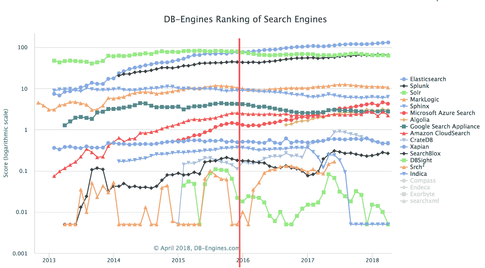

[DB Engines Search Engine Ranking Trend](https://db-engines.com/en/ranking_trend/search+engine)

Elasticsearch 是开源的。你可以从[他们的网站](https://www.elastic.co/downloads/past-releases)下载你喜欢的版本，然后在你想去的任何地方运行。虽然我建议在生产环境中使用 AWS Elasticsearch 服务，但我更喜欢在本地机器上运行 Elasticsearch 进行测试和开发。

让我们首先下载(目前)最新的 Elasticsearch 版本(6.2.3)并解压。打开终端并运行

```
$ wget https://artifacts.elastic.co/downloads/elasticsearch/elasticsearch-6.2.3.zip

$ unzip elasticsearch-6.2.3.zip
```

或者，你可以从你的浏览器[这里](https://www.elastic.co/downloads/past-releases/elasticsearch-6-2-3)下载 Elasticsearch，并用你喜欢的程序解压。

### 2.测试环境设置

我们将使用 Ruby on Rails 5 API 构建一个后端应用程序。它将有一个代表电影的模型。Elasticsearch 将对其进行索引，并且可以通过 API 端点进行搜索。

首先，让我们创建一个新的 rails 应用程序。在之前下载 Elasticsearch 的同一个文件夹中，运行生成新的 rails 应用程序的命令。如果您是 Ruby on Rails 的新手，请先参考本[入门指南](http://guides.rubyonrails.org/v5.1/getting_started.html)来设置您的环境。

```
$ rails new movies-search --api; cd movies-search
```

使用“api”选项时，不包括主要用于浏览器应用程序的所有中间件。正是我们想要的。请直接阅读 ruby on rails 指南。

现在让我们添加所有我们需要的宝石。打开您的 Gemfile 并添加以下代码:

```
# Gemfile

...
# Elasticsearch integration
gem 'elasticsearch-model'
gem 'elasticsearch-rails'

group :development, :test do
  ...
  # Test Framework
  gem 'rspec'
  gem 'rspec-rails'
end

group :test do
  ...
  # Clean Database between tests
  gem 'database_cleaner'
  # Programmatically start and stop ES for tests
  gem 'elasticsearch-extensions'
end
...
```

我们正在添加两个 Elasticsearch Gems，它将提供所有必要的方法来索引我们的模型并在其上运行搜索查询。rspec、rspec-rails、database_cleaner 和 elasticsearch-extensions 用于测试。

保存 gem 文件后，运行 **bundle install** 来安装所有添加的 gem。

现在，让我们通过运行以下命令来配置 Rspec:

```
rails generate rspec:install
```

该命令将创建一个 *spec* 文件夹，并将 *spec_helper.rb* 和 *rails_helper.rb* 添加到其中。它们可用于根据您的应用需求定制 rspec。

在这种情况下，我们将添加一个 DatabaseCleaner 块到 *rails_helper.rb* 中，这样每个测试将在一个空的数据库中运行。此外，我们将修改 *spec_helper.rb* ，以便在每次测试套件启动时启动一个 Elasticsearch 测试服务器，并在测试套件完成后再次关闭它。

这个解决方案基于 [Rowan Oulton](https://www.freecodecamp.org/news/how-to-add-a-powerful-search-engine-to-your-rails-backend-57bced889032/undefined) 的文章[测试 Rails 中的弹性搜索](https://medium.com/@rowanoulton/testing-elasticsearch-in-rails-22a3296d989)。为他鼓掌！

让我们从 DatabaseCleaner 开始。在 *spec/rails_helper.rb* 中添加以下代码:

```
# spec/rails_helper.rb
...
RSpec.configure do |config|
  ...

config.before(:suite) do
    DatabaseCleaner.strategy = :transaction
    DatabaseCleaner.clean_with(:truncation)
  end

config.around(:each) do |example|
    DatabaseCleaner.cleaning do
      example.run
    end
  end
end
```

接下来，让我们考虑一下 Elasticsearch 测试服务器的设置。我们需要添加一些配置文件，以便 Rails 知道在哪里可以找到我们的 Elasticsearch 可执行文件。它还会根据当前环境告诉它我们希望它在哪个端口上运行。为此，在 config 文件夹中添加一个新的配置 yaml:

```
# config/elasticsearch.yml

development: &default
  es_bin: '../elasticsearch-6.2.3/bin/elasticsearch'
  host: 'http://localhost:9200'
  port: '9200'
test:
  es_bin: '../elasticsearch-6.2.3/bin/elasticsearch'
  host: 'http://localhost:9250'
  port: '9250'
staging:
  <<: *default
production:
  es_bin: '../elasticsearch-6.2.3/bin/elasticsearch'
  host: 'http://localhost:9400'
  port: '9400'
```

如果您没有在下载 Elasticsearch 的同一个文件夹中创建 rails 应用程序，或者如果您使用的是不同版本的 Elasticsearch，那么您需要在这里调整 es_bin 路径。

现在向您的*initializer*文件夹添加一个新文件，它将从我们刚刚添加的配置中读取:

```
# config/initializers/elasticsearch.rb

if File.exists?("config/elasticsearch.yml")
   config = YAML.load_file("config/elasticsearch.yml")[Rails.env].symbolize_keys
   Elasticsearch::Model.client = Elasticsearch::Client.new(config)
end
```

最后，让我们更改 *spec_helper.rb* 以包含 Elasticsearch 测试设置。这意味着启动和停止 Elasticsearch 测试服务器，并为我们的 Rails 模型创建/删除 Elasticsearch 索引。

```
# spec/spec_helper.rb

require 'elasticsearch/extensions/test/cluster'
require 'yaml'

RSpec.configure do |config|
  ...
  # Start an in-memory cluster for Elasticsearch as needed
  es_config = YAML.load_file("config/elasticsearch.yml")["test"]
  ES_BIN = es_config["es_bin"]
  ES_PORT = es_config["port"]

config.before :all, elasticsearch: true do
    Elasticsearch::Extensions::Test::Cluster.start(command: ES_BIN, port: ES_PORT.to_i, nodes: 1, timeout: 120)  unless Elasticsearch::Extensions::Test::Cluster.running?(command: ES_BIN, on: ES_PORT.to_i)
  end

# Stop elasticsearch cluster after test run
  config.after :suite do
    Elasticsearch::Extensions::Test::Cluster.stop(command: ES_BIN, port: ES_PORT.to_i, nodes: 1) if Elasticsearch::Extensions::Test::Cluster.running?(command: ES_BIN, on: ES_PORT.to_i)
  end

# Create indexes for all elastic searchable models
  config.before :each, elasticsearch: true do
    ActiveRecord::Base.descendants.each do |model|
      if model.respond_to?(:__elasticsearch__)
        begin
          model.__elasticsearch__.create_index!
          model.__elasticsearch__.refresh_index!
        rescue => Elasticsearch::Transport::Transport::Errors::NotFound
          # This kills "Index does not exist" errors being written to console
        rescue => e
          STDERR.puts "There was an error creating the elasticsearch index for #{model.name}: #{e.inspect}"
        end
      end
    end
  end

# Delete indexes for all elastic searchable models to ensure clean state between tests
  config.after :each, elasticsearch: true do
    ActiveRecord::Base.descendants.each do |model|
      if model.respond_to?(:__elasticsearch__)
        begin
          model.__elasticsearch__.delete_index!
        rescue => Elasticsearch::Transport::Transport::Errors::NotFound
          # This kills "Index does not exist" errors being written to console
        rescue => e
          STDERR.puts "There was an error removing the elasticsearch index for #{model.name}: #{e.inspect}"
        end
      end
    end
  end

end
```

我们定义了四个块:

1.  启动 Elasticsearch 测试服务器的 before(:all)块，除非它已经在运行
2.  after(:suite)块，用于停止 Elasticsearch 测试服务器(如果它正在运行)
3.  before(:each)块，为每个配置了 Elasticsearch 的模型创建一个新的 Elasticsearch 索引
4.  删除所有弹性搜索索引的 after(:each)块

添加 *elasticsearch: true* 确保只有标记有 *elasticsearch* 的测试才会运行这些模块。

我发现当您运行所有测试一次时，例如在部署之前，这种设置非常有效。另一方面，如果您使用测试驱动的开发方法，并且您经常运行您的测试，那么您可能需要稍微修改这个配置。您不希望在每次测试运行时都启动和停止您的 Elasticsearch 测试服务器。

在这种情况下，您可以注释掉测试服务器停止的 after(:suite)块。当您不再需要它时，您可以手动关闭它，或者使用脚本。

```
require 'elasticsearch/extensions/test/cluster'
es_config = YAML.load_file("config/elasticsearch.yml")["test"]
ES_BIN = es_config["es_bin"]
ES_PORT = es_config["port"]
Elasticsearch::Extensions::Test::Cluster.stop(command: ES_BIN, port: ES_PORT.to_i, nodes: 1)
```

### 3.使用弹性搜索的模型索引

现在，我们开始实现带有搜索功能的电影模型。我们使用测试驱动的开发方法。这意味着我们首先编写测试，看到它们失败，然后编写代码使它们通过。

首先，我们需要添加具有四个属性的电影模型:标题(字符串)、概述(文本)、image_url(字符串)和平均投票值(浮点)。

```
$ rails g model Movie title:string overview:text image_url:string vote_average:float

$ rails db:migrate
```

现在是时候给我们的模型添加 Elasticsearch 了。让我们编写一个测试来检查我们的模型是否被索引。

```
# spec/models/movie_spec.rb
require 'rails_helper'

RSpec.describe Movie, elasticsearch: true, :type => :model do
  it 'should be indexed' do
     expect(Movie.__elasticsearch__.index_exists?).to be_truthy
  end
end
```

该测试将检查是否为电影创建了 elasticsearch 索引。请记住，在测试开始之前，我们会自动为所有响应 __elasticsearch__ 方法的模型创建一个 elasticsearch 索引。这意味着所有包含弹性搜索模块的型号。

运行测试，看它是否失败。

```
bundle exec rspec spec/models/movie_spec.rb
```

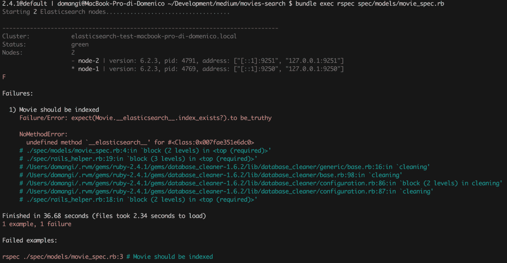

第一次运行这个测试时，您应该看到 Elasticsearch 测试服务器正在启动。测试失败，因为我们没有向我们的电影模型添加任何 Elasticsearch 模块。让我们现在就解决这个问题。打开模型并添加以下弹性搜索以包括:

```
# app/models/movie.rb

class Movie < ApplicationRecord
  include Elasticsearch::Model
end
```

这将为我们的电影模型添加一些 Elasticsearch 方法，比如缺失的 *__elasticsearch__* 方法(它在之前的测试运行中生成了错误)和我们稍后将使用的 *search* 方法。

再次运行测试，看它是否通过。

```
bundle exec rspec spec/models/movie_spec.rb
```

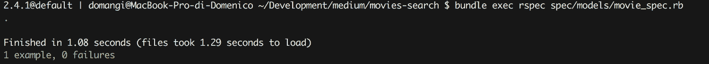

太好了。我们有一个索引电影模型。

默认情况下，Elasticsearch::Model 将为模型的所有属性建立一个索引，自动推断它们的类型。通常这不是我们想要的。我们现在将自定义模型索引，使其具有以下行为:

1.  只有标题和概述应该被索引
2.  应该使用词干(这意味着搜索“演员”也应该返回包含文本“演员”的电影，反之亦然)

我们还希望我们的索引在每次添加、更新或删除电影时都得到更新。

让我们通过将下面的代码添加到 *movie_spec.rb* 来将它转化为测试

```
# spec/models/movie_spec.rb
RSpec.describe Movie, elasticsearch: true, :type => :model do
  ...

describe '#search' do
    before(:each) do
      Movie.create(
        title: "Roman Holiday",
        overview: "A 1953 American romantic comedy films ...",
        image_url: "wikimedia.com/Roman_holiday.jpg",
        vote_average: 4.0
      )
      Movie.__elasticsearch__.refresh_index!
    end
    it "should index title" do
      expect(Movie.search("Holiday").records.length).to eq(1)
    end
    it "should index overview" do
      expect(Movie.search("comedy").records.length).to eq(1)
    end
    it "should not index image_path" do
      expect(Movie.search("Roman_holiday.jpg").records.length).to eq(0)
    end
    it "should not index vote_average" do
      expect(Movie.search("4.0").records.length).to eq(0)
    end
  end

end
```

我们在每个测试之前创建一个电影，因为我们配置了 DatabaseCleaner，所以每个测试都是独立的。*电影。__elasticsearch__。刷新 _ 索引！需要*来确保新的电影记录可立即用于搜索。

像以前一样，运行测试，看它是否失败。

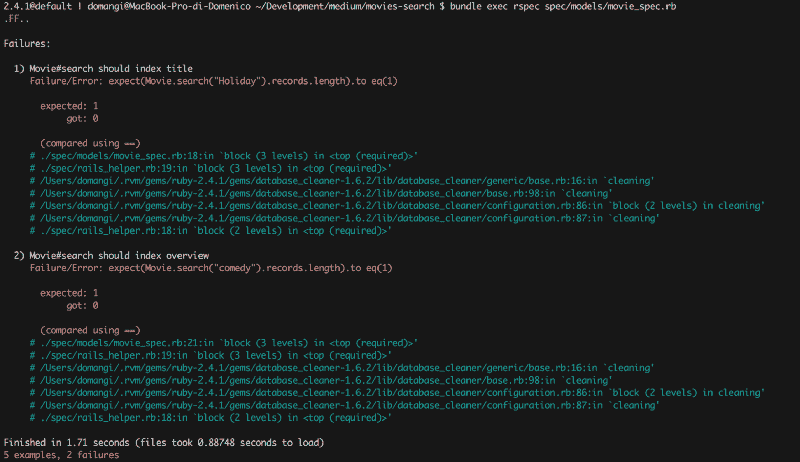

似乎我们的电影没有被编入索引。这是因为我们还没有告诉我们的模型当电影数据改变时该做什么。幸运的是，这可以通过向我们的电影模型添加另一个模块来解决:

```
class Movie < ApplicationRecord
  include Elasticsearch::Model
  include Elasticsearch::Model::Callbacks
end
```

使用*Elasticsearch::Model::Callbacks，*无论何时添加、修改或删除电影，其在 elastic search 上的文档也会更新。

让我们看看测试输出是如何变化的。

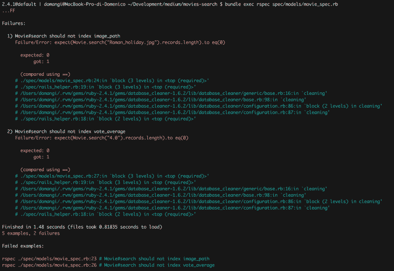

好的。现在的问题是，我们的搜索方法也返回匹配属性 *vote_average* 和 *image_url* 的查询。为了解决这个问题，我们需要配置 Elasticsearch 索引映射。所以我们需要具体告诉 Elasticsearch 要索引哪些模型属性。

```
# app/models/movie.rb

class Movie < ApplicationRecord
  include Elasticsearch::Model
  include Elasticsearch::Model::Callbacks

# ElasticSearch Index
  settings index: { number_of_shards: 1 } do
    mappings dynamic: 'false' do
      indexes :title
      indexes :overview
    end
  end
end
```

再次运行测试，看它是否通过。

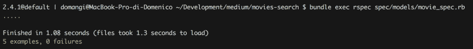

酷毙了。现在让我们添加一个词干分析器，这样“actor”和“actors”就没有区别了。和往常一样，我们将首先编写测试，然后看到它失败。

```
describe '#search' do
    before(:each) do
      Movie.create(
        title: "Roman Holiday",
        overview: "A 1953 American romantic comedy films ...",
        image_url: "wikimedia.com/Roman_holiday.jpg",
        vote_average: 4.0
      )
      Movie.__elasticsearch__.refresh_index!
    end

...

it "should apply stemming to title" do
      expect(Movie.search("Holidays").records.length).to eq(1)
    end

it "should apply stemming to overview" do
      expect(Movie.search("film").records.length).to eq(1)
    end
end
```

请注意，我们正在测试两种方式:Holiday 也应该返回 Holiday，Film 也应该返回 Films。

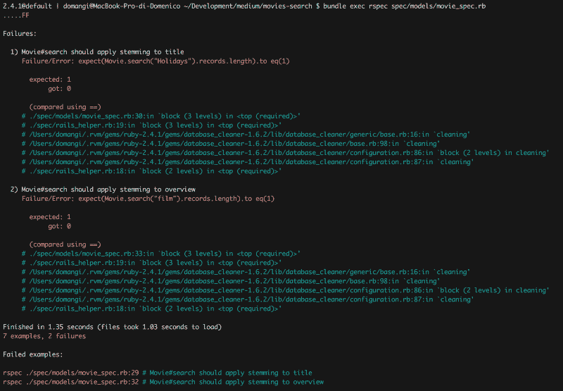

为了让这些测试再次通过，我们需要修改索引映射。这一次，我们将在两个字段中添加一个英语分析器:

```
class Movie < ApplicationRecord
  include Elasticsearch::Model
  include Elasticsearch::Model::Callbacks

# ElasticSearch Index
  settings index: { number_of_shards: 1 } do
    mappings dynamic: 'false' do
      indexes :title, analyzer: 'english'
      indexes :overview, analyzer: 'english'
    end
  end
end
```

再次运行您的测试，看看它们是否通过。

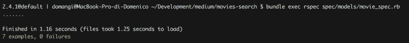

Elasticsearch 是一个非常强大的搜索平台，我们可以为我们的搜索方法添加许多功能。但是这不在本文的讨论范围之内。因此，我们将在这里停下来，继续构建 JSON API 的控制器部分，通过它可以访问搜索方法。

### 4.搜索 API 端点

我们正在构建的搜索 API 应该允许用户在电影表上进行全文搜索。我们的 API 有一个端点，定义如下:

```
Url: 
 GET /api/v1/movies

Params:
 * q=[string] required

Example url:
 GET /api/v1/movies?q=Roma

Example response:
[{"_index":"movies","_type":"movie","_id":"95088","_score":11.549209,"_source":{"id":95088,"title":"Roma","overview":"A virtually plotless, gaudy, impressionistic portrait of Rome through the eyes of one of its most famous citizens.", "image_url":"https://image.tmdb.org/t/p/w300/rqK75R3tTz2iWU0AQ6tLz3KMOU1.jpg","vote_average":6.6,"created_at":"2018-04-14T10:30:49.110Z","updated_at":"2018-04-14T10:30:49.110Z"}},...]
```

这里，我们根据 RESTful API 设计的一些最佳实践来定义我们的端点:

1.  URL 应该对对象或资源进行编码，而要采取的操作应该由 HTTP 方法进行编码。在本例中，资源是 *movies* (集合)，我们使用 HTTP 方法 **GET** (因为我们从资源中请求数据而不会产生任何副作用)。我们使用 URL 参数来进一步定义应该如何获取这些数据。在这个例子中，q=[string]，它指定了一个搜索查询。你可以在[马赫什·哈尔达尔](https://www.freecodecamp.org/news/how-to-add-a-powerful-search-engine-to-your-rails-backend-57bced889032/undefined)的文章 [RESTful API 设计指南——最佳实践](https://hackernoon.com/restful-api-designing-guidelines-the-best-practices-60e1d954e7c9)上阅读更多关于如何设计 RESTful API 的内容。
2.  我们还通过将 *v1* 添加到我们的端点 URL 来为我们的 API 添加版本控制。对 API 进行版本控制非常重要，因为它允许您引入与以前版本不兼容的新特性，而不会破坏为 API 以前版本开发的所有客户端。

好的。让我们开始实施。

像往常一样，我们从失败的测试开始。在 spec 文件夹中，我们将创建反映 API 端点 URL 结构的文件夹结构。这意味着控制器→api →v1 →movies_spec.rb

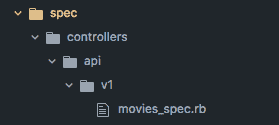

您可以手动或从运行以下命令的终端执行此操作:

```
mkdir -p spec/controllers/api/v1 && 
touch spec/controllers/api/v1/movies_spec.rb
```

我们在这里要写的测试是控制器测试。他们不需要检查模型中定义的搜索逻辑。相反，我们将测试三样东西:

1.  对/api/v1/movies 的 GET 请求？q=[string]将以[string]作为参数调用 Movie.search
2.  Movie.search 的输出以 JSON 格式返回
3.  返回成功状态

> 控制器测试应该测试控制器的行为。控制器测试不应该因为模型中的问题而失败。
> 
> (处方 20 —轨 4 测试处方。[诺尔·拉平](https://www.freecodecamp.org/news/how-to-add-a-powerful-search-engine-to-your-rails-backend-57bced889032/undefined)

让我们把它转换成代码。在*spec/controllers/API/v1/movies _ spec . Rb*中添加以下代码:

```
# spec/controllers/api/v1/movies_spec.rb
require 'rails_helper'
RSpec.describe Api::V1::MoviesController, type: :request do
  # Search for movie with text movie-title
  describe "GET /api/v1/movies?q=" do
    let(:title) { "movie-title"}
    let(:url) { "/api/v1/movies?q=#{title}"}

it "calls Movie.search with correct parameters" do
      expect(Movie).to receive(:search).with(title)
      get url
    end

it "returns the output of Movie.search" do
      allow(Movie).to receive(:search).and_return({})
      get url
      expect(response.body).to eq({}.to_json)
    end

it 'returns a success status' do
      allow(Movie).to receive(:search).with(title)
      get url
      expect(response).to be_successful
    end
  end
end
```

测试将立即失败，因为 Api::V1::movie controller 没有定义，所以让我们先这样做。像以前一样创建文件夹结构，并添加电影控制器。

```
mkdir -p app/controllers/api/v1 && 
touch app/controllers/api/v1/movies_controller.rb
```

现在将以下代码添加到*app/controllers/API/v1/movies _ controller . Rb*中:

```
# app/controllers/api/v1/movies_controller.rb
module Api
  module V1
    class MoviesController < ApplicationController
      def index;end
    end
  end
end
```

是时候运行我们的测试并看到它失败了。

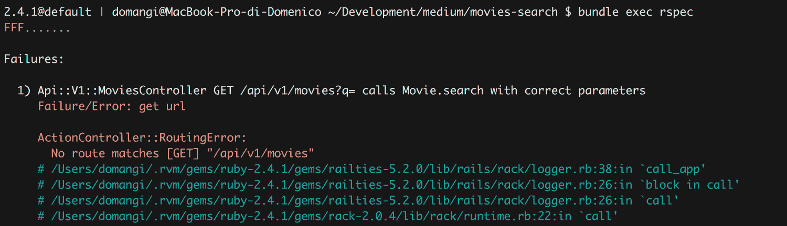

所有测试都会失败，因为我们仍然需要为端点添加一个路由。在 config/routes.rb 中添加以下代码:

```
# config/routes.rb
Rails.application.routes.draw do
  namespace :api do
    namespace :v1 do
      resources :movies, only: [:index]
    end
  end
end
```

重新运行您的测试，看看会发生什么。

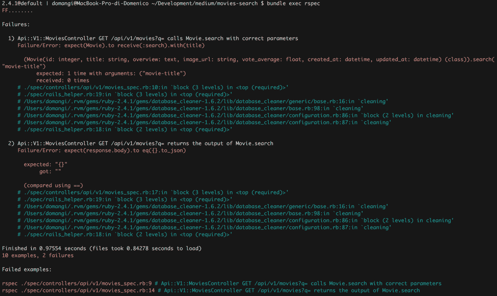

第一个错误告诉我们需要在控制器中添加一个对 Movie.search 的调用。第二个抱怨回应。让我们将缺失的代码添加到 movies_controller 中:

```
# app/controllers/api/v1/movies_controller.rb
module Api
  module V1
    class MoviesController < ApplicationController
      def index
        response = Movie.search params[:q]
        render json: response
      end
    end
  end
end
```

运行测试，看看我们是否完成了。

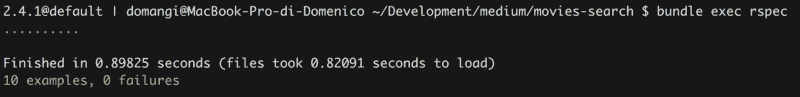

没错。仅此而已。我们已经完成了一个非常基本的后端应用程序，允许用户通过 API 搜索模型。

[你可以在这里找到我的 GitHub repo 上的完整代码](https://github.com/domangi/movies-search.git)。通过运行 rails db:seed，可以用一些数据填充电影表，这样就可以看到应用程序在运行。这将从 Kaggle 下载的[数据集中导入大约 45k 部电影。请查看自述文件了解更多详细信息。](https://www.kaggle.com/rounakbanik/the-movies-dataset)

如果你喜欢这篇文章，请在社交媒体上分享。谢谢大家！