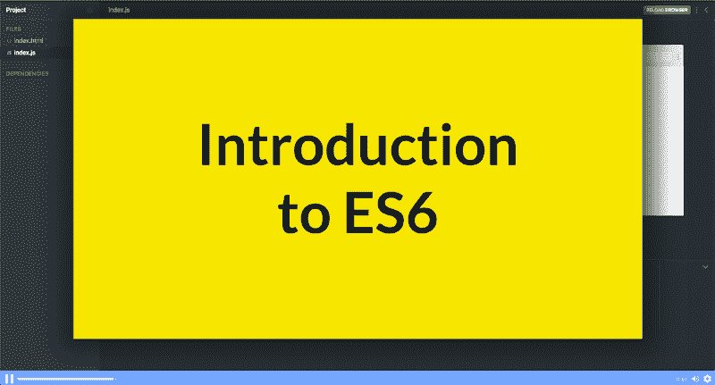
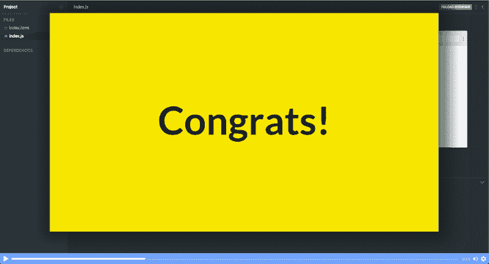

# 在这个 23 节的免费互动课程中学习 ES6+

> 原文：<https://www.freecodecamp.org/news/want-to-learn-es6-take-this-free-23-part-course-and-become-a-javascript-ninja-55002db1ff74/>



[Click here to get to the course.](https://scrimba.com/g/gintrotoes6?utm_source=freecodecamp.org&utm_medium=referral&utm_campaign=gintrotoes6_launch_article)

JavaScript 无疑是世界上最流行的编程语言之一。它几乎无处不在:从大规模 web 应用程序到复杂的服务器，再到移动和物联网设备。

因此，我们与 Dylan C. Israel 合作，请他在 Scrimba 上创建 ES6 课程的[。](https://scrimba.com/g/gintrotoes6?utm_source=freecodecamp.org&utm_medium=referral&utm_campaign=gintrotoes6_launch_article)

该课程包含 17 节课和 4 个互动挑战。它面向那些想要学习 ES6、ES7 和 ES8 中引入的 JavaScript 的现代特性的 JavaScript 开发人员。

让我们看看课程结构:

### 第一部分:简介


在介绍性视频中，Dylan 概述了他的课程将会是什么样子，以及他将涉及的主要话题。他还向您介绍了他自己，以便您在开始编写代码之前熟悉他。

### 第 2 部分:模板文字

本课程涉及的 ES6 的第一个特性是模板文字。模板文字是一种更干净、更漂亮的处理字符串的方式。他们不再需要大量的`+`符号来连接字符串。

```
let str1 = 'My name is:'  
let name = 'Dylan';

let str2 = `${str1} ${name}`

// --> 'My name is: Dylan' 
```

模板文字以反斜杠开始，我们使用`$`符号和花括号在中间引入一个变量。

### 第 3 部分:析构对象

在第 3 部分中，您将学习如何分解一个对象并提取您感兴趣的属性。

```
let information = { firstName: 'Dylan', lastName: 'Israel'};

let { firstName, lastName } = information; 
```

在上面的代码中，我们从对象中提取属性`firstName`和`lastName`，并通过使用对象析构将它们赋给变量。

### 第 4 部分:析构数组

在这一部分，你将学习如何使用数组销毁从数组中获取我们感兴趣的项的指针。

```
let [ firstName ] = ['Dylan', 'Israel']; 
```

这里，`firstName`指向右边数组中的第一项。我们还可以在数组元素的左边创建更多的指针。

### 第 5 部分:对象文字

在我们课程的第 5 部分，我们将学习 ES6 的另一个很酷的特性，那就是对象文字。如果键的名称和值相同，对象文字允许您省略对象中的键。

```
let firstName = 'Dylan';  
let information = { firstName }; 
```

因此，在上面的例子中，我们想要在我们的`information`对象中添加`firstName`的属性。`firstName`变量是另一个同名的变量。我们省略了键，只传递变量的名称，它将创建属性并自己赋值。

### 第 6 部分:对象文字(挑战)

现在是课程第一次挑战的时候了！这里的目标是控制台记录新城市、新地址和国家。

```
function addressMaker(address) {  
   const newAddress = {  
      city: address.city,  
      state: address.state,  
      country: 'United States'  
   };  
   ...  
} 
```

我们鼓励你使用我们到目前为止所学的主题来解决这个问题。这包括模板文字、对象销毁和对象文字。

### 第 7 部分:For…Of 循环

在第 7 部分中，您将了解一种遍历元素的新方法。ES6 引入了 For…Of loop 语句，该语句创建了一个循环，该循环遍历 String、Array、NodeList 对象等可迭代对象。

```
let str = 'hello';

for (let char of str) {  console.log(char);}// "h"// "e"// "l"// "l"// "o" 
```

在上面的代码示例中，For…Of 循环遍历一个字符串并注销字符。

### 第八部分:循环挑战

在这个挑战中，你被要求猜测当你在一个`for…of`循环中使用`let`而不是`const`时会发生什么，并试图操纵循环中的值。

```
let incomes = [62000, 67000, 75000];

for (const income of incomes) {

}  
console.log(incomes); 
```

### 第 9 部分:扩展运算符

在课程的第 9 部分，您将了解 ES6 中最酷的特性之一:Spread 运算符。

```
let arr1 = [1, 2, 3];
let arr2 = [4, 5, 6];
let arr3 = [...arr1, ...arr2];

// arr3 = [1, 2, 3, 4, 5, 6]; 
```

上面的代码演示了使用 spread 操作符的许多很酷的实现之一。在这里，我们将两个数组放入一个新的数组中，数组名前面有三个点(…)。

### 第 10 部分:Rest 运算符

在本课中，您将学习 Rest 操作符的一些用例。Rest 操作符允许我们将可变数量的函数参数表示为一个数组，从而帮助我们以更好的方式处理函数参数。

```
function findLength(...args) {  console.log(args.length);}

findLength();  // 0
findLength(1); // 1
findLength(2, 3, 4); // 3 
```

这里，我们用不同数量的参数调用同一个函数，Rest 操作符为我们完美地处理了这个问题。

### 第 11 部分:箭头功能

这一课告诉我们 ES6 中引入的最酷和最受关注的特性之一:箭头函数。箭头函数改变了我们编写函数的方式。

```
const square = num => num * num;

square(2); // 4 
```

通过使用箭头函数，*平方*函数的外观已经完全改变。只用一行代码，我们就能返回一个数的平方。箭头函数还有许多其他出色的实现，在本课中会有解释。

### 第 12 部分:默认参数

默认参数允许我们用默认值初始化功能。在本课中，您将了解该功能在实际编码任务中有多有用，因为它可以帮助您避免错误和 bug。默认参数的一个简单示例是:

```
function sum (a, b = 1) {    
  return a + b;
}

sum(5); // 6 
```

这里我们设置了`b`的默认值，这样当我们没有传递 b 的任何值时，它将使用默认值来计算结果。

### 零件#13:包括()

使用`includes`方法，我们可以找出任何字符串是否包含特定的字符或子串。在本课中，您将详细了解该函数的实际使用案例。

```
let str = 'Hello World';

console.log(str.includes('hello')); // true 
```

这里，我们找出我们的字符串是否包含`hello`的子串。如您所见，includes 方法根据条件是否匹配返回 true 或 false。

### 第 14 部分:租金和费用

也许 ES6 最重要的特性是声明变量的两个新关键字:`let`和`const`。

```
let str = 'Hello World';

const num = 12345; 
```

使用`let`，我们可以创建变量，这些变量可以在程序的后面被改变。用`const`声明的变量永远不能改变。我们将在这节课中学习它们。

### 第 15 部分:进口和出口

我们都知道拥有模块化代码有多重要，尤其是当你正在开发大规模的应用程序时。有了 JavaScript 中的`import`和`export`语句，声明和使用模块变得非常容易和干净。

在本课程的第 15 部分，您将学习如何使用导出和导入语句来创建模块。

```
// exports function 
export function double(num) {   
 return num * num;  
} 
```

在上面的代码中，我们导出一个名为`double.`的函数，然后在一个单独的文件中导入该函数:

```
// imports function  
import { double } from '..filepath/filename 
```

### 第 16 部分:焊盘开始()和焊盘结束()

ES2017 引入了两种操作弦乐的新方法，您将在本部分中详细了解这两种方法。`padStart`和`padEnd`只是在字符串的开头和结尾添加填充。

```
let str = 'Hello';  
str.padStart(3); // '   Hello'

str.padEnd(3); // 'Hello   ' 
```

### 第 17 部分:padStart()和 padEnd()挑战

在这一部分，你将应对本课程的第三个挑战。这是一个小测验，Dylan 首先让你猜，然后解释当下面的代码运行时会发生什么

```
let example = 'YouTube.com/CodingTutorials360';

// console.log(example.padStart(100));  
// console.log(example.padEnd(1)); 
```

### 第 18 部分:类

类是在 ES6 中引入的，它们完全加快了在 JavaScript 中使用面向对象模式的步伐。尽管它只是 JavaScript 现有原型继承的语法糖，但它使得用更面向对象的方式编写更加容易。

因此，在这一课中，你将详细地学习如何使用类，并从 OOP 特性中获益，比如继承。下面是一个使用类的简单例子。

```
class Car {
   constructor(wheels, doors) {
      this.wheels = wheels;
      this.doors = doors;
   }
   describeMe() {
     console.log(`Doors: ${this.doors} and Wheels: ${this.wheels}`);
   }}

const car1 = new Car(4, 2);  
car1.describeMe(); // Doors: 2 and Wheels: 4 
```

这里，我们创建了一个简单的 Car 类，其中有一个构造函数来分配轮子和门。我们也有一种方法来记录车门和车轮的数量。

然后，我们创建一个新的实例，并传递 wheels 和 doors 的值。最后，我们在它上面调用`describeMe`方法。

### 第 19 部分:结尾逗号

在第 19 课中，你将学习如何使用结尾逗号。它们使向代码中添加新元素、属性或特性变得更加容易，因为您可以这样做，而不必担心向前面的元素添加逗号。

```
let arr = [  1,   2,   3, ];arr.length; // 3 
```

这只是一个使用尾随逗号的简单例子。在我们的课程中，你会学到更多关于它们的知识。

### 第 20 部分:异步和等待

Async & Await 是我最喜欢的 ES6 特性。使用 Async & Await，我们可以编写看起来像同步代码的异步代码。这是干净的，易于阅读，易于理解。因此，在这一课中，您将学习一些如何使用它的实际例子。

```
let response = await fetch('https://example.com/books');
console.log('response'); 
```

在上面的例子中，我们在 fetch 语句之前使用了 await 关键字，所以它会一直等到这个 API 的结果被获取，然后再前进到下一行。

### 第 21 部分:异步和等待(挑战)

这是本课程的最后一个挑战，当然是关于异步和等待。您将被要求首先尝试使用 Async & Await 将以下基于 promise 的代码转换成:

```
function resolveAfter3Seconds() {  
   return new Promise(resolve => {  
      setTimeout(() => {  
        resolve('resolved');  
      }, 3000);  
   });  
} 
```

如果不能彻底解决也不用担心。迪伦会详细解释怎么做。本课结束时，你将有足够的信心立即开始使用它。

### 第 22 部分:器械包

在本课程的最后一课，你将会学到一个非常重要的数据结构，集合。这是一个允许你存储唯一值的对象。所以每当你想拥有一个只包含唯一值的集合时，你可以使用集合。

```
const set1 = new Set([1, 2, 3, 4, 5]); 
```

### 第 23 部分:下一步是什么？



作为课程的总结，Dylan 给出了一些关于如何进一步学习和改进您现在编写的代码的提示。

就是这样！如果你走了这么远，你可以给自己一点鼓励！您已经完成了课程，离成为 JavaScript 忍者又近了一步。

感谢阅读！我叫 Per，我是 Scrimba 的联合创始人，我喜欢帮助人们学习新技能。如果你想获得关于新文章和资源的通知，请在 [Twitter](https://twitter.com/perborgen) 上关注我。

* * *

感谢阅读！我的名字叫 Per Borgen，我是最简单的学习编码方法——Scrimba 的联合创始人。如果你想学习建立专业水平的现代网站，你应该看看我们的[响应式网页设计训练营](https://scrimba.com/g/gresponsive?utm_source=freecodecamp.org&utm_medium=referral&utm_campaign=gintrotoes6_launch_article)。


[Click here to get to the advanced bootcamp.](https://scrimba.com/g/gresponsive?utm_source=freecodecamp.org&utm_medium=referral&utm_campaign=gintrotoes6_launch_article)