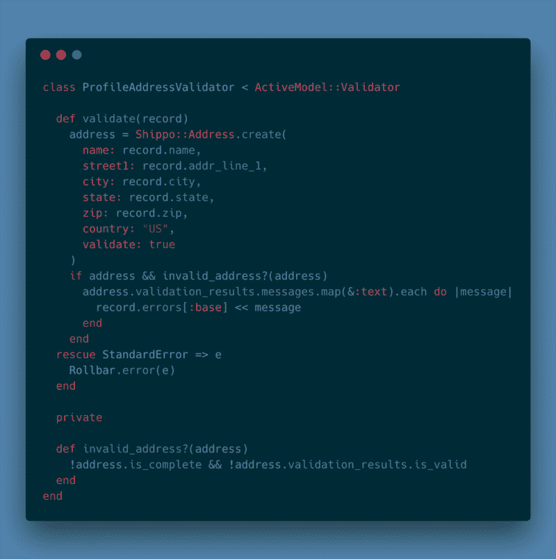
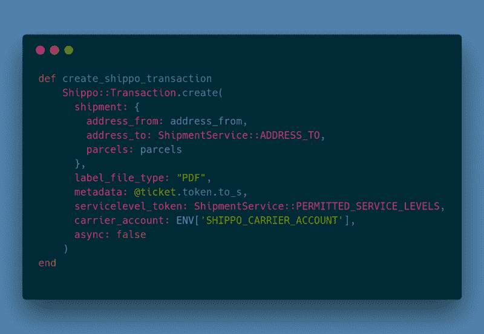
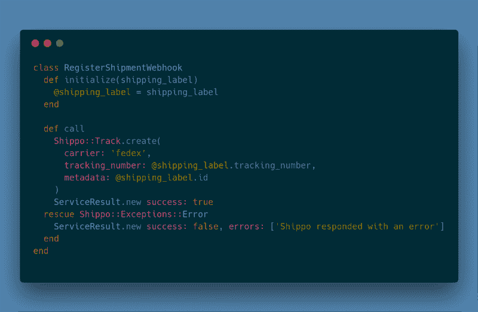
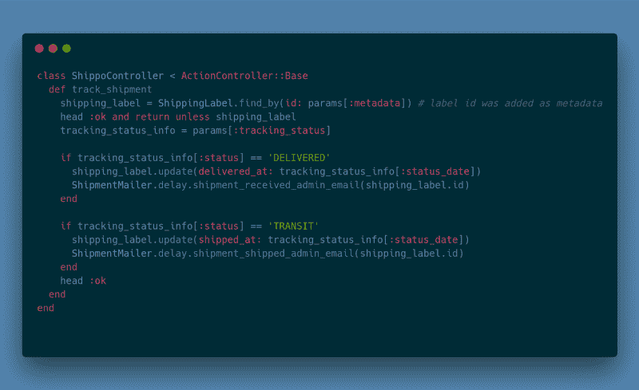

# 我发现了一个 API，可以帮助你通过多种快递服务运送电子商务产品。

> 原文：<https://www.freecodecamp.org/news/check-out-this-api-that-helps-you-ship-ecommerce-products-through-multiple-mail-services-725bcd9ce6f8/>

伊戈尔·彼得罗夫

# 我发现了一个 API，可以帮助你通过多种快递服务运送电子商务产品。以下是使用方法。


Photo by [Guillaume Bolduc](https://unsplash.com/photos/uBe2mknURG4?utm_source=unsplash&utm_medium=referral&utm_content=creditCopyText) on [Unsplash](https://unsplash.com/search/photos/shipping?utm_source=unsplash&utm_medium=referral&utm_content=creditCopyText)

过去的几个月非常忙碌:我参与了不同电子商务项目的开发，加入了一家初创公司，还参与组织了另一家公司——所有这些都是在为一场超级马拉松做准备。

碰巧我正在做一些需要运输功能的电子商务项目。这些项目已经被其他人启动了(不是我从头开始写的),并且它们集成了**Shippo***shipping*服务。所以我就是这样认识了七宝并开始与之合作的。**

**我不知道 Shippo 是否是 web 应用程序中提供功能的唯一选择，但它非常受欢迎，并且有一个非常好和简单的 API。在本文中，我们将揭示您可能需要使用该服务解决的几个常见任务，以及 **Ruby** 。**

#### **从希波开始**

**你首先需要为你的项目捆绑一个 Shippo 账户和`shippo` gem:**

```
**`gem 'shippo', git: 'https://github.com/goshippo/shippo-ruby-client'`**
```

**接下来，你需要用你应该有的 API 令牌来配置它(Shippo 给你`test`或者`live`令牌)。就把这个放在`config/initializers/shippo.rb`:**

```
**`Shippo::api_token = ENV['shippo_api_token']`**
```

**为了和`ENV`一起工作，你可以使用类似于`dotenv`或者`figaro`或者 **Heroku** 的东西。**

#### **验证地址**

**Shippo 的一个很酷的功能是允许你验证地址。假设您的应用程序用户资料中有地址字段，您需要在注册时验证用户的地址是否正确。我想到了一个定制的验证器解决方案:**

```
**`class Profile < ApplicationRecord  validates_with ProfileAddressValidatorend`**
```

**利用`Shippo::Address` API 的验证器代码如下所示:**

****

#### **创建装运/提取费率**

**下一个流行的任务是分两步创建一个装运。首先，您将从不同的承运商(您在 Shippo 中设置的)获取运费，并向您的用户显示，以便他们可以选择一个。其次，根据用户的选择，您将创建一个事务(运输标签)。**

**您还可以提供用于编辑地块尺寸的用户界面，或者只允许他们从预定义的地块/盒子中进行选择。**

**我们的第一步可能是这样的:**

```
**`Shippo::Shipment.create(  address_from: @address_from,  address_to: ADDRESS_TO,  parcels: parcels,  async: false)`**
```

**如果你把它包装成一个服务对象，`@address_from`是你想传递给它的东西。它应该是这样的(相同的*散列*对于`ADDRESS_TO`可能是一个常数，如果你的用户只发送到一个地址):**

```
**`{    :name => 'Apple',    :street1 => 'One Apple Park Way',    :city => 'Cupertino',    :state => 'CA',    :zip => '95014',    :country => 'US',    :phone => '+1 (408) 996–1010',    :email => 'tim@apple.com'  }`**
```

**最后，`parcels`是这种结构的数组:**

```
**`{  length: 10, # or something coming from params  width: 10,  height: 10,  distance_unit: :in,  weight: 3,  mass_unit: :lb,}`**
```

**在传递所有这些数据并调用`Shippo::Shipment.create`之后，您应该得到一个包含一个`rates`属性(`shipment.rates` )的装运对象。**

#### **基于所选费率创建运输标签(交易)**

**我们有一个用户选择的速率，我们在`@selected_shipping_rate`中实例化了它(比如在一个控制器中)。现在只要这样做:**

```
**`transaction = Shippo::Transaction.create(  rate: @selected_shipping_rate['object_id'],  label_file_type: "PDF",  metadata: @ticket.token.to_s, # pass any additional data if needed  async: false)`**
```

**你应该通过检查`transaction["status"]`来确认是否成功。从[可用状态](https://goshippo.com/docs/reference/rb#transactions)来看应该是`SUCCESS`什么的。您可能还会对`transaction["tracking_number"]`和`transaction["label_url"]`(发货标签 PDF 文件的 URL)感兴趣。**

#### **单一呼叫标签创建**

**您可能希望用一个 Shippo API 调用来创建一个运输标签。嗯，你可以做到这一点！在这种情况下，你将使用一个具体的运输公司，如**联邦快递**。**

**因此，这个 API 调用看起来像是我们之前所做的两个调用的组合:`carrier_account`是一个运营商对象 id —您可以使用[https://gos hippo . com/docs/reference/Rb # Carrier-accounts-list](https://goshippo.com/docs/reference/rb#carrier-accounts-list)来获得它，而`servicelevel_token`是来自这个[服务级别枚举](https://goshippo.com/docs/reference/rb#servicelevels)的相应令牌:**

****

#### **运营商设置**

**对于正在工作的运营商，您需要传递所有必需的数据。这取决于具体的运输提供商。七宝对[页面](https://goshippo.com/docs/carriers)所需要的东西有很好的描述。例如，要建立联邦快递，你至少需要从他们那里获得`meter number`和`account number`。**

**关于联邦快递 *:* 有一件棘手的事情，他们的测试服务器不是很稳定(这一事实得到了 Shippo 支持部门的证实)。因此，有时你可以创建货件并请求费率，但有时你会得到这样的回应:“联邦快递 API 没有回应。请几分钟后重试。**

#### **跟踪货件**

**最后，你可能希望像一个“老大哥”一样监视你的货物:-)然后你需要开始跟踪货物，这样你就会知道它们实际上是什么时候被发送和交付的。**

**Shippo 为此提供了一个`Shippo::Track` API，你可以通过 HTTP 接收 webhooks。首先，你应该注册你将跟踪一些货物。**

****

**`@shipping_label`是我们自己存储在数据库中的对象:我们在成功创建 Shippo 事务(运输标签)后保存了它。**

**第二，你需要有一个 webhooks 处理程序:在 Rails 方面，你需要添加一个路由和一个控制器。**

**Shippo 随后会向您发送有关跟踪状态更新的数据，这样您就可以更新数据库中的状态信息，并使一切保持同步。**

```
**`# Shippo webhook in routes.rbpost '/shippo_webhook' => 'shippo#track_shipment'`**
```

****

**不要忘记在开发中使用您最喜欢的开发隧道工具如`ngrok`或`localtunnel`来测试这一点。当然，您需要登录到您的 Shippo 帐户，并指定将接收 webhooks 的 URL 以及它们是什么类型的 webhooks。**

### **结论**

**当你的应用程序需要一些运输功能时，Shippo 是一个很好的解决方案。这就是为什么我会选择它作为我的下一个项目。**

**如果市场上有什么有竞争力的东西，请在评论中告诉我。我很想听听对于运输任务来说很酷的东西。**

***如果你喜欢这篇文章，请点击* ✋ *来传播这个消息。***