# 如何布局和设计一个网站(没有任何设计技巧)

> 原文：<https://www.freecodecamp.org/news/how-to-layout-and-design-a-website-without-any-design-skills-86d94e40b55a/>

如果你正试图为客户建立自由网站，或者仅仅是试图建立你的作品集，你可能会遇到这个难题:

如果你没有任何网页设计技能，如何建立一个网站？

以下是一些选项:

*   你可以雇佣一个网页设计师来为你设计——但是(好的)设计师并不便宜。
*   你可以在 Fiverr 或 Upwork 上找到一个便宜的设计师——但你知道这可能有风险。
*   或者你可以下载一个免费的或者高级的主题或者模板——但是有时候他们不会做你想要他们做的一切。

你的另一个选择是学习一些布局和设计网站的基本技能，并建立自己的前端。

现在，在你阅读这篇文章的时间里，你不会成为一个了不起的设计师。对于复杂的网站，你可能最终需要与专业设计师合作。

但是我相信你可以学习如何规划和设计适合大多数小企业的简单网站。

这种方法包括:

*   学习网站如何在视觉上组合在一起的基础知识
*   研究现有的网页设计，为自己获得灵感和想法。

一旦你知道了网页布局和设计的基本知识，你就能够为你的作品集和自由职业者建立定制的网站。

当然，你建立的每个网站都会给你带来经验。随着时间的推移，随着你继续练习你的手艺，你将能够创造出越来越复杂的设计。

这一过程的主要步骤如下:

*   决定你网站的基本要素
*   规划你网站的布局
*   把设计放在一起
*   建造出最终产品

[https://www.youtube.com/embed/BWS4IO5Wdsc?start=612&feature=oembed](https://www.youtube.com/embed/BWS4IO5Wdsc?start=612&feature=oembed)

Check out my YouTube channel, Coder Coder, to watch me build websites from scratch with HTML & CSS!

每一步都将由研究推动——看看其他网站，看看他们做了什么，并找出你想在你的网站上重复使用的部分。

一个重要的提示:我一点也不提倡你窃取不属于你的 CSS 或图片。(首先，你不会从复制粘贴工作中学到任何东西。)

这里的想法是获得创造性的想法和概念，并用它们来创造类似的东西。

### 决定你网站的基本要素

在你开始选择颜色或字体之前，让我们回答一些关于这个网站的一般性问题:

**1。网站会推广什么样的业务？**

披萨店、摄影室还是书店？任何类型的企业都可以从网站中受益，所以你可以选择任何东西。

对于我们这里的目的，我们将选择一个虚构的咖啡馆称为中央咖啡。因为大家都喜欢咖啡，对吧？

**2。网站会有哪些页面？**

一些常见的页面包括主页、关于页面、联系页面以及企业所处行业的特定页面。

了解网站页面和其他一般结构方面的最好方法是做一些快速的在线研究。

### 研究现有网站

查看其他现有的类似类型的企业网站。看看这些网站中的 3-4 个，看看他们有什么网页。

试着注意网站是如何设计的，并在以下方面做笔记:

*   网站有哪些页面，
*   整体风格是什么，
*   导航和寻找东西是多么容易，
*   以及任何引起你兴趣的东西。

找到示例网站的一个好地方是[主题森林](https://themeforest.net/)。它有大量免费和优质的网站模板和 WordPress 主题。如果你坚持最受欢迎的主题，你知道通常他们会是好设计的例子。

这是我从一个主题中找到的一个咖啡店的例子。

### [第七个](https://the7.io/coffee/)

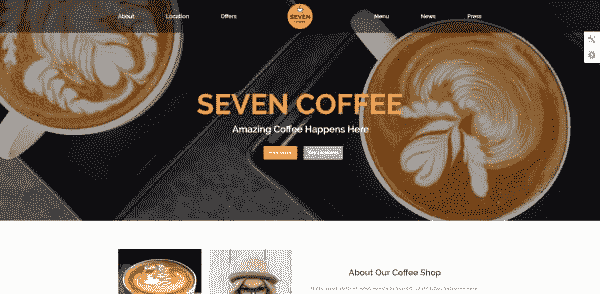

页面:
一个页面的网站，包括:主页，关于，位置，报价，菜单，新闻，新闻，博客文章

**风格:**
现代干净，配好照片

**导航:**
轻松导航

这是我在“芝加哥咖啡店”搜索中找到的一些网站:

### [虫洞咖啡](http://www.thewormhole.us/)

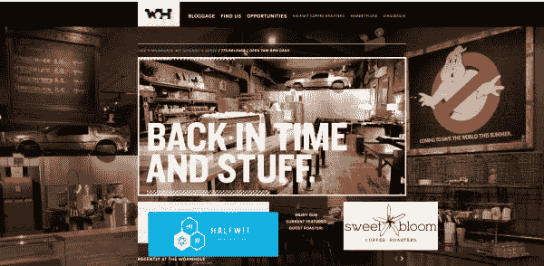

**页面:**
主页、博客、位置/联系人、工作机会

**风格:**
有几分现代；商店的照片更怀旧

**导航:**
不能马上明显看出这是一家咖啡店。浏览这个网站有点困难。

### [咖啡馆街道](http://www.caffestreets.com/)

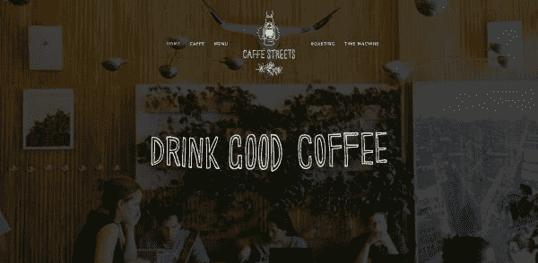

**页面:**
一个页面的网站，栏目有:首页、咖啡馆(关于)、菜单、烘焙、时光机(果汁)、联系方式

**风格:**
简约现代(Squarespace)

**导航:**
相当容易导航。我喜欢顶部的粘性菜单栏，它可以让你向下滚动到每个部分。

### [建咖啡](https://buildcoffee.org/)

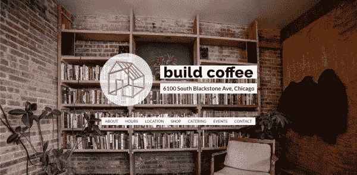

**页面:**
一个页面的网站，栏目有:主页、简介、时间、地点、店铺、餐饮、活动、联系方式

**风格:**
简单，设计是将全幅照片之间的白色背景部分与文字相结合。

**导航:**
相当容易导航

### [泽田咖啡](http://sawadacoffee.com/)

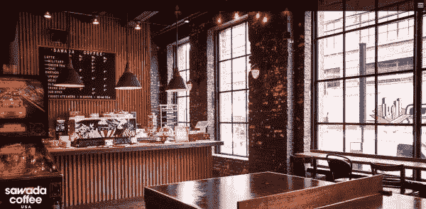

**页面:**
主页，关于，食物&饮料，新闻，联系&小时，我们的餐馆，工作

风格:
设计主要是关于摄影，而文字似乎是事后才想到的

**导航:**
导航有点困难——我差点没看到右边角落的汉堡菜单。

### 为你自己的网站写下笔记

现在，在查看了多个咖啡店网站后，我们对哪些特征是共同的有了更好的了解。我们对自己认为可行的和不可行的有一些想法。

基于你的研究，你现在可以开始为你自己的网站写笔记了。

对于中央咖啡，我认为我们将坚持使用一个简单的单页网站，包含以下部分:

*   页眉
*   主页
*   关于
*   菜单
*   位置/联系人
*   页脚

### 规划你网站的布局

现在我们已经弄清楚了网站的框架，我们将使用我们想要放入每个页面或部分的元素来充实每个页面或部分。我们最终制作的布局也被称为**线框**。

在线框图中，我们并没有设计任何东西，也就是说还没有字体、颜色或照片。我们只是想出我们想要的内容类型，以及它在页面上的大致位置。在这一点上，它更像是一个蓝图或图表。

### 页眉

我喜欢 Seven Coffee 演示页面的顶部导航栏和 Caffe Streets 网站。

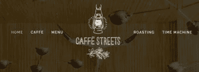

然而，在这两个页面上，它都是居中的，我宁愿让它靠左对齐，徽标在前，章节在后。

那是桌面版的。对于平板电脑和手机，默认情况下，我们只会在标题中显示徽标和汉堡菜单。

单击汉堡包将打开一个脱离画布的菜单，该菜单将从右侧滑入以显示部分导航。

### 主页

因为这是一个单页网站，当你加载网站时，你最初在屏幕上看到的就是“主页”。我喜欢 Seven Coffee 的名字下面有个小标语。

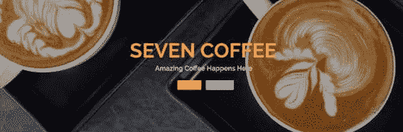

我想这里我会有一个图像在背景中(像建立咖啡),文本在它的上面。在桌面和移动设备上都是一样的。

### 关于

所有的网站都有一个简短的关于的部分，有些还有照片。我会放一段关于咖啡馆的文字，还会放几张店铺内部的照片，以吸引用户前来光顾。

### 菜单

每个网站处理菜单的方式都不同:

*   Seven Coffee 有一个带有价格的菜单条目网格，
*   Caffe Streets 只有一份商品清单，
*   并建立和 Sawada 链接到菜单的 pdf 文件。

就我个人而言，我讨厌在手机上浏览网站时不得不下载 PDF 文件。所以我将坚持使用一个简化的菜单，上面有饮料和食物，并附上一些照片。

### 位置/联系人

我想把地点，时间和联系方式放在网站的底部。我的猜测是，用户将从网站的顶部开始，滚动到底部。

将行动号召放在底部可以回答这个问题，“现在怎么办？”这将有助于游客采取行动，特别是通过获得咖啡馆的方向，并希望访问！

### 页脚

页脚会非常小。这将只是一个小酒吧的版权信息。

### 完整的线框

这里有完整的桌面和移动版网站的线框。我用一个叫做 [Mockflow](https://mockflow.com/) 的免费在线工具创建了这些。他们让你免费创建一个项目，如果你想要一个以上的项目，他们有付费计划。

它很容易使用，我喜欢粗略风格的选项，因为它很有趣？

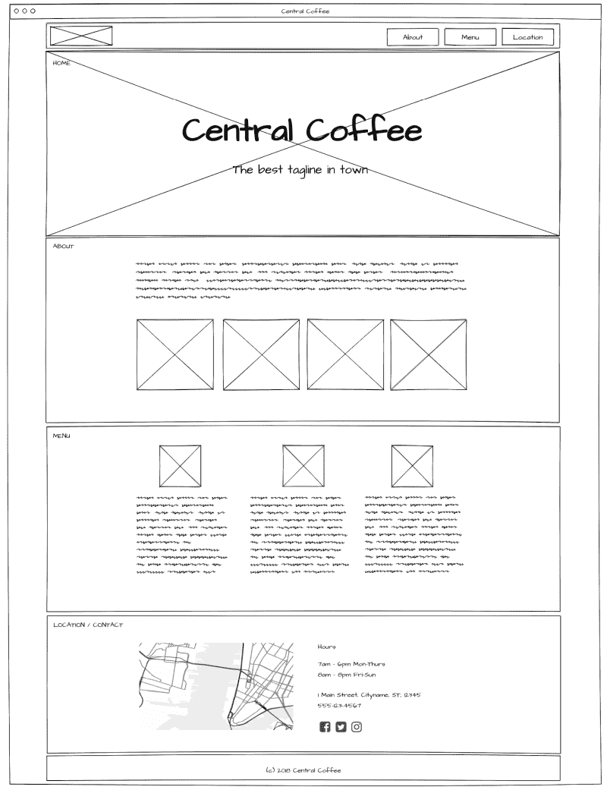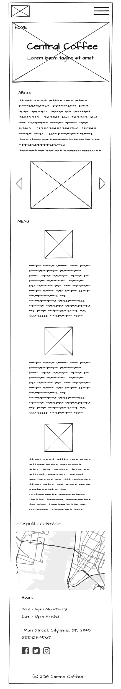

### 决定基本的设计规格

还是那句话，我们不会做超细节超花哨的款式。不过，我们确实需要弄清楚一些基本的东西。比如:

#### **配色方案**

配色方案就是你在网站上使用的不同颜色。就像粉刷和装饰你的房子一样。通常你会希望在大部分空间坚持使用灰色和白色这样的中性色调。对于你想突出的重要元素，比如链接和按钮，用一到两种明亮的强调色。

如果你需要一些色彩灵感，Canva 有一些[样本调色板](https://www.canva.com/learn/brand-color-palette/)供你尝试。

对于中央咖啡网站，我将使用 Canva 链接中的秋季系列——这是一种基于棕色的暖色调。

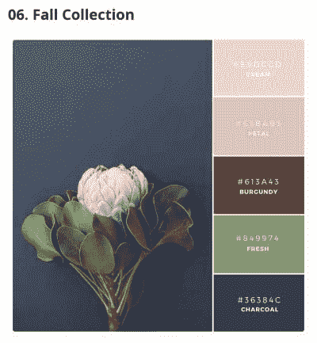

我试图唤起那种与咖啡店相关的怀旧、舒适的感觉。

#### **Fonts**

回顾一下网站，几乎所有的网站都使用无衬线字体(没有“衬线”的字母，或者像打字机文本一样没有结束条)。

我会为你的大部分文本选择一种简单的字体，然后你可以为标题和大标题选择稍微花哨一点的字体。

谷歌字体是一个寻找字体的好地方，你可以在你的网站上免费下载。不要太多，因为每种字体、粗细和风格都会给网站增加额外的负担。

#### **图像/摄影**

选择一个适合网站业务类型的总体风格或基调。对于一家咖啡店，你通常会选择光线柔和、温馨或怀旧的室内照片，人们在咖啡店聊天和放松，以及食物和饮料的图像。

对于插图和标志，有一些免费的在线图形设计工具，带有你可以在你的网站上使用的图像。一些例子是:

*   [坎瓦](https://www.canva.com/)
*   [Vectr](https://vectr.com/)
*   [抓拍](https://snappa.com/)

### 扩建网站

现在我们有了线框来告诉我们一切是如何布局的。我们有自己的设计参考，有助于引导前端风格。

由于我们没有设计师来创建详细的 PSD，我们将继续前进，并开始从我们刚刚制定的线框网站建设。

以下是我通常如何构建网站前端的方法:

1.  设置网站文件
2.  创建和组织文件夹和文件。
3.  让任务运行程序启动并运行。(这个项目我用的是 [Gulp](https://gulpjs.com/) 。)
4.  为每个模板创建一个单独的 HTML 文件。

然后对每个 HTML 模板执行以下步骤:

1.  用基本的 HTML 元素创建框架结构。
2.  逐个构建页面元素。
3.  对于每个元素，添加 CSS 样式，首先确保每个部分布局正确。
4.  当您工作时，检查页面在浏览器中的外观，继续进行更正。

### 确保你的网站响应迅速

当你建立一个网站时，检查你的风格在桌面、平板和移动设备上看起来是否无缝是一个好主意。

您可以在自己的电脑上使用不同的浏览器轻松检查桌面样式。对于移动设备，你可以使用 Chrome 的开发者工具，它可以在各种移动设备上模拟网站。

请记住，任何仿真工具都不会与实际的手机或平板电脑完全一样。因此，当测试你的风格时，当网站在互联网上时，你最终会想要在一个真正的手机上检查它。

这里有一些设备模拟器，可以用来测试网站显示:

*   [Responsinator.com](http://www.responsinator.com/)(免费)
*   Quirktools 提供的 [Screenfly](http://quirktools.com/screenfly) (免费)
*   [Browserstack](https://www.browserstack.com/) (付费)——browser stack 允许你在实际设备上测试虚拟机。

### 成品！

以下是成品中央咖啡网站截图:

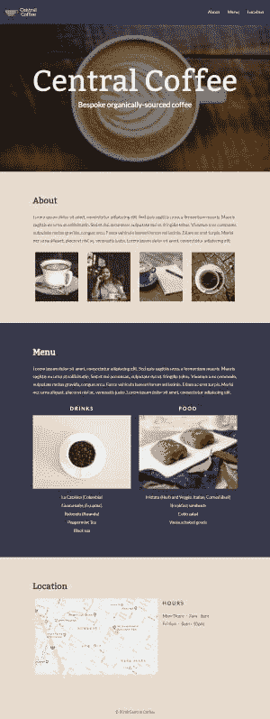

你可以在我的 Github.io 页面亲自查看真实站点[。](https://thecodercoder.github.io/central-coffee-demo)

这就是我如何设计和建立一个网站，而不必聘请设计师。

我希望这篇文章对你有帮助！请在下面的评论中告诉我你的想法。

#### 想要更多吗？

Coder-Coder.com，◾️在我的博客上看到了更多像这样有用的帖子。
◾️在 [Instagram](https://www.instagram.com/thecodercoder/) 和 [Twitter](https://twitter.com/thecodercoder) 上关注我！◾️在我的 YouTube 频道查看编码教程。