# 卷积神经网络直观指南

> 原文：<https://www.freecodecamp.org/news/an-intuitive-guide-to-convolutional-neural-networks-260c2de0a050/>

达芙妮·科内利塞

# 卷积神经网络直观指南

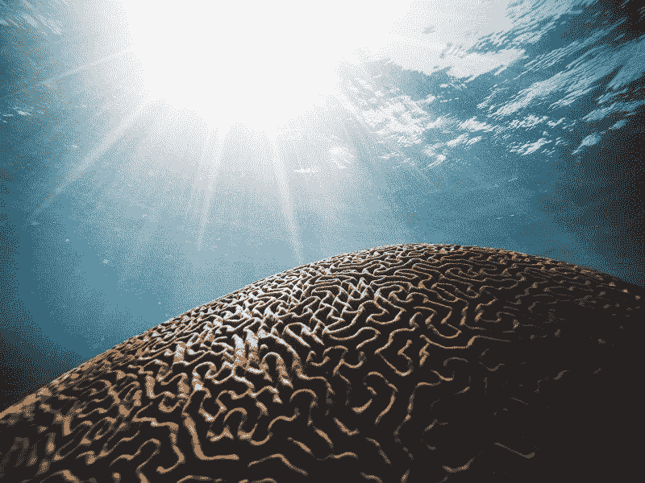

Photo by [Daniel Hjalmarsson](https://unsplash.com/photos/41Wuv1xsmGM?utm_source=unsplash&utm_medium=referral&utm_content=creditCopyText) on [Unsplash](https://unsplash.com/search/photos/brain?utm_source=unsplash&utm_medium=referral&utm_content=creditCopyText)

在本文中，我们将探索卷积神经网络(CNN ),并在较高的层面上，探讨它们是如何受到大脑结构的启发的。如果你想更具体地了解大脑，文章末尾有更多资源可以进一步帮助你。

### **大脑**

我们不断地分析我们周围的世界。没有有意识的努力，我们对看到的一切做出预测，并根据预测采取行动。当我们看到某样东西时，我们会根据过去学到的知识给每个物体贴上标签。为了说明这一点，请看这张图片。


Source: [https://www.youtube.com/watch?v=40riCqvRoMs](https://www.youtube.com/watch?v=40riCqvRoMs)

你可能会想“那是一个快乐的小男孩站在椅子上”。或者你可能认为他看起来像是在尖叫，想要攻击面前的这块蛋糕。

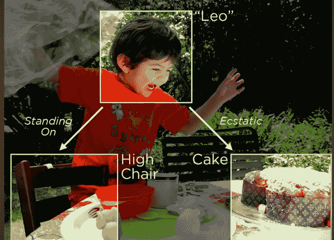

Source: [https://www.youtube.com/watch?v=40riCqvRoMs](https://www.youtube.com/watch?v=40riCqvRoMs)

这是我们每天潜意识里做的事情。我们观察、标记、预测和识别模式。但是我们怎么做呢？我们是如何解释我们所看到的一切的？

大自然花了 5 亿多年才创造出这样一个系统。眼睛和大脑之间的合作被称为初级视觉通路，是我们能够理解周围世界的原因。

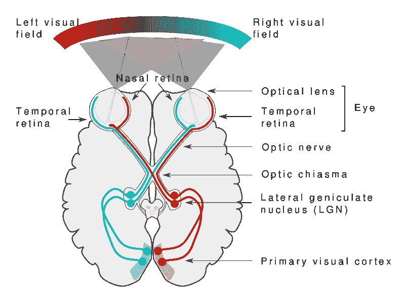

The Visual Pathway. — Source: [https://commons.wikimedia.org/wiki/File:Human_visual_pathway.svg](https://commons.wikimedia.org/wiki/File:Human_visual_pathway.svg)

虽然视觉始于眼睛，但对我们所见的实际解释发生在大脑中，在**初级视觉皮层**。

当你看到一个物体时，你眼中的光感受器通过视神经向初级视觉皮层发送信号，在那里输入被处理。初级视觉皮层负责理解眼睛看到的东西。

所有这些在我们看来都很自然。我们甚至很少想到，我们能够认出生活中看到的所有物体和人是多么特别。大脑中神经元和连接的**非常复杂的层次结构**在记忆和标记物体的过程中起着重要作用。

想想我们是如何学习的，例如，伞是什么。或者一只鸭子，一盏灯，一支蜡烛，或者一本书。一开始，我们的父母或家人告诉我们直接环境中物体的名称。我们通过给我们的例子来学习。慢慢地，但肯定地，我们开始越来越经常地认识到我们环境中的某些事物。它们变得如此普遍，以至于下次我们看到它们时，我们会立刻知道这个物体的名字。他们成为我们在世界上的**模型**的一部分。

### 卷积神经网络

与儿童如何学习识别物体类似，我们需要向算法展示数百万张图片，然后它才能归纳输入内容，并对它从未见过的图像做出预测。

电脑和我们“看”的方式不同。他们的世界只由数字组成。每幅图像都可以用二维数组来表示，称为像素。

但是他们以不同的方式感知图像的事实，并不意味着我们不能训练他们像我们一样识别模式。我们只需要以不同的方式思考图像是什么。

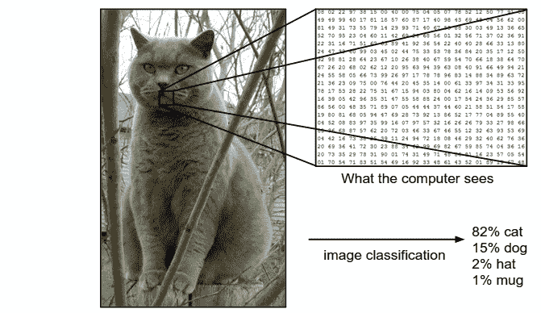

How a computer sees an image. — source: [http://cs231n.github.io/classification/](http://cs231n.github.io/classification/)

为了教会算法如何识别图像中的对象，我们使用一种特定类型的[人工神经网络](https://medium.com/@daphn3cor/building-a-3-layer-neural-network-from-scratch-99239c4af5d3):卷积神经网络(CNN)。它们的名字源于网络中最重要的运算之一:[卷积](https://en.wikipedia.org/wiki/Convolution)。

卷积神经网络的灵感来自大脑。20 世纪 50 年代和 60 年代，D . H Hubel 和 T . N Wiesel 对哺乳动物大脑的研究提出了哺乳动物视觉感知世界的新模型。他们表明，猫和猴子的视觉皮层包括专门对其直接环境中的神经元做出反应的神经元。

在他们的论文中，他们描述了大脑中两种基本类型的视觉神经元细胞，每种细胞都以不同的方式发挥作用:简单细胞( **S 细胞**)和复杂细胞( **C 细胞**)。

例如，当简单细胞将基本形状识别为固定区域和特定角度的线条时，它们就会激活。复杂细胞具有较大的感受野，其输出对感受野中的特定位置不敏感。

复杂细胞继续对某种刺激做出反应，即使它在视网膜上的绝对位置发生了变化。在这种情况下，复杂是指更加灵活。

在[视觉](http://www.cns.nyu.edu/~david/courses/perception/lecturenotes/V1/lgn-V1.html)中，单个感觉神经元的**感受野**是视网膜的特定区域，在该区域中，某些东西将影响该神经元的放电(即，将激活该神经元)。每个感觉神经元细胞都有相似的感受野，它们的感受野是重叠的。

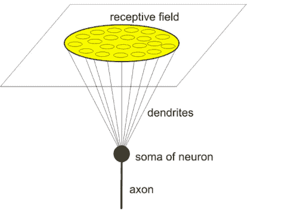

A neuron’s receptive field. — Source: [http://neuroclusterbrain.com/neuron_model.html](http://neuroclusterbrain.com/neuron_model.html)

此外，**层级**的概念在大脑中起着重要作用。信息以连续的顺序存储在模式序列中。位于大脑最外层的**新皮层**，分层存储信息。它储存在皮层列中，或新皮层中统一组织的神经元群中。

1980 年，一个叫 Fukushima 的研究者提出了一个[层次神经网络模型](https://en.wikipedia.org/wiki/Neocognitron)。他称之为**新认知基因**。这个模型的灵感来自简单细胞和复杂细胞的概念。大脑皮层能够通过学习物体的形状来识别模式。

后来，在 1998 年，Bengio、Le Cun、Bottou 和 Haffner 在一篇论文中介绍了卷积神经网络。他们的第一个卷积神经网络被称为 **LeNet-5** ，能够从手写数字中分类数字。

对于卷积神经网络的整个历史，你可以从[到这里](http://dataconomy.com/2017/04/history-neural-networks/)。

### **架构**

在本文的剩余部分，我将带您了解 CNN 的架构，并展示 Python 实现。

卷积神经网络具有不同于常规神经网络的架构。常规神经网络通过一系列隐藏层来转换输入。每一层都由一组**神经元**组成，其中每一层都与前一层中的所有神经元完全连接。最后，还有最后一个完全连接的图层-输出图层-用于表示预测。

卷积神经网络有点不同。首先，这些层是按照 3 个维度组织的:宽度、高度和深度。此外，一层中的神经元并不连接到下一层中的所有神经元，而是仅连接到其一小部分区域。最后，最终的输出将减少到一个单一的概率得分向量，沿着深度维度组织。

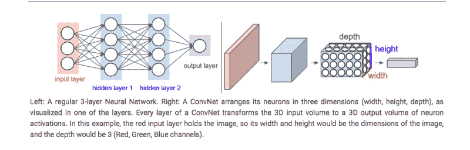

Normal NN vs CNN. — Source: [http://cs231n.github.io/convolutional-networks/](http://cs231n.github.io/convolutional-networks/)

CNN 有两个组成部分:

*   隐藏层/特征提取部分

在这一部分中，网络将执行一系列的**卷积**和**汇集**操作，在此期间检测**特征**。如果你有一张斑马的照片，网络会在这部分识别出它的条纹、两只耳朵和四条腿。

*   分类部分

这里，完全连接的层将在这些提取的特征之上充当**分类器**。他们将为图像上的物体分配一个**概率**，该物体就是算法预测的物体。

```
# before we start building we import the libraries
```

```
import numpy as np
```

```
from keras.layers import Conv2D, Activation, MaxPool2D, Flatten, Densefrom keras.models import Sequential
```

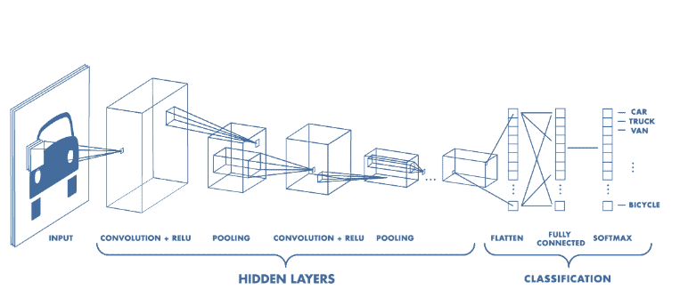

Architecture of a CNN. — Source: [https://www.mathworks.com/videos/introduction-to-deep-learning-what-are-convolutional-neural-networks--1489512765771.html](https://www.mathworks.com/videos/introduction-to-deep-learning-what-are-convolutional-neural-networks--1489512765771.html)

#### **特征提取**

卷积是 CNN 的主要组成部分之一。术语[卷积](http://timdettmers.com/2015/03/26/convolution-deep-learning/)是指两个函数产生第三个函数的数学组合。它融合了两组信息。

在 CNN 的情况下，使用**滤波器**或**内核**(这些术语可以互换使用)对输入数据进行卷积，然后产生**特征图**。

我们通过在输入上滑动滤波器来执行卷积。在每个位置，执行矩阵乘法，并将结果加到特征图上。

在下面的动画中，你可以看到卷积运算。你可以看到**滤波器**(绿色方块)滑过我们的**输入**(蓝色方块)，卷积的总和进入**特征图**(红色方块)。

我们过滤器的区域也被称为感受野，以神经元细胞命名！这个滤镜的大小是 3x3。

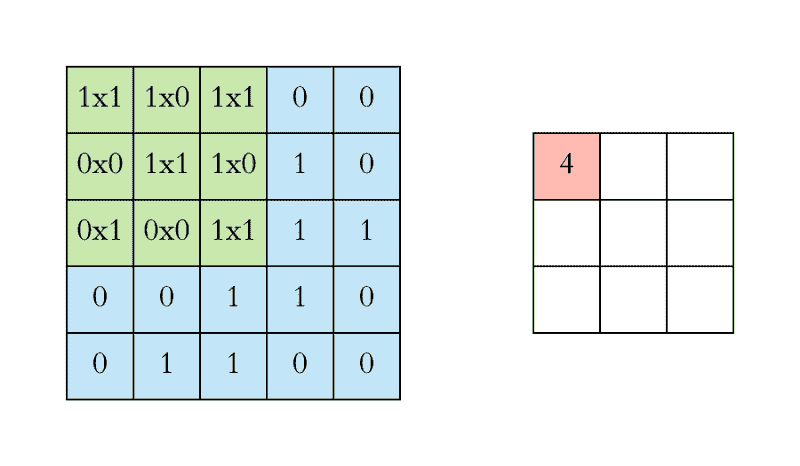

Left: the filter slides over the input. Right: the result is summed and added to the feature map. — Source: [https://towardsdatascience.com/applied-deep-learning-part-4-convolutional-neural-networks-584bc134c1e2](https://towardsdatascience.com/applied-deep-learning-part-4-convolutional-neural-networks-584bc134c1e2)

为了便于解释，我已经向你们展示了 2D 的操作，但实际上卷积是在 3D 中进行的。每个图像被表示为一个 3D 矩阵，其宽度、高度和深度的尺寸分别为[和](https://www.youtube.com/watch?v=jajksuQW4mc)。深度是一个维度，因为图像中使用了颜色通道(RGB)。

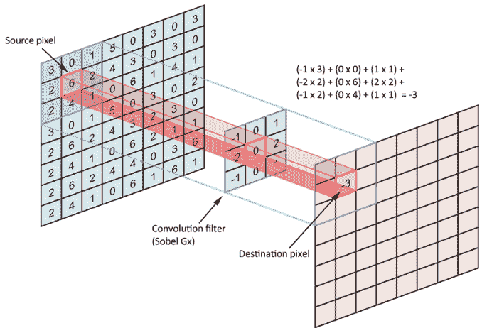

The filter slides over the input and performs its output on the new layer. — Source: [https://towardsdatascience.com/applied-deep-learning-part-4-convolutional-neural-networks-584bc134c1e2](https://towardsdatascience.com/applied-deep-learning-part-4-convolutional-neural-networks-584bc134c1e2)

我们对输入进行多次卷积，每次运算使用不同的过滤器。这导致不同的特征图。最后，我们将所有这些特征图放在一起，作为卷积层的最终输出。

就像任何其他神经网络一样，我们使用一个**激活函数**来使我们的输出非线性。在卷积神经网络的情况下，卷积的输出将通过激活函数。这可能是 [ReLU](https://github.com/Kulbear/deep-learning-nano-foundation/wiki/ReLU-and-Softmax-Activation-Functions) 激活功能。

**步幅**是卷积滤波器每次移动的步长。步幅大小通常为 1，这意味着过滤器逐像素滑动。通过增加步长，滤波器以更大的间隔在输入上滑动，从而减少像元之间的重叠。

下面的动画展示了步幅 1 的实际效果。


因为特征图的大小总是小于输入，所以我们必须做一些事情来防止我们的特征图缩小。这就是我们使用**填充**的地方。

添加一个零值像素层，用零包围输入，这样我们的特征图就不会缩小。除了在执行卷积后保持空间大小不变之外，填充还可以提高性能，并确保内核和步幅大小适合输入。

在卷积层之后，通常在 CNN 层之间添加一个**池层**。池的作用是不断降低维数，以减少网络中的参数和计算量。这缩短了训练时间并控制了[过拟合](https://en.wikipedia.org/wiki/Overfitting)。

最常见的池类型是**最大池**、*、*，它在每个窗口中取最大值。这些窗口大小需要预先指定。这减小了特征图的大小，同时保留了重要的信息。

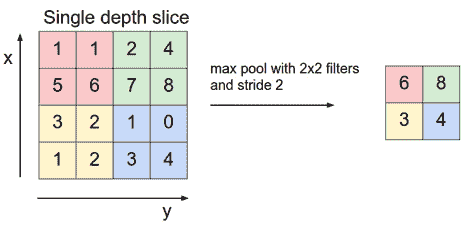

Max pooling takes the largest values. — Source: [http://cs231n.github.io/convolutional-networks/](http://cs231n.github.io/convolutional-networks/)

因此，当使用 CNN 时，我们必须决定的四个重要的 [**超参数**](https://en.wikipedia.org/wiki/Hyperparameter_(machine_learning)) 是:

*   内核大小
*   过滤器数量(即，我们想要使用多少个过滤器)
*   步幅(滤波器的步长有多大)
*   填料

```
# Images fed into this model are 512 x 512 pixels with 3 channels
```

```
img_shape = (28,28,1)
```

```
# Set up the model
```

```
model = Sequential()
```

```
# Add convolutional layer with 3, 3 by 3 filters and a stride size of 1# Set padding so that input size equals output size
```

```
model.add(Conv2D(6,2,input_shape=img_shape))
```

```
# Add relu activation to the layer 
```

```
model.add(Activation('relu'))
```

```
#Pooling
```

```
model.add(MaxPool2D(2))
```

下图显示了一种可视化卷积图层的好方法。试着看一会儿，真正理解正在发生的事情。


How convolution works with K = 2 filters, each with a spatial extent F = 3 , stride, S = 2, and input padding P = 1\. — Source: [http://cs231n.github.io/convolutional-networks/](http://cs231n.github.io/convolutional-networks/)

#### **分类**

在卷积层和池层之后，我们的分类部分由几个完全连接的层组成。然而，这些完全连接的层只能接受一维数据。为了将我们的 3D 数据转换成 1D，我们使用 Python 中的函数`flatten`。这实质上是将我们的 3D 体积排列成一个 1D 矢量。

卷积神经网络的最后几层是完全连接的层。完全连接层中的神经元与前一层中的所有激活具有完全连接。这部分在原理上与常规神经网络相同。

```
#Fully connected layers
```

```
# Use Flatten to convert 3D data to 1Dmodel.add(Flatten())
```

```
# Add dense layer with 10 neuronsmodel.add(Dense(10))
```

```
# we use the softmax activation function for our last layermodel.add(Activation('softmax'))
```

```
# give an overview of our model
```

```
model.summary
```

```
_________________________________________________________________Layer (type)                 Output Shape              Param #   =================================================================conv2d_1 (Conv2D)            (None, 27, 27, 6)         30        _________________________________________________________________activation_1 (Activation)    (None, 27, 27, 6)         0         _________________________________________________________________max_pooling2d_1 (MaxPooling2 (None, 13, 13, 6)         0         _________________________________________________________________flatten_1 (Flatten)          (None, 1014)              0         _________________________________________________________________dense_1 (Dense)              (None, 10)                10150     _________________________________________________________________activation_2 (Activation)    (None, 10)                0         =================================================================Total params: 10,180Trainable params: 10,180Non-trainable params: 0__________________________________________________________________
```

### 培养

使用反向传播或梯度下降，训练 CNN 的工作方式与常规神经网络相同。然而，由于卷积运算，这在数学上有点复杂。

如果你想阅读更多关于常规神经网络如何工作的内容，你可以阅读我之前的文章。

```
"""Before the training process, we have to put together a learning process in a particular form. It consists of 3 elements: an optimiser, a loss function and a metric."""
```

```
model.compile(loss='sparse_categorical_crossentropy', optimizer = 'adam', metrics=['acc'])
```

```
# dataset with handwritten digits to train the model onfrom keras.datasets import mnist
```

```
(x_train, y_train), (x_test, y_test) = mnist.load_data()
```

```
x_train = np.expand_dims(x_train,-1)
```

```
x_test = np.expand_dims(x_test,-1)
```

```
# Train the model, iterating on the data in batches of 32 samples# for 10 epochs
```

```
model.fit(x_train, y_train, batch_size=32, epochs=10, validation_data=(x_test,y_test)
```

```
# Training...
```

```
Train on 60000 samples, validate on 10000 samplesEpoch 1/1060000/60000 [==============================] - 10s 175us/step - loss: 4.0330 - acc: 0.7424 - val_loss: 3.5352 - val_acc: 0.7746Epoch 2/1060000/60000 [==============================] - 10s 169us/step - loss: 3.5208 - acc: 0.7746 - val_loss: 3.4403 - val_acc: 0.7794Epoch 3/1060000/60000 [==============================] - 11s 176us/step - loss: 2.4443 - acc: 0.8372 - val_loss: 1.9846 - val_acc: 0.8645Epoch 4/1060000/60000 [==============================] - 10s 173us/step - loss: 1.8943 - acc: 0.8691 - val_loss: 1.8478 - val_acc: 0.8713Epoch 5/1060000/60000 [==============================] - 10s 174us/step - loss: 1.7726 - acc: 0.8735 - val_loss: 1.7595 - val_acc: 0.8718Epoch 6/1060000/60000 [==============================] - 10s 174us/step - loss: 1.6943 - acc: 0.8765 - val_loss: 1.7150 - val_acc: 0.8745Epoch 7/1060000/60000 [==============================] - 10s 173us/step - loss: 1.6765 - acc: 0.8777 - val_loss: 1.7268 - val_acc: 0.8688Epoch 8/1060000/60000 [==============================] - 10s 173us/step - loss: 1.6676 - acc: 0.8799 - val_loss: 1.7110 - val_acc: 0.8749Epoch 9/1060000/60000 [==============================] - 10s 172us/step - loss: 1.4759 - acc: 0.8888 - val_loss: 0.1346 - val_acc: 0.9597Epoch 10/1060000/60000 [==============================] - 11s 177us/step - loss: 0.1026 - acc: 0.9681 - val_loss: 0.1144 - val_acc: 0.9693
```

### 摘要

总之，CNN 对于图像分类和识别特别有用。它们有两个主要部分:特征提取部分和分类部分。

CNN 中的主要特殊技术是卷积，其中滤波器滑过输入，并合并输入值+特征图上的滤波器值。最后，我们的目标是给我们的 CNN 提供新的图像，这样它就可以给出它认为看到的或[用文本描述图像](https://cs.stanford.edu/people/karpathy/neuraltalk2/demo.html)的[物体的概率。](https://cs.stanford.edu/people/karpathy/neuraltalk2/demo.html)

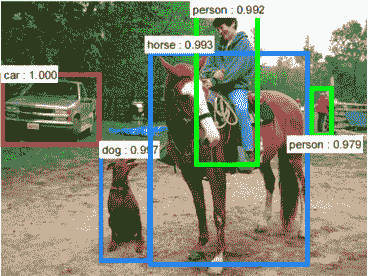

— Source: [https://arxiv.org/pdf/1506.01497v3.pdf](https://arxiv.org/pdf/1506.01497v3.pdf)

你可以在这里找到完整的代码。

#### 更多**大脑**相关推荐？

*   阅读这篇关于大脑的非常酷的文章。
*   我还推荐这本关于智力和大脑的书。
*   [《如何创造思维》](https://en.wikipedia.org/wiki/How_to_Create_a_Mind)雷·库兹韦尔著。