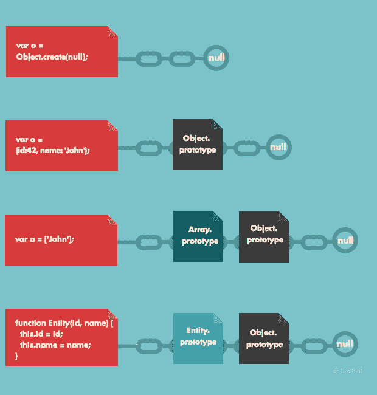

# 让我们揭开 JavaScript 的“new”关键字的神秘面纱

> 原文：<https://www.freecodecamp.org/news/demystifying-javascripts-new-keyword-874df126184c/>

辛西娅·李

# 让我们揭开 JavaScript 的“new”关键字的神秘面纱


周末，我完成了威尔·森坦斯的 [JavaScript:最难的部分](https://frontendmasters.com/courses/javascript-hard-parts/)。这可能听起来不像是度过周末最光荣的方式，但我实际上发现完成课程非常有趣和放松。它涉及了函数式编程、高阶函数、闭包和异步 JavaScript。

对我来说，课程的亮点是他如何扩展面向对象编程(OOP)的 JavaScript 方法，并揭开了**新**操作符背后的神秘面纱。当使用**新**操作符时，我现在对引擎盖下发生的事情有了全面的了解。

### **JavaScript** 中的面向对象编程


Photo by [Nick Karvounis](https://unsplash.com/@nickkarvounis?utm_source=medium&utm_medium=referral) on [Unsplash](https://unsplash.com?utm_source=medium&utm_medium=referral)

面向对象编程(OOP)是一种基于“对象”概念的编程范式数据和函数(属性和方法)被捆绑在一个对象中。

JavaScript 中的对象是键值对的集合。这些键值对是对象的属性。属性可以是数组、函数、对象本身或任何原始数据类型，如字符串或整数。

我们的 JavaScript 工具箱中有哪些用于对象创建的技术？

假设我们正在刚刚设计的游戏中创建用户。我们将如何存储用户的详细信息，比如他们的姓名、积分，以及实现方法，比如积分的增加？这里有两个创建基本对象的选项。

#### **选项 1 —对象文字符号**

```
let user1 = {
  name: "Taylor",
  points: 5,
  increment: function() {
    user1.points++;
  }
};
```

JavaScript 对象文字是用花括号括起来的名称-值对的列表。在上面的示例中，创建了对象“user1 ”,相关数据存储在其中。

#### **选项 2 — Object.create()**

`Object.create(proto, [ propertiesObject ])`

方法接受两个参数:

1.  proto:应该是新创建对象的原型的对象。它必须是对象或 null。
2.  propertiesObject:新对象的属性。该参数是可选的。

基本上，你传递给`Object.create`一个你想继承的对象，它返回一个继承自你传递给它的对象的新对象。

```
let user2 = Object.create(null);

user2.name = "Cam";
user2.points = 8;
user2.increment = function() {
  user2.points++;
}
```

上面的基本对象创建选项是重复的。它要求每个都是手动创建的。

我们如何克服这一点？

### 解决方法

#### **解决方案 1——使用函数生成对象**

一个简单的解决方案是编写一个函数来创建新用户。

```
function createUser(name, points) {
  let newUser = {};
  newUser.name = name;
  newUser.points = points;
  newUser.increment = function() {
    newUser.points++;
  };
  return newUser;
}
```

要创建一个用户，您现在可以在函数的参数中输入信息。

```
let user1 = createUser("Bob", 5);
user1.increment();
```

然而，上例中的 increment 函数只是原始 increment 函数的副本。这不是编写代码的好方法，因为对函数的任何潜在更改都需要针对每个对象手动完成。

#### **解决方案 2——使用 JavaScript 的原型性质**

与 Python 和 Java 等面向对象的语言不同，JavaScript 没有类。它使用原型和原型链接的概念来继承。

当您创建一个新数组时，您可以自动访问内置方法，如`Array.join`、`Array.sort`和`Array.filter`。这是因为数组对象继承了 Array.prototype 的属性。



Image credit: [JavaScript Prototype Chains, Scope Chains, and Performance](https://www.toptal.com/javascript/javascript-prototypes-scopes-and-performance-what-you-need-to-know) by Diego Castorina

每个 JavaScript 函数都有一个 prototype 属性，默认为空。您可以向这个原型属性添加函数，在这种形式下，它被称为方法。当执行继承的函数时，这个的值指向继承的对象。

```
function createUser(name, points) {
  let newUser = Object.create(userFunction);
  newUser.name = name;
  newUser.points = points;
  return newUser;
}

let userFunction = {
  increment: function() {this.points++};
  login: function() {console.log("Please login.")};
}

let user1 = createUser("Bob", 5);
user1.increment();
```

当`user1`对象被创建时，与 userFunction 的原型链结合就形成了。

当`user1.increment()` 在调用堆栈中时，解释器将在全局内存中寻找 user1。接下来，它将寻找增量函数，但不会找到它。解释器将查看原型链上的下一个对象，并在那里找到增量函数。

#### **解决方案 3 — *新增*和*本*关键词**


**new** 运算符用于创建一个具有构造函数的对象的实例。

当我们用 new 调用构造函数时，我们自动执行以下操作:

*   创建了一个新对象
*   它将`this`绑定到对象上
*   构造函数的原型对象成为新对象的 __proto__ 属性
*   它从函数中返回对象

这太棒了，因为自动化减少了重复代码！

```
function User(name, points) {
 this.name = name; 
 this.points = points;
}
User.prototype.increment = function(){
 this.points++;
}
User.prototype.login = function() {
 console.log(“Please login.”)
}

let user1 = new User(“Dylan”, 6);
user1.increment();
```

通过使用原型模式，每个方法和属性都被直接添加到对象的原型上。

解释器将沿着原型链向上，在用户的原型属性下找到增量函数，用户的原型属性本身也是一个对象，其中包含信息。记住—**JavaScript 中的所有函数也是对象**。既然解释器已经找到了它需要的东西，它可以创建一个新的本地执行上下文来运行`user1.increment()`。

**旁注:__proto__ 和原型之间的差异**

如果你已经对 __proto__ 和 prototype 感到困惑，不要担心！对此感到困惑的远不止你一个人。

Prototype 是构造函数的一个属性，它决定了什么将成为构造对象的 __proto__ 属性。

因此，__proto__ 是创建的引用，该引用被称为原型链键。

#### **解决方案 4—ES6‘语法糖’**


其他语言允许我们在对象“构造函数”本身中编写共享方法。ECMAScript6 引入了 **class** 关键字，它允许我们编写类似于其他经典语言的普通类的类。实际上，它是 JavaScript 的原型行为之上的语法糖。

```
class User {
  constructor(name, points) {
    this.name = name;
    this.points = points;
  }
  increment () {
    this.points++;
  }
  login () {
    console.log("Please login.")
  }
}

let user1 = new User("John", 12);
user1.increment();
```

在解决方案 3 中，使用`User.prototype.functionName`精确地实现了相关的方法。在这个解决方案中，获得了相同的结果，但是语法看起来更清晰。

### **结论**

我们现在已经了解了 JavaScript 中创建对象的不同选项。虽然**类**声明和**新**操作符相对容易使用，但是理解什么是自动化是很重要的。

概括地说，当用 **new** *:* 调用构造函数时，以下动作是自动执行的

*   创建了一个新对象
*   它将`this`绑定到对象上
*   构造函数的原型对象成为新对象的 __proto__ 属性
*   它从函数中返回对象

感谢阅读我的文章，如果你喜欢就鼓掌吧！查看我的其他文章，如[我如何建立我的番茄钟应用程序，以及我在这一路上学到的经验教训](https://medium.freecodecamp.org/how-i-built-my-pomodoro-clock-app-and-the-lessons-i-learned-along-the-way-51288983f5ee)。