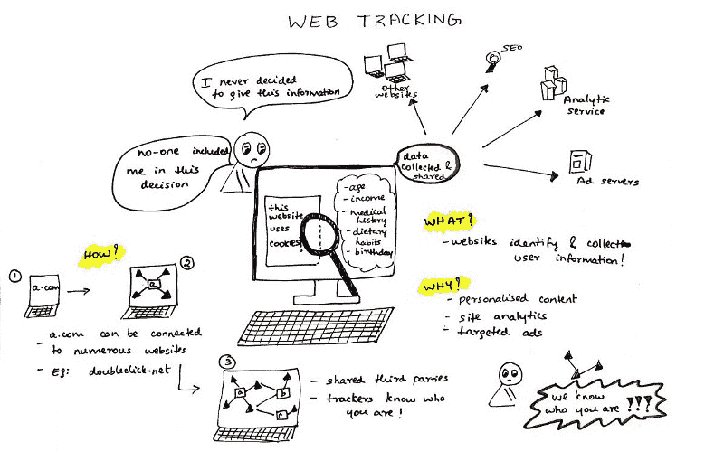
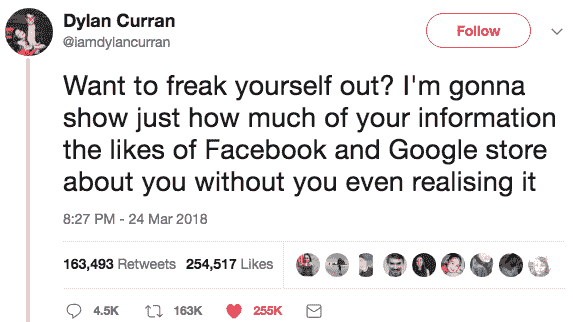
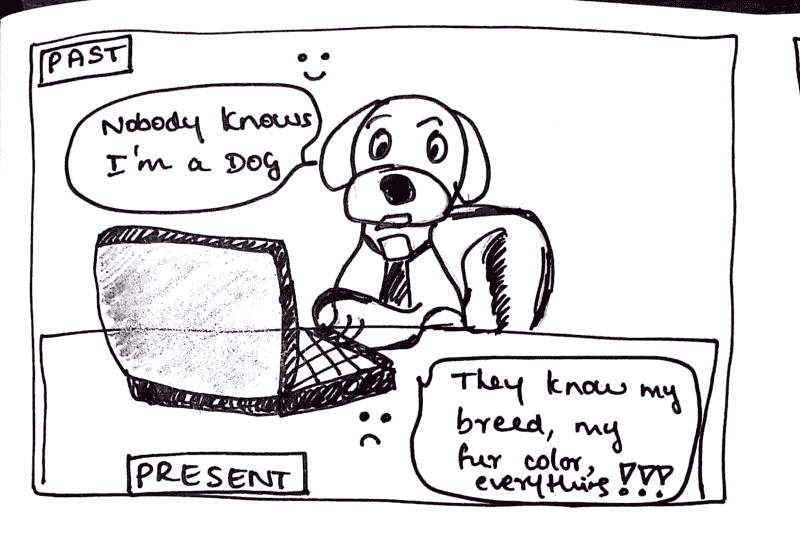
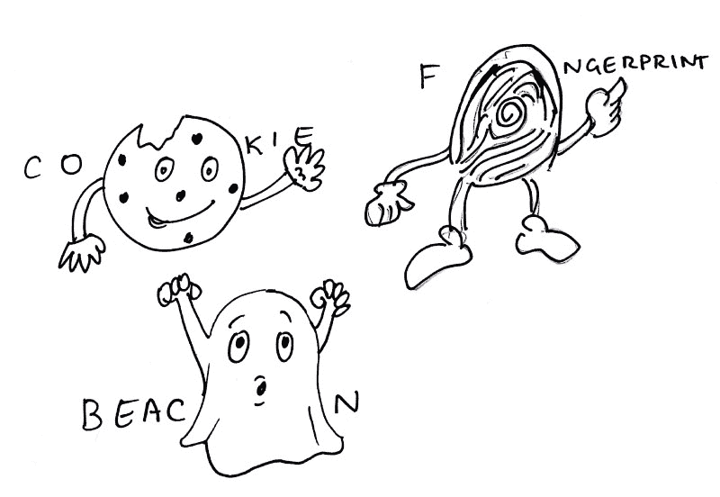
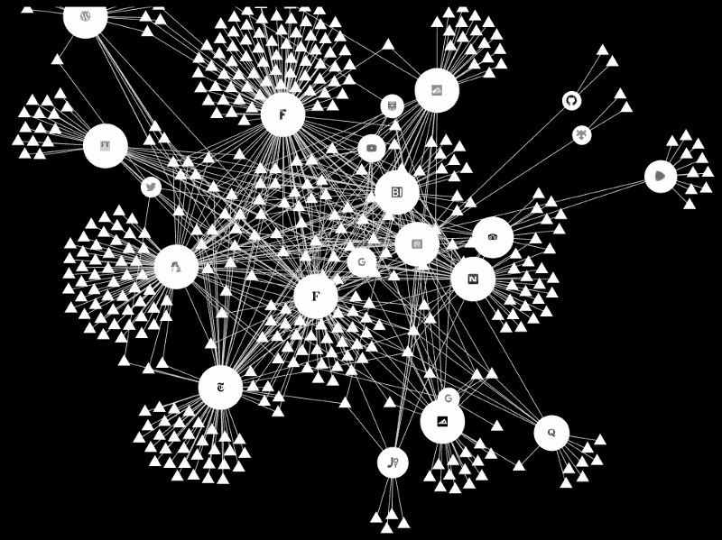

# 网络跟踪:关于你的在线隐私，你应该知道什么

> 原文：<https://www.freecodecamp.org/news/what-you-should-know-about-web-tracking-and-how-it-affects-your-online-privacy-42935355525/>

由普林西帕

# 网络跟踪:关于你的在线隐私，你应该知道什么

An overview of web tracking

脸书丑闻的出现让我们所有人都开始关注和讨论网络隐私的增加。以下是我试图简单解释网络跟踪是如何工作的。

您将在本文中发现:

1.  什么是网络跟踪，如何跟踪，为什么跟踪？
2.  这是邪恶的吗？
3.  第一方与第三方网络跟踪
4.  跟踪机制
5.  如何追踪追踪者

### 什么是网络跟踪？

网络跟踪是网站识别和收集用户信息的做法。这通常是网络浏览历史的某个子集的形式。

#### 它是如何工作的？

每当你使用互联网时，你都会留下你访问过的网站的记录，以及你点击的每一个东西。为了跟踪这些信息，许多网站会保存一小块数据，嵌入不可见的对象，或者使用您的用户帐户和硬件配置。

下面的“跟踪机制”一节将对此进行详细描述。

#### **为什么会这样做？**

从网站所有者和跟踪者的角度来看，它提供了理想的功能，包括个性化、网站分析和定向广告。

没有追踪器，电子商务网站将不得不把每个用户都视为陌生人，并且无法呈现个性化内容。

### 网络跟踪是邪恶的吗？

网络跟踪并不是 100%邪恶的，但它的工作原理仍然知之甚少。在你切换网站后，你刚刚看过的产品的广告，或者你几周前看过的产品，又重新出现了！最令人担忧的是来自第三方网站的追踪器。

这条 Twitter 帖子描述了谷歌和脸书收集了我们多少信息。

### **第一方与第三方网络跟踪**

比方说，你去 nytimes.com。《纽约时报》知道你已经访问过，也知道你正在读哪篇文章。在这种情况下，纽约时报是“第一方”

因为您选择访问第一方，所以我们并不特别关心第一方从您的访问中了解到什么。像 doubleclick.net 这样的第三方追踪器——被 nytimes.com 植入以提供例如定向广告——可以记录用户对 nytimes.com 的访问。

任何网站中追踪器的数量取决于网站所有者的决定。

#### **什么是第三方追踪？**

第三方网站跟踪是指除用户直接访问的网站之外的实体(跟踪者)跟踪或协助跟踪用户对网站的访问的做法。

#### 第三方追踪者令人毛骨悚然。

一旦页面上有一个第三方，该第三方就有能力转向并邀请任意数量的其他第三方访问第一方网页。

你的个人信息很有价值，**你有权知道正在收集的关于你的数据**——你的年龄、收入、家人的年龄和收入、病史、饮食习惯、最喜欢的网站、你的生日……不胜枚举。

诀窍在于获取这些数据，并与第三方合作，帮助他们想出新的方法来说服你花钱，注册服务，并放弃更多信息。如果你决定为了一个切实的利益而放弃这些信息，这是很好的，但是除了一个广告，你可能永远看不到其他的利益，也没有人让你参与这个决定。

#### **跟踪不是匿名的**

Cartoon depicting tracking isn’t anonymous

你可能会认为这种跟踪是匿名的，因为你的真实姓名没有附上。但是很多第三方确实知道你的真实身份。

例如，当脸书充当第三方追踪者时，只要你创建了一个脸书账户并登录，他们就可以知道你的身份——甚至可能你没有登录。

追踪器还可以通过算法利用用户浏览历史和社交媒体档案之间的统计相似性来消除用户的匿名性。

#### **可见的第三方追踪器**

虽然大多数第三方是不可见的，但可见的页面元素，如脸书 Like 按钮、嵌入式 Twitter feeds 和各种其他商业小部件都是第三方跟踪的模式。

### **跟踪机制**

以下是最常见的跟踪机制:

Cookies, fingerprinting and beacons — tracking mechanisms

Cookies 是最广为人知的识别用户身份的方法。它们使用由 web 服务器放在浏览器存储器中的小块数据(每个数据限于 4 KB)。当用户第一次访问网站时，带有唯一用户标识符(可以随机生成)的 cookie 文件会存储在用户的计算机上。

以后访问脸书页面不需要您登录，因为您的详细信息会通过您首次登录时存储的 cookie 被浏览器记住。

**浏览器指纹识别**是一种高度精确的方法，可以在用户上网时识别和跟踪他们。收集的信息相当全面，通常包括浏览器类型和版本、操作系统和版本、屏幕分辨率、支持的字体、插件、时区、语言和字体偏好，甚至硬件配置。

这些标识符可能看起来是通用的，根本不是个人标识。但是，通常只有几百万分之一的人拥有与您完全相同的规格。

网络信标非常小，通常是嵌入网页或电子邮件中的隐形物体。网络信标也被称为“网络臭虫”，也称为“标签”、“页面标签”、“跟踪臭虫”、“像素跟踪器”或“像素 gif”。

最简单的形式是微小清晰的图像，通常只有一个像素大小。当网页被加载或电子邮件被打开时，它们以图像的形式下载，并向远程服务器请求图像。服务器呼叫提醒公司，他们的电子邮件刚刚被打开或他们的网页被访问。

这就是为什么你不应该在来自你不信任的发件人的邮件中显示图片。

网络信标也被在线广告商所使用，他们将网络信标嵌入到他们的广告中，这样他们就可以独立地跟踪他们的广告被显示的频率。

### 如何追踪追踪者！

去年，我通过拓展项目在 Mozilla 实习。我开发了一个叫做[光束](https://princiya777.wordpress.com/category/lightbeam/)的工具。这种隐私浏览器扩展可以帮助您发现在您浏览网页时谁在跟踪您。

A visualization from Lightbeam showing first and third party trackers

当您激活 Lightbeam 并访问一个网站时，浏览器扩展会创建该页面上所有活动的第三方追踪器的实时可视化。当你浏览第二个网站时，它会突出显示同样活跃的第三方追踪器，并显示哪些第三方在这两个网站上都见过你。可视化随着你访问的每一个站点和浏览器发出的每一个请求而增长。

### 参考资料和进一步阅读

网络跟踪有比这里写的更多的内容。以下是一些了解更多信息的好地方:

1.  [WebTAP 项目](http://randomwalker.info/publications/webtap-chapter.pdf)
2.  [网上第三方追踪](http://www.franziroesner.com/pdf/webtracking-NSDI2012.pdf)
3.  [Mozilla 隐私基础知识](https://learning.mozilla.org/en-US/activities/privacy-basics/)

保持安全，让互联网成为一个更健康的地方！