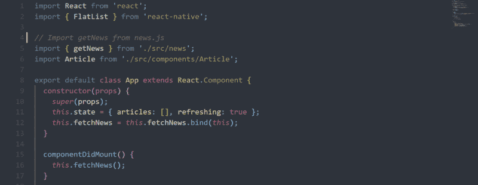
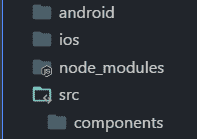
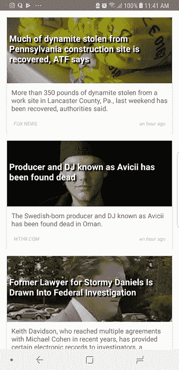
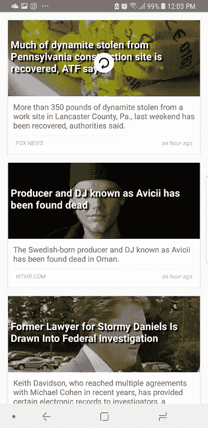

# 如何用 React Native 构建新闻 app

> 原文：<https://www.freecodecamp.org/news/create-a-news-app-using-react-native-ced249263627/>

作者:穆罕默德·萨尔曼

# 如何用 React Native 构建新闻 app



App.js

这是我在 Medium 上的第一篇文章，我想和你分享我是如何用 React Native 制作一个新闻应用的。

[最初发布在我的博客上。](https://code.nimrey.me/how-to-build-a-news-app-with-react-native/)

构建应用程序的要求:

*   基本了解 [JavaScript](https://developer.mozilla.org/en-US/docs/Web/JavaScript) 语言*。*
*   安装: [Node.js，](https://nodejs.org/en/download/) [react native](https://facebook.github.io/react-native/) 使用 [npm](http://nodejs.org) 。
*   使用的库:[时刻](https://momentjs.com/)、[反应-原生](http://facebook.github.io/react-native)、[反应-原生-元素](https://www.freecodecamp.org/news/react-native-training.github.io)。

如果你不熟悉这些资源，不要担心，它们很容易使用。

我们将在帖子中涉及的主题有:

*   新闻宣传短片
*   获取 API
*   FlatList
*   下拉以刷新
*   连接

更多…让我们开始吧！

> 您可以在此找到项目回购

### 新闻宣传短片

> 一个简单易用的 API，可以为现在网络上的标题和文章返回 JSON 元数据。——[NewsAPI.org](https://newsapi.org/)

首先，你应该注册新闻应用编程接口来获得免费的`apiKey` ( **你的认证密钥**)。

创建一个新的 React 原生项目，并将其命名为`news_app`(或者其他任何名称)。在项目目录下，新建一个文件夹，命名为`src`。在`src` 目录下，创建一个文件夹，命名为`components`。因此，您的项目目录应该如下所示:



project directory

在`src` 文件夹中，创建名为`news.js`的新文件。在这个文件中，我们将从新闻 API 中获取包含标题的 JSON。

### 新闻网

确保用您自己的 API 密钥替换您的 _API_KEY_HERE。有关新闻 api 的更多信息，请访问[新闻 API 文档](https://newsapi.org/docs) ***。***

现在我们声明`getNews` 函数，它将为我们获取文章。导出函数，这样我们就可以在我们的 `App.js`文件中使用它。

### App.js

在构造函数中，我们定义了初始状态。`articles` 将在我们获取文章后存储它们，`refreshing`将帮助我们刷新动画。注意，我将`refreshing` bool 设置为 true，因为当我们启动应用程序时，**我们希望动画在我们加载文章**(新闻标题)时开始。

组件安装后立即调用`componentDidMount`。在它里面我们称之为`fetchNews`方法。

```
componentDidMount() {  this.fetchNews();}
```

在`fetchNews`中，我们调用`getNews()`，它返回一个[承诺](https://developer.mozilla.org/en-US/docs/Web/JavaScript/Reference/Global_Objects/Promise)。所以我们使用`.then()`方法，该方法接受一个回调函数，回调函数接受一个参数(**文章**)。

现在将州中的文章分配给 articles 参数。我只输入了`articles`,因为这是一个新的 ES6 语法，意思是`{ articles: articles }`,我们将`refreshing` 设置为 false 来停止旋转动画。

```
fetchNews() {  getNews().then(      articles => this.setState({ articles, refreshing: false })  ).catch(() => this.setState({ refreshing: false }));}
```

`.catch()` **在拒绝的情况下被调用。**

`handleRefresh`方法将启动旋转器动画并调用`fetchNews()`方法。我们传递了`() => this.fetchNew` s()，所以它在我们指定状态后立即被调用。

```
handleRefresh() {  this.setState({ refreshing: true },() => this.fetchNews());}
```

在 render 方法中，我们返回一个`FlatList`组件。然后我们传递一些道具。`data`是来自`this.state`的文章数组。`renderItem`接受一个函数来呈现数组中的每一项，但是在我们的例子中，它只返回我们之前导入的`Article`组件(我们将会用到它)。并且我们将 article item 作为道具传递，以便稍后在该组件中使用。

### 文章. js

在 *src/components* 中创建一个新的 JavaScript 文件，并将其命名为 **Article.js**

让我们从使用[NPM](http://nodejs.org):***react-native-elements**安装两个简单的库开始，这给了我们一些可以使用的**预制** 组件，以及将处理我们的时间的 [moment](http://momentjs.com) 。*

*使用 npm 安装它们:*

```
*`npm install --save react-native-elements moment`*
```

*在 Article.js 中:*

*这里发生了很多事情。首先，我们从[析构](https://developer.mozilla.org/en-US/docs/Web/JavaScript/Reference/Operators/Destructuring_assignment)定义在 *类下面的`article` 道具和`styles` 对象**开始。****

*在 render 方法中，我们定义了时间常数来存储文章发布的时间。我们使用时刻库将日期转换成从那时起经过的**时间**，如果`publishedAt`是`null`，我们从现在起经过`publishedAt`或**时间**。*

*在文章图像的 URL 为空的情况下，`defaultImg`被分配图像 URL。*

*当用户按下卡片时，render 方法返回`*TouchableNativeFeedback*`进行处理。我们传递给它一些道具:`useForground`，它告诉元素在卡片上显示涟漪效果时使用前景，以及`onPress`，它接受一个函数并在用户按下卡片时执行它。我们通过了`() => Linking.openUrl(u` rl)，它会在我们按卡的时候简单的打开全文的网址。*

*该卡片有三个道具:`featuredTitle` ，它是放在图像上的标题，`featuredTitleStyle` 对其进行样式化，`image`，它是来自文章道具的文章图像。否则，如果它是`null`，它将成为`defaultImg`。*

```
*`..  featuredTitle={title}  featuredTitleStyle={featuredTitleStyle}  image={{ uri: urlToImage || defaultImg }}..`*
```

*至于文本元素，它将保存文章的描述。*

```
*`<Text style={{ marginBottom: 10 }}>{description}</Text>`*
```

*我们添加了一个分隔线将描述与**时间和源名称**分开。*

```
*`<Divider style={{ backgroundColor: '#dfe6e9' }} />`*
```

*在`Divider`下面，我们有一个`View`,它包含源名称和文章发表的时间。*

```
*`..<View   style={{ flexDirection: ‘row’, justifyContent: ‘space-between’ }} >   <Text style={noteStyle}>{source.name.toUpperCase()}</Text>  <Text style={noteStyle}>{time}</Text></View>..`*
```

*在`class`之后，我们为这些组件定义了样式。*

*现在，如果我们运行应用程序:*

*

our news app* *

pull down to refresh* 

*这就对了。GitHub 上有该应用的源代码:[在这里，](https://github.com/msal4/royal_news)可以随意分叉。*

*我希望你喜欢我的文章！如果您有任何问题，请随时发表评论或通过 [twitter](http://twitter.com/4msal4) 联系我，我一定会帮助您:)*

*？给我买杯咖啡好吗？*

*下一个故事？H [如何用 JavaScript 构建本地桌面应用](https://medium.freecodecamp.org/build-native-desktop-apps-with-javascript-a49ede90d8e9)*