# React.js:在不使用外部库的情况下实现拖放功能

> 原文：<https://www.freecodecamp.org/news/reactjs-implement-drag-and-drop-feature-without-using-external-libraries-ad8994429f1a/>

作者:拉杰什·皮莱

# React.js:在不使用外部库的情况下实现拖放功能

#### 深入了解在 React from scratch 中实现拖放功能的细节。


So, easy even your dog can drag it :)

让我们先看看我们将要构建的结果。我正在尝试。gif——希望它在任何地方都能像预期的那样工作。我用的是私人驾照上的 [Camtasia](https://discover.techsmith.com/camtasia-brand-desktop-features-logos-april/?gclid=EAIaIQobChMIn67LrPXp2gIVk7rACh0hjgr7EAAYASAAEgJWa_D_BwE) 。

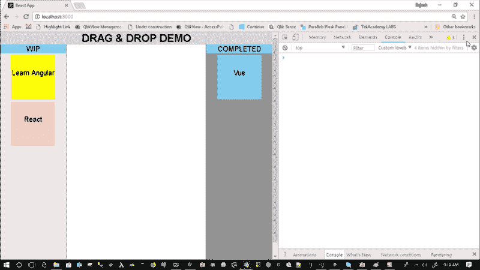

Ignore the UI/Styles please!

关键的学习点是:

1.  通过添加“draggable”属性使元素可拖动
2.  通过实现“dragover”事件使区域可拖放
3.  通过实现“dragstart”事件来捕获拖动数据
4.  通过实现“放下”事件来捕获放下
5.  实现拖动元素时触发的“拖动”事件
6.  将中间数据存储在数据传输对象中

对于视觉学习者，请观看下面的视频。

### 步骤 1 —为演示创建根应用程序

所有用于拖放的代码都将进入 AppDragDropDemo.js 组件。

```
import React from 'react';import ReactDOM from 'react-dom';import '.index.css';import AppDragDropDemo from './AppDragDropDemo';
```

```
ReactDOM.render(<AppDragDropDemo />,     document.getElementById("root"));
```

AppDragDropDemo 的入口点看起来像下面的代码。

```
import React, { Component } from 'react';
```

```
export default class AppDragDropDemo extends Component {  render () {    return (      <div className="container-drag">        DRAG & DROP DEMO      </div>    );  }}
```

如果您现在运行该应用程序，您将看到这个令人敬畏的屏幕(双关语)


### 步骤 2 —创建状态对象来存储一些任务

让我们创建一些任务来模拟一个简单的应用程序。我们打算将这些任务拖放到不同的类别中，如`wip`、`complete`等等。

```
export default class AppDragDropDemo extends Component {      state = {            tasks: [{name:"Learn Angular",             category:"wip",              bgcolor: "yellow"},                        {name:"React",              category:"wip",              bgcolor:"pink"},                        {name:"Vue",              category:"complete",              bgcolor:"skyblue"}                ]}
```

```
 render () {    return (      <div className="container-drag">        DRAG & DROP DEMO      </div>    );  }}
```

### 第 3 步—将我们的数据分类

让我们在 render 方法中实现下面的代码，将任务分成各自的类别，`wip`和`complete`。请随意添加更多的类别并使用代码。

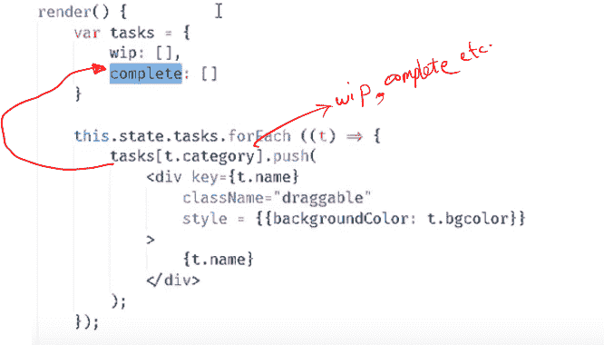

您可以从下面的代码片段中复制粘贴上面的代码。

```
render() {          var tasks = { wip: [],                 complete: []          }           this.state.tasks.forEach ((t) => {                   tasks[t.category].push(<div       key={t.name}                           onDragStart={(e)=>this.onDragStart(e, t.name)}                          draggable                          className="draggable"                          style={{backgroundColor: t.bgcolor}}>                                {t.name}                    </div>);          });
```

在上面的代码中，我们遍历所有任务，为每个任务项创建一个 div，并将其存储在各自的类别中。

因此，`wip[]`包含 wip 类别中的所有任务，而`complete[]`包含所有已完成的任务。

### 步骤 4-使任务项目可拖动

将 draggable 属性添加到

或任何元素，使元素可拖动。有关代码的文本格式，请参考上面的代码块。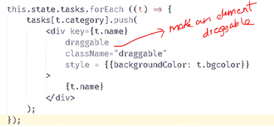

### 步骤 5 —创建一个可拖放的容器

要创建一个可删除的容器，需要实现`dragover event`。现在，因为我们想要禁用默认的 dragover 事件，我们简单地从 dragover 事件中调用`event.preventDefault()`。

我们还将在相应的 div 元素中呈现`{tasks.wip}`和`{tasks.complete}`。

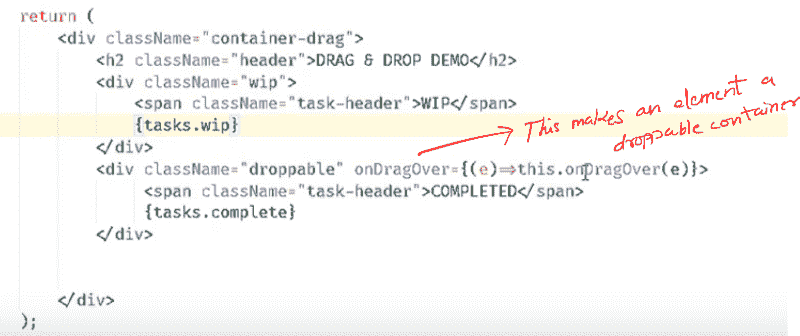

```
return (<div className="container-drag">     <h2 className="header">DRAG & DROP DEMO</h2>                       <div className="wip"        onDragOver={(e)=>this.onDragOver(e)}                           onDrop={(e)=>{this.onDrop(e, "wip")}}>                          <span className="task-header">WIP</span>                          {tasks.wip}                     </div>                     <div className="droppable"      onDragOver={(e)=>this.onDragOver(e)}                          onDrop={(e)=>this.onDrop(e, "complete")}>                           <span className="task-header">COMPLETED</span>                           {tasks.complete}                     </div>               </div>);
```

```
Let us now implement the onDragOver() event handler.
```

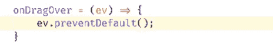

到目前为止的输出如下图所示。

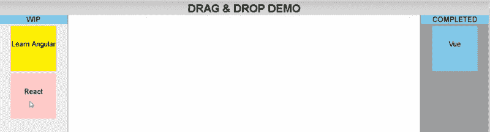

### 步骤 6-捕获被拖动元素的状态

让我们修改为每个任务创建类别的代码。添加一个 eventhandler `ondragstart`并传递 id/name 或任何需要在拖放过程中保存的信息。

我使用`name`作为唯一的值来标识任务。请随意使用 ID 或您拥有的任何唯一密钥。

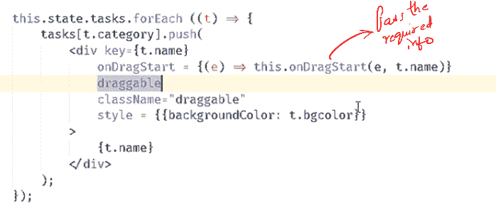

现在让我们实现`onDragStart`事件处理程序。

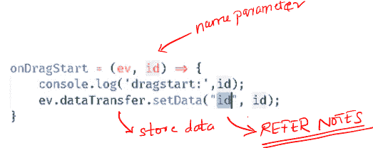

在 onDragStart 处理程序中，我们获取参数并将其存储在 dataTransfer 对象中。(不要被参数命名搞糊涂了，因为我想我在编写这段代码时是在一个不同的命名世界中:)。)

**IE 注意**:这可能不适用于 IE。对于 IE 来说，更好的做法是给出格式作为键，如下图。

```
Instead of
```

```
ev.dataTransfer.setData("id", id)
```

```
USE
```

```
ev.dataTransfer.setData(“text/plain”,id)
```

上述处理程序将确保被拖动的元素存储在事件对象中，并在需要时可供使用。在投掷目标时可能需要它。

现在，如果您运行应用程序并拖动元素，将会输出以下日志。

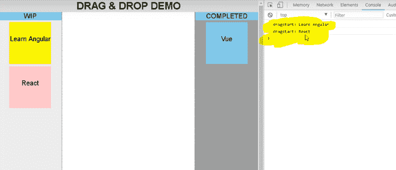

### 步骤 7-处理放下事件。

让我们打开 render 方法，将`onDrop`事件添加到类名为`droppable`的 div 中。

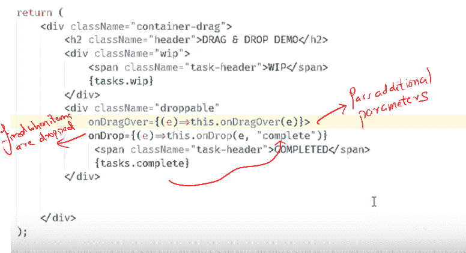

在上面的代码中，我们添加了`drop`事件处理程序，并将所需的类别`complete`作为参数传递。这表明我们正在将元素从`wip`状态放到`complete`状态(类别)。如果需要，请随意更改名称。

现在让我们实现`onDrop()`事件处理程序。

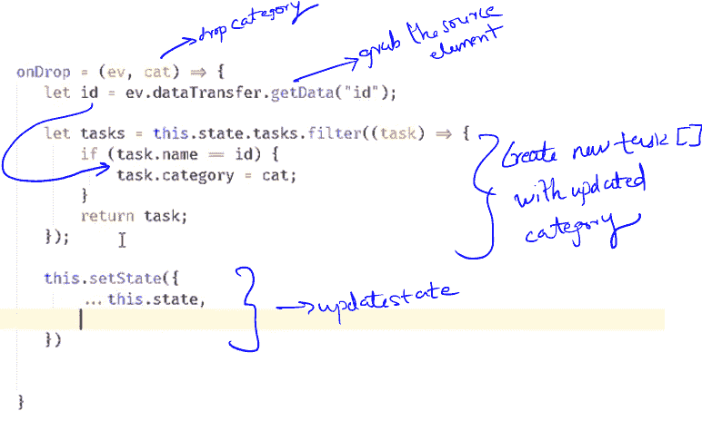

以下是您可以复制/粘贴的代码:

```
onDrop = (ev, cat) => {         let id = ev.dataTransfer.getData("id");  let tasks = this.state.tasks.filter((task) => {      if (task.name == id) {               task.category = cat;                 }                     return task;          });           this.setState({                 ...this.state,                 tasks          });    }
```

在`onDrop`事件处理程序中，我们通过在事件的 dataTransfer 对象上使用 getData 方法来抓取被拖动的任务。

然后，我们使用 filter 方法创建一个新的 tasks 数组，并更改被拖动的任务的类别。

`setState()`会触发渲染，任务会被渲染到正确的区域。

**IE 注意**:要让它在 IE 中工作，使用下面的 getData 方法。

代替

**var id = home . data transfer . get data(id)**

使用

**var id = home . data transfer . get data(文本)**

### 步骤 8 —要实现从“完成”到“在制品”的下降，添加 onDrop 处理程序

`onDrop()`处理程序与前面的一样。

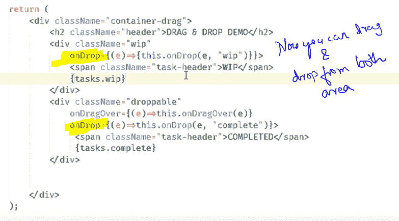

最后运行代码，惊叹自己的创造:)一边编码一边享受乐趣。

你可以从[这里](https://github.com/rajeshpillai/youtube-react-components/blob/master/src/AppDragDropDemo.js)抓取源代码。

**注意:**为了跨浏览器工作，将 setData 类型改为 string。
例如，要设置数据，使用`**ev.dataTransfer.setData(“text/plain”,id)**` **。**要读取数据，使用`**var id = ev.dataTransfer.getData(“text”)**`

因为我的目的是演示核心的拖放功能，所以代码没有针对设计和命名约定等因素进行优化。

跟我学@Learner + Fullstack 蔻驰(@ rajeshpillai):[https://twitter.com/rajeshpillai](https://twitter.com/rajeshpillai)

促销:如果你希望支持我们的开源课程[在 12 到 20 周内掌握前端工程](https://codeburst.io/mastering-front-end-engineering-in-12-to-20-weeks-for-beginners-and-experienced-alike-6dc5172e3295)，我将在 Udemy 上为媒体读者提供特别的 10 美元优惠券。

刚刚发表了我的早期访问课程[Javascript Deep Dive——编写你自己的 React](https://www.udemy.com/javascript-deep-dive-code-your-own-react-library/?couponCode=SOCIAL1000)