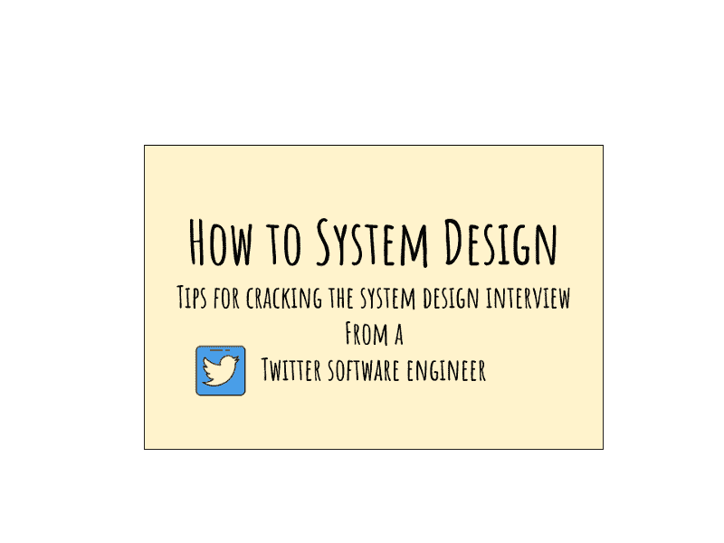
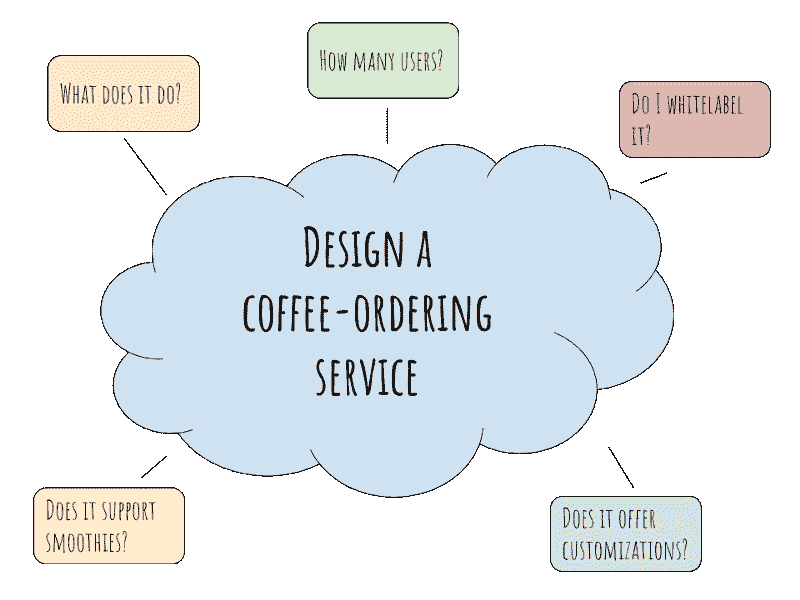
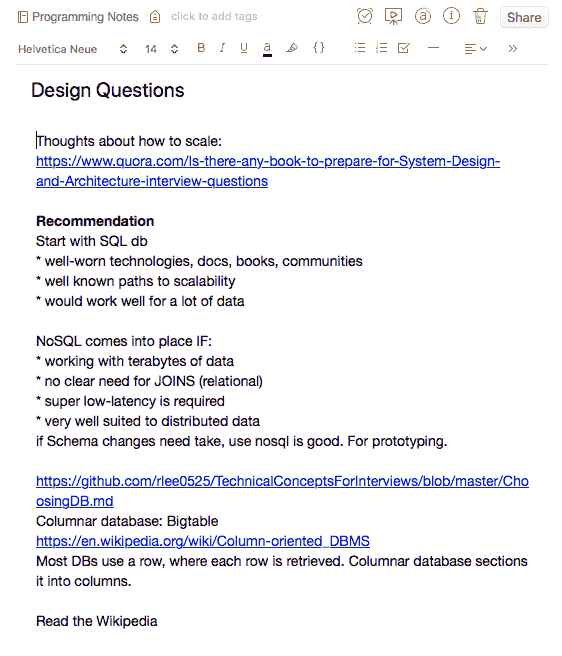

# 破解系统设计面试:来自 Twitter 软件工程师的提示

> 原文：<https://www.freecodecamp.org/news/how-to-system-design-dda63ed27e26/>

作者:阿智·华创

# 破解系统设计面试:来自 Twitter 软件工程师的提示

我最近写了一篇关于我如何获得多家顶级科技公司邀请的文章。在我准备面试的过程中，我阅读了大量的资料，并准备了一套关于如何解决系统设计问题的笔记。在这篇文章中，我想与大家分享这些技巧。

如果您是一名没有大规模分布式系统经验的应届毕业生，或者甚至是一名拥有多年经验的经验丰富的工程师，本文将对您有用。

**更新(3/24/2019)** :如果你想加入一群学生来学习更多关于系统设计的知识，我正在一起组织一个小班！你可以去这个[链接](http://bit.ly/interviewcourses)了解更多，或者访问我的网站:【zhiachong.com】T4 了解更多信息。

How to System Design: Tips from a Twitter software engineer

本文分为以下四个部分:

*   询问澄清问题
*   利用你的背景
*   系统地解决问题
*   保留自己的笔记

### 询问澄清问题

系统设计面试的一个核心目标是**给候选人一个展示他们知识的机会。**

答案没有严格的对错之分。一个好的系统设计问题通常听起来很模糊，原因是它应该给你一个机会来展示以下内容:

*   你会如何看待问题空间
*   你如何看待瓶颈
*   你能做些什么来消除这些瓶颈。

How to design this black box

想象一下，你被要求设计一个黑盒。你会如何解决这个问题？除了盒子能装下一些物品之外，这里没有明确的指示说明你需要建造什么。

我个人采用的最有用的策略之一是**提出澄清问题。**你会问，什么是“好的”澄清问题？

一个好的澄清问题可以帮助你实现一个或多个目标:

1.  帮助你缩小你应该做的事情的范围
2.  帮助阐明用户对系统的期望是什么
3.  给你指明前进的方向
4.  通知您可能的瓶颈/问题区域

在黑盒的例子中，你可能会问，“那么，盒子里装的是什么？它能装多少东西？而意向用户是谁？”

对此我可能会说，让我们建立一个黄色的盒子，上面有一个笑脸，最多可以装一个网球。然而，这不是一个普通的网球。它的半径至少为 0.5 米，重约 1 千克。它是用来拥抱的，而不是拿着的，所以我不想在它上面有任何把手。

给你，这是盒子。

My ideal box with a smiley face

总是问一些澄清性的问题。不是根据你在面试中是否问了一个特定的问题来评判你，而是根据你对问题空间的思考来评判你。

例如，如果我现在让你设计 Twitter，你会怎么做？花几分钟思考一下，甚至可以在一张纸上画出来。尽可能地深入和广泛，然后回到这篇文章。更好的是，你可以**在下面的评论中留下你的笔记**，我们可以进一步讨论。

如果您还没有意识到这一点，上面的练习的最终结果会产生明显不同的结果。对于我自己的特定背景，我可能会深入研究 API 设计和后端基础设施。根据我的经验，我可能也会探究 iPhone 特有的问题。我将讨论客户机如何与中间层端点交互，日志如何工作，我将如何设计后端以确保正常运行时间，等等。

你可以和同事进行一些非常有趣的讨论，这是面试官想要的一个非常强烈的信号。

### 利用你的背景优势

我经常看到工程师试图弄清楚面试官想问什么，然后迎合他们的回答以符合预期。

事实上，我强烈反对任何人这样做，原因有几个:

1.  每个人都有独特的背景。在系统设计面试中，这是你展示自己优势的机会。不要浪费机会去想别人可能对你有什么期望。
2.  面试官可能会点头同意你的回答，但他们可能知道你只是在虚张声势，并没有真正思考问题。

你的经历和背景可能与下一个候选人大相径庭。你带来了一套别人没有的价值观和专业知识。这就是让你变得有价值和不可替代的原因。不管你在哪个领域，人们关心的是你能给**带来什么。**

### 系统地解决问题

现在，根据我的专业知识，当我处理一个新系统时，我会考虑几件事。我强烈建议你也为自己制定一套标准或步骤。

当我在一个新系统上工作时，我脑海中的一些事情是:

*   系统的目标是什么？
*   谁是系统的用户？
*   我们正在研究的规模是多少？
*   这是新/旧系统吗？我们如何处理版本控制？

除其他外…

看，我的标准与前端工程师的标准不同。我用这些标准在脑海中形成一幅画面，这些将指导我的决策过程。

有了这些问题的答案，我就可以着手处理手头的问题，然后系统地把它分解成各个部分。

我喜欢做的一个很好的练习是**如何设计一个咖啡订购系统**。有一天我坐在星巴克时想到了这一点，并意识到如果我能在手机上点一杯思慕雪并在我当地的星巴克取它，那该多好。

我的思维开始转向不同的方向:

*   这台咖啡点餐机是做什么的？
*   如果我造了一个，我能把它卖给星巴克吗，还是贴上白标，作为服务出售？
*   如果卖给星巴克，我需要支持多少用户？
*   或者，如果我给它贴上白色标签，我能不能把这个接口卖给我的咖啡订购服务，然后帮助客户构建一个后端，这样他们就可以把订单存储在他们的本地机器上？

How to approach this problem

一旦我得到了这些问题的答案，我就可以对我的咖啡订购服务有一个全面的了解。下面是我的咖啡点餐服务版本的样子:

我的咖啡订购服务是一个软件即服务( [SAAS](https://en.wikipedia.org/wiki/Software_as_a_service) )。它为不同的合作伙伴提供了一个接口。

*   它有一个名为 *addCoffeeForMerchant* 的 API，用于插入咖啡名称、咖啡价格和咖啡成分。
*   它有一个 GET API，名为 *getCoffeesForMerchant* ，返回给定商家 ID 的咖啡列表。
*   商家 ID 是使用某种哈希机制生成的唯一标识符(UUID ),可以与客户进一步澄清。
*   该软件针对只读操作进行了优化，因为我的大多数客户只需创建一次菜单，就可以在一天中多次阅读。
*   它有一个缓存机制，使用[最近最少使用(LRU)](https://en.wikipedia.org/wiki/Cache_replacement_policies#Least_recently_used_(LRU)) 驱逐策略，因为如果菜单项有一段时间没有被订购，我的客户不会在意它在菜单上显示的速度是否稍慢。
*   如果其中一个数据存储自我爆发，我的咖啡订购服务将跨美国西部和美国东海岸的不同集群复制数据，因为我目前只针对美国市场。

或者，你能想到的任何其他咖啡订购服务也很有可能。这只是你优化什么的问题。我认为这些是非常有趣的问题，这是一个很好的脑力锻炼，可以让你的思维保持活跃。

### 保留自己的笔记

作为一名软件工程师，这是一个永无止境的学习过程。我强烈建议你用 Evernote 或者鼹鼠皮做笔记。我个人会随身携带一个小笔记本，用来记录我需要快速记下的想法，我会尽可能地在 Evernote 上记录各种其他东西。

我的 Evernote 里有一个名为“编程”的笔记本。每当我遇到新的东西或有趣的东西，我就把它记在笔记本上，以备将来参考。

我每月或每季度检查一遍这些新笔记，并给它们贴上标签，以确保笔记井然有序。例如，我对任何与系统设计有关的东西都有一个“设计”标签。可能是我觉得有趣的 YouTube 视频的链接，或者是我同事提出的我没有想到的有趣论点。

这是我笔记的一个样本:

Sorry for the bad grammar and typos :p

我最近从一位同事那里了解到的一件事是，NoSQL 非常适合做原型，因为不需要与其他团队进行模式讨论。如果我想改变模式，我可以用 NoSQL 数据库很快做到。这是我在“编程”笔记本中插入的一个关键的工作经验。

我把笔记分成:

1.  系统设计
2.  面试(经验+回顾我过去参加过的不同面试，按公司名称分组)
3.  随机花絮，CS 好记，像有用的 bash 脚本或命令行技巧
4.  阅读/ YouTube 视频

以上所有注释都归入“编程”项下。随着时间的推移，我发现我有一个伪组织的过去读过或探索过的东西的集合。

就个人而言，任何了解我的人都知道，我不是一个很有条理的人。因此，我只收集了大概 10 - 15%的东西，所以还有很多事情要做。

在系统设计方面，知识和实践是相辅相成的。如果你觉得你目前的工作不能给你提供系统设计的机会，那么你应该找一个可以的，或者试着设计一个现有架构的一小部分，这样它或者更快，更便宜，更健壮，或者在将来更容易修改。

### 我推荐的资源

[介绍:架构和系统设计](https://www.youtube.com/watch?v=ZgdS0EUmn70)——一位前脸书工程师关于如何解决系统设计问题的精彩 Youtube 教程。

[设计数据密集型应用](https://amzn.to/2H1ULel) -学习如何进行规模化设计的另一个好资源。它讲述了一个典型的软件工程师认为理所当然的各种事情——数据库(mySQL 和 noSQL)如何工作，何时使用它们，处理规模的各种技术的优缺点等等。我强烈推荐？

模拟面试——模拟真实面试的模拟环境对准备面试非常有帮助。如果你能找到一个朋友帮你做，那么我强烈推荐。我也进行模拟面试，所以如果你感兴趣，请随时打电话到[zhiachong.com](http://www.zhiachong.com)联系我！

关于实时数据的统一抽象，每个软件工程师都应该知道的事情——一个关于日志和权衡的冗长的技术性讨论。我还没有写完，但是一个同事极力推荐我写的。

[Evernote](https://www.evernote.com/referral/Registration.action?sig=3dbd8660e92a8ca68faeb24c552fd32a492c1e620fe4c77e45844685fed05492&uid=18085328) -最好的？我用过的笔记应用。有很多关于如何最好地利用 Evernote 的教程。我还没有浏览它们，只是因为我只是把它当作一个笔记本来使用。我把我学到的所有东西都记录在上面，然后偶尔浏览并重新组织它们。

鼹鼠皮笔记本(Moleskin notebook)——我真的很喜欢这本。它的质量非常高。价格略高，但由于我每天都在使用它，我认为这是一项不错的投资。每天手里拿着一个漂亮的笔记本，让我更兴奋地写更多的笔记。

[Pilot G2(黑色)](https://amzn.to/2Gwb9qj) -这是我用过的最好的笔，也是我唯一会用的笔。我从亚马逊上批量购买它们，并把它们放在我去的任何地方。我的背包里有一个，办公室里有一个，家里的办公室里也有一个，这样我身边总会有一支笔。它写起来很棒，墨水流畅，我喜欢用它写字的感觉。再加上鼹鼠皮，有时候我真想拿起 G2 在上面随便写点东西，因为这两个实在是太完美了。

[钻研系统设计面试](https://www.educative.io/collection/5668639101419520/5649050225344512) —这是朋友推荐的。这是一门详细教授如何设计分布式系统的在线课程。然而，这是一门 79 美元的课程。有一个团队定价。如果有兴趣的话，我会和他们商量一下，看看是否有可能组织一个团体来享受团体折扣。

*在 [Twitter](https://twitter.com/zhiachong) 、[脸书](https://www.facebook.com/zhiachong.tech)、 [LinkedIn](https://www.linkedin.com/in/zhiachong/) 上关注我。注册[我的邮件列表](http://eepurl.com/dnt9Sf)，在那里我会定期发送提示、技巧和行业知识。*

如果你喜欢这篇文章，请在下面评论:**对于构建一个可扩展的、可靠的系统，你有什么建议？**