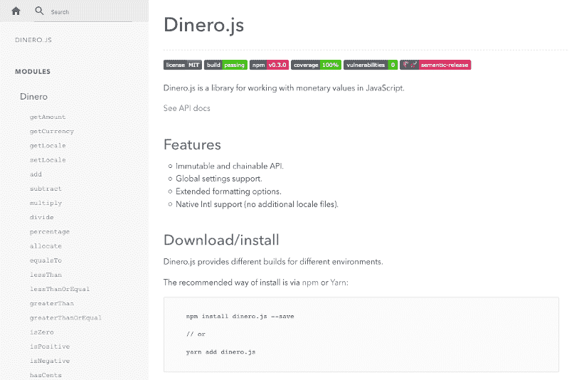
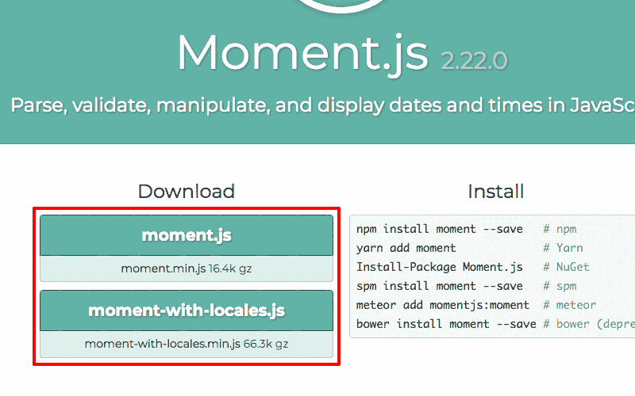

# 如何在 JavaScript 中处理货币值

> 原文：<https://www.freecodecamp.org/news/how-to-handle-monetary-values-in-javascript-3fef5eeb3eda/>

莎拉·达扬

# 如何在 JavaScript 中处理货币值


Photo by [Thought Catalog](https://unsplash.com/photos/gbQ3EsFSdG8?utm_source=unsplash&utm_medium=referral&utm_content=creditCopyText) on [Unsplash](https://unsplash.com/?utm_source=unsplash&utm_medium=referral&utm_content=creditCopyText)

钱无处不在。

银行应用、电子商务网站、股票交易平台——我们每天都与金钱打交道。我们也越来越依赖科技来处理我们的问题。

然而，对于如何以编程方式处理货币值还没有达成共识。这是现代社会中的一个普遍概念，但在任何主流语言中它都不是一流的数据类型，而日期和时间则是。因此，**每一个软件都有自己处理金钱的方式，伴随而来的是所有的陷阱**。

#### 陷阱 1:金钱是一种财富

当你需要代表金钱时，你的第一反应可能是使用`Number`。

钱无非就是一个数值，对吧？不对。

货币价值的数量部分只是相对于另一个方面:它的货币。根本没有 10 块钱这回事。是 10 美元，10 欧元，10 比特币……如果你想把两个不同货币的货币值相加，需要先进行换算。如果你想比较它们，也是一样:如果你只有一个数量，你就无法进行准确的比较。**金额和货币缺一不可**。

#### 陷阱 2:浮点数学

大多数当代货币要么是十进制，要么根本没有次单位。这意味着当货币有子单位时，主单位中的子单位数是 10 的幂。例如，一美元有 100 美分，是 10 的 2 次方。

使用十进制系统有其优点，但在编程时会产生一个主要问题。计算机使用二进制系统，所以[它们不能自然地表示十进制数](http://0.30000000000000004.com/)。一些语言已经提出了自己的解决方案，比如 Java 中的`[BigDecimal](https://docs.oracle.com/javase/7/docs/api/java/math/BigDecimal.html)`类型或者 C#中的`[decimal](https://docs.microsoft.com/en-us/dotnet/csharp/language-reference/keywords/decimal)`类型。JavaScript 只有`Number`类型，可以用整数或者[双精度浮点](https://en.wikipedia.org/wiki/IEEE_754)。因为它是十进制的二进制表示，**当你试图做数学运算**时，你会得到不准确的结果。

```
0.1 + 0.2 // returns 0.30000000000000004 ? 
```

使用浮点数来存储货币值不是一个好主意。

当您计算更多的值时，细微的精度误差会导致更大的差距。这不可避免地会导致舍入问题。

#### 陷阱 3:百分比与分配

有时候你需要分钱，但是**百分比不能在不增加或减少便士**的情况下削减它。

假设您需要支付 999.99 美元，并支付 50%的首付。这可以通过一些简单的数学计算来完成。一半是 499.995 美元，但你不能平分一分钱，所以你可能会将结果四舍五入到 500 美元。问题是，当你收取后半部分的费用时，你会得到同样的结果，并多收一分钱。

你不能仅仅依靠百分比或除法来分钱，因为它不能被无限分割。汽油价格可能会显示两位以上的小数，但这只是象征性的:你最终总是要支付一个整数。

#### 工程救援

正如你所看到的，金钱远比看上去的要多，也不仅仅是简单的数据类型所能处理的。

幸运的是，**软件工程师[马丁·福勒](https://martinfowler.com/)想出了一个解决方案**。在《企业应用架构 的 [*模式中，他描述了*](https://martinfowler.com/books/eaa.html)*[货币价值](https://martinfowler.com/eaaCatalog/money.html)的一种模式:*

#### 性能

方法

*   数学:加、减、乘、分配
*   比较:等于、大于、大于或等于、小于、小于或等于。

**由此，你可以创造出满足你大部分货币需求的价值对象**。

#### 作为数据结构的货币

金钱的行为不同于简单的数字，因此应该区别对待。第一件也是最重要的事情是**它应该总是由一个金额和一个货币**组成。

你可以从金额和货币做任何事情。您可以将货币金额相加，检查它们是否相等，并根据需要将它们格式化。这可以通过对象的方法来完成。在 JavaScript 中，任何一种返回对象的函数都可以完成这个任务。

#### 以美分计的金额

有几种方法可以解决 JavaScript 中的浮点问题。

你可以使用像 [Decimal.js](https://mikemcl.github.io/decimal.js) 这样的库，将你的浮点数作为字符串处理。这是一个不错的解决方案，甚至在您必须处理[大数字](https://developer.mozilla.org/fr/docs/Web/JavaScript/Reference/Objets_globaux/Number/MAX_SAFE_INTEGER)时也很方便。**然而，这是以增加(严重的)依赖性为代价的，导致性能下降**。

你可以在计算前将浮点数乘上整数，然后再将它们除以整数。

```
(0.2 * 100 + 0.01 * 100) / 100 // returns 0.21 ? 
```

这是一个很好的解决方案，但是需要对对象构造或每个操作进行额外的计算。这不一定会消耗性能，但仍然是不必要的处理工作。

第三种方法是直接存储相对于单位的分数值。如果需要存储 10 美分，就不会存储`0.1`，而是`10`。这允许你只处理整数，这意味着安全的计算(直到你碰到[大数](https://developer.mozilla.org/fr/docs/Web/JavaScript/Reference/Objets_globaux/Number/MAX_SAFE_INTEGER))和出色的性能。

#### 一个不可变的库，用于创建、计算和格式化货币值

根据这些观察，我做了一个 JavaScript 库: [**Dinero.js**](https://github.com/sarahdayan/dinero.js) 。



Dinero.js 遵循福勒的模式等等。它允许您用 JavaScript 创建、计算和格式化货币值。你可以做数学，解析和格式化你的对象，问他们问题，让你的开发过程更容易。

该库被设计成不可变和可链接的。它支持全局设置，具有扩展的格式选项，并提供本机国际化支持。

#### 为什么不可改变？

不可变的库更安全，更可预测。可变操作和引用副本是许多 bug 的来源。选择不变性可以完全避免它们。

使用 Dinero.js，您可以执行计算，而不必担心修改原始实例。在下面的 Vue.js 例子中，调用`priceWithTax`时`price`不会改变。如果实例是可变的，它会。

```
const vm = new Vue({  data: {    price: Dinero({ amount: 500 })  },  computed: {    priceWithTax() {      return this.price.add(this.price.percentage(10))    }  }})
```

#### 可链接性

优秀的开发人员努力使他们的代码更简洁、更易读。当您想要在单个对象上连续执行几个操作时，链接提供了一个优雅的符号和简洁的语法。

```
Dinero({ amount: 500 })  .add(Dinero({ amount: 200 }))  .multiply(4)  .setLocale('fr-FR')  .toFormat() // returns "28,00 US$"
```

#### 全局设置

当您处理大量的货币值时，您可能希望其中的一些值共享一些属性。如果你在用德语制作一个网站，你可能想用德国货币格式显示金额。

这就是全局设置派上用场的地方。您可以声明将应用于所有新对象的选项，而不是将它们传递给每个实例。

```
Dinero.globalLocale = 'de-DE'Dinero({ amount: 500 }).toFormat() // returns "5,00 $"
```

#### 本机国际化支持

传统上，库使用语言环境文件进行国际化。如果你详尽无遗，他们往往会使图书馆更重。



Moment.js is four times heavier with locale files.

语言环境文件也很难维护。国际化 API 是本地的，并且得到了 T2 的良好支持。除非你必须使用过时和/或边缘的浏览器，否则使用`toFormat`是安全的。

#### 格式化

对象非常适合存储数据，但在显示数据时就没那么有用了。Dinero.js 自带各种格式化方法，包括`toFormat`。它提供了比`Number.prototype.toLocaleString`更直观和简洁的语法。将它与`setLocale`配对，你就可以用任何语言以合适的格式显示任何 Dinero 对象。这对多语言电子商务网站特别有帮助。

#### 下一步是什么？

福勒的货币模式被广泛认为是一个很好的解决方案。它启发了许多语言的许多实现。如果你喜欢 DIY，我推荐它和这篇文章中的观察作为起点。或者你可以选择 [Dinero.js](https://github.com/sarahdayan/dinero.js) :一个现代的、可靠的、经过全面测试的解决方案，已经开始工作。

玩得开心！

关于 Dinero.js 有什么问题吗？或者关于如何制作自己的货币数据结构？让我们在[推特](https://twitter.com/frontstuff_io)上聊天吧！

*最初发表于 [frontstuff.io](https://frontstuff.io/how-to-handle-monetary-values-in-javascript) 。*