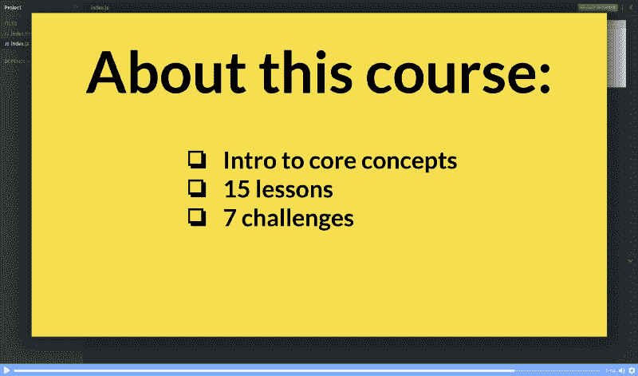
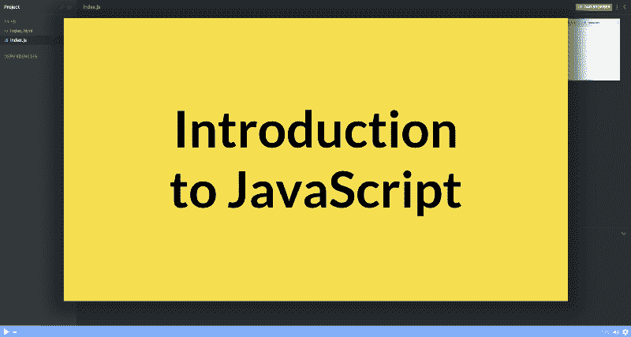
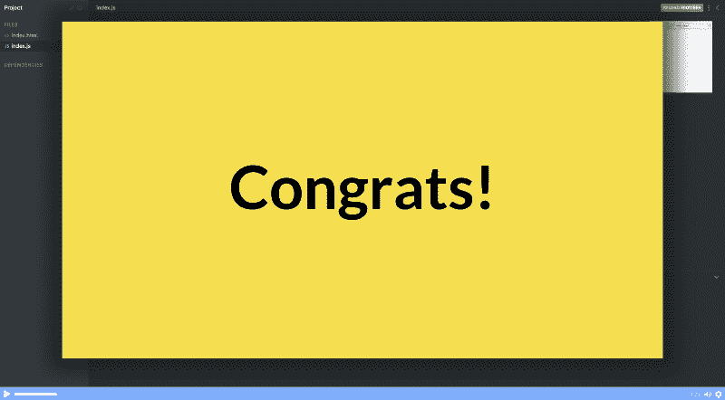

# 通过这个免费的互动课程，在一个小时内学会 JavaScript

> 原文：<https://www.freecodecamp.org/news/want-to-learn-javascript-heres-a-free-24-part-course-to-get-you-started-e7777baf86fb/>



A breakdown of the course. [You can click here to jump directly to the course.](https://scrimba.com/g/gintrotojavascript?utm_source=freecodecamp.org&utm_medium=referral&utm_campaign=gintrotojavascript_launch_article)

JavaScript 是网络上最流行的编程语言。你可以用它来创建网站、服务器、游戏甚至原生应用。所以难怪在今天的就业市场上，这是一项非常有价值的技能。

所以我联系了迪伦·c·伊斯雷尔(Dylan c . Israel)——一位[编程 YouTuber](http://www.youtube.com/CodingTutorials360)和 freeCodeCamp 毕业生——请他在 Scrimba 上创建一个[免费 JavaScript 课程。](https://scrimba.com/g/gintrotojavascript?utm_source=freecodecamp.org&utm_medium=referral&utm_campaign=gintrotojavascript_launch_article)

该课程包含 15 个讲座和 7 个互动挑战，适合初学者。它将向您快速介绍最重要的 JavaScript 概念。

课程是这样安排的。

### 第一部分:简介



和往常一样，课程开始时会有一个关于这个主题的截屏和课程结构的概述。Dylan 还会告诉你一些关于他自己的事情，这样你就可以在深入研究编码之前了解他。

### 第二部分:变量

你需要学习的第一个概念是*变量，*用于存储值。在现代 JavaScript 中，有两个关键字可以做到这一点:`let`和`const`。

让我们把名字*迪伦*存储在`let`中，我们称之为`name`。

```
let name = 'Dylan';  
console.log(name);

// --> 'Dylan' 
```

如您所见，我们可以在以后引用该变量来获取值，例如，使用`console.log()`方法将它记录到控制台。

### 第三部分:字符串

在第二课中，您将学习第一个数据类型: *strings* 。字符串只是存储一系列用引号括起来的字符。所以每当你用单引号或双引号括起来的时候，它就会变成 JavaScript 中的一个字符串，就像这样:

```
let name = "Dylan"; 
```

### 第 4 部分:字符串挑战

课程的第一次挑战时间到了！在这个例子中，你要试着把两个变量合并成一个。

```
let firstName = "Dylan";  
let lastName = "Israel";

console.log(fullName);

// --> ReferenceError: fullName is not defined 
```

如果这是你第一次介绍 JavaScript，为了解决这个问题，你需要使用你新学到的关于变量*和字符串*的知识。你可能还需要做一些实验代码。幸运的是，这在 Scrimba 平台中是可能的。**

### 第五部分:数字

接下来是你需要学习的第二种数据类型:*数字*。其他语言通常有多种数字数据类型，比如十进制数字的*浮点数*和整数的*整数*。_ 然而，在 JavaScript 中，它们都是*数字*。

我们可以使用`typeof`来检查数据类型:

```
let example1 = 7;  
let example2 = 7.77;

console.log(typeof example1);  
console.log(typeof example2);

// --> "number"  
// --> "number" 
```

在这个讲座中，你还将学习如何使用`parseInt()`和`parseFloat()`方法在字符串和数字之间转换值。

### 第六部分:数字挑战

在数字挑战赛中，您将接触到一些不同的字符串和数字，以及您目前所学的方法。你的工作是猜测这些表达式最终是什么值。

```
let example1 = parseInt("33 World 22");  
let example2 = parseFloat('44 Dylan 33');  
let example3 = 55.3333.toFixed(0);  
let example4 = 200.0.toFixed(2); 
```

这可能有点棘手，所以如果你犯了错误，不要气馁！

### 第 7 部分:布尔型

布尔很简单，它们要么*为真*要么*为假。*下面是创建布尔值的方法:

```
let example = true; 
```

当你编程时，`example`现在被设置为*真*的事实会派上用场，因为你有时想要基于这样的条件采取行动。

在这堂课中，你还将了解到*真值*或*假值*，它们是其他数据类型，如字符串或数字，但它们有*真值*或*假值*的一面。

### 第 8 部分:布尔挑战

在布尔挑战中，迪伦遵循与数字一相同的模式，你要猜一堆值。你的工作是猜测这些变量是真的还是假的

```
let example1 = false;  
let example2 = true;  
let example3 = null;  
let example4 = undefined;  
let example5 = '';  
let example6 = NaN;  
let example7 = -5;  
let example8 = 0; 
```

### 第 9 部分:数组

到目前为止，您已经学习的数据类型是所谓的*原始*值。现在是时候学习数组了，它是一个*非原始*值。

数组只是一个值的列表，就像这样:

```
let example = ['programming', 'design', 'art']; 
```

您将学习如何创建数组，如何添加和删除项目，甚至如何使用`forEach()`方法遍历整个数组。

### 第 10 部分:阵列挑战

在数组挑战赛中，您将了解到通过*引用*或*值*进行填充的概念，这对于正确理解 JavaScript 非常重要。我们稍后还会重温这个概念，因为重复有助于巩固知识。

```
let example1 = ['Dylan', 5, true];  
let example2 = example1;

example2.push(11);

console.log(example1);  
console.log(example2); 
```

如果你不知道*通过引用传递*的概念，上面记录的结果可能会让你吃惊。

### 第 11 部分:对象

从数组开始，我们将继续将其近亲称为*对象。*对象就像数组一样，可以存储多个值。然而，对象不是由值列表组成，而是由所谓的键值对组成。我们用花括号创建一个对象:

```
let example = {  
  firstName: 'Dylan';  
  lastName: 'Israel'  
}; 
```

在这堂课中，你将学习如何填充对象并获取它们的值。

### 第 12 部分:目标挑战

在这个挑战中，我们将重温通过*引用*或*值*传递的概念。您还将了解到`Object.assign()`方法，它允许您创建对象的副本。

```
let example1 = {  
  firstName: 'Dylan'  
};  
let example2 = example1;  
example2.lastName = 'Israel';

console.log(example1);  
console.log(example2); 
```

### 第 13 部分:算术运算符

如果一种编程语言不知道如何进行算术运算，它几乎毫无用处。用 JavaScript 做这件事非常简单:

```
let example = 5 + 5;

console.log(example)

// --> 10 
```

在这个讲座中，您还将体验 JavaScript 如何处理多个操作组合在一起的表达式。

### 第 14 部分:关系运算符

编程时，我们经常要比较数值，看看它们是否相等，或者其中一个是否比另一个大，所以在这堂课中，你会学到如何去做。

```
let example1 = 10;  
let example2 = 15;

console.log(example1 > example2)

// --> false 
```

现实世界中的例子是当你想检查一个用户是否有足够的信用来购买一件商品。如果信用高于价格，那么他们被允许购买，否则，他们不能。

### 第 15 部分:关系运算符挑战

在这个挑战中，你将能够通过猜测这些变量的布尔值来测试你对关系运算符的理解程度:

```
let example1 = 5 === 5;  
let example2 = 5 == '5';  
let example3 = 6 != '6';  
let example4 = 7 !== '7'; 
```

### 第 16 部分:增量和减量

让数值变大或变小是编程中经常要做的事情，比如当你在计数的时候。不过，这可以通过几种不同的方式来实现，因此它值得单独讲授。

```
let example = 1;  
example = example + 1;

console.log(example);

// --> 2 
```

### 第 17 部分:增量和减量挑战

这个挑战将看看做`example++`和`++example`的区别。

这可能需要你做一些实验来理解它，甚至是谷歌搜索，这对任何开发人员来说都是一项关键技能。

### 第 18 部分:如果，否则如果，否则

像`if`、`if else`和`else`这样的条件语句在编程时至关重要。它让你的应用程序有逻辑。所以在这节课中，你将学习如何与这三者一起工作。

```
let example = 5;

if (example === 5) {  
  console.log('Runs');  
} else if ( true ) {  
  console.log('else if');  
} else {  
  console.log('else');  
} 
```

您还将了解如何将这些条件与关系操作符结合起来构成复杂的逻辑。

### 第 19 部分:如果，否则如果，否则挑战

在这个挑战中，你将尝试猜测下列表达式的计算结果。这是建立在你在关系运算符讲座和上一讲中学到的基础上的。

```
console.log(10 === 10 && 5 < 4);  
console.log(10 === 10 || 5 < 4);  
console.log((5 >= 5 || 4 > 4) && 3 + 2 === 5); 
```

同样，如果你没有猜对，不要失去勇气。这东西对初学者来说很棘手！

### 第 20 部分:开关

在这堂课中，你将学习所谓的`switch`语句，如果你有许多条件要检查，这真的很方便。这里有一个例子:

```
let studentAnswer = 'D';

switch(studentAnswer) {  
  case 'A':  
    console.log('A is wrong.');  
    break;  
  case 'B' :  
    console.log('B is wrong.');  
    break;  
  case 'C':  
    console.log('C is correct.');  
    break;  
  default:  
    console.log('Not a real answer.');  
} 
```

### 第 21 部分:For 循环

For 循环允许您多次执行一个代码块。金额由您通过设置三个条件来决定。下面是一个简单的`for`循环的例子:

```
for (let i = 0; i < 5; i++) {  
  console.log(i);  
}

// -->  
// 0  
// 1  
// 2  
// 3  
// 4 
```

在这节课中，你将看到如何使用一个`for`循环来计算一组数字的总和。

### 第 22 部分:While & do while

如果你想多次执行一段代码，但是不知道*如何*多次，那么`while`循环可能正是你所需要的。只要满足某个条件，它就允许您执行一段代码。

```
let count = 0;

while (count < 20) {  
  count++;  
}

console.log(count); 
```

您还将了解到`do/while`语句。

### 第 23 部分:功能

最后，您需要了解函数，因为这对任何应用程序都是至关重要的。您将学习函数的语法，如何调用它们，以及如何向它们添加参数。

```
function add() {  
  console.log('add');  
}

add();

// --> 'add' 
```

当你完成了这个讲座，你就完成了这门课的教学大纲，你知道你已经理解了 JavaScript 的核心概念。

### 第 24 部分:下一步是什么？



Dylan 在课程结束时告诉你一些关于你下一步可以做什么，以便进一步提高你的 JavaScript 技能！请记住，本课程只是一个开始。

一旦你走到了这一步，我会强烈鼓励你继续，因为你正在获得当今社会非常有价值的技能。

JavaScript 不仅可以帮助你改善你的职业生涯，而且你还可以自己开发产品！

所以请务必[参加今天的免费课程](https://scrimba.com/g/gintrotojavascript?utm_source=freecodecamp.org&utm_medium=referral&utm_campaign=gintrotojavascript_launch_article)。您将能够在不知不觉中自己用 JavaScript 构建项目！

* * *

感谢阅读！我的名字叫 Per Borgen，我是最简单的学习编码方法——Scrimba 的联合创始人。如果你想学习建立专业水平的现代网站，你应该看看我们的[响应式网页设计训练营](https://scrimba.com/g/gresponsive?utm_source=freecodecamp.org&utm_medium=referral&utm_campaign=gintrotojavascript_launch_article)。


[Click here to get to the advanced bootcamp.](https://scrimba.com/g/gresponsive?utm_source=freecodecamp.org&utm_medium=referral&utm_campaign=gintrotojavascript_launch_article)