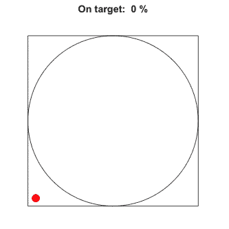
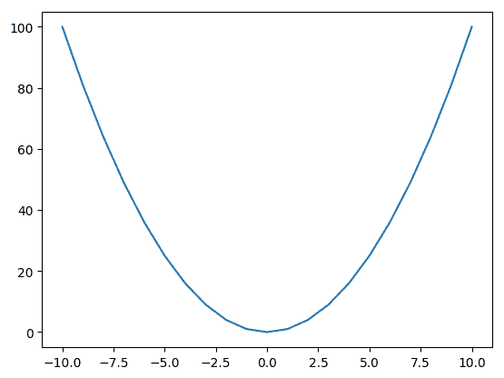
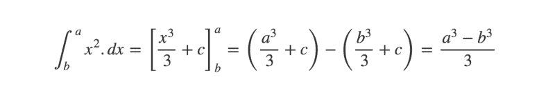
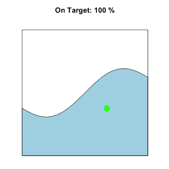
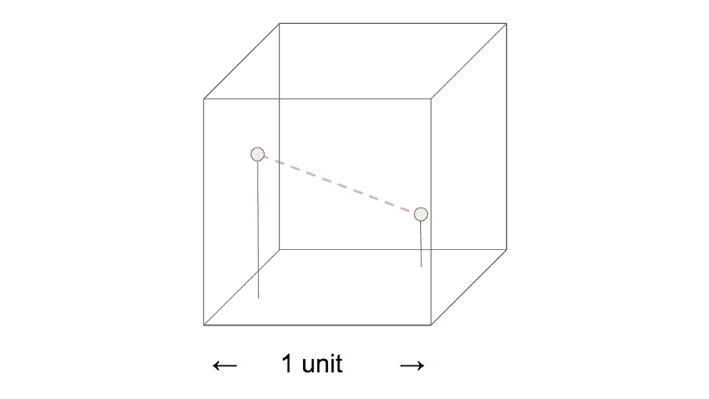
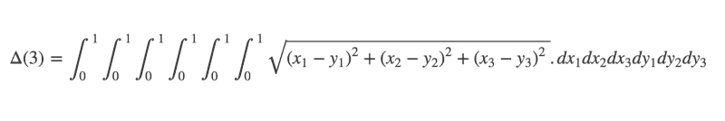

# 用蒙特卡罗方法解决“不可解”的问题

> 原文：<https://www.freecodecamp.org/news/solve-the-unsolvable-with-monte-carlo-methods-294de03c80cd/>

你如何解决一个“无法解决”的问题？

数据科学、数学金融、物理、工程和生物信息学(以及其他许多领域)很容易产生棘手的问题。这些问题在计算上没有简单的解决方案。

幸运的是，有一些方法可以用非常简单的技巧近似解决这些问题。

**蒙特卡罗方法**是一类可以应用于计算“困难”问题的方法，可以得到近乎足够精确的答案。总的前提非常简单:

1.  随机抽取问题的输入样本
2.  对于每个样本，计算输出
3.  汇总输出以逼近解决方案

打个比方，想象你是一只蚂蚁，在一个巨大的瓷砖马赛克上爬行。从你的角度来看，你没有简单的方法去理解马赛克描绘了什么。

如果你开始在镶嵌图中走来走去，并以随机的时间间隔对你访问的瓷砖进行采样，你就会对镶嵌图显示的内容有一个大致的概念。你取的样本越多，你的近似值就越好。

如果你能覆盖每一块瓷砖，你最终会有一个完美的马赛克图像。然而，这并不是必须的——在一定数量的采样之后，您会有一个相当好的估计。

这正是蒙特卡罗方法近似解决“不可解”问题的方法。

这个名字指的是摩纳哥一个著名的赌场。该方法的先驱之一斯坦尼斯劳·乌拉姆于 1949 年发明了这个词。据报道，乌兰的叔叔是一个赌徒，赌博中的“机会”和蒙特卡洛方法之间的联系对斯坦尼斯劳来说一定是特别明显的。

理解一个技术概念的最好方法是一头扎进去，看看它是如何工作的。本文的其余部分将展示蒙特卡罗方法如何解决三个有趣的问题。这些例子将用 Julia 编程语言呈现。

### 介绍朱莉娅

如果你对专攻数据科学感兴趣，有许多语言你可以考虑学习。近年来，一种越来越重要的选择是一种叫做 Julia 的语言。

Julia 是一种数值编程语言，已经在一系列定量学科中被采用。它是免费下载的。还有一个非常简洁的基于浏览器的界面，叫做 JuliaBox，由 Jupyter Notebook 提供支持。

我们今天要使用的 Julia 的一个很酷的特性是它是多么容易促进[并行计算](https://computing.llnl.gov/tutorials/parallel_comp/)。这允许您在多个进程上执行计算，当大规模执行时，会带来显著的性能提升。

#### 并行前进

要在多个进程上启动 Julia，请转到终端(或者在 JuliaBox 中打开一个新的终端会话)并运行以下命令:

```
$ julia -p 4
```

这将在四个 CPU 上启动一个 Julia 会话。要在 Julia 中定义函数，使用以下语法:

```
function square(x) return x^2 end
```

没错——Julia 使用了一种`start-end`方法，而不是缩进或花括号。For 循环是相似的:

```
for i = 1:10 print(i) end
```

当然，您可以添加空白和缩进来提高可读性。

Julia 的并行编程能力主要依赖于两个概念:**远程引用**和**远程调用**。

*   远程引用是一些对象，它们实质上充当在其他进程上定义的对象的命名占位符。
*   远程调用允许进程根据存储在其他进程上的参数调用函数。

在所有过程中定义功能是很重要的。查看下面的代码:

```
@everywhere function hello(x)
    return "Hello " * x
    end

result = @spawn hello("World!")
print(result)
fetched = fetch(result)
print(fetched)
```

`@everywhere`宏确保在所有进程中定义`hello()`函数。`@spawn`宏用于将[闭包](https://guide.freecodecamp.org/javascript/closures/)包裹在表达式`hello("World!")`周围，然后在自动选择的进程上对其进行远程求值。

该表达式的结果立即作为一个`Future`远程引用返回。如果你尝试打印`result`，你会失望的。`hello("World!")`的输出已经在一个不同的进程上进行了评估，在这里不可用。要使其可用，请使用`fetch()`方法。

如果产卵和取卵似乎太麻烦了，那么你很幸运。Julia 还有一个`@parallel`宏，它将承担并行运行任务所需的一些繁重工作。

`@parallel`既可以独立工作，也可以通过“缩减器”功能收集所有过程的结果，并将其缩减为最终输出。看看下面的代码:

```
@parallel (+) for i = 1:1000000000
    return i
    end
```

for 循环只是在每一步返回`i`的值。`@parallel`宏使用加法运算符作为归约器。它获取`i`的每个值，并把它加到先前的值上。

结果是前十亿个整数的总和。

了解了 Julia 的并行编程能力之后，让我们继续看看如何使用蒙特卡罗方法来解决一些有趣的示例问题。

### 玩彩票

作为第一个例子，让我们想象玩一个彩票游戏。这个想法很简单——在 1 到 50 之间选择 6 个唯一的数字。比如说，每张票 2 英镑。

*   如果您将所有六个数字都与抽取的数字匹配，您将赢得大奖(100 万英镑)
*   如果你匹配五个号码，你赢得一个中等奖(100，000)
*   如果你匹配四个数字，你赢得一个小奖(100)
*   如果你匹配三个数字，你赢得一个非常小的奖励(10)

如果你二十年来每天都玩这种彩票，你会期望赢得什么？

你可以用纸和笔，用一点概率论来解决这个问题。但是那会很费时间！相反，为什么不使用蒙特卡罗方法呢？

这种方法简单得令人怀疑——一遍又一遍地模拟游戏，然后计算结果的平均值。

开始朱莉娅:

```
$ julia -p 4
```

现在，导入 StatsBase 包。使用`@everywhere`宏使其可用…嗯，在任何地方。

```
using StatsBase@everywhere using StatsBase
```

接下来，定义一个函数来模拟一个彩票游戏。论点允许你改变游戏规则，探索不同的场景。

```
@everywhere function lottery(n, outOf, price)
    ticket = sample(1:outOf, n, replace = false)
    draw = sample(1:outOf, n, replace = false)
    matches = sum(indexin(ticket,draw) .!= 0 )
    if matches == 6
        return 1000000 - price
    elseif matches == 5
        return 100000 - price
    elseif matches == 4
        return 100 - price
    elseif matches == 3
        return 10 - price
    else
        return 0 - price
    end
    end
```

使用 Julia 的`indexin()`函数计算匹配数字的数量。它接受一个数组，并为每个元素返回它在另一个数组中的位置索引(如果没有找到该元素，则返回零)。与许多现代语言不同，Julia 从 1 开始索引，而不是从 0 开始。

`.!= 0`语法检查这些索引中哪些不等于零，并为每个返回`true`或`false`。最后，对`true`的数量求和，给出总的匹配数。

现在让我们模拟二十年来每天玩彩票……并行一万次。

```
winnings = @parallel (+) for i = 1:(365*20*10000)          
    lottery(6,50,2)
    end

print(winnings/10000)
```

回报不太好，是吧？

您可以扩展代码以允许更高级的规则和场景，并查看这对结果的影响。

蒙特卡罗模拟允许模拟比这个彩票例子复杂得多的情况。然而，这种方法与这里介绍的非常相似。

让我们看看蒙特卡罗方法还允许我们做什么…

### 圆周率的值

Pi(或π)是一个数学常数。也许最著名的是它出现在圆的面积公式中:

*A = πr*

π是一个[无理数](http://mathworld.wolfram.com/IrrationalNumber.html)的例子。它的精确值不可能表示为两个整数的任何分数。事实上，π也是一个[超越数](https://www.mathsisfun.com/numbers/transcendental-numbers.html)的例子——甚至没有任何[多项式方程](http://mathworld.wolfram.com/Polynomial.html)是它的解。

您可能认为这使得获取π的精确值不那么简单。是吗？

实际上，你可以用蒙特卡罗启发的方法找到一个很好的π估计值。一个直观的类比可能如下:

*   在墙上画一个 2m×2m 的正方形。在里面，画一个半径为 1m 的圆。
*   现在，后退几步，随意向墙壁扔颜料。每次颜料落在圆圈里时都要数一数。
*   投掷一百次后，算出有多少次投掷落在圆圈内。用这个乘以正方形的面积。这是你对π的估计。



The circle’s area is about 78% that of the square, so about that percentage of paint lands inside the circle

这样做的原因非常直观。从包含圆的正方形中随机采样点时，从圆内选择点的概率与圆的面积成比例。

有了足够多的随机样本，就可以找到这个比例的可靠估计， *p* 。

现在，我们知道正方形的面积是 2×2 = 4m，我们知道圆的面积是π× *r* 。由于半径 *r* 等于 1，圆的面积正好是π。

因为我们知道正方形的面积，并且估计了圆覆盖面积的比例 *p* ，所以我们可以估计π。简单的乘以 *p* ×4。

我们抛出的随机样本越多，估计值 *p* 就越好。然而，当我们采集越来越多的样本时，精度的提高会减少。

下面是模拟这个例子的 Julia 代码。我在 JuliaBox 终端中运行这个程序，使用以下命令在四个 CPU 上启动 Julia:

```
$ julia -p 4
```

首先，定义一个抽样方法。

```
@everywhere function throwPaint(N)
    hits = 0
    for i = 1:N
        x = rand() ; y = rand()
        if x^2 + y^2 < 1
            hits += 1
        end
    end
    return float(hits / N * 4)
end
```

这运行一个循环，在 0 和 1 之间随机采样`x`和`y`坐标。if 语句使用[圆方程](https://www.khanacademy.org/math/algebra2/intro-to-conics-alg2/expanded-equation-circle-alg2/a/circle-equation-review)来检查这些点是否位于一个假想的圆内，并计算命中次数。该函数返回命中比例乘以 4。

并行运行该函数将允许抽取非常多的样本，从而提供更高的精度。

```
Pi = @parallel (+) for i = 1:nworkers()              
    throwPaint(100000000) / nworkers() 
    end

print(Pi)
```

`nworkers()`方法返回正在使用的 CPU 数量(在本例中是四个)。这意味着每个进程运行`throwPaint()`方法一亿次。总的来说，这为我们提供了大量样本，并有助于非常精确地估计π值。

### 更大的图景:整合

上面估算π的例子是蒙特卡罗近似更一般的用例的一个具体例子，即求解积分问题。

[积分是一种微积分技术](http://mathworld.wolfram.com/Integral.html)，寻找由[数学函数](http://mathworld.wolfram.com/Function.html)定义的区域。例如，一条简单的曲线可能由以下函数定义:

*f(x)→*

相应的图表是:



f(x) → x² gives a classic U-shaped curve passing through the origin

曲线下方的面积通过对 *f(x)* 积分得到。



对于更简单的函数，[积分很容易解决，只需要一点练习](https://www.mathsisfun.com/calculus/integration-introduction.html)。然而，对于更复杂的函数，我们需要求助于估计方法。

在低维中，曲线下的面积可以用相对简单的算法来近似，比如[梯形法](https://en.wikipedia.org/wiki/Trapezoidal_rule)。

然而，由于[维度的诅咒](https://medium.freecodecamp.org/the-curse-of-dimensionality-how-we-can-save-big-data-from-itself-d9fa0f872335)，这在更高维度中变得在计算上不可行。相反，可以使用基于蒙特卡罗的方法来估计面积。

这可以用与上面的π例子完全相同的方式来可视化，除了曲线不需要被定义为圆。相反，想象一下向包含任意形状的单位正方形扔颜料。例如:



The area under the curve is about 45% that of the square. No calculus needed!

在更高维度中，前提不变。这个问题仍然可以通过随机采样输入值、对其进行评估并聚合来近似求解来解决。不要从正方形中的圆取样，想象一下从立方体中的球体取样。

作为最后一个例子，让我们来做一个很难的数学难题。

#### 一道很难的数学难题

> 在一个单位立方体内随机选择两个点。平均下来，他们之间的距离是多少？



Randomly pick two points inside a unit cube. What is the expected distance between them?

我现在给你一个警告——这个[数学解并不简单](http://mathworld.wolfram.com/HypercubeLinePicking.html)。



If you enjoy solving multiple integrals, well… good for you! For the rest of us, there’s always Monte Carlo…

然而，使用蒙特卡罗方法可以得到一个精确的估计，你猜对了。

```
$ julia -p 4
```

首先，定义一个抽样方法。

```
@everywhere function samplePoints(dimensions)
    pt1 = []
    pt2 = []
    for i = 1:dimensions
        pt1 = push!(pt1, rand())
        pt2 = push!(pt2, rand())
    end
    return [pt1, pt2]
    end
```

现在定义一个计算两点间距离的函数。

```
@everywhere function distance(points)
    pt1 = points[1]
    pt2 = points[2]
    arr = []
    for i = 1:length(pt1)
        d = (pt2[i] - pt1[i]) ^ 2
        arr = push!(arr, d)
    end
    dist = sqrt(sum(arr))
    return dist
    end
```

最后，并行运行这两个函数。这次我们将把每个结果写入一个`SharedArray`对象，而不是减少到一个输出。`SharedArray`对象允许不同的进程访问存储在同一数组对象中的数据。

```
results = SharedArray{Float64}(1000000)
@parallel for i = 1:1000000
    results[i] = distance(samplePoints(3))
    end

sum(results) / length(results)
```

你应该得到一个非常接近 0.6617 的答案——这当然是正确答案！通过改变传递给`samplePoints()`的参数，你可以在任何你喜欢的维度上解决一般化的问题。

### 接下来呢？

希望你已经发现这个蒙特卡洛方法介绍是有用的！

当正确实施时，它们为数据科学家、工程师、金融数学家和研究人员……以及其他任何工作涉及理解复杂系统的人提供了一个无价的工具。

如果你有兴趣了解他们的应用，网上有大量的资源。然而，最好的学习方法是实践！一旦你熟悉了基本前提，为什么不试着模拟你自己的蒙特卡罗例子呢？

任何反馈或意见，请在下面留下！