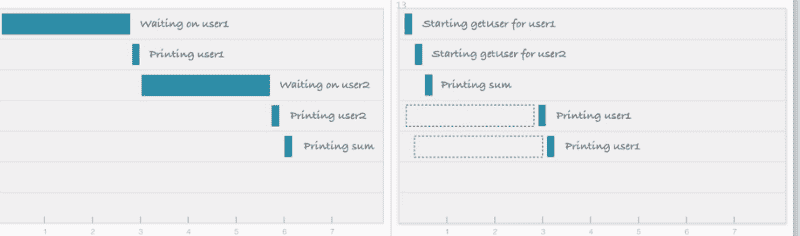
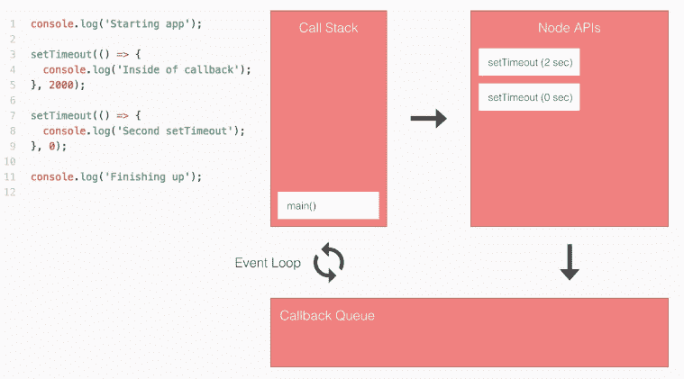

# Node.js 到底是什么？

> 原文：<https://www.freecodecamp.org/news/what-exactly-is-node-js-ae36e97449f5/>

Node.js 是一个 JavaScript 运行时环境。听起来很棒，但那是什么意思？这是怎么回事？

Node.js 运行时环境包括执行用 JavaScript 编写的程序所需的一切。


If you know Java, here’s a little analogy.

Node.js 是在 JavaScript 的最初开发者将其从只能在浏览器中运行的东西扩展到可以作为独立应用程序在机器上运行的东西时出现的。

现在你可以用 JavaScript 做更多的事情，而不仅仅是让网站具有交互性。

JavaScript 现在有能力做其他脚本语言如 Python 能做的事情。

您的浏览器 JavaScript 和 Node.js 都运行在 V8 JavaScript 运行时引擎上。这个引擎把你的 JavaScript 代码转换成更快的机器代码。机器码是计算机无需解释就能运行的低级代码。

### 为什么是 Node.js？

以下是 Node.js 官方网站[给出的正式定义:](https://nodejs.org/en/)

> Node.js 是基于 [Chrome 的 V8 JavaScript 引擎](https://developers.google.com/v8/)构建的 JavaScript 运行时。
> 
> Node.js 采用事件驱动、非阻塞的 I/O 模型，使其轻量级且高效。
> 
> Node.js '包生态系统， [npm](https://www.npmjs.com/) ，是全球最大的开源库生态系统。

我们已经讨论过这个定义的第一行:“Node.js 是一个基于 Chrome 的 V8 JavaScript 引擎的 JavaScript 运行时。”现在让我们来理解另外两行，这样我们就能发现 Node.js 为什么如此受欢迎。

I/O 是指输入/输出。它可以是从读/写本地文件到向 API 发出 HTTP 请求的任何内容。

I/O 需要时间，因此会阻塞其他功能。

考虑这样一个场景，我们请求一个后端数据库来获取 user1 和 user2 的详细信息，然后将它们打印在屏幕/控制台上。对该请求的响应需要时间，但是这两个用户数据请求可以同时独立执行。



Blocking I/O (left) vs Non-Blocking I/O (right)

### 阻塞输入输出

在阻塞方法中，直到用户 1 的数据被打印到屏幕上，用户 2 的数据请求才被启动。

如果这是一个 web 服务器，我们必须为每个新用户启动一个新线程。但是 JavaScript 是单线程的(不完全是，但是它有一个单线程的事件循环，我们稍后会讨论它)。所以这会使 JavaScript 不太适合多线程任务。

这就是非阻塞部分出现的原因。

### 非阻塞输入输出

另一方面，使用非阻塞请求，您可以为 user2 发起一个数据请求，而无需等待对 user1 请求的响应。您可以并行启动这两个请求。

这种非阻塞 I/O 消除了对多线程的需求，因为服务器可以同时处理多个请求。

### JavaScript 事件循环

如果您有 26 分钟的时间，请观看这段关于节点事件循环的精彩视频解释:

[https://www.youtube.com/embed/8aGhZQkoFbQ](https://www.youtube.com/embed/8aGhZQkoFbQ)

否则，这里有一个 JavaScript 事件循环如何工作的快速分步解释。



Image Credits: Andrew Mead’s [course](https://www.udemy.com/the-complete-nodejs-developer-course-2/)

1.  将`main()`压入调用堆栈。
2.  将`console.log()`压入调用堆栈。然后它会立即运行并弹出。
3.  将`setTimeout(2000)`推到堆栈上。`setTimeout(2000)`是一个节点 API。当我们调用它时，我们注册了事件回调对。事件将等待 2000 毫秒，然后回调函数。
4.  在 API 中注册之后，`setTimeout(2000)`从调用栈中弹出。
5.  现在第二个`setTimeout(0)`以同样的方式注册。我们现在有两个节点 API 等待执行。
6.  等待 0 秒钟后，`setTimeout(0)`被移到回调队列，同样的事情也发生在`setTimeout(2000)`上。
7.  在回调队列中，函数等待调用堆栈为空，因为一次只能执行一条语句。这由事件循环负责。
8.  最后一个`console.log()`运行，`main()`从调用堆栈中弹出。
9.  事件循环看到调用堆栈为空，回调队列不为空。因此，它将回调(按照先进先出的顺序)移动到调用堆栈中执行。

### npm


这些是由 awesome 社区建立的库，它们将解决你的大多数一般性问题。npm(节点包管理器)有一些包，你可以在你的应用程序中使用，使你的开发更快更有效。

### 需要

要求做三件事:

*   它从 [Node.js API](http://nodejs.org/api/) 加载与 Node.js 捆绑在一起的模块，比如文件系统和 HTTP。
*   它加载第三方库，比如从 npm 安装的 Express 和 Mongoose。
*   它允许您需要自己的文件并模块化项目。

Require 是一个函数，它接受一个参数“path”并返回`module.exports`。

### 节点模块

节点模块是一个可重用的代码块，它的存在不会意外地影响其他代码。

您可以编写自己模块，并在各种应用程序中使用它。Node.js 有一组内置模块，无需进一步安装即可使用。

### V8 通过利用 C++加速 JavaScript

V8 是用 C++编写的开源运行时引擎。

JavaScript -> V8(C++) ->机器码

V8 实现了 ECMA-262 中指定的 ECMAScript 脚本。ECMAScript 是由 Ecma International 创建的，旨在标准化 JavaScript。

V8 可以独立运行，也可以嵌入到任何 C++应用中。它有钩子，允许你写你自己的 C++代码，你可以让 JavaScript 使用。

这实际上允许您通过将 V8 嵌入到 C++代码中来为 JavaScript 添加特性，这样您的 C++代码就能理解比 ECMAScript 标准更多的内容。

编辑:Greg Bulmash 让我注意到，除了 Chrome 的 V8，还有很多不同的 JavaScript 运行时引擎，比如 Mozilla 的 SpiderMonkey，微软的 Chakra 等等。同样的细节可以在[这一页](https://en.wikipedia.org/wiki/JavaScript_engine)中找到。

### 事件

我们的应用程序中发生了一些我们可以回应的事情。节点中有两种类型的事件。

*   系统事件:来自 libuv 库的 C++核心。(比如读完一个文件)。
*   自定义事件:JavaScript 核心。

### 在 Node.js 中编写 Hello World

我们必须这么做，不是吗？

创建一个 app.js 文件，并向其中添加以下内容。

```
console.log("Hello World!");
```

打开您的节点终端，将目录更改为保存文件的文件夹，并运行`node app.js`。

Bam —您刚刚在 Node.js 中编写了 Hello World。

[Follow @Priyesh_p18](https://twitter.com/Priyesh_p18?ref_src=twsrc%5Etfw)