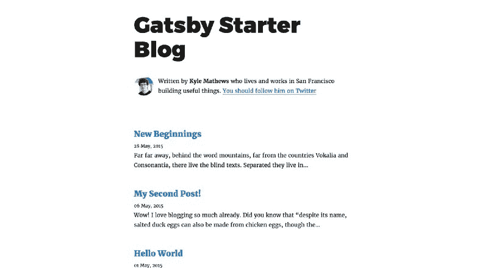
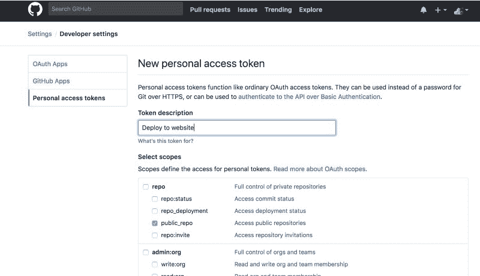
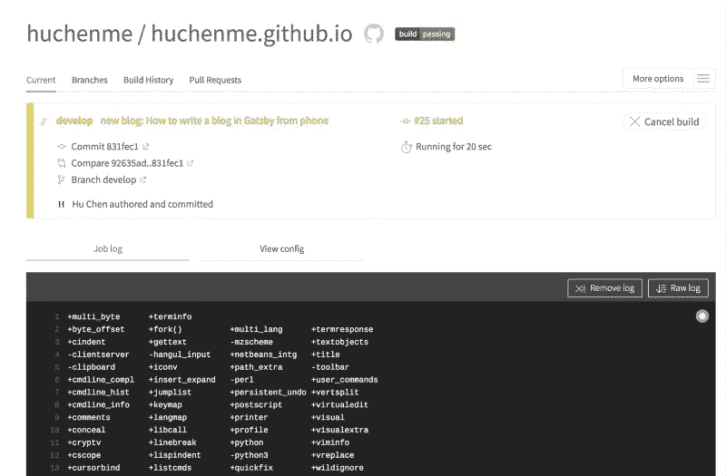
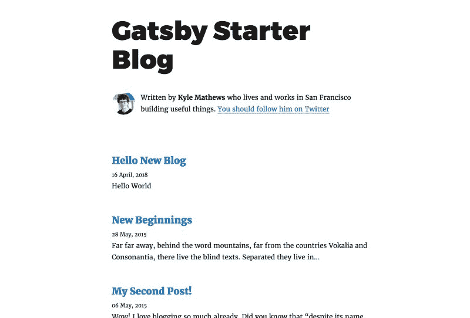

# 如何使用盖茨比创建你的博客，并在你的手机上工作

> 原文：<https://www.freecodecamp.org/news/how-to-write-a-blog-using-gatsby-from-your-phone-e92a99851a04/>

作者:陈虎

# 如何使用盖茨比创建你的博客，并在你的手机上工作


*Image by [**Jesus Kiteque**](https://unsplash.com/@jesuskiteque)*

最近，我决定把我的博客迁移到[盖茨比](https://www.gatsbyjs.org/)。Gatsby 是一个基于 React 的速度极快的静态站点生成器。

### ***本期***

#### ***为什么人们爱在 Medium 这样的平台上写作而不使用静态站点生成器？***

有两种人:在 Medium 这样的平台上写作的人和使用静态站点生成器自己编写博客的人。

与静态站点生成器相比，在 Medium 这样的公共平台上写作有很多优势。如果你在公共平台写作，你可以在笔记本电脑上写作，在手机上编辑。一旦你写完了，你只需要点击“发布”按钮。一切都完成了，你的博客开通了，你可以马上接触到你的读者。

另一方面，如果你在 static site generator 中写博客，你将需要记住所有的脚本，在`localhost`上预览博客，为生产构建博客，提交并推送你的更改到 GitHub，并向公众部署你的站点。如果出现任何问题，您可能需要重复一些步骤，并等待几分钟，直到在线博客是您想要的。

除了真正的写作，你会花更多的时间去做不重要的事情。

#### ***为什么要在盖茨比上而不是公共平台上写？***

我猜这就是为什么人们最终放弃使用静态站点生成器，转而在介质上写作的原因。但有一些 Medium 或 Wordpress 无法提供的东西:你写得越多，你就越想把你的作品放在一个安全的地方，以一种简单的格式保存，就像你可能会把你的日记保存很多年一样。

但是想象一下，有一天你想把你写的所有东西从 Medium 迁移到别的地方。这时你希望你已经在 Markdown 中写好了所有的东西，并且有一个网站来托管这些 Markdown 文件。

#### ***但是我怎么才能让在《盖茨比》里写作像在介质上写作一样容易呢？***

使用静态站点生成器编写并不困难。我始终相信，你的博客越容易写和发布，你就会写得越多。在尝试和研究了不同的设置后，我对结果非常满意。

在我的 Travis CI 设置中，`git push`是新的“发布”按钮。你所需要做的就是提交和推送你的代码。我也会分享如何在你的手机上编辑博客。

我将这篇文章分为五个部分:

1.  **如何创建盖茨比博客**
2.  **设置 Github 页面来托管您的博客**
3.  **为自动部署设置 Travis**
4.  **添加新博客并发布**
5.  **奖励:如何在手机上写博客**

### 1.如何创建盖茨比博客

有很多关于如何使用盖茨比建立博客的[教程](https://www.gatsbyjs.org/tutorial/)讨论了盖茨比提供的所有强大功能。这篇文章不会关注这个问题，但是我仍然会展示一些基本的步骤来建立和运行你的博客。

我假设你已经是一名 JavaScript 开发人员，知道一些关于`npm`、`yarn,`和持续集成的基础知识。对于本教程，我将使用`yarn`，但也可以随意使用`npm`。

首先，安装`gatsby-cli`并使用 Gatsby 的官方博客 starter 创建一个新的 repo。

```
$ yarn global add gatsby-cli
```

```
$ gatsby new gatsby-blog https://github.com/gatsbyjs/gatsby-starter-blog
```

```
$ cd gatsby-blog
```

```
$ gatsby develop
```

现在，在浏览器中打开`localhost:8000`,您应该会在浏览器中看到生成的博客。



### 2.设置 Github 页面来托管您的博客

现在，让我们公开主持博客。

有很多方法可以免费托管你的站点，但是我更喜欢把源代码和产品代码放在同一个地方。因为我把代码提交给了 GitHub，所以我更喜欢用 GitHub 页面来托管我的站点。但是可以随意使用其他服务来托管您的静态站点。

> 注意:稍后我将需要使用 [Travis CI](https://travis-ci.org/) 在每次提交后自动部署网站，因此您可能还需要检查他们支持哪些[平台](https://docs.travis-ci.com/user/deployment/)进行部署。

现在，创建一个名为 **username.github.io.** 的 repo，这将是您站点的源代码和生成的生产版本的 repo。

因为 GitHub 页面提供来自`master`分支的内容，所以您需要将由`yarn build`命令生成的`public`文件夹的内容部署到`master`分支。我们将需要把我们的源代码到另一个分支。我们称它为`develop`。

让我们创建一个初始提交，并将分支重命名为`develop`。

```
$ git init
```

```
$ git add .
```

```
$ git commit -m “Initial Commit”
```

```
$ git branch -m develop
```

现在，我们需要将代码放入 GitHub。如果您已经创建了名为 **username.github.io** 的 repo，将您的代码推入 repo。

```
$ git remote add origin git@github.com:username/username.github.io.git
```

```
$ git push -u origin develop
```

确保您的 GitHub repo 中没有`master`分支，并且默认分支被设置为`develop`。

### 3.为自动部署设置 Travis

这是重要的一步。虽然我们可以用`yarn deploy`来部署，那也是另外三个步骤:生成公共文件夹，部署到 GitHub 页面，等待，在线检查。

但是我们可以用 Travis CI T1 去掉这些步骤。Travis CI 是一个托管、分布式、持续集成服务，用于构建和测试托管在 GitHub 上的软件项目。

如果你的项目在 GitHub 上是公开的，Travis CI 是免费的。现在，通过连接到您的 GitHub 创建一个 Travis 帐户，并在 Travis 中添加您的回购。

#### 在项目根目录下创建一个.`travis.yml`文件

```
language: node_js
```

```
cache:
```

```
 directories:
```

```
 - ~/.npm
```

```
notifications:
```

```
 email:
```

```
 recipients:
```

```
 - chen@huchen.me
```

```
 on_success: always
```

```
 on_failure: always
```

```
node_js:
```

```
 - '9'
```

```
git:
```

```
 depth: 3
```

```
script:
```

```
 - yarn build
```

```
deploy:
```

```
 provider: pages
```

```
 skip-cleanup: true
```

```
 keep-history: true
```

```
 github-token: $GITHUB_TOKEN
```

```
 local-dir: public
```

```
 target-branch: master
```

```
 on:
```

```
 branch: develop
```

您也可以查看[要点](https://gist.github.com/huchenme/fc3afa589cd64d6cdedad92fb7d70851)。让我解释一下这个配置:

*   **通知**:我让 Travis 给我发一封关于成功和失败的邮件。默认情况下，它仅在状态发生变化时发送电子邮件(例如，如果状态为“成功”但更改为“失败”，或者如果状态为“失败”但更改为“已修复构建”)。但即使成功了，我也想收到电子邮件，这样我就可以在线复查了。
*   **git:depth:3** :我要求 Travis 在克隆项目时使用 depth `3`，因为这将有助于加快构建速度。
*   **脚本**:Travis 需要运行的脚本是`yarn build`，它在`public`文件夹中创建静态文件，以便进一步部署。
*   **部署**:我要求 Travis 在`yarn build`脚本成功后部署到 GitHub 页面。它使用我在 Travis repo 设置中设置的`$GITHUB_TOKEN`(我将在下面谈到这个)，将`public`文件夹中的内容推送到 GitHub `master`分支，并且应该只在`develop`分支上触发部署。点击[此处](https://docs.travis-ci.com/user/deployment/pages/)阅读更多关于部署配置的信息。

#### 为 Travis 创建一个令牌以推送到 GitHub

您需要[生成一个具有`public_repo`或`repo`范围的个人访问令牌](https://help.github.com/articles/creating-an-access-token-for-command-line-use/)(私有存储库需要 repo)来允许 Travis 将代码推送到 GitHub repo。这是因为 Travis 运行`yarn build`，需要将`public`文件夹推入 GitHub Pages 服务的`master`分支。



创建令牌后，您需要**将其复制并粘贴**到您的 Travis repo 设置中。


现在，在 git 中添加`.travis.yml`，并将更改推送到 GitHub。

```
$ git add .travis.yml
```

```
$ git commit -m “Add Travis config file”
```

```
$ git push origin develop
```

现在你可以查看特拉维斯的情况了。您应该会看到 Travis 的状态变为黄色(正在运行)。如果一切正常，它将在几分钟内变绿，您应该会收到一封关于成功构建的电子邮件。您可以访问`https://username.github.io`查看您刚刚创建的博客。



### 4.添加新博客并发布

有趣的部分来了。现在我将演示使用这个过程发布一个新博客是多么容易。

现在，让我们添加一个新的博客。

1.  在`src/pages/new-blog;`中创建一个文件`index.md`。你也需要创建一个新的文件夹`new-blog`。
2.  在`index.md`里放一些简单的内容。

```
---
```

```
title: Hello New Blog
```

```
date: "2018–04–16T23:46:37.121Z"
```

```
---
```

```
Hello World
```

3.提交这个新文件并推入 GitHub

```
$ git add .
```

```
$ git commit -m “Add a new blog”
```

```
$ git push origin develop
```

4.等 Travis 说完上网查。几分钟后你收到一封邮件后，你可以再次查看`https://username.github.io`。您应该会在列表中看到您的新博客。



### 5.额外收获:如何用手机写博客

我想消除写博客的另一个障碍。当我带着笔记本电脑的时候，我只能写我的博客，但是我想知道:我可以用我的手机来构思和编辑吗？

事实证明这很容易。你所需要做的就是[将你的桌面和文档文件添加到 iCloud Drive](https://support.apple.com/en-sg/HT206985) 中，并将你的 repo 放在桌面或文档中。最初可能需要一些时间，但是一旦所有的东西都上传了，更新是即时的，我可以同时在我的笔记本电脑、iPhone 和 iPad 上查看我的编辑，没有任何问题。

iPhone 上有很多降价应用。我个人觉得 [IA Writer](https://ia.net/writer) 最好:支持所有平台，优雅专注于写作，对 iCloud Drive 的支持非常好。

虽然我也可以设置我的 iPhone 进行 git 提交和推送，但我觉得没有必要。如果写博客最困难的部分已经完成，使用笔记本电脑做最后的检查和提交代码对我来说不是什么大问题。`git push`就像点击媒体上的“发布”按钮一样简单。

### 就是这样！

我们已经到了本教程的结尾。谢谢你读到这里。

这个帖子只是盖茨比容貌的冰山一角。我对它的灵活性和强大的功能感到惊讶。你绝对应该去看看它的官方教程。