# 试图通过高中数学课来解释区块链

> 原文：<https://www.freecodecamp.org/news/blockchain-explained-by-trying-to-pass-a-high-school-math-class-2322c01ece48/>

凯文·科诺年科

# 试图通过高中数学课来解释区块链

如果你曾经努力上过高中数学课，那么你将能够理解区块链技术的原理，这使得比特币成为可能。

你有没有尝试过通过阅读随机的博客帖子和维基，或者观看 YouTube 视频来学习区块链的基础知识？

它很快就变成了技术问题。您很快就会看到这样的概念:

*分布式台账*

*加密哈希*

*数字签名*

虽然你肯定可以坚持度过最初的困惑，但在理解整个系统之前，你需要理解一系列新的技术概念。

#### **这就是为什么这么难的原因**

比特币(和区块链)是基于一种分布式和去中心化的范式。我们习惯于中央集权的、值得信赖的权威机构，比如银行、医疗服务提供商和企业(是的，我们甚至信任其中的大部分)。

这些机构中的每一个都有复杂的系统来保持高质量。为了在没有中央集权的情况下维持重要产品的相同标准，我们也需要新的、复杂的规则来保持分散系统的运行。

因此，在本文中，我将创建一所名为“分布式高中”的新高中，它采用区块链的原则进行运作。我们将创建一种新的方法，使用分布式系统对数学课作业进行评分。学生将能够独立维护评分系统，而无需教师参与。

**最后一点:**虽然比特币可能是 2018 年区块链技术最受欢迎的应用，但许多其他行业也可能在未来五年内开始采用区块链。

这一解释将直接适用于比特币，但也适用于其他类型的区块链。例如，医疗保健提供商可以使用区块链来安全地存储个人病历。

如果你正在寻找一个更技术性的解释，这个关于比特币的 20 分钟 YouTube 动画视频可能是我最喜欢的。

### 管理一所高中的集中方式

假设你是一名高一新生，你正在上所有九年级学生的代数课。为了通过这门课，你需要在家庭作业、测验和测试中获得足够的分数。你们班总共有 30 名学生。

所有这些都由一个集中的权威来管理:老师。这个人会给你所有的作业打分，每个季度给你发成绩单，并确保没有人在考试中作弊(这会破坏整个班级的诚信)。

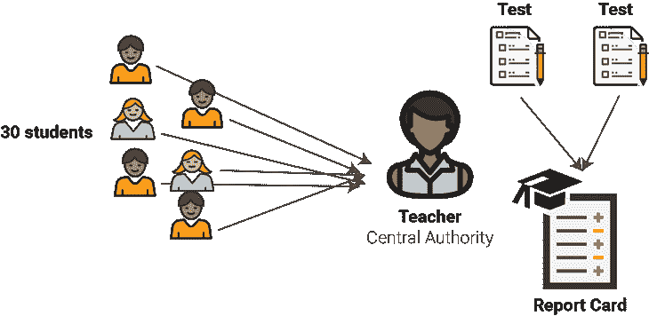

虽然这是我们都习以为常的制度，但它实际上有一些固有的缺陷。

1.  效率可能很低:当你一次给一个老师 30 份试卷时，他们有时会花一周的时间才把试卷还给你——因为给 30 份试卷打分永远都是要花时间的！
2.  有时这是有风险的:有时老师可能会输掉学生的考试。或者纸测试可能被洪水或其他自然灾害破坏。这些事情发生了。老师处理如此多的作业，可能会有一些错误。
3.  **易腐:**你曾经是班里的捣蛋鬼吗？当老师坐下来给你的试卷评分时，他们可能会看一眼试卷顶部的名字，然后在给试卷评分时立即产生偏见。有时候这是很难避免的(人性之类的)。
4.  花费巨大:花在考试评分上的时间本可以用来做其他更有成效的事情。这大概也是老师最不喜欢的工作部分。他们可能成为一名教师，这样他们就可以帮助学生学习，而不是把所有的“空闲”时间都花在批改试卷上。取而代之的是，你父母的纳税人的钱被投入到一项可以大大改善的活动中。

您可以在其他集中式系统中看到类似的问题。例如，尽管我们把自己的血汗钱托付给银行，但银行业通过需要大规模纳税人资金救助的高风险做法，帮助导致了 2008 年的金融危机。

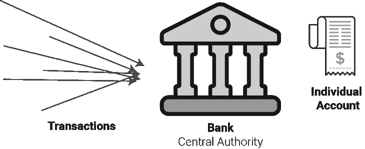

虽然我们信任医生，但医疗失误是美国第三大死亡原因，仅次于心脏病和癌症。其中许多错误可能是由于医生无法获得重要的医疗数据而导致的。

那么，回到高中数学课。你可能想知道…我们到底要如何通过消除老师的影响来解决所有这些问题，老师是这个系统中最有专业知识的人。我们如何防止它变成无政府状态？

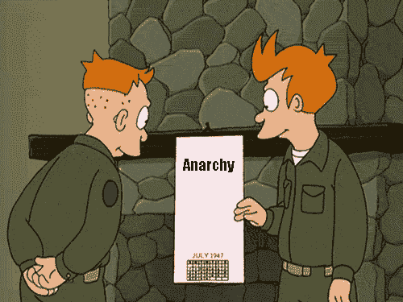

这就是区块链概念的由来。在我进入具体的方式之前，我们将使用区块链创建一种新的方式来运行分布式高中，你应该知道每个区块链都有其创建者制定的特定规则。

在比特币的例子中，是“[中本聪](https://en.wikipedia.org/wiki/Satoshi_Nakamoto)”撰写了最初的白皮书，并创建了规则(算法)，允许它在没有人类干预的情况下运行。

在我们学校的例子中，我们将有一位非常有远见的校长改变了规则。

### 为分布式高中创建区块链

当老师私下批改作业和管理成绩时，区块链会公开所有的交易。所以，除了创建它的人之外，区块链不依赖任何中央权威。

如果你还没有猜到，这意味着在分布式高中，我们将从九年级学生互相评分开始！

假设今天是考试日，上课时间是一个小时。学生做完试卷后，把它们整齐地叠放在老师的桌子上。

但是，老师没有把所有的试卷带回家评分，而是把它们堆成一大堆，让每个学生随机做一份试卷，用答案评分。

这被称为**交易**。这是构成区块链的基本单位。假设一名学生安迪给另一名学生爱丽丝打了 84 分。在这种情况下，安迪是**发送者**，爱丽丝是**接收者**。

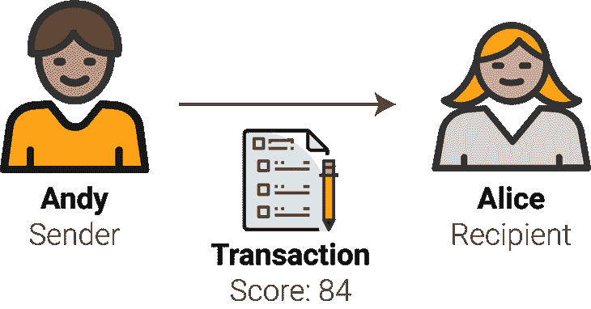

用比特币的话来说，这不会是随机的:你知道你要往哪里汇钱！

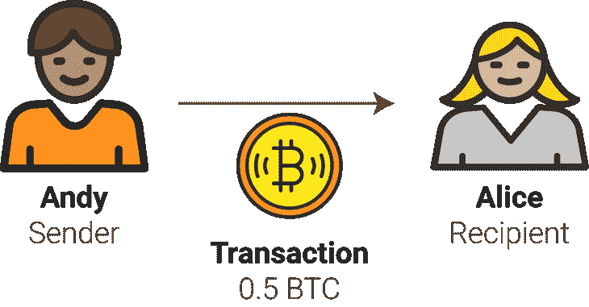

到目前为止，我们已经解决了速度和成本问题。老师不再需要花时间评分，每个学生都可以很快地给其他考试评分。但是，欺诈的可能性很大。这非常接近无政府状态。需要有一个由负责任的人组成的网络，让所有参与者保持诚实。

这就是校长的政策发挥作用的地方。校长控制着大家都关心的一件事:评分系统。在分布式高中，校长决定允许高年级学生(12 年级)运行这个区块链系统，以换取奖励。

如果一个高年级学生在一天内复习了 20 个这样的分级测试，他们可以参加一个竞赛，在他们自己的一个测试中增加 **10 分。**

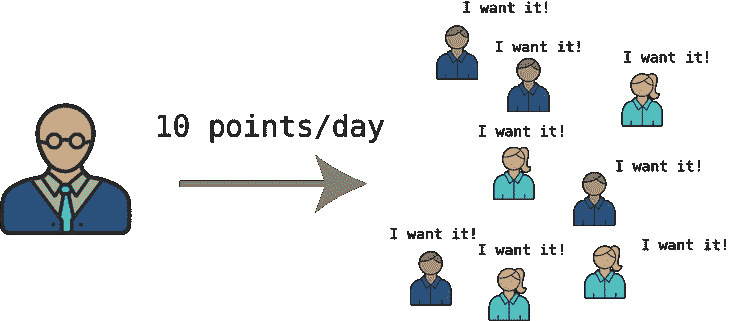

这一组 20 个事务被称为一个**块**，我们将最终展示所有块如何一起工作以形成一个**区块链**。

那么为什么只有学长才能这么做呢？为什么一定要竞争呢？

必须是高年级学生，因为校长需要能够每天处理评分测试工作量的参与者(如果他们愿意的话)。如果系统变慢了，那么没有人会验证和记录他们的测试，这将是一个彻底的失败。

而且必须是竞争，这样积分制才不会完全贬值。想象一下，如果每个高年级学生都复习了他们的 20 次考试，并在自己的考试中获得了 10 分，会是什么情况？分数膨胀将会猖獗，就像政府印更多的钞票时通货膨胀会加剧一样。必须有一个稀缺点的竞争。稍后我会分享比赛的条款。

校长并没有强迫任何高年级学生参加，但他们有强烈的动机这样做。

在比特币中，每个块有 1 兆字节(MB)的数据限制。截至 2017 年末，平均事务包括约 500 字节的数据，因此一个块通常包含约 2000 个事务([来源](https://arstechnica.com/tech-policy/2017/12/bitcoin-fees-are-skyrocketing/))。

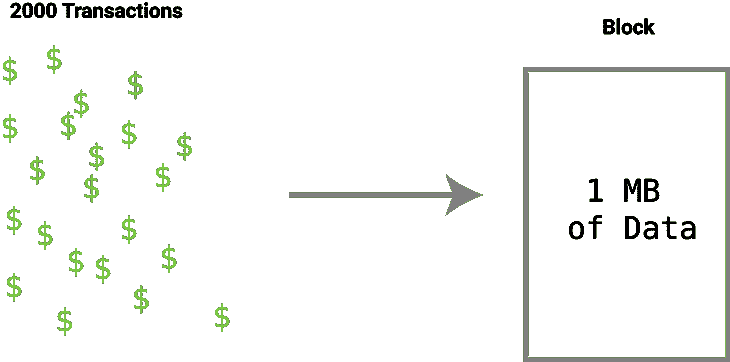

### 分布式分类账简介

现在我们知道了一个测试是如何被评分的(一个交易),以及高年级学生维护系统完整性的激励机制:他们通过审查和验证更多的测试来获得更多的分数。但是我们仍然缺少完整的分布式基础设施来了解这项工作实际上是如何完成的。

假设 10 个高年级学生接受了校长的提议。他们想成为这场比赛的一部分，以便在自己的考试中获得更多的分数。另一组 10 名高年级学生决定志愿帮助维护系统，但不参加比赛。这仅仅是出于对分布式系统的支持，也是开源分级运动精神的一部分。

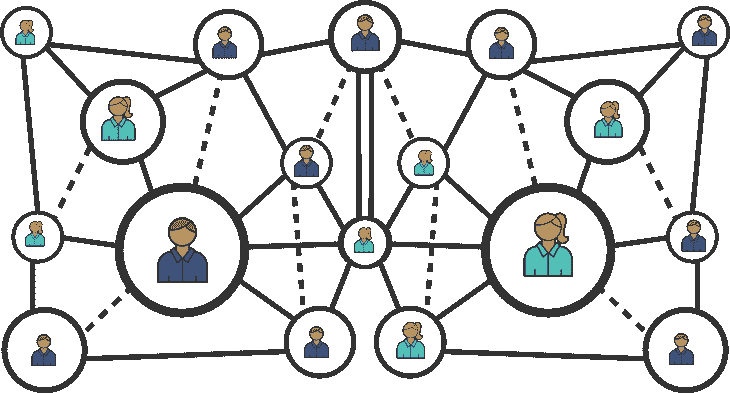

那些前辈中的每一个都是网络中的 [**全节点**](https://bitcoin.org/en/full-node) 。他们就新的事务和块进行实时通信。

决定参加比赛的 10 名高年级学生被称为**矿工**。他们用**内存池**中可用的事务构建模块，该内存池是未确认事务的储存库。

当像安迪这样的学生完成一项测试的评分时，该学生向高年级学生网络广播一个**未验证的交易**。每个完整的节点都像谣言一样与其他人分享它。它成为内存池的一部分。

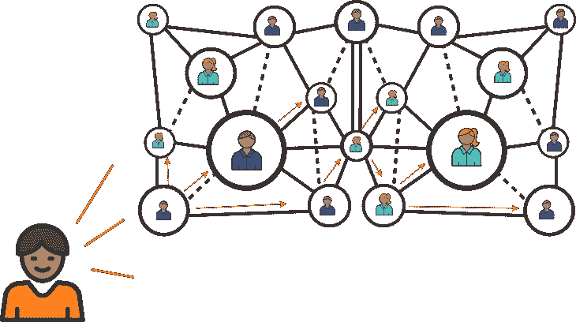

每个节点必须首先**验证**交易。换句话说，他们决定这是否可能。在这个例子中，验证可能意味着通过将所有最终答案输入到您的计算器中来确认评分者实际上对测试进行了正确评分。我们稍后将进入验证的另一部分。

验证之后，每个矿工都有机会从 20 个测试或事务中构建自己的模块。

但是等等！在测试日，应该向网络添加 30 个新交易，因为班上有 30 名学生。矿工如何选择要添加到区块中的交易？

答案是一笔**交易费**。每个**发送者**必须在他们的交易中附加交易费，以补偿矿工的工作。因此，矿商通常会选择立即将所有收费最高的交易归入他们的区块。由于这是根据供应和需求来操作的，所以在需要验证的测试较少的日子里，他们可以包括费用较低的交易。

在我们学校的例子中，这个交易费可以是发送者测试中的一个点，以捐赠给矿工。它不会从爱丽丝(接受者)的测试中出来。在比特币中，它只是比特币的一小部分，比如 0.000003 BTC。发件人支付费用，因为这是处理物流最简单的方式。

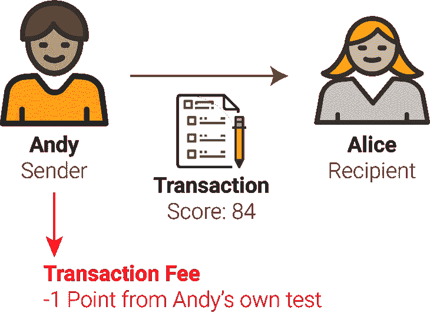

此时，每个矿工都有他们想要添加到区块链的 20 个已验证事务块。现在，是比赛的时候了，看看 10 名矿工中的哪一个将获得他们的区块并从校长那里获得分数。

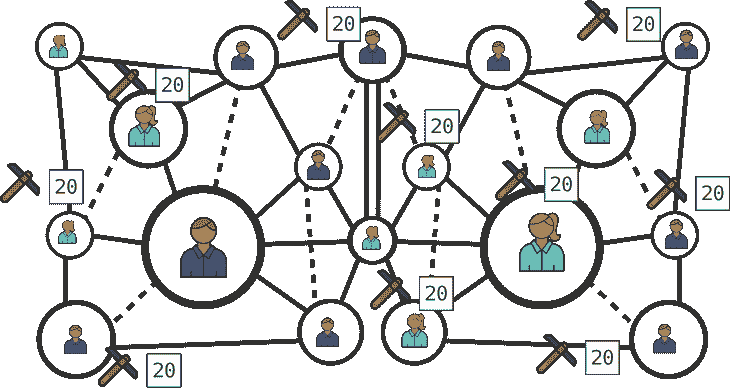

最后一件事。你开始看到冗余的数量，或者重复的工作。每个提议的块将有许多共同的事务(测试)。这是运行分布式系统所必需的安全措施。如果所有节点都单独验证事务，那么欺骗系统就更加困难了。

### 工作证明的竞赛

想象一下，在创建一个包含 20 个交易的区块的所有工作之后，校长向每个矿工分享了一个 12 年级水平的数学问题。最先解决问题的人会得到所有的分数，他们的积木也会被确认。

这将意味着“富人越来越富”，并扭曲整个系统的激励。

每天，数学尖子生都有很大的机会赢得比赛，而其他高年级学生几乎没有机会。很快，大多数矿工/老年人将停止参与，因为他们永远不会得到任何积分。

所以，取而代之的是，我们的校长打算每晚在学校组织一次寻宝游戏。重要的是，寻宝游戏与矿工的数学能力毫无关系。这鼓励了大家继续挖矿。

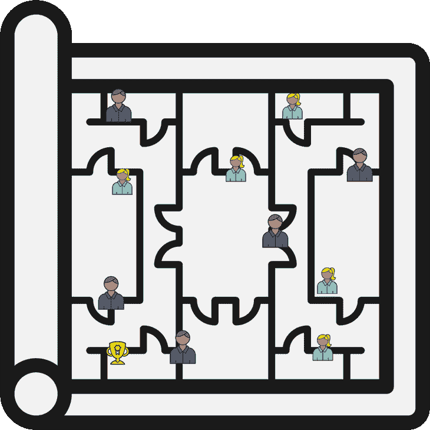

校长会把奖杯藏在学校的某个地方。学生们必须跑来跑去，直到他们找到它，然后大喊，这样全校的其他学生就可以确认他们找到了，然后回家。由于这位校长有一些神奇的预见能力，他把奖杯藏在一个完美的地方，这样每天晚上都要花大约一个小时才能找到。

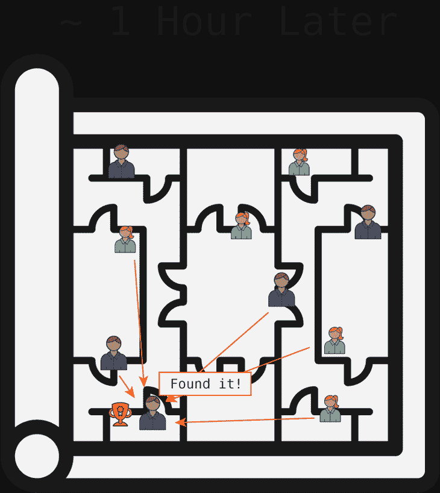

这听起来武断吗？换句话说，它感觉像是突然冒出来的吗？

那么，它必须与测试验证无关，这样它才能公平竞争。这在比特币中被称为“[工作证明](https://en.bitcoin.it/wiki/Proof_of_work)”。这是一个很难解决的算法，但一旦解决，其他节点就很容易确认。每个比特币矿工必须猜测数字，直到他们选择正确的数字来解决这个难题。在比特币中，平均每 10 分钟就有一个新的区块被确认。

请记住，比特币矿工实际上是巨大的计算机，看起来像这样:

[Image credit](https://medium.com/@lopp/the-future-of-bitcoin-mining-ac9c3dc39c60).

随着时间的推移，随着越来越多的矿工加入这个网络，这个算法也变得越来越难。如果有更多的矿工，这意味着会有更多的猜测，所以如果比特币想要继续每 10 分钟确认一次区块，挑战肯定会变得更加困难。

这个例子展示了比特币(以及我们学校的例子)如何迫使每个矿工与网络中的其他人竞争。一旦一名矿工解开了谜题，他们就与网络上的其他人分享他们的答案，这可以很快得到证实。当节点达成**共识**，或超过 50%同意该区块为**确认**后，可以将其加入区块链。

这促使一些矿工成立了行业协会。在我们学校的例子中，这意味着一旦其中一人找到奖杯，一些学生将同意平分奖金。这只是增加了第一个找到奖杯的人成为他们团队成员的可能性。

在比特币中，正在解决这一“工作证明难题”的总计算能力被称为 [**散列率**](https://bitcoin.org/en/vocabulary#hash-rate) 。最大的比特币公会控制着大约 10%的哈希比率，这仍然给了其余的矿工一个解决这个难题的好机会。如果一个公会拥有 50%的杂凑率，那么其他人继续采矿的动力就会减少。

一旦一个区块被确认，矿工将获得奖励(一次测试 10 分)和确认交易的所有交易费。然后，不属于该块的事务返回到**内存池**，以包含在未来的块中。

### 建设一个区块链

到目前为止，我们已经介绍了向区块链添加一个区块的大部分步骤。但是，我们还没有涵盖建设区块链本身的全部要点。

区块链有一个简单的三层结构。一系列事务组成一个块。一系列积木组成了一个区块链。

虽然您当然可以根据时间将一个区块链分成几个部分，但通常每个单独的节点(高级)将维护区块链的完整历史，或**分类账**。

在我们的高中例子中，我们看到的是一个九年级的班级。因此，班级的完整历史可以是整个班级所有学生的所有成绩，从幼儿园到今天。由于我们以 1 天为间隔添加区块，一学年大约有 180 天，这意味着区块链包含大约 1700 个区块。

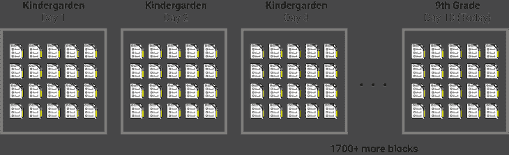

每个块都有一个唯一的 ID，由于使用了一个“[哈希函数](https://www.coindesk.com/information/how-do-bitcoin-transactions-work/)，该 ID 取决于前一个块的块 ID。这就是保证区块链安全的原因:没有块替换或重写历史这样的事情，因为它会改变每个后续块的块 ID。

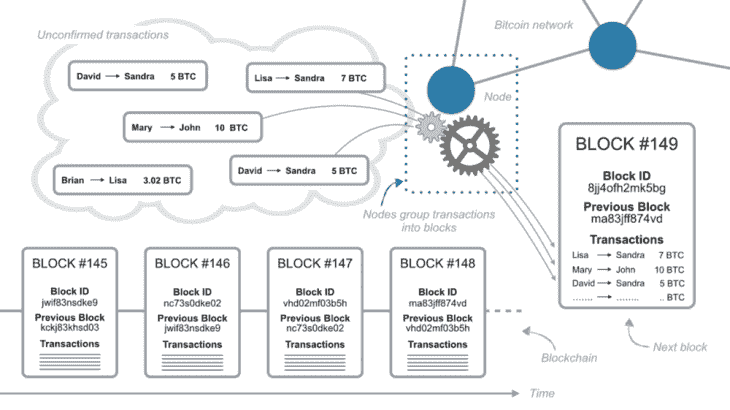

由于我们的教育示例使用一天的时间间隔，您可能会想，*“哦，为每个块创建一个惟一的 ID 应该很容易，因为每个日期只出现一次！”*

但是，这将引入一个安全漏洞。如果一个矿工能够在链条中间的某个地方引入一个新的区块，它不会打破这个模式！异常的挖掘器可以很容易地复制块 ID，并且后面的块不会改变它们的值，因为日期遵循一个可靠的模式，可以很容易地复制。

这里有一个[哈希生成器，你可以用它来玩。我希望我能给你一些关于块顺序的奇妙的类比，但是不幸的是，这就是散列函数的要点。这使得模仿和替换积木变得非常非常困难(就我们所知，这是不可能的)。因此，我将添加一些随机的字符串来显示正在发生的事情。](http://www.miraclesalad.com/webtools/sha256.php)

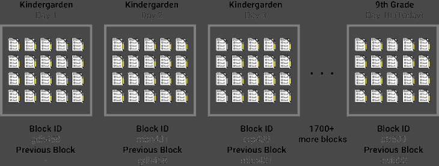

我们将在下一部分讨论隐私，因为现在，看起来每个 12 年级学生都可以看到每个 9 年级学生的整个年级历史。这不是我们想要的！

但是，从积极的一面来看，分布式账本允许每个高年级学生在网络中循环时确保分级测试的有效性。

这个排序系统是**相对的**，而不是绝对的。块的顺序比它们被添加到链中的次数更重要。正如我们上面讨论的，时间戳太容易复制和模仿了。

让我们举一个被称为**双重花费攻击**的例子。假设你的一个同学在周一参加数学考试，她知道自己考得很差。你的一个同学对那个版本的测试进行评分，然后像往常一样将它广播到节点。

你那位成绩很差的同学那天晚上疯狂地学习，然后第二天出现在另一个班级参加同样的考试。也许老师前一天没有注意到她在那里——所以她能够说服老师她前一天不在场。请记住，教师在评分测试中没有作用，因此教师不能快速参考前一天的考试。学生被允许再次参加考试，并与班上的其他同学一起提交。

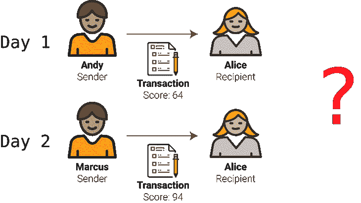

以下是来自区块链的最新选项，爱丽丝试图超越她以前的成绩。

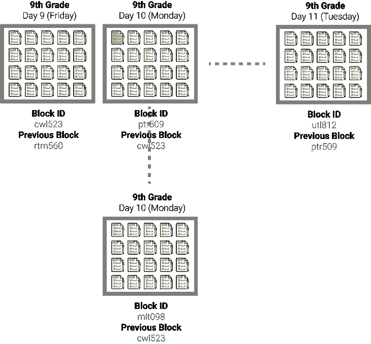

哦，对了，爱丽丝现在需要成为网络上的矿工，参加寻宝游戏。她现在是这个网络的第 11 名矿工。

规则是“最长的链条获胜”这意味着，在第 11 天，网络的其余部分可能正在用最新的一组事务添加一个新块。但是 Alice 将对链进行“**”分叉**，并为第 10 天添加一组新的事务，共有 19 个事务，并用她的新测试分数替换旧测试分数。

分叉意味着她试图建立一个新的最长的链，而不是网络中其他人认为最长的链。

如果她能在那天赢得寻宝游戏，然后第二天回来再赢一次，她就有了最长的链条。

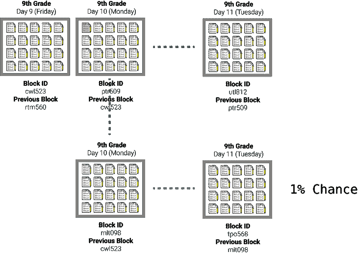

这就是“工作证明”制度的部分价值。由于 Alice 是网络中 11 名矿工之一，她有大约 1%的机会连续解决两个街区的问题。有 99%的可能性，她会付出所有的努力却一无所获。这不是一个很好的激励。

这也是为什么块 id 和以前的块 id 是比特定日期更好的标记方案。如果 Alice 在她秘密进行第二次测试的那一天赢得了比赛，那么那天的所有新测试最终仍将存储在区块链中。他们只需要再等一天。

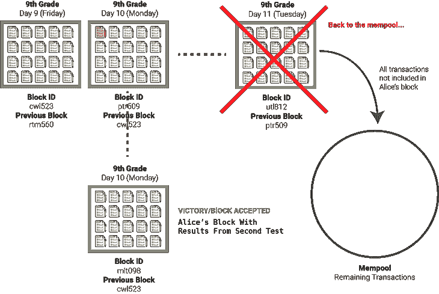

### 介绍公钥和私钥

到目前为止，我们已经介绍了允许分布式高中学生管理自己成绩的所有机制。我们只遗漏了一件重要的事情:隐私！

现在，每个学生的成绩都永远暴露在区块链上。如果这是一种货币，就很容易算出每个人有多少钱。这不是我们想要的。

同时，透明度是让个人对不公平评分和其他欺诈行为负责的好方法。

这也是为什么比特币使用了**公钥和私钥**的加密系统。在高中，你可能已经习惯了几乎每个走廊都有储物柜。

嗯，在比特币中,(本质上)有无限数量的公私密钥组合。所以，想象一下，这所高中的墙上排列着你在公寓楼里看到的小邮箱。

他们覆盖了整个该死的学校的每一面墙。并且，由于储物柜的总数是无限的，所以学校中的每个学生都可以拥有无限数量的储物柜。用数学术语来说:

*无限制/30 名学生=无限制*

你看过《哈利·波特与凤凰社》吗？

这就像《预言大厅》中的场景一样——看似无限。

但是无论如何…

为了简单起见，让我们假设每个学生在学校参加考试的每个年级(9-12)都有一个邮箱。如果一个学生在九年级，这意味着他们正在使用他们九年级的储物柜。

让我们回到我们的事务，Andy 对 Alice 的测试进行评分。

我们的**全节点**，精彩的高三学生，首先要评估安迪是否有资格评阅九年级数学试卷。安迪需要证明自己。

这里有一个问题:如果安迪高兴地向网络宣布他已经给爱丽丝的作业评分，他就有暴露爱丽丝的风险。如果她成绩不及格怎么办？她不想让全世界都知道，永远！

所以，他必须在匿名的情况下广播。他可以随机地向其中一个节点滑一张纸条…就像 1980 年代的高中电影开始中的大多数谣言一样！

那么整个节点将与网络的其余部分共享该谣言。

这就是我们的**公钥**发挥作用的地方。当安迪在网络上透露他的分级测试时，他实际上是在说:

*   我现在的邮箱地址是 126900trl。
*   为了证明考试当天我在现场，这里是老师给我评分这个具体考试的答案钥匙(**数字签名**)。
*   此外，为了证明我确实是 9 年级代数班的学生，下面是 1-8 年级每年数学课的期末考试成绩，以及每项考试的答案(**事务链**)。
*   我将把测试发送到邮箱 856734

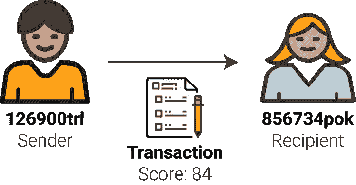

这回答了两个关键问题:

1.  发件人是他/她声称的那个人吗？
2.  发件人是否有资格成为发件人(给测试打分)？

为了回答第一个问题，比特币使用了一个**数字签名**。数字签名对于每笔交易都是唯一的，由交易 ID 和私钥的散列组成。在这种情况下，这有点像考试钥匙:只有在特定的考试当天你在那里，并且老师把它给了你，你才能拥有它。

对于第二个问题，请记住，在比特币中没有“账户”或“账户余额”的概念。如果有的话，安迪可以分享一个证明他有资格的身份证号码。

为了证明这个特定的公钥(Andy 的公钥)具有足够的批准，他必须共享一个每个完整节点都可以验证的测试历史。这样，每个人都可以证明他完成了 1-8 年级。安迪还必须提供每项测试的答案，以证明他当时在房间里。这被称为**交易链。**我不会在这里介绍它，但它是验证的一个重要部分。

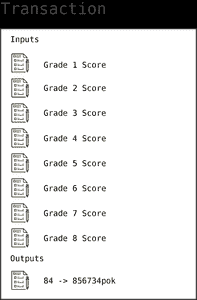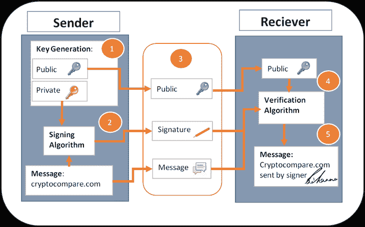

[Image credit](https://www.cryptocompare.com/wallets/guides/how-do-digital-signatures-in-bitcoin-work/).

在安迪的事务被**验证**并被包含在一个已经被**确认**的块中之后，他可以在不为公众所知的情况下将测试放到爱丽丝的邮箱中。

正如您在上面的交易中注意到的，Andy 必须访问过去 8 年的测试！这个储物柜系统只允许安迪查看他的试卷。

安迪有一组 8 个**私钥**。每次开始新的一年，他都会打开另一个储物柜，把那一年的成绩放在储物柜里。

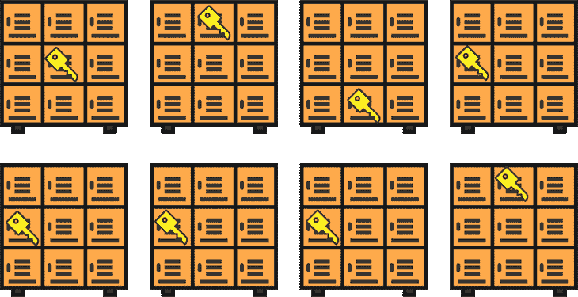

其他人可以将他的最新测试结果放入他的储物柜，但只有他可以取回结果。

像[比特币基地](http://coinbase.com/)这样的比特币软件可以让你在钱包里创建许多公/私密钥组合。这提高了安全性。你永远不会想要放弃你的私人密钥，这是访问已经转移给你的比特币的唯一途径。与传统银行不同，如果你忘记或丢失了私人钥匙，没有人可以求助。比特币会被锁起来。

### 最后的想法

概括来说，我们有:

*   测试(交易)
*   答案(数字签名)
*   九年级学生(寄件人和收件人)
*   十二年级学生(全节点)
*   负责人(区块链创建者)
*   无限邮箱(公钥/私钥)
*   没有教师评分测试(中央集权)
*   没有成绩单(账户/账户余额)

这个系统很大程度上围绕着“不信任”的概念，你可能已经看到了仔细的制衡和激励结构。在管理银行业或公共教育的传统剧本中，对中央权威的信任扮演着重要角色。为了将控制权交还给个人，节点上必须有大量的冗余来防止欺诈，同时还要有周密的安全协议来防止黑客侵入系统。

但是，这种分布式系统可以彻底改变许多行业处理数据的方式，并有助于防止工业事故、医疗事故和金融破产。

如果您还没有注意到，在所有完整的节点上有大量重复的工作。在验证和确认交易之间，以及尽可能快地猜测“工作证明”的答案之间，系统消耗大量能量。[根据一项估算](https://arstechnica.com/tech-policy/2017/12/bitcoins-insane-energy-consumption-explained/)，比特币网络消耗的能量相当于丹麦这个国家！但是，这也是形成共识和维护采矿完整性所必需的。

### 获得更多直观的解释

你喜欢这个教程吗？为它鼓掌，留下评论，或者在这里注册以获得我最新的技术解释: