# React.js 中 setState 的快速介绍

> 原文：<https://www.freecodecamp.org/news/understanding-setstate-in-react-ea8982168b49/>

作者:拉杰什·皮莱

# React.js 中 setState 的快速介绍

#### 如何有效地使用 setState 以及应该避免哪些陷阱

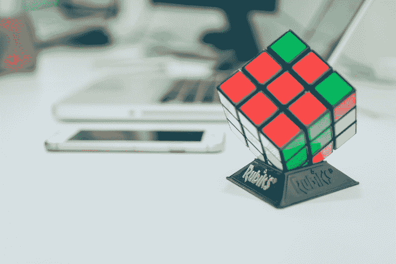

State management shouldn’t be like solving Rubik Cube :)

**TL；博士**——如果你是视觉学习者，去看我做的视频:[react js——setState 如何工作](https://www.youtube.com/watch?v=hwvnCnQ1mRg)

或者在这里观看:

### setState 简介

首先要注意的是，React 中的 setState 函数以异步方式工作。这可能会使一些开发人员出错，因为状态值在更新后不会立即可用。

使用 setState 有两种方法:基于对象的方法和函数方法。

让我们来看看两者的作用。我们将在这个过程中理解基于对象的 setState 的问题。

让我们创建一个简单的应用程序。

```
class App extends React.Component {   constructor() {     super();     this.state = {       value: 0,       message: 'default click state'     }   }     onClick = () => {     this.setState({       value: this.state.value + 1     });          this.setState({       message: `click-state ${this.state.value}`     });   }         render(){     return(        <div>         <div>render->state={this.state.value} -              {this.state.message}         </div>         <button onClick={this.onClick}>Click-setState</button>               </div>     );   }}
```

现在我们将把这个应用程序挂载到我们的根 DOM 节点。

```
ReactDOM.render(  <App />,   document.getElementById("root"));
```

上面的代码在执行时会呈现状态对象中的值和消息，还会呈现一个按钮。

如果您看一下 click 处理程序，我们有两个连续的 setState 函数来访问 this.state 值。

我们期望的行为是，当单击按钮时，正确的状态值应该呈现在下面的 div 中(提取以供参考):

```
<div>render->state={this.state.value} -      {this.state.message}</div>
```

`this.state.message`包含来自`this.state.value`的值

我们期望当按钮被点击时，两个状态值应该是相同的。

让我们看看这个的输出。

初始输出如下所示，因为值从 0 开始。

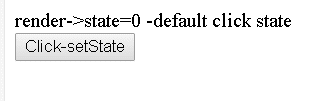

在第一次点击之后，我们期待下面的输出:

```
render->state=1 -click-state 1
```

但是我们得到的是这个:

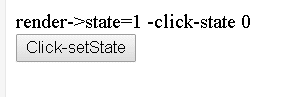

mismatch in state value

第二次点击时，输出仍然不匹配，如下所示。

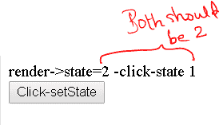

现在你可能正在打盹或挠头:)


Photo by [Jackman Chiu](https://unsplash.com/@jackmanchiu?utm_source=medium&utm_medium=referral) on [Unsplash](https://unsplash.com?utm_source=medium&utm_medium=referral)

### onClick()函数

所以让我们看一下 onClick()函数来理解这个问题。

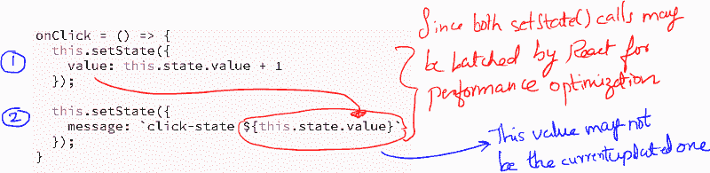

由于 setState 调用在第一 setState 执行可能完成之前是异步的，所以对第二 setState 的引用可能指向先前的值，而不是第一个当前更新的值。

我们将通过使用 setState 的功能方面来解决这个问题。

为了演示修复，让我们再创建一个按钮:

```
<button onClick={this.onClickfn}>Click-setState fn</button>
```

并添加一个新的点击处理程序 onClickfn()，如下所示

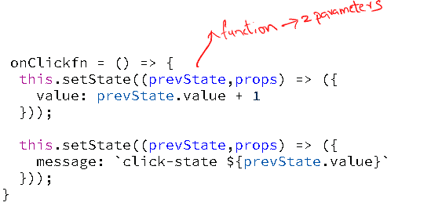

setState(fn)

上面的方法使用 setState 中的 functional 参数。

这可以是如上所示的箭头函数，也可以是普通的 ES5 函数。

这个函数使用两个参数作为参数:第一个是 prevState，第二个是 props(如果您也需要 props，它是从父组件传递来的)。在这里，我们只研究以前的状态。

上面的 prevState 与 setState 函数相关，因为它是最后更新的状态。这将始终指向正确的值。

让我们看看点击几次后的输出。您会发现，当您单击第二个按钮时，这些值总是同步的。

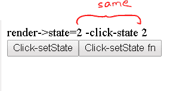

在上面的示例中，您可以看到使用函数 setState 参数正确地对以前的状态进行了批处理，并获得了可预测的状态值。

我们还需要注意一点:setState()还需要一个回调函数，一旦状态值被成功更新，这个函数就会被执行。

这在 setState 成功更新后您必须执行一些操作的情况下非常方便。

让我们看最后一个例子。

假设我们希望在更新后记录状态值，我们编写如下代码。为此，我将使用 onClickfn()处理程序。

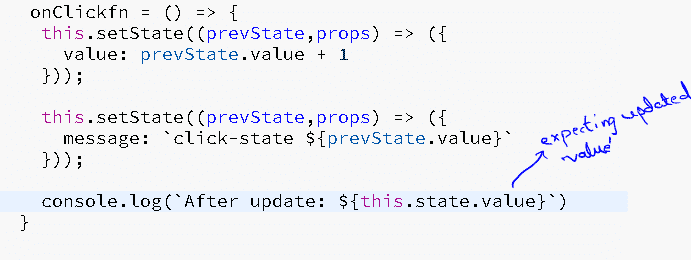

但是让我们看看`console.log`并验证该值是否正确。点击三次后，您将获得以下状态:

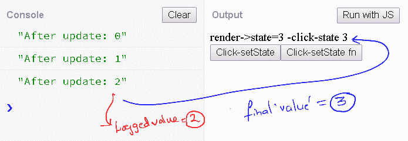

您会发现记录的值不是最后更新的值。让我们解决这个问题，看看输出。

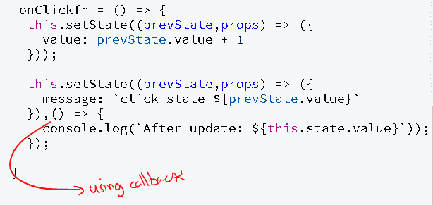

在上面的例子中，我们使用了 setState()第二个回调参数。一旦 setState()完成了它的操作，这个回调将被执行。

让我们看看上面修改后的代码的最终输出。

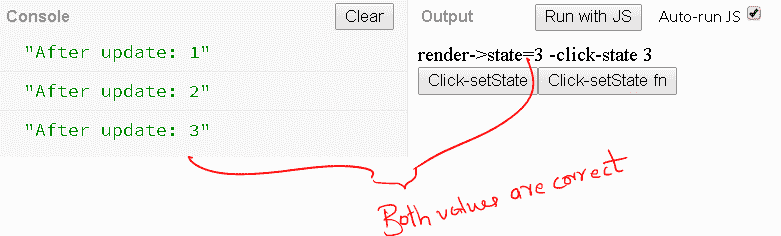

### 包扎

我希望这篇小文章能澄清一些关于 setState 的误解。

完整的源代码可以在 [jsbin](http://jsbin.com/mekiwog/1/edit) 获得。

编码快乐！

跟我学@Learner + Fullstack 蔻驰(@ rajeshpillai):[https://twitter.com/rajeshpillai](https://twitter.com/rajeshpillai)

促销:如果你希望支持我们的开源课程[在 12 到 20 周内掌握前端工程](https://codeburst.io/mastering-front-end-engineering-in-12-to-20-weeks-for-beginners-and-experienced-alike-6dc5172e3295)，我将在 udemy 上为媒体读者提供特别的 10 美元优惠券[react js-Beyond the basic](https://www.udemy.com/reactjs-beyond-the-basics/?couponCode=MEDIUM_500)课程