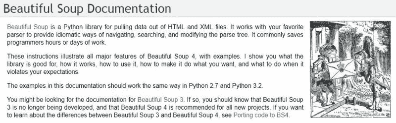
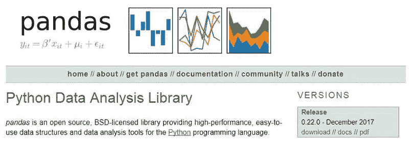

# 更好的网页抓取在 Python 与硒，美丽的汤，和熊猫

> 原文：<https://www.freecodecamp.org/news/better-web-scraping-in-python-with-selenium-beautiful-soup-and-pandas-d6390592e251/>

作者戴夫·格雷

### 网页抓取

使用 Python 编程语言，可以快速有效地从 web 上“抓取”数据。

网页抓取的定义是:

> 一种工具，用于将 web 上的非结构化数据转换为可供分析的机器可读的结构化数据。([来源](https://www.promptcloud.com/blog/should-data-scientists-learn-web-scraping))

在数据科学家的技能组合中，网络搜集是一个很有价值的[工具。](https://medium.com/@Francesco_AI/data-science-skills-list-9f38863adab5)

现在，刮什么？


“Search drill down options” == Keep clicking until you find what you want.

### 公开数据

KanView 网站支持“政府透明”。这也是该网站的口号。该网站提供了堪萨斯州的工资单数据。这太棒了！

然而，像许多政府网站一样，它将数据隐藏在深入链接和表格中。这通常需要“最佳猜测导航”来找到您正在寻找的特定数据。我想在一个研究项目中使用堪萨斯大学的公共数据。用 Python 抓取数据并保存为 JSON 是我开始时需要做的事情。

### JavaScript 链接增加了复杂性

使用 Python 进行 Web 抓取通常只需要使用 [Beautiful Soup](https://www.crummy.com/software/BeautifulSoup/) 模块就可以达到目的。 [Beautiful Soup](https://www.crummy.com/software/BeautifulSoup/) 是一个流行的 Python 库，它通过遍历 DOM(文档对象模型)使 web 抓取更容易实现。

然而， [KanView](http://kanview.ks.gov/PayRates/PayRates_Agency.aspx) 网站使用 JavaScript 链接。因此，使用 Python 和 Beautiful Soup 的例子如果没有一些额外的添加就无法工作。


[https://pypi.python.org/pypi/selenium](https://pypi.python.org/pypi/selenium)

### 硒拯救世界

[Selenium 包](https://pypi.org/project/selenium/)用于自动化来自 Python 的 web 浏览器交互。有了 Selenium，编写 Python 脚本来自动化 web 浏览器成为可能。之后，那些讨厌的 JavaScript 链接就不再是问题了。

```
from selenium import webdriver
from selenium.webdriver.common.keys import Keys
from bs4 import BeautifulSoup
import re
import pandas as pd
import os
```

Selenium 现在将启动一个浏览器会话。为了让 Selenium 工作，它必须访问浏览器驱动程序。默认情况下，它将在 Python 脚本所在的目录中查找。链接到 Chrome、Firefox、Edge 和 Safari 驱动程序的链接[可以在这里找到](https://pypi.python.org/pypi/selenium)。下面的示例代码使用 Firefox:

```
#launch url
url = "http://kanview.ks.gov/PayRates/PayRates_Agency.aspx"

# create a new Firefox session
driver = webdriver.Firefox()
driver.implicitly_wait(30)
driver.get(url)

python_button = driver.find_element_by_id('MainContent_uxLevel1_Agencies_uxAgencyBtn_33') #FHSU
python_button.click() #click fhsu link
```

上面的`python_button.click()`告诉 Selenium 点击页面上的 JavaScript 链接。到达职位页面后，Selenium 将页面源代码交给 Beautiful Soup。



[https://www.crummy.com/software/BeautifulSoup/](https://www.crummy.com/software/BeautifulSoup/)

### 过渡到美味的汤

[Beautiful Soup](https://www.crummy.com/software/BeautifulSoup/) 仍然是遍历 DOM 和抓取数据的最佳方式。在定义了一个空列表和一个计数器变量之后，是时候让 Beautiful Soup 抓取页面上所有匹配正则表达式的链接了:

```
#Selenium hands the page source to Beautiful Soup
soup_level1=BeautifulSoup(driver.page_source, 'lxml')

datalist = [] #empty list
x = 0 #counter

for link in soup_level1.find_all('a', id=re.compile("^MainContent_uxLevel2_JobTitles_uxJobTitleBtn_")):
    ##code to execute in for loop goes here
```

从上面的例子可以看出，Beautiful Soup 将为州政府机构的每个职位检索一个 JavaScript 链接。现在，在 for / in 循环的代码块中，Selenium 将单击每个 JavaScript 链接。美丽的汤将从每一页检索表格。

```
#Beautiful Soup grabs all Job Title links
for link in soup_level1.find_all('a', id=re.compile("^MainContent_uxLevel2_JobTitles_uxJobTitleBtn_")):

    #Selenium visits each Job Title page
    python_button = driver.find_element_by_id('MainContent_uxLevel2_JobTitles_uxJobTitleBtn_' + str(x))
    python_button.click() #click link

    #Selenium hands of the source of the specific job page to Beautiful Soup
    soup_level2=BeautifulSoup(driver.page_source, 'lxml')

    #Beautiful Soup grabs the HTML table on the page
    table = soup_level2.find_all('table')[0]

    #Giving the HTML table to pandas to put in a dataframe object
    df = pd.read_html(str(table),header=0)

    #Store the dataframe in a list
    datalist.append(df[0])

    #Ask Selenium to click the back button
    driver.execute_script("window.history.go(-1)") 

    #increment the counter variable before starting the loop over
    x += 1
```



[https://pandas.pydata.org/](https://pandas.pydata.org/)

### 熊猫:Python 数据分析库

美丽的汤把发现传递给熊猫。Pandas 使用它的`read_html`函数将 HTML 表格数据读入 dataframe。数据帧被附加到先前定义的空列表中。

在循环的代码块完成之前，Selenium 需要点击浏览器中的后退按钮。这是为了循环中的下一个链接可以在 job listing 页面上单击。

当 for / in 循环完成时，Selenium 已经访问了每个职位链接。美汤从每一页都检索到了表格。Pandas 将每个表中的数据存储在一个数据帧中。每个数据帧都是数据列表中的一项。各个表数据帧现在必须合并成一个大的数据帧。这些数据随后将被转换成 JSON 格式与[熊猫。Dataframe.to_json](https://pandas.pydata.org/pandas-docs/stable/generated/pandas.DataFrame.to_json.html) :

```
#loop has completed

#end the Selenium browser session
driver.quit()

#combine all pandas dataframes in the list into one big dataframe
result = pd.concat([pd.DataFrame(datalist[i]) for i in range(len(datalist))],ignore_index=True)

#convert the pandas dataframe to JSON
json_records = result.to_json(orient='records')
```

现在 Python 创建了 JSON 数据文件。已经可以使用了！

```
#get current working directory
path = os.getcwd()

#open, write, and close the file
f = open(path + "\\fhsu_payroll_data.json","w") #FHSU
f.write(json_records)
f.close()
```

### 自动化过程很快

上述自动网页抓取过程很快完成。Selenium 打开一个浏览器窗口，您可以看到它正在工作。这让我可以给你看一个截屏视频，展示这个过程有多快。您会看到脚本跟踪一个链接、获取数据、返回并单击下一个链接的速度有多快。这使得从数百个链接中检索数据只需几分钟的时间。

[https://www.youtube.com/embed/Hhvf4IOt88A](https://www.youtube.com/embed/Hhvf4IOt88A)

### 完整的 Python 代码

这里是完整的 Python 代码。我已经包括了制表的进口。它需要一行额外的代码，使用制表将数据漂亮地打印到您的命令行界面:

```
from selenium import webdriver
from selenium.webdriver.common.keys import Keys
from bs4 import BeautifulSoup
import re
import pandas as pd
from tabulate import tabulate
import os

#launch url
url = "http://kanview.ks.gov/PayRates/PayRates_Agency.aspx"

# create a new Firefox session
driver = webdriver.Firefox()
driver.implicitly_wait(30)
driver.get(url)

#After opening the url above, Selenium clicks the specific agency link
python_button = driver.find_element_by_id('MainContent_uxLevel1_Agencies_uxAgencyBtn_33') #FHSU
python_button.click() #click fhsu link

#Selenium hands the page source to Beautiful Soup
soup_level1=BeautifulSoup(driver.page_source, 'lxml')

datalist = [] #empty list
x = 0 #counter

#Beautiful Soup finds all Job Title links on the agency page and the loop begins
for link in soup_level1.find_all('a', id=re.compile("^MainContent_uxLevel2_JobTitles_uxJobTitleBtn_")):

    #Selenium visits each Job Title page
    python_button = driver.find_element_by_id('MainContent_uxLevel2_JobTitles_uxJobTitleBtn_' + str(x))
    python_button.click() #click link

    #Selenium hands of the source of the specific job page to Beautiful Soup
    soup_level2=BeautifulSoup(driver.page_source, 'lxml')

    #Beautiful Soup grabs the HTML table on the page
    table = soup_level2.find_all('table')[0]

    #Giving the HTML table to pandas to put in a dataframe object
    df = pd.read_html(str(table),header=0)

    #Store the dataframe in a list
    datalist.append(df[0])

    #Ask Selenium to click the back button
    driver.execute_script("window.history.go(-1)") 

    #increment the counter variable before starting the loop over
    x += 1

    #end loop block

#loop has completed

#end the Selenium browser session
driver.quit()

#combine all pandas dataframes in the list into one big dataframe
result = pd.concat([pd.DataFrame(datalist[i]) for i in range(len(datalist))],ignore_index=True)

#convert the pandas dataframe to JSON
json_records = result.to_json(orient='records')

#pretty print to CLI with tabulate
#converts to an ascii table
print(tabulate(result, headers=["Employee Name","Job Title","Overtime Pay","Total Gross Pay"],tablefmt='psql'))

#get current working directory
path = os.getcwd()

#open, write, and close the file
f = open(path + "\\fhsu_payroll_data.json","w") #FHSU
f.write(json_records)
f.close()
```


Photo by [Artem Sapegin](https://unsplash.com/photos/ZMraoOybTLQ?utm_source=unsplash&utm_medium=referral&utm_content=creditCopyText) on [Unsplash](https://unsplash.com/search/photos/coffee-laptop?utm_source=unsplash&utm_medium=referral&utm_content=creditCopyText)

### 结论

使用 **Python** 和**美汤**的网页抓取是你技能组合中的一个优秀工具。当您需要处理的数据可供公众使用，但不一定方便使用时，请使用 web 抓取。当 JavaScript 提供或“隐藏”内容时，带有 **Selenium** 的浏览器自动化将确保您的代码“看到”您(作为用户)应该看到的内容。最后，当你在抓取充满数据的表格时， **pandas** 是 Python 数据分析库，它将处理这一切。

### 参考:

以下文章是这个项目的有用参考:

[https://python programming language . com/web-scraping-with-pandas-and-beautiful soup/](https://pythonprogramminglanguage.com/web-scraping-with-pandas-and-beautifulsoup/)

任何时候都可以通过 LinkedIn 或 T2 Twitter 联系我。如果你喜欢这篇文章，给它一些掌声。我将真诚地感谢它。

[https://www.linkedin.com/in/davidagray/](https://www.linkedin.com/in/davidagray/)

[**戴夫·格雷(@ yedavidgray)|推特**](https://twitter.com/yesdavidgray)
[*戴夫·格雷的最新推文(@ yedavidgray)。导师@FHSUInformatics *开发者*音乐人*企业家*……*](https://twitter.com/yesdavidgray)
[twitter.com](https://twitter.com/yesdavidgray)