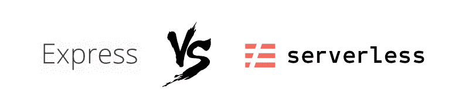
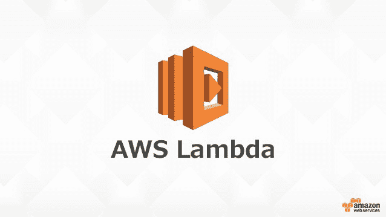

# AWS 上的 node . js API——Express 与无服务器的优缺点

> 原文：<https://www.freecodecamp.org/news/node-js-apis-on-aws-the-pros-and-cons-of-express-versus-serverless-a370ab7eadd7/>

威廉·伍德黑德

# AWS 上的 node . js API——Express 与无服务器的优缺点

最近我一直在玩[无服务器](https://serverless.com/) + AWS lambda，我不得不说，我已经被震撼了。

在过去的几年里，我几乎只使用 [Express](http://expressjs.com/) 和 [AWS EC2](https://aws.amazon.com/ec2/) (最近还有 [Docker](https://www.docker.com/) )来构建 JavaScript REST APIs。

这篇文章概述了 [Express](http://expressjs.com/) 和 [Serverless](https://serverless.com/) 的优缺点，并解释了为什么我们在 [Pilcro](https://www.pilcro.com/?utm_source=medium&utm_medium=serverless&utm_campaign=awareness) 的团队进行切换是有意义的。这篇文章的目标读者是希望在 AWS(或类似平台)上部署和管理 Node.js APIs 的技术团队。



Slightly aggressive collage of their logos. Apologies.

#### TL；速度三角形定位法(dead reckoning)

在过去的 6 个月里，从[快递](http://expressjs.com/)到[无服务器快递](https://serverless.com/)的转变彻底改变了我们的递送方式。

**优点:**降低成本|开箱即用的部署可扩展性和监控|闪电般的开发。

**缺点**:失去控制|神秘的[λ](https://aws.amazon.com/lambda/)运行时|年轻的生态系统|没有现成的零停机部署

#### 什么是 Express |什么是无服务器？

Express 是一个 [Node.js](https://nodejs.org) 包，它的核心是对原生 Node.js http(s)模块的精心设计的抽象。

另一方面，无服务器是一个与云平台交互的工具包，如 AWS 或 [GCP](https://cloud.google.com/) ，以部署和管理 API。

从这些描述中，我们可以看到 Express 和 Serverless 确实有很大的不同——可能差得无法比较。然而，我*比较它们的原因是 Express 和 Serverless 都可以用于编写 Node.js APIs。所以让我们来做一些比较:*

#### 索引文件

总的来说，比起写配置，我更喜欢写代码。这意味着您可以运行、测试和调试您的工作。

使用 Express，您的索引文件是 JavaScript 代码。这是一个非常有表现力的声明文件。有了无服务器，恐怕就是 yml 配置了。

下面是 Express*Hello World*index . js 文件:

```
const express = require('express');const handler = require('./handler');
```

```
const app = express();app.get('/hello-world', handler.helloWorld);app.listen(3000, () => console.log('Listening on port 3000'));
```

这里是无服务器的 *Hello World* index.yml 文件:

```
service: hello-worldprovider:    name: aws    runtime: nodejs6.10functions:  helloWorld:    handler: handler.helloWorld    events:      - http:        path: hello-world        method: get
```

非常相似，但是我个人喜欢基于 Express 中间件的方法。对我来说，它可读性更强，更容易测试和调试。

#### 学习曲线

这是一个棘手的话题，因为它取决于你想要达到的目标:

*   如果您是 Node.js 的爱好者，并且想学习如何在自己的计算机上设置本地主机服务器，那么 Express 是适合您的。这是一个很好的实验包，网站上的“入门”文档非常好，您可以很容易地开始体验 Node.js 基于事件的体系结构的复杂性。
*   如果您试图部署和管理健壮的、可伸缩的 Node.js APIs，那么使用无服务器的学习曲线肯定会更容易。这是因为无服务器解决了许多基于云的复杂问题。这些包括部署、监控和基础架构供应，仅举几例。

#### 运营—部署、扩展、记录、监控…


Cogs to represent Operations, obviously.

这就是无服务器真正发挥作用的地方。Express 本身并不能处理基于云的架构的所有复杂性。如果您使用 Express，您将需要其他软件包的帮助:

为了部署和扩展，你可以使用 [Docker](https://www.docker.com/) 、 [Kubernetes](https://kubernetes.io/) 、 [Elastic Beanstalk](https://aws.amazon.com/elasticbeanstalk/) 或其他一些 AWS 服务。

对于日志记录、监控和错误处理，您可能会使用 [New Relic](https://newrelic.com/) 、 [Datadog](https://www.datadoghq.com/) 、 [Pingdom](https://www.pingdom.com/) 等等。

你明白了。Express 是构建 API 的一个很好的底层工具，但是你需要学习很多其他的包来让你的 API 在现代基于云的世界中茁壮成长。如果您想配置自己的体系结构并拥有完全的控制权，这是非常好的。

有了无服务器，您可以获得更多现成的东西。不是来自于 Serverless 包本身，而是因为 Serverless 可以自动与你的云平台中的所有服务进行交互。例如，就像我们上面看到的 *Hello World* index.yml 示例一样，默认情况下您会得到:

*   从 AWS Lambda 进行监控
*   从 [AWS Cloudwatch](https://aws.amazon.com/cloudwatch/) 记录日志
*   从 AWS Lambda 自动缩放
*   从无服务器部署& [AWS 云形成](https://aws.amazon.com/cloudformation/)

这对于希望专注于编写应用程序代码而不是管理基础设施的快速发展的技术团队来说绝对是难以置信的。

*请注意:目前在无服务器的情况下，我们无法实现零停机部署。我认为用 AWS CodeDeploy 实现是可能的，但我们目前只允许 API 停机一秒左右。*

#### 费用

对于任何在云上构建健壮、高可用性 API 的人来说，成本是一个重要的考虑因素。无服务器解决方案使我们的成本大幅降低:

在 AWS 上运行一台 T2 中型 EC2 Linux 机器每月花费大约 33 美元。在切换到无服务器之前，我们使用了 3 台这样的机器。

有了 Serverless + AWS Lambda，你每个月免费获得**100 万个请求。**

**在 Pilcro，我们还没有达到这个基准，所以我们每个月已经节省了 100 多美元。有了无服务器和 Lambda，**我们现在可以免费运行我们的 APIs】。****

#### **AWS Lambda 运行时**

**

AWS Lambda logo** 

**使用无服务器的一个缺点是，您的 API 函数是在 AWS Lambda 运行时运行的。这意味着你永远都不确定到底发生了什么。**

**您还必须处理 AWS Lambda 函数的某些奇怪之处，比如注入到您的处理程序中的古怪的*事件*和*上下文*对象:**

```
`function awsLambdaHandler(event, context, callback) {  ...}`
```

```
`function expressHandler(req, res, next) {  ...}`
```

**我更喜欢 Express 的 *req，res，next* 中间件模式。在我看来更符合逻辑，更容易理解。**

**另一个奇怪的地方是，要让 AWS Lambda 运行您的处理程序，它们需要被加载到执行上下文中。这可能需要一些时间。函数会在执行上下文中缓存一段时间，所以对 Lambda 的第一个请求通常会比后续请求花费更多的时间。如果您的 API 不经常使用，这可能会令人恼火。**

***边注*:AWS node . js Lambda 运行时的一个伟大之处是他们安装了 [ImageMagick](https://www.imagemagick.org) 二进制文件。所以你可以在你的 Lambda 函数中进行图像操作！**

#### **结论**

**这实际上不是 Express 和无服务器的比较。这是一个承认——在追求健壮、可扩展的云 API 的过程中——像无服务器这样的包提供了太多现成的东西，以至于继续使用 Express(和其他工具一起)感觉像是一项艰巨的工作和学习。**

**在 [Pilcro](https://www.pilcro.com/?utm_source=medium&utm_medium=serverless&utm_campaign=awareness) ，我们的 API 非常简单和标准。它们由简单的 REST 请求和一些复杂的图像操作函数组成。**

**因为我们的 API 非常简单，所以使用无服务器和 Lambda 的决定很简单——我们的主要驱动因素是**成本**、**可伸缩性**和**开发速度。****

****成本**因为……成本。**

****可扩展性**因为我们构建在 G-Suite 之上，所以我们需要能够极其快速有效地扩展。**

****开发速度**因为我们需要用 6 个月的时间和一个小的技术团队一起开发 Pilcro。**

**无服务器为我们带来了这三大优势，这在过去的 6 个月中彻底改变了我们的交付方式。无服务器的生态系统还很年轻，所以在接下来的 12 个月里，这个领域可能会有很多发展。**

#### **帮助您决定是否使用无服务器的步骤**

1.  **你的 API 有多复杂？您需要使用 Express 获得的低级配置和亲密度吗？**
2.  **您目前如何管理部署、扩展和监控？你对你的解决方案满意吗？一个新雇佣的开发人员能多快学会你的架构的所有不同部分？**
3.  **换成无服务器可以省钱吗？**

***如果你喜欢这个故事，请问？并请与他人分享。也请检查我的公司 p[ilcro.com。](https://www.pilcro.com/?utm_source=medium&utm_medium=serverless&utm_campaign=awareness) Pilcro 是 G-Suite 的品牌软件，面向营销人员和品牌代理。***