# 下面是用 AWS 创建 Lambda 函数的三种常用方法

> 原文：<https://www.freecodecamp.org/news/aws-lambda-offering-developers-ultimate-flexibility-d8939ff4220/>

作者:萨姆·威廉姆斯

# 下面是用 AWS 创建 Lambda 函数的三种常用方法

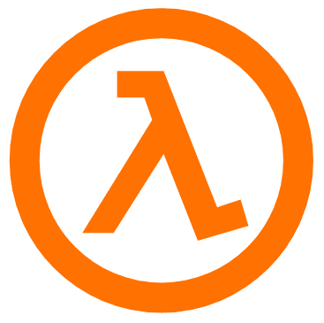

AWS Lambda 函数简直不可思议！它们是托管在亚马逊网络服务上的功能，可以通过许多不同的方式触发。

最好的一点是，你只需为 Lambda 函数运行的时间付费。有没有一个小时才运行一次，只需要 2 秒钟的东西？你一天只会被收费 48 秒！与运行 24/7 AWS EC2 实例或您自己的私有服务器相比，这简直是疯了。

今天我们将创建一个 Lambda 函数，看看处理代码的三种最佳方式。

### 创建 Lambda 函数

一旦你建立了你的 AWS 账户，有几种方法可以创建一个新的 Lambda 函数。我们将使用 AWS 控制台。

#### AWS 控制台

在 AWS 控制台中，您可以在服务下找到 AWS Lambda，这将带您进入 Lambda 控制台。

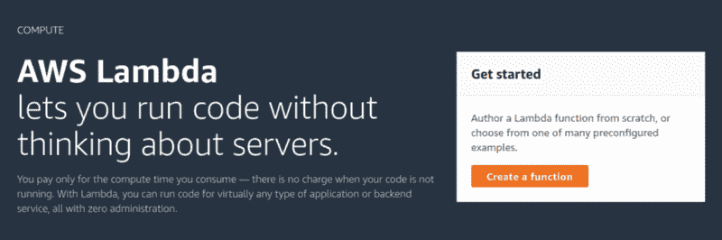

如果这是你第一次使用 Lambda，你会看到这个。点击**创建功能**按钮，开始设置您第一个功能。

您将到达设置页面，在这里您可以配置函数的某些方面(名称、运行时、角色)。您可以从蓝图或无服务器应用程序仓库创建 Lambda，但在本例中，我们将从头开始创作。

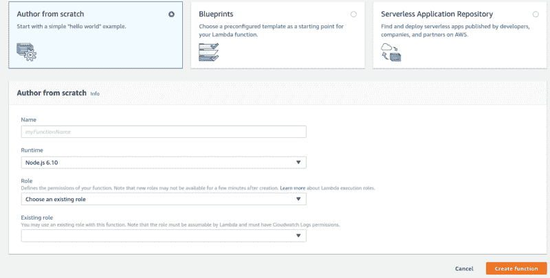

输入您的函数的名称(这对于您的用户或子帐户必须是唯一的)，选择您的运行时(我们将使用 Node.js 8.10)，并选择一个角色。

如果您还没有一个角色，您必须创建一个新角色。从模板创建一个，您可以将**策略模板**留空。

### 编写 Lambda 函数代码

Lambdas 的一大优势是你可以选择如何编写和编辑它们。有三种主要方法可以做到这一点

*   Lambda 控制台
*   云 9
*   在您的本地机器上

我将涵盖这三个方面，并讨论它们各自的优缺点。

### 方法 1: Lambda 控制台

这是您创建函数时进入的屏幕。你会发现有很多事情正在进行。我们现在关心的是**功能代码** 部分，大约在中间。

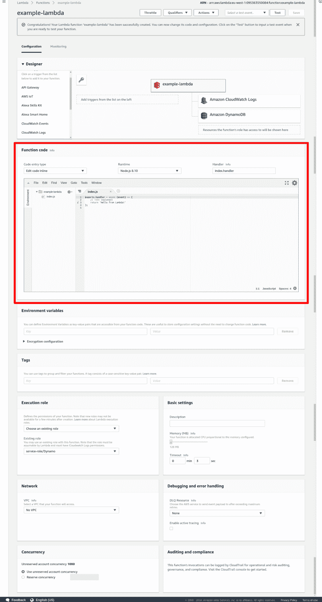

在这里我们有一个基本的编辑器。我相信它是基于 Cloud 9 IDE 的，对于简单的 Lambda 函数来说工作得相当好。你可以在下面看到这个处理程序是一个异步函数，因为我选择了使用 Node 8.10。如果你喜欢回调，那么 Node 6.10 就是你的运行时。

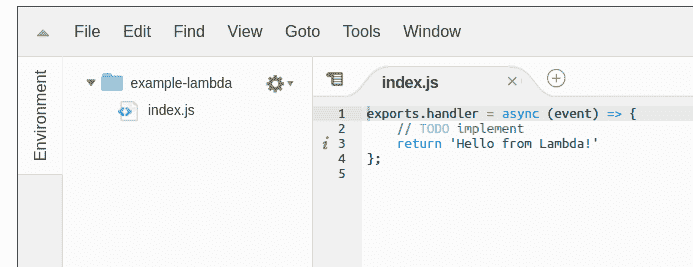

#### **优势**

*   这是一个体面的编辑。
*   您可以通过 AWS 控制台从任何计算机访问它。

#### **缺点**

*   好像不是 100%稳定。有时它不允许您保存，所以您必须将所有工作复制到一个本地文件，重新加载页面，然后将您的工作复制回来。我希望这个问题很快得到解决！
*   它没有终端。这意味着你不能单独使用这种方法使用 NPM 安装包。

### 方法二:Cloud9 编辑器

亚马逊最近收购了在线开发平台 Cloud9。它似乎运行一个非常基础的 Ubuntu 版本，该版本与 AWS 平台的其余部分集成在一起。

在 AWS 控制台搜索 **Cloud9** ，进入页面选择**创建环境** *。从这里开始，您为您的环境命名并进入下一步。*

在这里，您可以选择想要在什么样的环境上运行。很棒的一点是 t2.micro 是免费层，所以如果你在免费层，你可以免费使用这个方法。我从来不需要比 t2.micro 更强大的东西。

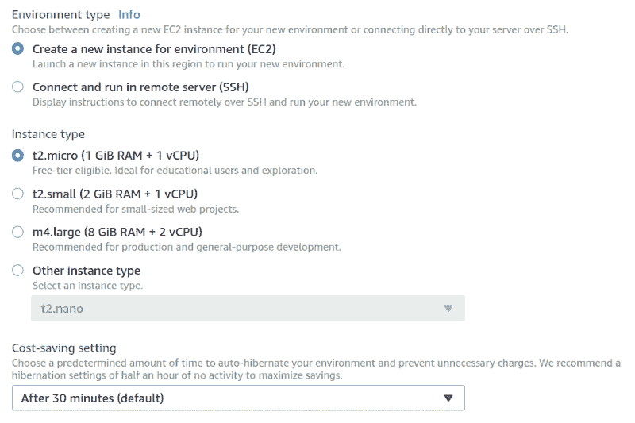

从这里继续，您将进入新的 Cloud9 环境！

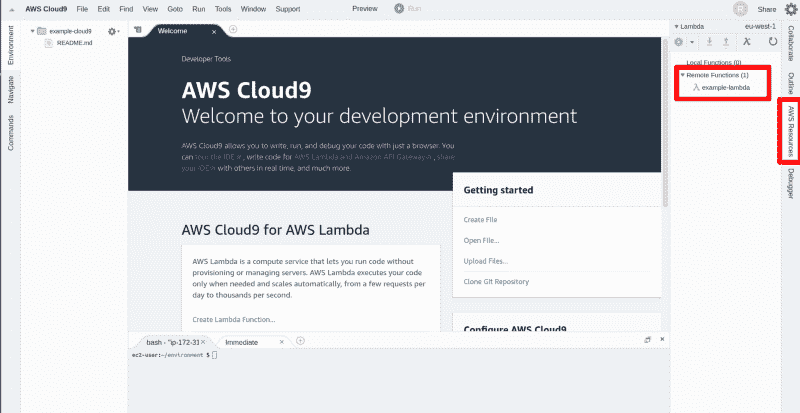

最酷的是，你可以从 Cloud9 环境内部访问所有的 Lambda 函数。点击 **AWS 资源** ，在**远程功能**下你会找到你所有的功能。单击您想要编辑的 Lambda 函数，然后点击上面的下载图标，将其导入到您的环境中。

一旦完成，就像你在本地工作一样。

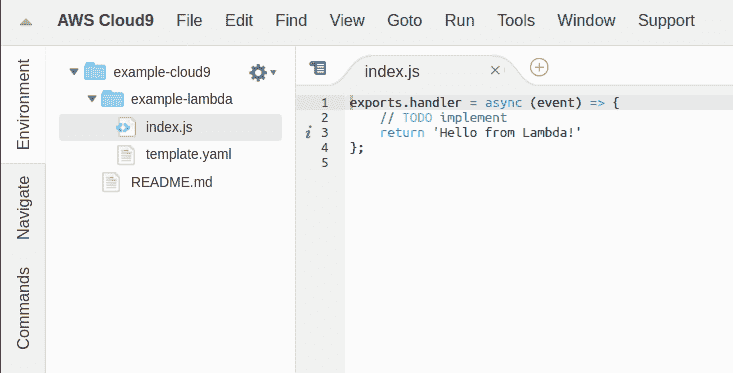

完成后，只需从本地列表中选择您一直在使用的功能，然后点击上传按钮。几秒钟之内，您的所有更改都将生效。

#### **优势**

*   同样，这都是远程的，所以如果你在多台机器上工作，你不需要担心忘记提交你的工作或者把它保存到记忆棒上。
*   获取您的功能并上传它们非常简单。这是这种方法迄今为止最好的一点。
*   现在，您有了一个集成的终端，允许您安装 npm 软件包，并使用该终端做任何您想做的事情。

#### **缺点**

*   它仍然有 Lambda 编辑器的稳定性问题。我曾多次尝试保存该功能，但都失败了，不得不复制到本地，刷新，再重新复制到 Cloud 9。几次之后，我放弃了，转到了本地剪辑。

### 方法 3:本地编辑

我要做的有点不同，我会列出优点和缺点，然后告诉你如何做得更好。

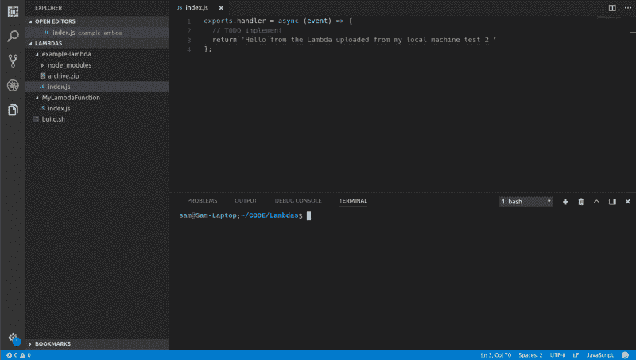

#### **优势**

*   本地编辑是大多数开发人员的工作方式。我们可以使用我们最喜欢的 IDE、扩展和配色方案。
*   它很稳定(只要你的电脑稳定)。

#### **缺点**

*   没有花哨的按钮来获取和上传您的工作到 AWS。
*   您的工作是本地的，因此拥有多个用户或只是在多个设备上工作会更加复杂。

#### 本地编辑技巧

因为这种方法的优点是如此吸引人(或者其他方法的缺点是如此骇人听闻)，我们将利用一些基本的变通方法。应该需要大约 15 分钟来设置我们需要的一切！

#### AWS CLI

要将我们的工作上传到 AWS，我们可以使用 AWS CLI。这允许我们上传一个 zip 文件到我们的 AWS 帐户，它填充了一个给定的 Lambda。

为此，我们首先需要设置 AWS CLI。你可以使用[这个教程](https://docs.aws.amazon.com/cli/latest/userguide/installing.html)或者在你的终端输入`npm install -g aws-cli`来安装它。现在，我们需要为我们的 CLI 设置一个用户以登录。

在 IAM 管理中，点击**添加用户** *，*给用户命名，选择**程序化访问** *。*这将允许我们远程充当用户。

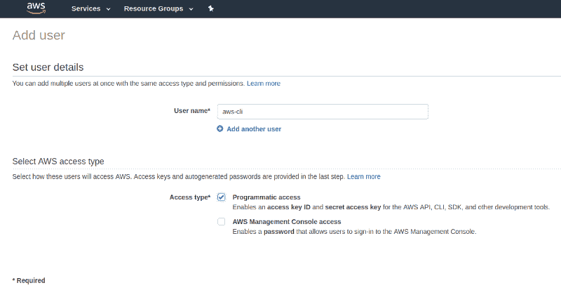

在权限界面中，选择**直接附加现有策略**，选择**管理员访问** *。*这将让你通过命令行界面做任何你想做的事情。如果您愿意，或者如果这是供其他人访问的，您可以对该用户设置更严格的策略。

在你看到你的访问键之前还有另一个屏幕。复制您的访问密钥并打开一个终端。运行命令`aws configure`,它会要求你做 4 件事。

```
AWS Access Key ID [None]: "Your Access Key ID"AWS Secret Access Key [None]: "Your Secret Access Key"Default region name [eu-west-1]:Default output format [json]:
```

前两个可以在用户创建的最后一页找到，接下来的两个可以保留为缺省值或者更改为您想要的值。

#### 使用 AWS CLI

现在我们已经设置了 CLI，我们可以使用它来使我们的生活变得更加轻松。如果你有一个存储了 Lambda 函数的文件夹，我们可以运行几个简单的命令将它上传到 AWS。

```
cd MyLambdaFunctionrm index.zipzip –X –r ./index.zip *aws lambda update-function-code     --function-name MyLambdaFunction     --zip-file fileb://index.zipcd ..
```

#### AWS CLI 构建脚本

这很好，但是每次你想上传一个新的 Lambda 版本的时候都输入这些内容会变得很烦人。所以我们将使用一个构建脚本。

为了让这个脚本正常工作，您需要一个这样的文件夹结构。每个 lambda 都有一个包含相关文件的文件夹和一个 region.txt 文件。

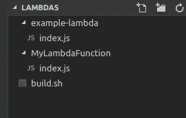

这个脚本不仅运行基本的 AWS CLI 命令，还执行额外的检查，运行`npm install`，并回显进度的详细信息。

这可能看起来像一个复杂的脚本，但它可以很容易地分解。前 32 行移到 Lambda 函数的文件夹中，运行`npm install`并检查是否安装了 AWS CLI。第 38 行压缩文件夹，除了某些文件，第 42 行上传压缩文件。

现在你所需要做的就是导航到 Lambdas 函数所在并运行的主文件夹

```
./build.sh example-lambda
```

这个脚本可以修改和扩展，以包括特定区域的上传，批量上传多个 Lambda 函数或 Git 集成。

#### 饭桶

大多数阅读这篇文章的人都会在日常生活中使用 Git。这是有原因的:它让生活变得更简单。

拥有一个包含所有 Lambda 函数的 Git 存储库是与开发团队合作或者自己在多台机器上工作的一个很好的方式。

### 摘要

编辑 Lambda 函数有三种常见方式:在 Lambda 控制台、Cloud 9 和本地。

这三种方法各有优缺点，但我个人认为最好的选择是在本地编写函数，并使用部署脚本进行部署。

如果你觉得这篇文章很有用，那就给它一些掌声，并关注我以获得更多的 AWS 教程和开发者文章！

接下来→ [向你自己的亚马逊 Lex 聊天机器人](https://tutorials.botsfloor.com/say-hello-to-your-own-amazon-lex-chat-bot-9f22e7a0f9b0)问好

