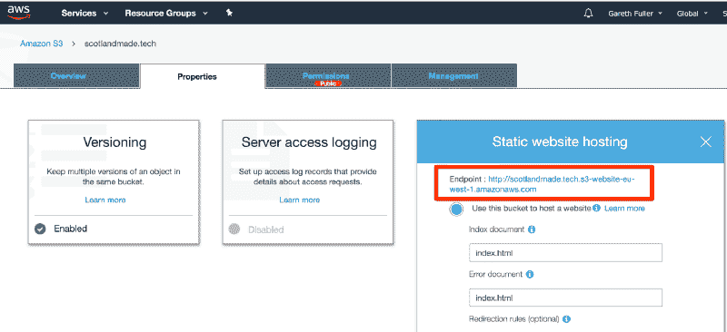

# 在 5 分钟内将 NUXT 应用部署到 S3

> 原文：<https://www.freecodecamp.org/news/deploy-a-nuxt-app-to-s3-in-5-minutes-515a161eb74f/>

作者加雷斯·富勒

# 在 5 分钟内将 NUXT 应用部署到 S3

一步一步的指南部署一个 NUXT 应用与 Vue.js 到一个 AWS S3 桶与自定义域和一切！？

首先，我假设你对 [Vue.js](https://vuejs.org/) 、 [NUXT](https://nuxtjs.org/) 和亚马逊 AWS S3 桶有些熟悉。

我们只有 5 分钟，所以让我们开始吧。

#### 1.安装 Vue CLI

在命令行上:

```
npm install -g @vue/cli
```

然后

```
npm install -g @vue/cli-init
```

#### 2.创建您的 NUXT 应用程序

在命令行上:

```
vue init nuxt-community/starter-template exampleapp-frontend
```

然后

```
cd exampleapp-frontend
```

#### 3.测试开发环境

在命令行上:

```
npm install
```

然后

```
npm run dev
```

如果您在浏览器中导航到 [localhost:3000](http://localhost:3000) ，您应该会看到默认的 NUXT 主页。

#### 4.生成您的 NUXT 应用

在命令行上:

```
npm run generate
```

这将生成一个包含您的生产 NUXT 应用程序构建的`/dist`文件夹。这是我们将部署到 S3 的文件夹。

#### 5.安装 AWS CLI

我们需要 AWS CLI，这样我们就可以从命令行快速创建和操作我们的 S3 存储桶。

```
pip install awscli --upgrade --user
```

#### 6.配置您的 AWS CLI

这一步是为了让您有权从命令行在您的 AWS 帐户中创建一个 S3 存储桶。

```
aws configure
```

然后它会要求一些凭证:

```
AWS Access Key ID: [ENTER YOUR ACCESS KEY]
AWS Secret Access Key: [ENTER YOUR SECRET ACCESS KEY]
Default region name: [ENTER YOUR PREFERRED REGION NAME]
Default output format: json
```

对于您的“默认区域名称”,请选择最适合您的名称。以下是 S3 服务的可用地区列表。

#### 7.创建您的 S3 桶

在命令行上:

```
aws s3api create-bucket --bucket yourdomain.com --region eu-west-1 --create-bucket-configuration LocationConstraint=eu-west-1
```

注意，我们已经用我们想要使用的域名命名了这个存储桶。将“yourdomain.com”替换为您希望应用位于的任何域。此外，将“欧盟-西方-1”替换为您自己的首选地区。

#### 8.启用 S3 桶静态网站托管

在命令行上:

```
aws s3 website s3://yourdomain.com/ --index-document index.html --error-document index.html
```

注意，这里我们还设置了 S3 静态托管桶的索引和错误文档。在这个例子中，我们将它们都设置为 NUXT 索引页(index.html ),但是将来您可能想要将`--error-document`更改为实际的错误页。

#### 9.启用 S3 时段版本控制

在命令行上:

```
aws s3api put-bucket-versioning --bucket yourdomain.com --versioning-configuration Status=Enabled
```

#### 10.创建一份 S3 保单以上传至 S3 时段

这允许通过公共 URL 访问您的 S3 桶。

在您的本地目录中，创建一个名为`policy.json`的 JSON 文件，并添加以下内容:

```
{
  "Statement": [
    {
      "Effect": "Allow",
      "Principal": "*",
      "Action": "s3:GetObject",
      "Resource": "arn:aws:s3:::yourdomain.com/*"
    }
  ]
}
```

然后从命令行将该策略添加到您的存储桶中:

```
aws s3api put-bucket-policy --bucket yourdomain.com --policy file://policy.json
```

#### 11.将您的 NUXT 应用程序部署到 S3

在命令行上:

```
aws s3 cp dist s3://yourdomain.com --recursive
```

这里我们实际上是将`/dist`文件夹的内容上传到我们刚刚创建的 S3 桶中。

#### 12.将您的自定义网址指向您的新应用

从您的 S3 桶的“属性”部分获取您的 S3 桶 URL:



将自定义域的根 CNAME 记录设置为指向该端点。如果您使用的是 Cloudflare for DNS，您应该按如下方式进行设置:


注意:您可能还需要删除当前与您的域关联的任何 DNS A 记录。

就是这样！

如果您浏览到您指定的域(在我们的例子中是 yourdomain.com)，您应该能够看到 NUXT 应用程序的默认页面。

不信 5 分钟就能搞定？我跟随我自己的文章，在屏幕上录制，并且在**整整 5 分钟**内完成！

实际上完全是侥幸。

这是视频:

[https://www.youtube.com/embed/peumMBGExFc?feature=oembed](https://www.youtube.com/embed/peumMBGExFc?feature=oembed)