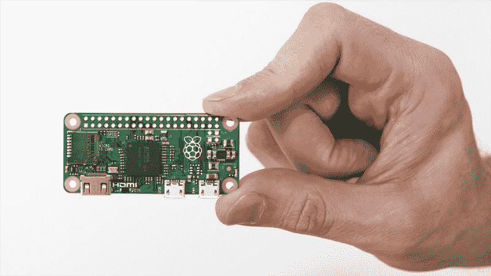
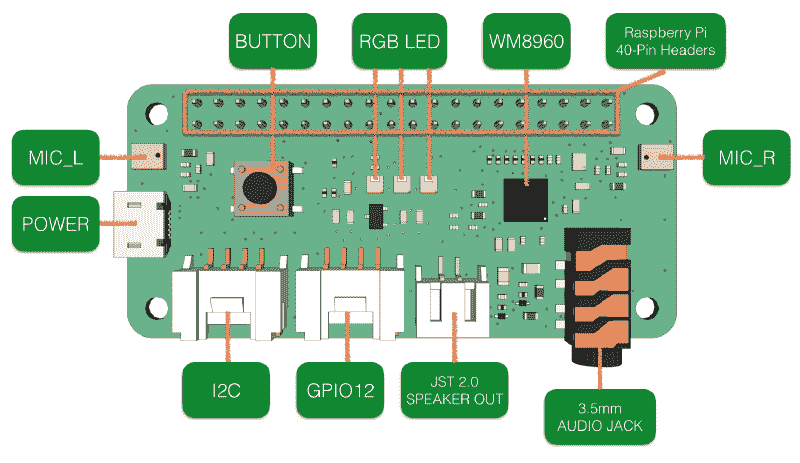
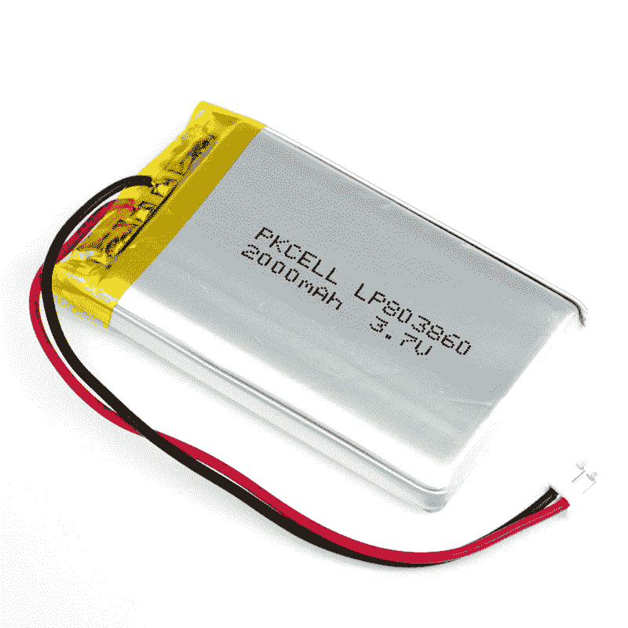
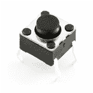
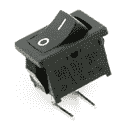
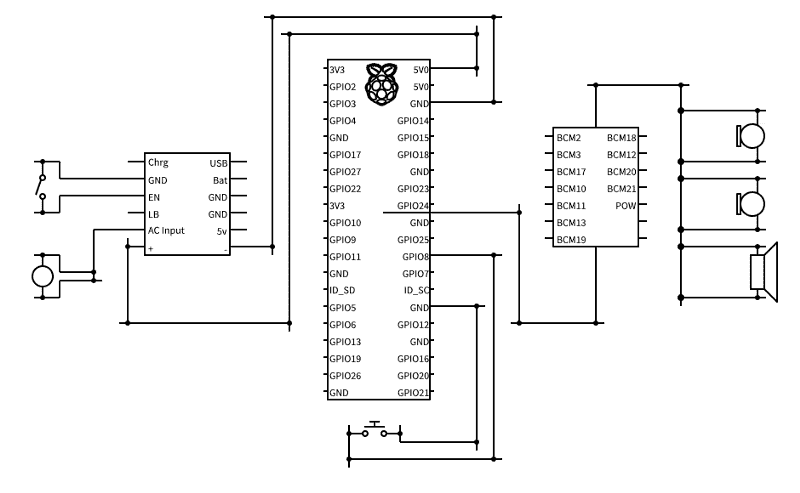
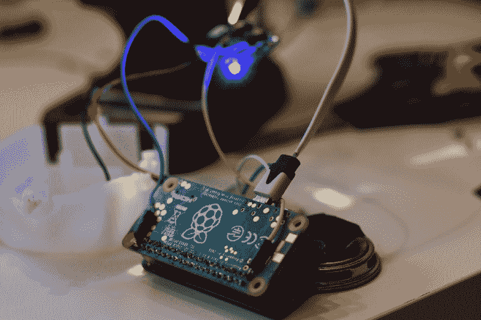

# 奥托背后的硬件:一只长毛绒猴子，它成了我的声乐助手

> 原文：<https://www.freecodecamp.org/news/the-hardware-behind-otto-a-monkey-plush-which-became-my-vocal-assistant-96a25c634021/>

弗拉维奥·德·斯特凡诺

# 奥托背后的硬件:一只长毛绒猴子，它成了我的声乐助手

奥托是一只猴子毛绒玩具，我们在 2017 年 2 月和女朋友旅行时在一家高速公路商店找到的。

它的能力，虽然非常可爱，却是听你说话，然后走路，用更高的音调重复所有的事情。

我的目标是把它变成一个声音助手，让它更强大。

SkeletOtto and Otto

这是关于奥托系列的第一部分。

最初，它由以下硬件组成:

*   一个连接到他腿上的马达，让他能够行走
*   一个简单的、封闭的(用于修改)内置板
*   麦克风和扬声器
*   开始收听阶段的按钮
*   四节 AA 电池
*   完全切断电路电源的开关

我想用新的和可编程的硬件来替换所有这些东西。

这里真正的挑战是找到适合原始外壳的权利组件。可用的空间不多，所以每一个选择都必须认真对待。

#### 基线板

这个项目的首选硬件是 Raspberry PI 板。

它们小巧而强大，足以让开发人员使用高级编程语言和内置库，而无需每次都刷新软件。

此外，您可以在更舒适的环境中调试您的应用程序。

当时最好的硬件是 2017 年 2 月底推出的 Raspberry Pi Zero W，Pi Zero W 拥有最初 Pi Zero 的所有功能，但增加了连接性。

Raspberry Pi Zero W

对于这样的项目，主板是不够的，所以我增加了额外的硬件。

#### 音频组件

要构建语音助手，我们需要音频组件。当然，对这些组件的要求是扬声器和麦克风。

对于麦克风，我尝试了 USB 麦克风。这个配件的问题是，它不像我希望的那样明智。此外，还需要一个 USB 集线器来连接它。

此外，我无法轻松连接原声扬声器。

出于这个原因，我选择购买一个额外的板，很好地完成了这项任务: [**ReSpeaker 2-Mics Pi HAT。**](https://www.seeedstudio.com/ReSpeaker-2-Mics-Pi-HAT-p-2874.html)

ReSpeaker 2-Mics Pi HAT 是一款用于 Raspberry Pi 的双麦克风扩展板，专为人工智能和语音应用而设计。

该板基于低功耗立体声编解码器 WM8960 开发。板的两侧有 2 个麦克风，用于采集声音。它还提供了 3 个 APA102 RGB LEDs，1 个用户按钮和 2 个板载 Grove 接口。

我不打算将 led 连接到我的板上，但事实上，这款帽子内置了 led，让我想到了使用它们。

ReSpeaker 2-Mics Pi HAT — Hardware specifications

然后我拿了一个旧的蓝牙迷你音箱，拆开，连接到 JST 2.0 音箱 Out 口。

为了让它工作，你必须在你的主板上安装他们的驱动程序。驱动程序还用于通过标准协议控制应用中的 led。

ReSpeaker 2-Mics Pi HAT

提示:当你安装屏蔽时，你所有的 GPIO 管脚都被盖住了。了解您的主板真正使用了哪些引脚**是很有用的。为此，使用[https://pinout.xyz/](https://pinout.xyz/)**

**例如，对于这个板，检查这个链接:[https://pinout.xyz/pinout/respeaker_2_mics_phat](https://pinout.xyz/pinout/respeaker_2_mics_phat)**

#### **为电路板供电**

**Raspberry Pi 板可以通过 USB 5V 输入轻松供电。这种方法的问题是，你必须购买一个电池组，并通过 USB 连接它。**

**我没有找到任何足够小的电池组来适应我的毛绒，然后我唯一的选择是使用脂电池。**

**

LiPo Battery — 3.7V 2000mAh** 

**你不能把你的 LiPo 电池连接到你的板上，你必须使用转换器。它可以由任何 3.7V 锂离子/锂电池供电，然后将电池输出转换为 5.2V DC。**

**最初我买了一个 [**LiPo SHIM**](https://shop.pimoroni.com/products/lipo-shim) ，但是我没有注意到这个控制器在不给电池充电的情况下给你的主板供电。**

**为此我改用了 [**Adafruit PowerBoost 500 充电器。**](https://shop.pimoroni.com/products/powerboost-500-charger-rechargeable-5v-lipo-usb-boost-500ma) 它有内置的电池充电电路。即使在给电池充电时，您也能保持项目运行！**

**

Adafruit PowerBoost 500 Charger** 

#### **附加硬件**

**该软件使用“热门词汇”概念来启动交互。基本上，它不断地听一个热门词，像“嘿奥托”，然后你只是说话，说命令。**

**为了有一个替代的方法来开始交互，我安装了一个**按钮**直接连接到 GPIO 板上的 GPIO8 引脚。**

**

Push button** 

**现在只缺少一样东西:电源开关。**

**我通过它的启用端口将这个简单的组件连接到 PowerBoost 充电器。启用端口的目的是完全断开输出。**

**

Power on-off switch** 

#### **将一切联系在一起**

**在这里你可以看到完整的详细电路图([https://www.circuit-diagram.org/circuits/0d85ce05](https://www.circuit-diagram.org/circuits/0d85ce05))**

**

Otto Circuit diagram** 

**这是作品的快照:**

**

The hardware behind Otto**