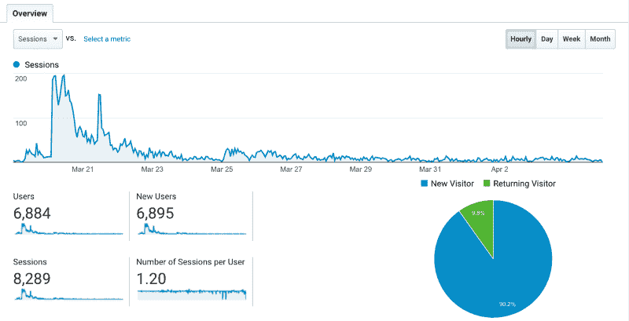
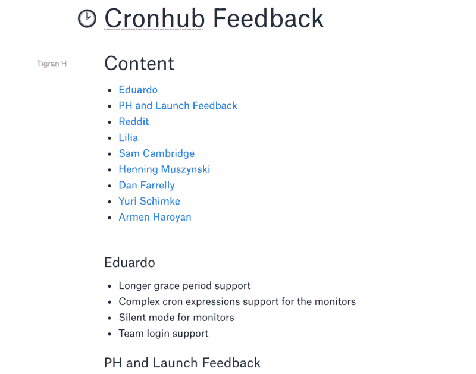
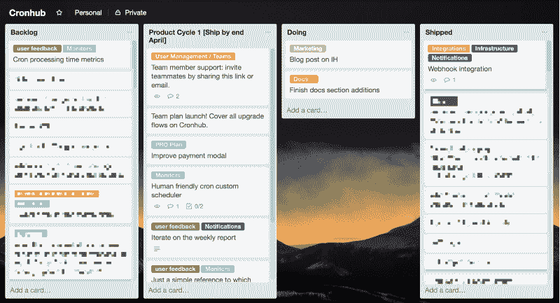
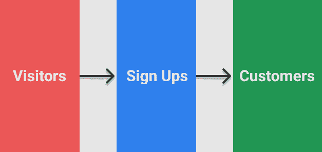
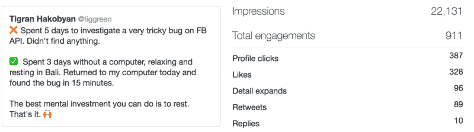

# 启动你的副业项目后的头 100 天做什么

> 原文：<https://www.freecodecamp.org/news/things-to-do-in-the-first-100-days-after-launching-your-side-project-f572f8efa739/>

作者:蒂格兰·哈科比安

# 启动你的副业项目后的头 100 天做什么

自从我启动我的第一个 SaaS 项目以来，已经过去了将近三个星期。我写了一个[非常个人化的故事](https://www.indiehackers.com/@tigran/how-i-shipped-my-first-saas-side-project-while-working-full-time-42862e847b)，讲述我如何在全职工作的时候发布 Cronhub。

今天，我写另一个个人故事，关于我如何计划在未来 100 天内发展我的 SaaS 副业以获得更多的客户。

这篇文章的目的是分享和透明我的思考过程。如果你和我一样，真的想建立一个有利可图的副业，那么我也希望通过这篇文章激励你在评论中谈论和分享更多关于你的产品。这是我们互相帮助实现目标的唯一方法。

I’ve been in Bali for the last couple of weeks and am loving it here! :)

### 介绍

我叫 Tigran，是 [Buffer](https://www.indiehackers.com/@tigran/www.buffer.com) 的软件工程师。编程不仅是我的谋生之道，也是我最喜欢的爱好之一。我喜欢做兼职项目。

在过去一年左右的时间里，我已经开始认真思考几年后我想去哪里。我已经决定要建立一个有利可图的副业作为收入来源。这项业务还将帮助我学习宝贵的多学科生活技能，否则我是学不到的。

为了将我的想法变成现实，几周前，我启动了我的第一个 SaaS 项目。

我注意到有很多文章是关于一个产品的发布以及制造商如何接近发布日的。这很好，但我觉得没有太多关于发布后会发生什么的故事。

这可能是因为创始人很难与世界分享发布日之后的小小失望。这很自然，我不怪任何人。看到会话或用户数下降并不愉快，也很难与他人分享。

在这篇文章中，我想分享我计划如何发展我的新 SaaS 项目，并在项目启动后获得更多客户。主要是想和大家分享我的策略和思考过程，目的是学习和获得反馈。

### 我现在在哪里

我想先分享一下我现在的处境会给你一些背景。让我们做一个快速的总结。

[我在 2018 年 3 月 20 日推出 Cronhub](https://www.producthunt.com/posts/cronhub) ，到现在已经几周了。Cronhub 以 800 多张赞成票成为当天产品搜索的第二名。看到人们投票或评论你的项目是一种很棒的感觉。人们的反馈大多令人鼓舞。

上线后的第二天，我就有了第一个也是唯一一个付费用户。看到来自 Stripe 的邮件通知我，我有了一个新的付费客户，这是最好的感觉。我不会用任何东西来改变这种感觉。

在过去的几周里，我看到在发布日之后，会议的数量显著下降。老实说，这对我来说并不是一个很大的惊喜，因为我确切地知道从[之前的副项目发布](https://www.producthunt.com/posts/booknshelf)中可以期待什么。

这是过去两周 Cronhub 会话的截图。下面的分布是按小时计算的。到目前为止，我总共进行了 8289 次治疗。

GA Cronhub numbers for the last 2 weeks

发布两周后，我在 Cronhub 上有了 1 个付费用户，大约 450 个注册用户，125 个活跃的 cronjob 监视器。如果监视器至少有一次 ping，我就认为它是活动的。我每月的经常性收入(MRR)是 7 美元，我目前每月花费大约 40 美元来支付所有的 Cronhub 费用。我预计费用数字在未来会有所增长。

现在我们知道了我的立场，我将继续分享 Cronhub 的下一步，以及我如何计划在未来 100 天内获得更多的付费用户。

### 我的目标是什么？

我的目标是找到适合市场的产品。这对我意味着什么？这意味着在“开发者”计划中获得至少 10 个付费客户，在“团队”计划中获得一个客户(我将在下个月推出团队计划)。

这些数字是随机的，但也很重要。我如此关注这些数字的原因是，我认为没有什么比付费用户更能体现产品的价值。如果我有 10 - 15 个付费客户，我可以告诉自己，我已经找到或者非常接近找到适合市场的产品。

有了我的目标和这些数字，我想衡量我围绕 Cronhub 所做决策的成功程度。我的产品决策领域非常广泛，不仅仅局限于我下一步应该构建什么功能。我也问自己应该如何营销 Cronhub，或者我的理想客户是谁。

如果你问我我的目标应该是谁，我不知道确切的答案。目前，我的目标是个人工程师和工程团队。那可能是对的，但是我必须确定。我想最终找到 Cronhub 所属的小众市场。

如果你像我一样是个工程师，你会知道建造很可能是最容易的部分，接下来是最难的。不过，我很想挑战自己。

既然我已经设定了目标，我想谈谈实现目标的步骤。当然，和其他目标一样，我也有可能无法实现。然而，真正驱动我的是到达那里的过程。

在接下来的 100 天里，我将从我所做的所有好的和坏的决定中吸取重要的教训，我答应自己将它们写在我的[决策日志](https://www.google.co.id/search?q=decision+journal&oq=decision+journal&aqs=chrome..69i57j0l5.4370j1j1&sourceid=chrome&ie=UTF-8)中。决策日志帮助我反思我的决策，这样我就能在未来成为更好的决策者。

### 我的策略

#### 产品周期

我是一个产品工程师，这一步可能是我最能胜任的一步。与我必须做的其他事情相比，花时间构建新功能甚至修复 bug 是一件有趣的事情。

然而，我知道如果你建造了它，人们就会来，这是一个神话。我不相信那个。

大多数工程师倾向于根据他们出货的数量来衡量他们的生产力。恐怕在这里我不是一个例外，然而，我试图改变我对我的生产力的看法。不一定非要物质化。有时候，你花在思考某个特定产品特性上的时间是最好的时间。

在开始编码和构建新特性之前，我试图花足够的时间来回答以下问题。

*   这个功能真的需要吗？
*   如果答案是肯定的，那么我会问另一个问题:这是我现在应该做的最重要的事情吗？

通常，这两个问题足以决定一个新功能是否会成功。优先级和时间管理可能是单人开发者最重要的技能。作为一个单独的创始人或创客，我们没有太多的资源可以依赖，所以我们自己做所有的事情。这就是时间和优先级发挥作用的地方。

Cronhub 的大部分产品创意来自用户反馈以及我自己的直觉。是这两者的混合。对于用户反馈，我有一个专门的 [Dropbox Paper](http://paper.dropbox.com/) ，在那里我收集了我从不同的人和用户那里收到的所有 Cronhub 反馈。到目前为止，我是这样组织的。

I collect all user feedback in a dropbox paper

我必须不断和我的用户交流，听取他们的反馈。在我有很多顾客之前，我也会继续相信我的直觉。一旦我有足够多的客户，我可能会开始为 Cronhub 创建一个全面的数据跟踪机制，以更好地了解我的客户如何使用我的产品。只有几个数据点，我认为现在还不值得关注数据驱动的决策。

我把我的大部分想法都放在 Trello Backlog 专栏里，然后把它们优先放入产品周期。在 Buffer，我们使用 6 周的产品周期，我发现它们非常有价值。作为一个团队，我们在 6 周内完成了很多事情。

我也决定用 Cronhub 做一些类似的事情。不同的是，我的周期是一个月长，在两个周期之间我有一周的时间来优先考虑下一个周期最重要的任务。

如果一个单一的特性请求出现了很多次，它会得到我更多的关注。例如，“ [Webhook Integration](https://www.indiehackers.com/@tigran/cronhub.io/features) ”就是其中之一，我刚刚发布了它。每个功能都被分解成非常小的任务。如果我需要在一个任务上花一天以上的时间，那么这个任务就不够小。让我的任务变得更小是看到持续进步的关键。

在接下来的 100 天里，我计划完成三个产品周期。我希望三个月后，Cronhub 的改进将会非常明显。在接下来的三个周期中，我有什么想法？

*   我要启动[新的“团队”计划](https://cronhub.io/pricing)。这将是每月 49 美元，它将包括多达 100 个显示器的无限团队成员。当我有这个计划时，我也可以开始瞄准团队。这个计划很可能会有一个“免费试用”我知道我的理想客户是团队而不是个人开发者。此外，我认为向企业销售产品要比向个人消费者销售容易得多。
*   我想改进我发送给所有 Cronhub 用户的每周报告。周报表超级重要，我想让它对我的用户更有价值。
*   产品改进和更好的文档。作为一名开发人员，我非常理解一个有良好文档记录的产品的重要性。我设想 Cronhub docs 也包括教育材料。

考虑到我还有一份自己热爱的全职工作，我想接下来的几个月这些都会让我很忙！

#### 内容营销

我知道我必须推销 Cronhub，没有问题。然而，我不确定我应该如何营销它，以及 Cronhub 的最佳营销策略是什么。我读过 Gabriel Weinberg 的“[你可以用 19 个渠道来获得牵引力](https://medium.com/@yegg/the-19-channels-you-can-use-to-get-traction-93c762d19339)”的文章(顺便说一句，这很棒)，它帮助我找到了一个临时的答案。

我想专注于我个人喜欢的营销渠道，而我的竞争对手却不屑一顾。

我认为这就是内容营销。我的竞争对手都没有专注于内容营销，我个人喜欢写文章和教育材料。毕竟我出身于教师家庭。

但首先，我必须定义内容营销对 Cronhub 意味着什么。我的用户大部分是开发者，所以我大致知道我的目标受众是开发者和开发者团队。我应该写能获得更多开发者访客的内容。我创建了下面的流程来更好地形象化我的营销策略。

根据我的谷歌分析数据，15%的访问者注册了 Cronhub。我不知道行业平均水平是多少，但我觉得 15%已经不错了。Cronhub 是一个非常小众的产品，所以我不期望有很高的注册量。

如果我的访问者/注册率不低，那么我的主要挑战是将已经注册的用户转化为付费客户，对吗？为此，我必须做产品方面的工作。我知道认知和获取都是营销努力，但激活是产品的全部。

我的营销目标是带来更有可能转化为付费客户的访问者。由于我不知道这些潜在客户到底是谁，我想带来更多的访问者，这样我就可以按访问者类型将转换放入桶中。这样我就可以区分转化的访问者类型，这可能是我的目标受众。

当我对我的目标受众有了更好的了解，我就能研究出他们真正感兴趣的是什么。我会就他们感兴趣的话题写博客、帖子和教育文章。

但是现在，我将把重点放在广阔的开发者市场上，为这些受众编写内容。这篇文章是这个策略的一部分。

由于我是一名开发人员，所以我不难猜测什么类型的内容会吸引其他开发人员。为你所在的市场开发一个产品真的是无价之宝。我创建 Cronhub 是为了满足自己的需求，因为我相信肯定会有其他开发者面临同样的问题。我希望我是对的。

我认为内容营销更适合 Cronhub 的另一个原因是，我坚信现在投资编写高质量的内容从长远来看是有回报的，尤其是对 SEO 而言。我可能会写一篇关于 SEO 的不同的文章，但简单地说，我计划通过在 Cronhub 上托管我自己的博客并不断为开发人员提供高质量的内容来提高 SEO 水平。

除了内容营销之外，我还想分享我在 Twitter 上做的一个快速技巧，让更多的访问者访问 Cronhub。我的大多数 Twitter 粉丝都是技术人员，所以利用我现有的观众也很合适。

我喜欢 Twitter，我偶尔会用它在 Cronhub 上发布更新。我过去的一些推文最近引起了很多关注。这些推文通常会获得个人资料点击量。因为我知道这一点，我最近故意在我的 Twitter 个人资料中添加了一个直接的 cronhub.io 链接，这样查看我个人资料的人更有可能点击那个链接。

信不信由你，它真的有用。当我在推特上参与度高的时候，就会有更多的人访问 Cronhub。这已经成为我社交媒体营销的一个重要部分，而且我真的很喜欢和我的粉丝联系。

一个例子是我最近的一条推文，它赢得了很高的浏览量(以及很多个人资料点击量)。检查完 GA 后，我看到那天有更多的访客。

[https://twitter.com/tiggreen/status/981004806457245697](https://twitter.com/tiggreen/status/981004806457245697)

综上所述，营销对我来说很难，还好。我知道这很难，因为这对我来说是新的，我还没有必要的技能。然而，我真的很有兴趣了解不同的营销策略，并了解哪些其他营销渠道可能对 Cronhub 有效。

内容营销是非常耗时的，尤其是对一个人来说，所以我必须考虑不同的渠道。然而，正如我所说，内容营销对我来说是非常自然的，因为我真的很喜欢写作！

### 结论

既然我已经和你分享了我的目标和策略，我的下一步就是完成它们。这不能让我筋疲力尽。由于我有全职工作，所以我打算每天在 Cronhub 上工作 1 - 2 个小时。休息对我来说非常重要，所以周末熬夜或长时间工作是不可取的。

我将在产品和内容营销之间分配时间。我对我的旅程感到非常兴奋，迫不及待地想在未来分享更多。期待我更多这样的文章。

非常感谢您的阅读。我希望你喜欢读我的故事，并从中至少学到一件事。即使你没有，也许它会激励你建立和营销你的副业。

如果你正在开发一个产品，并且这个故事引起了你的共鸣，我很想听听你的意见。在产品发布后的前 100 天里，你都做了些什么？请随意评论你的问题。你可以在 Twitter 上联系我，或者发电子邮件给我，地址是 tigran[at][cron hub . io](http://cronhub.io/)。

如果你是使用 cronjobs 的开发人员或开发团队的一员，你可以免费试用 [Cronhub](http://www.cronhub.io/) 。如果您升级到“开发者”计划，使用优惠券代码“freecodecamp”获得 20%的折扣。

*最初发表于[www.indiehackers.com](https://www.indiehackers.com/@tigran/the-next-100-days-after-my-saas-side-project-launch-or-how-i-plan-to-acquire-my-first-customers-5d84d18eab)。*