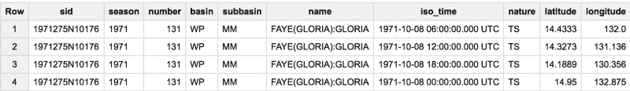
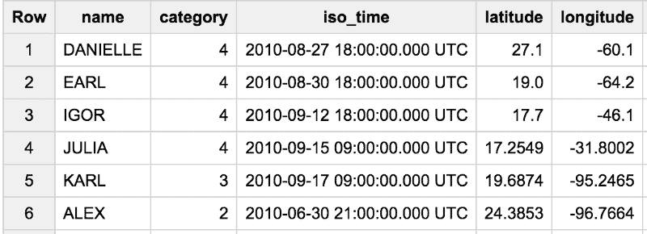
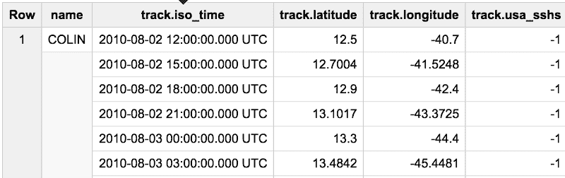
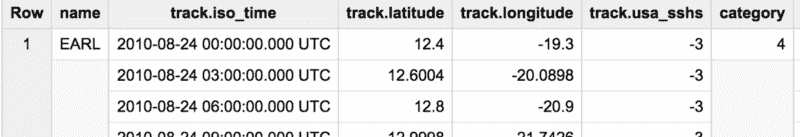

# 探索强大的 SQL 模式:ARRAY_AGG、STRUCT 和 UNNEST

> 原文：<https://www.freecodecamp.org/news/exploring-a-powerful-sql-pattern-array-agg-struct-and-unnest-b7dcc6263e36/>

作者:拉克·拉克什马南

# 探索强大的 SQL 模式:ARRAY_AGG、STRUCT 和 UNNEST

使用嵌套字段而不是展平所有数据是非常经济有效的(在存储和查询时间方面)。嵌套的、重复的字段非常强大，但是查询它们所需的 SQL 看起来有点陌生。所以，花一点时间在 STRUCT、UNNEST 和 ARRAY_AGG 上是值得的。将这三者结合使用还会使某些类型的查询更容易编写。


One powerful SQL pattern is to make an array of structs and then unnest

#### 工作

让我们来看一个热带气旋的[大查询表](https://bigquery.cloud.google.com/table/bigquery-public-data:noaa_hurricanes.hurricanes?tab=details)。这是表格的预览:



Input table

任务是找到 2010 年季节的每个北美飓风(`basin=NA`)达到的最大值`usa_sshs`(更好地称为“类别”)以及首次达到该类别的时间。我希望能够说一些类似于“丹尼尔飓风在 2010 年 8 月 27 日 18:00 UTC 达到 4 级，当时它在(27.1，-60.1)”。



Hurricane Danielle reached Category 4 at 18:00 UTC on 2010–08–27 when it was at (27.1, -60.1)

下面是[解查询](https://bigquery.cloud.google.com/savedquery/706124400321:cefd97430e124f0f8e79121775f9cd08)。在本文中，我将一点一点地构建它。

#### 飓风在哪里？

我的第一步是创建飓风位置的历史。本质上，我想说的是:



History of each hurricane

我们可以按盆地和季节过滤:

```
#standardsqlWITH hurricanes AS (SELECT  NAME, iso_time, latitude, longitude, usa_sshsFROM  `bigquery-public-data.noaa_hurricanes.hurricanes`WHERE  season = '2010' AND basin = 'NA')SELECT * from hurricanes LIMIT 5
```

但是这给了我们一堆满足必要条件的行。我们需要的是得到每个飓风位置的有序列表。仅仅在上面的查询中添加一个`GROUP BY`是不行的。(为什么不呢？试试吧！)

然而，这个查询是有效的:

```
#standardsqlWITH hurricanes AS (SELECT  MIN(NAME) AS name,  ARRAY_AGG(STRUCT(iso_time, latitude, longitude, usa_sshs) ORDER BY iso_time ASC) AS trackFROM  `bigquery-public-data.noaa_hurricanes.hurricanes`WHERE  season = '2010' AND basin = 'NA'GROUP BY  sid)
```

```
SELECT * from hurricanes LIMIT 5
```

让我们梳理一下这个查询:

1.  我们按 storm id 分组，但是当我们分组时，我们得到一堆行。我们通常会做的是对组中的行进行聚合，如`SUM()`或`AVG()`，以使结果集中的每一行只有一个值。
2.  要保留组中的所有行，使用`ARRAY_AGG()`。在这个数组中，我们不需要一个字段，我们需要四个。因此，我将这四个字段(时间、纬度、经度、飓风强度)作为一个结构。该结构允许我保留这四列之间的逐个元素的关系。
3.  按时间对数组排序。

#### 最大类别

现在我们有了每个飓风的历史，让我们找出飓风达到的最大类别。我们想要的是:



Maximum category reached by the hurricane

下面是附加的`WITH`:

```
WITH hurricanes AS (  ...),
```

```
cat_hurricane AS (SELECT name,track, (SELECT MAX(usa_sshs) FROM UNNEST(track))  AS categoryfrom hurricanesORDER BY category DESC)
```

```
SELECT * from cat_hurricane
```

从飓风表中选择名称是显而易见的。只是一个专栏而已。但是选择`track`做什么呢？因为`track`是一个数组，所以你得到的是整个数组。

为了从跟踪数组中获得一行，我们需要通过`UNNEST()`。当您调用`UNNEST(track)`时，它会生成一个表，因此`UNNEST()`只能在 BigQuery 的`FROM`子句中使用。一旦您理解了`UNNEST(track)`制作了一个有四列的表格(在`STRUCT`中的四列)，您就会看到`MAX(usa_sshs)`只是计算每个飓风达到的最大强度。

#### 达到最大类别的时间

我们如何找到达到最大类别的时间？实际上，在`UNNEST(track)`表中找到所有行，其中`usa_sshs`列是最大类别，并将其限制为 1，以获得符合类别的第一行:

```
SELECT   name,   category,   (SELECT AS STRUCT iso_time, latitude, longitude   FROM UNNEST(track)    WHERE usa_sshs = category ORDER BY iso_time LIMIT 1).*FROM cat_hurricaneORDER BY category DESC, name ASC
```

下面是[全查询](https://bigquery.cloud.google.com/savedquery/706124400321:cefd97430e124f0f8e79121775f9cd08)。请尝试一些变体，以了解正在发生的情况:

1.  为什么我会有`.*`？试验一下这个查询，看看如果我不包括`.*`会发生什么？(提示:与列名有关)。
2.  如果我不做上面的`AS STRUCT`会怎么样？
3.  如果我不做`LIMIT 1`会怎么样？