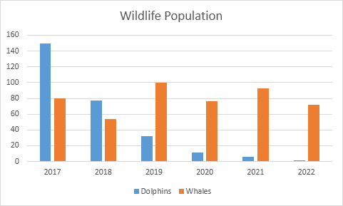
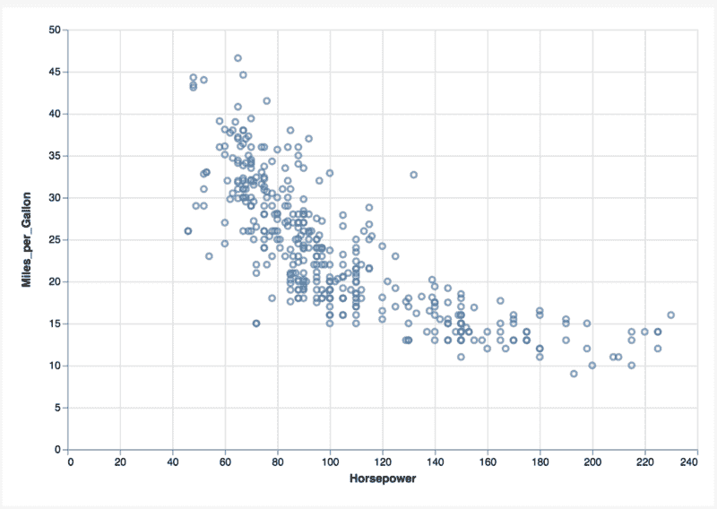

# 构建动态可视化的新方法

> 原文：<https://www.freecodecamp.org/news/a-new-way-of-building-dynamic-visualisations-5c732091a3c1/>

作者 Sushrut Shivaswamy

# 构建动态可视化的新方法


脸书采用 Flux 架构后，它开始流行起来。这是一种管理 React 组件状态的方式，因此数据在应用程序中的流动是单向的。

这种方法的优点是，应用程序由几个有状态的组件组成，这些组件将状态传递给嵌套的子组件。React 的一个真正补充这种状态管理方法的特性是，React 允许我们将 UI 编写为状态的函数。这意味着，随着状态沿着应用程序的组件层次结构向下渗透，组件会自动更改视图以反映状态的变化。

React 使用的模板系统 JSX 允许创建可重用的单个文件组件。

它还非常适合在 DOM 的结构和与之相关的行为之间建立界限。

*   JSX 清晰地展示了 DOM 结构，比创建相同的 DOM 结构所需的几行 JavaScript 代码更加直观。
*   与 DOM 结构相关的行为——像 onClick、onHover 这样的事件处理程序——作为组件的成员函数来处理。
*   对 DOM 结构的任何改变都需要用户调用 **setState 来改变组件的状态，而不是直接改变 DOM** 。这使得调试应用程序变得更加容易，同时也确保了应用程序总是处于一个定义好的状态。

然而，随着应用程序的复杂性增加，Flux 方法也开始显示出它的局限性。

很少有有状态组件将状态传递给子组件，这对小应用程序来说似乎没什么问题。但是，随着组件层次结构复杂性的增加，有状态组件必须相互共享状态。

虽然可以通过公共变量，或者更好的是 Observer 模式，在 JavaScript 的不同组件/类之间共享状态，但是随着组件数量的增加，维护应用程序变得更加困难。

对状态变化做出反应的组件的简单性与面向对象设计的复杂性混淆了。

### 图表——为什么很难制作？

网络应用受益的进步并没有改变图表库的制作方式。图表也是一种表示组件，从技术上来说可以称为 UI。图表也由控制其视觉外观的 DOM 元素组成。

然而，图表在一个关键方面有所不同:开发人员不把 SVG 当作 DOM。从技术上讲，`<s` vg >标签甚至不像其他 DOM 元素那样是 HTMLElement，而是位于一个单独的名称空间中。SVG 唯一为人所知的是它能够缩放到任何视窗大小，并将图像的分辨率保持在一个恒定的水平。大部分开发者对它的了解程度就是这样。

还有用于创建 SVG 图像的标签，如`<poi`nt`>, &l`t；rect `/>, and` <polyline/>sound**非常“数学化”这使得开发人员回避 SVG 结构的实际工作方式。**

**即使是那些涉及大量使用 SVG 的应用程序的人通常也不知道它的内部工作方式。他们利用其他库，如 [snap](http://snapsvg.io/) 或 d3，来避免理解幕后发生的事情的麻烦。**

**避免了 SVG 标记的潜在复杂性之后，对复杂的 SVG 结构建模就变得容易了。**

#### **几何学**

**例如，考虑一个条形图。**

**

A nice bar chart.** 

**我们通常采用千篇一律的方法，将图表分成几部分:**

*   **x 轴**
*   **y 轴**
*   **酒吧**

**经验丰富的开发人员会注意到单词 axis 在上面的列表中出现了两次。所以让我们创建一个子类可以继承的抽象层`Axis`。**

**为了呈现条形，我们可以创建一个名为`Bar`的单独的类，它利用由 `axis` **类**提供的**比例。由于图表有各种各样的形状，有一个其他类可以继承的抽象层`Geometry` **更有意义，即**`Bar``Point``Line`和`Area`。当制作更复杂的图表时，可以添加几种新的几何类型来呈现不同种类的图表。****

**按照上述方法，图表包括三个或更多有状态的组件，它们利用彼此的属性来呈现有意义的图表。**

**为了更新或增强图表，开发人员需要**知道这些组件**中的状态变化。由于状态分散在不同的组件中，对于新开发人员来说，即使是简单的更改也要花费大量的时间。**状态变化的顺序也变得相关。****

**在上面的例子中，几何图形利用了轴的比例。对于要调整大小的图表，每个轴的范围必须在更新`Geometry`之前更新**。****

**不遵循这种顺序将导致视觉假象，因为无效的比例会导致几何图形失真。在最坏的情况下，未能执行这个**有序的操作序列**可能会使图表处于未定义的状态。**

**图表之间的交叉连接进一步加剧了这个问题。状态变化的编排跨越多个图表/交互组件。**

**拥有如此多具有直接关系的交互组件也会导致组件之间的循环依赖。**

**这也是一个困扰 UI 开发框架的问题，直到用单一来源的事实开发 web 应用程序成为标准。最有影响力的图书馆是 Redux。**

****注意**:下一节将解释使用 Redux 如何使 web 应用程序开发变得更容易。如果您已经了解 Redux，请随意跳过它。**

### ****还原****

**Redux 是由 Dan Abhramov 开发的一个库。它提供了一种简单的方法来维护应用程序的状态，从而减轻了开发人员的负担。**

**Redux 引入了状态存储的概念，作为整个应用程序的唯一数据源。不是组件直接改变状态，而是每个组件将分派一个动作，该动作将提交对统一状态存储的改变。**

**每个动作都由一个唯一的 enum 标识，每次向状态存储提交更改时都会记录该 enum。这使得跟踪状态存储如何变化变得容易。**

**一旦更改被提交到状态存储中，新的状态就会沿着组件层次结构向下渗透。组件将重新呈现或忽略更改，这取决于更改的状态部分是否与它们相关。组件不能再孤立地改变状态。它必须是全球性的。**

****主要目的是将状态管理与从服务器呈现和获取数据等副作用隔离开来。始终让应用程序处于定义好的状态。****

**这为确定性视图渲染奠定了基础。给定一系列的状态变化，您将总是以相同的渲染视图结束。**

**这种确定性视图呈现级别对于离线应用程序尤其有用。在这里，当用户离线时发生的状态突变序列可以被存储，并在重新建立连接时重放，以获得相同的视图。**

**React-Redux 模型的成功催生了许多其他库，如 [Vue](https://vuejs.org/) 和 [Cycle](https://cycle.js.org/) ，以及其他几种状态存储的实现，如 [MobX](https://mobx.js.org/index.html) 和 [Vuex](https://vuex.vuejs.org/en/intro.html) 。**

### ****仔细看看 SVG****

**SVG 代表可缩放矢量图形。`svg`标签可以有选择地存放各种几何图形，这些几何图形公开了许多 DOM 属性。**

****圈** : `<circle` / >**

**属性:**

*   ****cx** :视口中圆的 x 偏移**
*   ****cy** :视口内圆的 y 偏移**
*   ****r** :圆的半径**

****折线** : `<polyline` / >**

**属性:**

*   ****点:**点(x，y)的数组，通过该数组绘制一条**线**。**

****多边形** : `<polygon` / >**

**属性:**

*   ****点**:构建多边形的点(x，y)数组。**

****正文** : `<text` / >**

**属性:**

*   ****x** :视口中文本的 x 偏移量**
*   ****y** :视口中文本的 y 偏移**
*   ****innerText** :要显示的文本。**

**在 SVG 标准中还有更多的几何类型，但是对于图表来说，上述内容就足够了。这些几何元素也可以用普通的 CSS 样式。**

### ****寻找桥梁****

**这些是现代 web 应用程序开发和图表库开发背后的指导原则。让我们试着找出开发图表库与 web 应用程序的不同之处:**

*   ****web app**由 DOM 节点组成。**图表**由 SVG 几何图形组成。**
*   **web 应用程序可以被分解成 DOM 的可重用部分，这些部分可以被建模为组件。**图表**没有被建模为可重用的几何图形集。**
*   **web 应用程序框架总是与模板引擎结合在一起，这样 DOM 结构就可以在标记中建模，行为也可以从中分离出来，用 JavaScript 编写。**图表**没有这样的框架可用。**
*   **web 应用程序框架允许通过使用插件来合并一个州商店。**图表**通常被建模为有状态的组件。**

### ****重塑图表复杂性****

**图表是一种可视化工具，使用几何图形展示数据中各个字段的变化。**

**那么这是怎么做到的呢？**

**

A nice scatter plot** 

**看上面的图表，我们看到了什么？视口中的圆偏移基于数据中存在的字段。**

**还有什么？**

*   **基于数据中的字段，刻度沿底部偏移。**
*   **文本标签根据数据中的字段沿底部偏移。**
*   **与上面图表左侧相同。**

**让我们把它分解到几何学的层面。**

**我们如何渲染散点图中的圆？**

**`<circle cx=”horsepowerScale()” cy=”milesPerGallonScale()” cr=”const”` / >**

**斧头呢？x 轴:文本+刻度**

**`<text x=”horsepowerScale()” y=”0”>{{ text value }}&`lt；/text >**

**`<tick x=”horsepwerScale()” y=”0”` / >**

**y 轴也有类似的 SVG 结构，只是比例函数发生了变化，x，y 字段发生了反转。**

**上面的共同主题是**图被视为一个有意义的几何排列:****

*   **SVG 名称空间中的每个几何图形都公开了可视属性**
*   **这些属性的值被绑定到一个计算值**
*   **计算值取决于比例**
*   **小数位数取决于数据中的字段和范围**

#### *****什么是秤？*****

**比例是一种将数据映射到视口中某个位置的功能。**

**尺度的输入是什么？**

*   **领域的领域**
*   **要映射到的视口的长度**

**设 **R** 为视口长度， **D** 为数据域。**

*   **然后，我们可以将比例函数 **S** 定义为:**
*   *****S = f(D，R) + b*****

**其中 **b** 是常数。**

#### *****一张图表需要有多少个刻度？*****

**如果你想两个，那你就错了。**

**比例不仅存在于 x 轴和 y 轴上。坐标轴本身在图表中只是作为视觉锚点出现，这样,**用户就可以沿着多个维度排列数据变化。****

**轴只是使用比例渲染的几何图形。**

#### *****有多少个维度？*****

**不是两个。视窗是二维的，但这与图表的维度无关。图表的维度是由所使用的比例函数的数量来定义的。**

**总体概念由两个简单的术语组成:**几何**和**比例**。**

**每个几何体都公开了控制其外观的视觉属性。**

**这些属性的值可以与缩放函数挂钩。缩放函数与数据中的特定字段相关联。**

**这有助于理解图表中的每个可视属性只能绑定到数据表中的一个字段。**

**考虑到图表的这种分解，我们可以对上面的散点图建模如下:**

**字段`Horsepower`用于创建名为`horsepowerScale()`的缩放函数。**

**字段`Acceleration`用于创建名为`accelerationScale()`的缩放函数。**

**因为我们不改变圆的大小，所以只需要两个比例函数。**

**散点图中的任何圆 **i** 都可以表示为**

**`<circle cx="horsepowerScale(ti)" cy="accelerationScale(ti)" cr="5"` / >**

**其中`ti`是数据表中的第`i`个元组。**

**假设只使用了两个缩放函数，那么上图的维度就变成了两个。**

**如果我们也使用与另一个场相关联的比例函数来调制每个圆的大小，那么维度将是三个。**

**这样做会导致所谓的“气泡图”。**

#### **图形语法**

**这类似于图形的[语法(GOG)](https://codewords.recurse.com/issues/six/telling-stories-with-data-using-the-grammar-of-graphics) 方法，其中每个图表都由一个标记(几何图形)和该标记使用的可视编码来定义。**

**在 GOG 方法中，散点图可表示为:**

```
`{`
```

```
 `mark: 'circle',`
```

```
 `encoding: {`
```

```
 `x: 'horsepower',`
```

```
 `y: 'acceleration'`
```

```
 `}`
```

```
`}`
```

****注意，在 GOG 几何图形的编码和 SVG 中几何图形显示的可视属性之间存在一对一的映射**。**

**轴也可以类似地呈现:**

*   **x 轴是一个记号几何图形，其 x 偏移属性与`horsepowerScale()`相关联，其 y 偏移设置为 0。**
*   **y 轴是一个记号几何图形，其 y 偏移属性与`accelerationScale()`相关，x 偏移设置为 0。**

**要呈现包含所有元素的散点图，以下代码片段就足够了:**

**将图表分解为视觉属性和缩放功能之间的关联，使我们可以将图表视为 web 应用程序。**

**Web 应用程序框架将 UI 建模为状态的函数。**

**图表框架应该将几何图形建模为比例的函数。**

**因此，使 web 应用程序易于开发的想法可以很容易地扩展到创建图表:**

*   **最初，表格数据作为输入提供。**
*   **对于数据数组中的每个字段，创建一个缩放函数。当列中的字段与更改相关联时，缩放函数有选择地重新计算值。相同的缩放函数渗透到整个应用程序中。**
*   **每个几何图形都被建模为一个暴露视觉属性的组件。**
*   **这些可视属性的值与对数据变化做出反应的缩放函数相关联。**
*   **几何图形的集合可以通过使用模板引擎(如 hyperHTML、mustache 或 handlebars)在标记中表示。理想情况下，模板引擎应该作为插件引入，这样我们就可以避免为 React 和 Angular 等不同的库编写绑定。**
*   **选择性计算比例的状态存储也应该作为插件引入。**

**让我们看看使用上述原则制作图表会是什么样子:**

**在上面的例子中，我们使用 React 作为模板引擎，使用 Redux 作为状态存储。**

**上面的方法只是一个框架的粗略实现，这个框架可以像 webapps 希望的那样对图表建模。**

**注意模板引擎和状态存储与实际渲染逻辑的分离。**

### **最后几点**

**理想情况下，我们创建的几何图形/图表应该可以作为用户选择的框架中的组件，以及它们的状态存储。如果这种事情看起来不可思议，请保持冷静。以前有人做过。**

**SkateJS 是一个创建 web 组件的编译器，但允许用户切换内部渲染引擎。**

**用户可以选择 React、Preact、lit-html 或扩展渲染器接口来编写自己的。默认渲染器只是直接变异 DOM。**

**一旦我们将同步渲染与状态管理结合起来，我们可以对我们选择的东西更加雄心勃勃。**

**想象一个`TickProvider`组件，它允许在给定的动画帧中只渲染一小簇几何图形，并且允许我们识别渲染管道中的瓶颈。**

**假设图表是有意义的几何排列，那么有意义的几何簇应该一起呈现。**

**在散点图示例中，对于渲染的每组圆，x/y 轴几何体的相应部分也应该同时渲染。**

**如果我们将渲染分成块，其中每个块由一个有意义的几何图形簇组成，如上所述，我们可以支持漂亮的过渡，增加图表的视觉吸引力。**

**一个`TickProvider`的另一个优点是，我们可以分析并确保每个几何体簇在每个节拍分配的时间内完全渲染。当要渲染的几何体数量非常大时，这将有助于避免 UI 冻结。我们可以与动画帧同步批处理渲染调用，而不是在整个几何体集合上运行渲染循环。**

**我们也可以分解可视化属性值的计算。**

**考虑一个数据表，它有 **N** 个字段，使用上述方法来呈现仪表板。**

**由于我们使用的是集中式状态存储，我们可以计算出 **N** 比例函数的值并记忆它们。只有当关联的数据表字段发生变化时，才需要重新计算它们。**

**此外，考虑下面的等式，该等式基于缩放函数计算 **m** 视觉属性的值。**

**绑定到 **N** 的字段 0 的可视属性 **V** 的第 0 个值可以计算如下:**

**V(0) = S(d0，R) + b0**

*   **其中 d0 是数据表中的第 0 个数据元组**
*   **r 是作为道具提供给组件的范围**
*   **b0 是常数**

**如果我们把一系列这样的等式写在一起，我们会看到:**

**V(0) = S(d0，R) + b0**

**V(1) = S(d1，R) + b1**

**V(2) = S(d2，R) + b2**

**..**

**V(m) = S(dm，R) + bm**

**比例函数本身可以表示为线性方程。我们有一组可以批量计算的线性方程来计算视觉属性的值。**

**为什么**

**上面的排列看起来可疑地像一个矩阵。**

**浏览器中的计算速度很慢，但矩阵计算可以通过利用 GPU 加速来加速。**

**因此，将图表建模为作为比例函数的几何图形可以帮助我们更快地渲染图表，并通过快速的首次渲染来处理大量数据。**

**数据可视化有助于我们从大量数据中获得洞察力。随着多个组织寻求做出数据驱动的决策，it 对决策的影响正在慢慢上升。**

**可以肯定地说，我们需要一种更健壮、更易访问和更易维护的可视化开发方式。**

**你怎么看？**