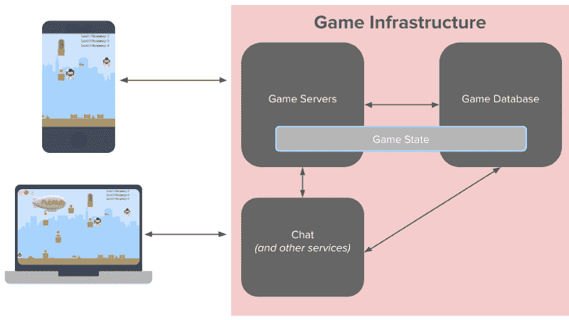
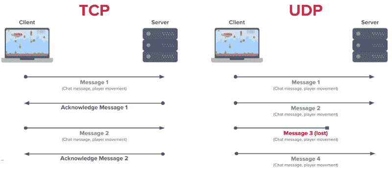

# 为什么你应该运行你的游戏服务器独立于你的聊天

> 原文：<https://www.freecodecamp.org/news/why-you-should-run-your-game-servers-independently-from-your-chat-3263b4b9548e/>

乔·汉森

# 为什么你应该运行你的游戏服务器独立于你的聊天

当涉及到构建多人游戏时，开发者经常面临一个两难的境地。

*   我是否可以利用现有的游戏服务器来运行聊天功能？
*   我是否将我的游戏服务器分开并独立运行我的聊天？

因为毕竟只是聊天信息，对吧？小消息被发送给单个用户或一个小组，所以你还不如利用已经建立的…这有什么坏处呢？

虽然最初利用您已经拥有的东西似乎是一个不错的选择，但是选择这种设计模式可能会产生许多问题。

我将向您展示为什么您应该独立运行您的游戏服务器和社交功能(最重要的是聊天)，这对您作为游戏开发者和您的最终用户都有好处。这样做，您将提高游戏本身的性能和可扩展性，并且您将允许社交功能在未来轻松扩展新功能。

### 微服务让你的游戏更易管理

面向微服务的架构将一个大型应用程序(在这种情况下是您的游戏)分解为小型的、独立版本的模块化服务，这些服务通过简单的、通用的 API 相互通信。它使得构建新功能和维护已构建的功能变得更加容易。

将您的游戏服务器与聊天功能分离开来，使您的整个基础设施更易于管理，并使您更接近完全面向微服务的架构。在这种情况下，让我们具体看看游戏中的聊天，以及它与驱动多人游戏的游戏服务器的关系。

有了单片架构，您的开发团队现在被锁定在一个单一的技术堆栈中——使用游戏已经构建的相同编程语言、数据库和软件环境。当引入新的开发人员时，或者当您想要构建新技术和系统的原型时，在微服务架构中快速前进要容易得多。

整体架构的依赖性也更加明显。如果你的单个应用程序功能失败，整个游戏就完蛋了。将您的游戏拆分为微服务可以更容易地隔离故障，并在单个模块出现故障时修复故障。

你的游戏服务器是为实时传送玩家的动作和状态而构建的，他们做得很好。将相同的技术和设计重新用于聊天消息，并没有为特定的功能使用最佳选项。分散的组件更容易维护，并且它们的伸缩性更好。

上图描述了一个游戏基础设施，其中聊天与游戏服务器是分离的。

此外，我们还可以在游戏服务器之外运行其他服务，包括授权、在线状态、统计数据和排行榜。

### 确保无缝游戏体验和聊天性能

总的来说，游戏性能是多人游戏的主要考虑因素。缓慢的游戏体验会赶走用户，他们永远不会回来。有了单片架构，游戏可以在实验室中运行。但是对于在世界任何地方都有大量用户的多人游戏，所有人都在快速地同时通信，你将开始看到聊天消息的传递和游戏体验的滞后和增加的延迟。

将两者分开可以确保 CPU 和网络资源得到更有效的利用。游戏服务器的主要目的是为游戏中的每个用户提供无缝体验。因此，应该利用处理能力来最大限度地提高性能。

假设你有一个类似英雄联盟或 EVE Online 的在线战斗竞技场游戏。在一个世界里，你可能同时有数百名玩家。那是通过你的游戏服务器发送的成千上万的信息，传递每个玩家创造的每一个输入。现在，将聊天消息添加到组合中。玩家完全有可能向聊天频道发送垃圾邮件，故意降低游戏服务器的速度，因为所有的消息都有相同的优先级。当然，检查这样的用户是可能的，但是你需要进行额外的处理，这会消耗游戏服务器的资源。

游戏服务器已经在处理密集的游戏体验——物理、图形和声音。当您添加聊天消息(一对一、小组、团队)并解析这些消息并将其发送给正确的用户时，所有这些消息都会慢慢累积到大型游戏中，并损害游戏的整体性能。

将聊天频道与多人频道分开运行是显而易见的。它窃取了重要的处理能力，这些能力本可以更好地解决比路由聊天消息更复杂的问题。

### UDP 与 TCP:当你两者都需要时，当你不需要时

然后是关于多人游戏协议的争论，UDP 和 TCP，以及什么时候使用哪一个最好。

快节奏的多人游戏(第一人称射击游戏、竞技场游戏等)使用 UDP 协议来同步玩家运动和更新游戏状态。UDP 是以快得离谱的速度发送这些游戏更新的理想选择，但不能保证消息(因为下一条消息来得太快)。

TCP 保证消息传递，这使它成为聊天的一个很好的选择。你会看到在 UDP 上运行你的游戏和在 TCP 上运行你的社交功能的出色表现。

然而，对于不太激烈的多人游戏，如回合制游戏，TCP 是游戏性和聊天的合适选择。因为 TCP 保证了消息的传递，而且在每一步都很重要的游戏中(比如拼字游戏或井字游戏)，它是支持多人游戏的一个很好的选择。当然，你仍然想把你的聊天和游戏服务器分开，特别是当你的游戏开始运行，并且你有数千用户同时连接的时候。

延迟是另一个需要考虑的问题，因为多人功能和社交功能有不同的延迟标准。对于一个多人游戏，确保游戏状态和提供玩家输入，行业标准是不超过 20 毫秒。而对于聊天应用程序，发送聊天消息的最大等待时间是 250 毫秒。

所以你有两种不同类型的实时消息，有两种不同的标准。让它们单独运行可以让您根据需要管理每一个。

### 轻松添加新的社交功能

将聊天作为独立服务运行，并选择行业标准协议(XMPP、WebSockets)或托管服务( [PubNub](https://www.pubnub.com?utm_source=Syndication&utm_medium=Medium&utm_campaign=SYN-CY18-Q2-Medium) )，这为轻松添加新的强大社交功能提供了机会。

从核心聊天开始，允许用户进行个人和群组聊天。这样，您就有了底层的基础设施，以及基本的发布/订阅。你还可以轻松地在上面添加许多其他社交功能。

通过最少的代码，您可以添加牌桌赌注聊天功能，如键入指示器、显示哪些玩家在线和离线的用户状态以及未读消息计数器，这些都是用户所期望的功能。

### 展望未来

大大小小的游戏工作室都在朝着这个架构设计前进，包括[口袋宝石](https://www.pubnub.com/customers/pocket-gems/?utm_source=Syndication&utm_medium=Medium&utm_campaign=SYN-CY18-Q2-Medium)，以及最近的 [EVE Online](https://www.eveonline.com/article/p4i0qx/new-chat-backend-coming-with-the-march-release) 。从更好的可扩展性和更高效的性能，到不受单一堆栈限制的自由创新，优势显而易见:将聊天从您的游戏服务器中分离出来是正确的选择。

*最初发表于[www.pubnub.com](https://www.pubnub.com/blog/why-you-should-run-your-game-servers-separate-from-your-chat/)。*