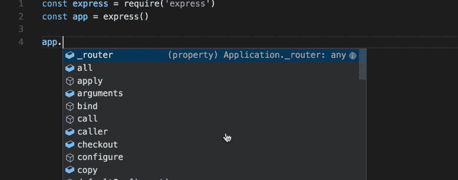
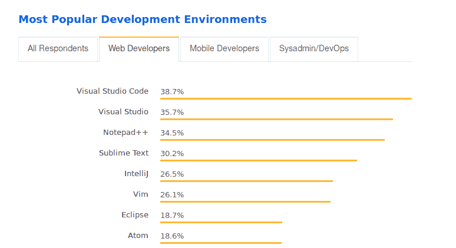
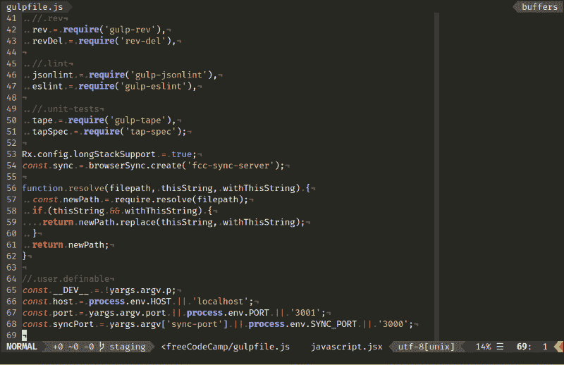

# 如何为 JavaScript 选择文本编辑器

> 原文：<https://www.freecodecamp.org/news/how-to-choose-a-text-editor-for-javascript-ec75c2cee6b8/>

作者 Ayo Isaiah

# 如何为 JavaScript 选择文本编辑器

Photo by [Clément H](https://unsplash.com/@clemhlrdt?utm_source=medium&utm_medium=referral) on [Unsplash](https://unsplash.com?utm_source=medium&utm_medium=referral)

如果你刚刚开始学习编码，在决定学习什么之后，你需要做的第一件事就是选择一个用于编写代码的文本编辑器。

文本编辑器是一个帮助你编写纯文本(没有任何格式)并将其保存到文件中的程序。Windows 上的记事本编辑器就是一个很好的例子。

Notepad in Windows 8

当您开始编码之旅时，您会很快发现文本编辑器是您花费大部分时间的地方——因为任何程序员的基本工作都是编写和编辑源代码。这就是为什么有必要选择一个适合你并支持你的学习努力。

并不是所有的文本编辑器都适合编程，比如前面提到的记事本，因为它不能简化或自动化源代码的编辑。

有一些文本编辑器是专门为编写和编辑源代码而设计的。这些被称为代码编辑器。代码编辑器可以是独立的程序，也可以内置在集成开发环境(IDE)中。

我们还有位于浏览器中的代码编辑器。CodePen 、 [Web Maker](https://webmakerapp.com/) 和 [Plunker](https://plnkr.co/) 就是突出的例子。你可能已经熟悉了这些基于网络的编辑器，因为许多在线编码程序如 [freeCodeCamp](https://www.freecodecamp.org/) 推荐使用它们。

然而，如果你想让你的编码更上一层楼，你需要考虑看看桌面编辑器，它超越了大多数基于网络的工具的水平。

当看到有这么多选择时，很容易被淹没。问五个人，你可能会得到五种不同的答案。

如果你刚刚开始，你需要选择一个支持你作为初学者的编辑器。学习编码已经够难了，所以你可以利用你能得到的所有帮助。

本文的目标是帮助您在学习编码时决定使用什么文本编辑器，特别强调 JavaScript 编程。

### 在代码编辑器中寻找什么

所有代码编辑器都可以编写文本并将其保存到文件中。除此之外，你选择的编辑器类型完全取决于你的个人喜好。也就是说，您的编辑器必须具备一些条件，才能被认为是足够好的 JavaScript 开发工具。

#### 语法突出显示

实际上，所有的代码编辑器都支持根据您使用的语言用不同的颜色突出显示源代码。这提高了可读性，并帮助您更快地发现语法错误。

#### 自动完成

代码自动完成是许多代码编辑器提供的一项功能，它通过在程序范围内完成变量、关键字、类和方法的名称来帮助加速编辑过程并减少输入错误。

Code auto completion in Visual Studio Code

如果你刚刚开始，我建议关闭编辑器中的自动完成功能，手动输入所有内容，这样你可以更快地记住语法。

然而，一旦你掌握了所有的基本关键字和内置方法，我看不出你自己把所有东西都打出来有什么价值。在这一点上，自动完成变得非常重要。

#### 支持 ES2015+以及流行的框架和库

一个好的编辑器还应该在最新的 JavaScript 特性发布后不久就提供支持，并拥有强大的插件生态系统，这样你就可以获得对最流行的框架和库的支持。

考虑到这些因素，如果您刚刚开始使用 JavaScript 和 web 开发，让我们来看看您可以使用的几个选项。

为了方便您选择，我将它们从最推荐到最不推荐进行了排序。这个排名是主观的，所以我鼓励你在尝试每一个后得出自己的结论。

这里列出的所有编辑器都是跨平台的，可以跨 Windows、macOS 和 Linux，因此您不必担心与您喜欢的操作系统的兼容性。

### Visual Studio 代码—免费

不要与 [Visual Studio](https://www.visualstudio.com/) 混淆，Visual Studio Code (VS Code)是目前 JavaScript 开发者最好的文本编辑器。虽然与其他流行的编辑器相比，它相对年轻，刚刚在 2015 年发布，但这些年来它已经有了长足的进步。事实上，以至于在最近的[堆栈溢出调查](https://insights.stackoverflow.com/survey/2018/#development-environments-and-tools)中，它被列为网络开发者中最受欢迎的文本编辑器。

Visual Studio Code just edged out Visual Studio as the most popular developer environment tool for web developers

VS 代码不仅仅是一个基本的文本编辑器。有些人说它更像是一个 IDE 而不是文本编辑器，因为它提供了许多你通常会在 IDE 中找到的特性。

它的一些主要功能包括内置调试工具、智能代码完成( [IntelliSense](https://code.visualstudio.com/docs/editor/intellisense) )、集成终端和对许多常见 Git 操作的本机支持。作为初学者，您可以利用这些特性以更快的速度生成工作代码。

可定制性是 Visual Studio 代码的另一个亮点。它支持数以千计的插件和主题，你可以安装，以进一步增强其功能。

### 崇高文本 3—80 美元

Sublime Text 3 是我刚学习编码时第一次使用的编辑器，所以我确实对它情有独钟。这是一个很棒的编辑器，由于其简单易用，在 web 开发人员中仍然很受欢迎。

虽然与 VS 代码相比，它对 JavaScript 的开箱即用支持相当蹩脚，但您可以通过安装插件来增强这种支持。它的速度也很快，不会占用太多的内存——这就是为什么我经常向那些电脑内存小于 4GB 的人推荐它。

尽管 Sublime 的单用户许可证价格高达 80 美元，但它可以免费下载和评估。您只会不时收到一条弹出消息，提醒您购买许可证以继续使用。

### 无原子的

Atom 于 2014 年由 GitHub 推出，作为 Sublime Text 和 Text Mate 等专有工具的免费开源替代品。虽然它获得了狂热的追随者，但它从未达到 Sublime 的受欢迎程度，现在已被一年后发布的 VS Code 超越。

这并不是说 Atom 是一个糟糕的编辑器——远非如此。对新手来说平易近人，不需要任何配置就能上手。就像 VS 代码一样，它也可以通过插件进行扩展，并支持许多类似 IDE 的特性，这些特性可以提高您编写代码的速度和效率。

### Vim 免费

在和其他代码编辑器一起工作了一段时间后，Vim 是我目前选择的文本编辑器。虽然我使用并喜欢 Vim，但我会犹豫是否向刚刚学习编码的人推荐它，因为与其他主流代码编辑器相比，它有一种完全不同的编辑文本的方法。这意味着你必须投入时间来学习它是如何工作的，这可能会分散你实际学习编码的注意力。

如果你正忙于学习编程，最好使用你已经熟悉的界面，这样你就不会偏离实际编程。此外，Vim 缺少许多编辑器(如 VS Code 或 Atom)默认提供的优秀特性。虽然可以使用插件为 Vim 添加更多的功能，但是这样做的过程要复杂一些。

如果你已经在你所学的语言上达到了一个合理的能力水平，并且你有兴趣尝试 Vim，你可以借鉴一下 [Yehuda Katz 是如何在不损失生产力的情况下过渡到 Vim 的](http://yehudakatz.com/2010/07/29/everyone-who-tried-to-convince-me-to-use-vim-was-wrong/),然后从那里开始。

### 网络风暴——129 美元/年

WebStorm 是另一个有趣的选项，许多 JavaScript 开发人员都信以为真，尽管它是一个成熟的 IDE，而不仅仅是一个文本编辑器。这也是我所知道的最贵的选择，尽管如果你是学生，你可以和其他 JetBrains 产品一起[免费获得。](https://www.jetbrains.com/student/)

我个人没有体验过 WebStorm，但是大多数评论者很快称赞了它对 JavaScript 及其生态系统的深度支持，正如你可能从一个复杂的 IDE 中所期待的那样。另一方面，它比独立的文本编辑器有更陡峭的学习曲线，并且有许多初学者并不真正需要的功能。

我认为当你有更多的经验时，WebStorm 可能是一个很好的学习工具，但我认为没有理由开始使用它。

### 没有错误的选择

无论你选择哪个编辑器都很棒。所有这些都为编写 JavaScript 提供了良好的环境，所以如果你决定不选择第一个而选择其他的，这真的不是问题。

我要告诫的是不要花太多时间学习像 Vim 或 WebStorm 这样复杂的工具。作为初学者，你应该更多地关注编程本身——这就是为什么我将 Visual Studio Code、Sublime Text 和 Atom 列为我的首选，因为它们都欢迎新手。我建议你把这三个都试一试，然后挑一个你觉得最舒服的。

感谢阅读！如果你喜欢这个，给它一些爱，按下？按钮！欢迎访问我在 f [reshman.tech](https://freshman.tech) 的博客，了解更多关于 web 开发的初学者友好内容，并通过 T [witter 与我联系。](https://twitter.com/@ayisaiah)

玩得开心，快乐编码！