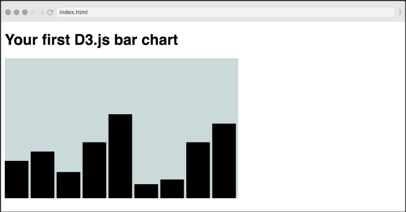
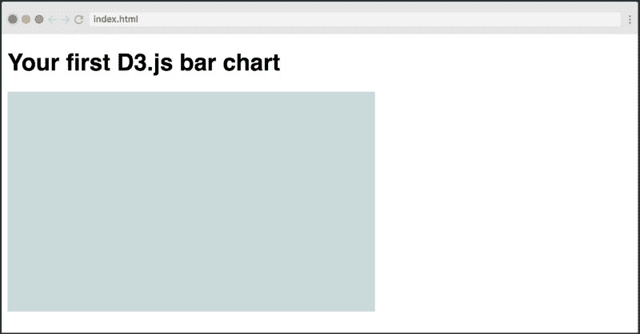

# 学习用 D3 创建条形图——初学者教程

> 原文：<https://www.freecodecamp.org/news/how-to-create-your-first-bar-chart-with-d3-js-a0e8ea2df386/>



Want to learn D3 properly? Check out [our free course](https://scrimba.com/g/gd3js?utm_source=freecodecamp.org&utm_medium=referral&utm_campaign=gd3js_bar_chart_article) as well.

D3.js 是最流行的 JavaScript 库，用于创建数据的可视化表示。但是，学习起来有点棘手，所以我认为从轻柔开始很重要。

在本教程中，你将学习如何用 D3 创建你的第一个条形图。它将向您介绍最重要的概念，同时仍然享受构建某些东西的乐趣。

我们还在 Scrimba 上创建了一个免费的 D3.js 课程。 **[查看这里。](https://scrimba.com/g/gd3js?utm_source=freecodecamp.org&utm_medium=referral&utm_campaign=gd3js_bar_chart_article)**

现在让我们开始吧。

#### 设置

我们将使用最简单的设置，简单地从 CDN 导入 D3 库。

```
<html>  
  <head>  
    <link rel="stylesheet" href="index.css">  
  </head>  
  <body>  
    <svg></svg>  
    <script src="https://d3js.org/d3.v4.min.js"></script>  
    <script></script>  
  </body>  
</html> 
```

我们将在脚本标签中编写 D3 代码。其次，我们向 DOM 添加了一个`<svg>`元素。如果你想在阅读本教程的时候摆弄一下代码，可以去看看[这个 Scrimba 游乐场](https://scrimba.com/c/cyKgGCL?utm_source=freecodecamp.org&utm_medium=referral&utm_campaign=gd3js_bar_chart_article)，里面有代码的最终版本。

我们要做的第一件事是选择这个元素，并对其进行一点样式化。

```
var svgWidth = 500;  
var svgHeight = 300;

var svg = d3.select('svg')  
    .attr("width", svgWidth)  
    .attr("height", svgHeight)  
    .attr("class", "bar-chart"); 
```

我们给它一个宽度和高度，外加一个`.bar-chart`类。在我们的 CSS 中，我们将类设计成这样:

```
.bar-chart {  
    background-color: #C7D9D9;  
} 
```

结果如下:



现在我们有了一个漂亮的 SVG 容器，可以在其中绘制条形图。这样做的代码有点复杂，所以让我们先看看整个事情，然后逐步完成每个步骤:

```
var dataset = [80, 100, 56, 120, 180, 30, 40, 120, 160];

var barPadding = 5;  
var barWidth = (svgWidth / dataset.length);

var barChart = svg.selectAll("rect")  
    .data(dataset)  
    .enter()  
    .append("rect")  
    .attr("y", function(d) {  
        return svgHeight - d  
    })  
    .attr("height", function(d) {  
        return d;  
    })  
    .attr("width", barWidth - barPadding)  
    .attr("transform", function (d, i) {  
         var translate = [barWidth * i, 0];  
         return "translate("+ translate +")";  
    }); 
```

#### selectAll()

我们做的第一件事可能看起来有点奇怪，我们正在做`.selectAll("rect")`，然而，我们还没有创建任何`<rect>`元素。所以这个方法返回一个空选择(一个空数组)。然而，我们将很快使用`enter().append()`创建`<rect>`元素。

这似乎有点令人困惑。但是解释`selectAll()`如何与`enter().append()`结合工作超出了本教程的范围。如果你想正确理解它，请仔细阅读[这篇文章](http://knowledgestockpile.blogspot.no/2012/01/understanding-selectall-data-enter.html)。

#### 数据()

然后我们链接`data()`方法并传入我们的数据集。这些数据最终将决定每一个条形的高度。

#### 输入()

下一步是链接`enter()`方法。`enter()`既查看您传递到`data()` **的数据集，又查看我们用`selectAll('rect')`做的选择**，然后它试图寻找“匹配”所以它创建了数据和 DOM 之间的映射。

但是请记住，`selectAll('rect')`方法返回了一个**空的**选择，因为 DOM 中还没有`<rect>`元素。但是，数据集有九个项目。所以没有“匹配”

然后，`enter()`方法允许您在 DOM 中为数据集中还没有对应的`<rect>`元素的每个项目创建一个新的`<rect>`元素。

#### 追加()

在下一行，我们为每一项添加了一个`<rect>`元素。由于这个方法跟在`enter()`之后，它实际上将被执行九次，一次针对在 DOM 中缺少相应`<rect>`的每个数据点。

#### 属性()

下一步是决定每个矩形(我们的条形)的形状。我们需要给它四个属性:**高度、宽度、x 位置**和 **y 位置**。我们将对所有这些使用`attr()`方法。

让我们从 y 位置开始:

```
.attr("y", function(d) {  
    return svgHeight - d  
}) 
```

第一个参数决定了我们要添加的属性:在本例中，是横条的 y 坐标。在第二个例子中，我们访问一个回调函数，在这个函数中我们将返回我们希望属性拥有的值。

在这里，我们在迭代过程的这一步访问数据点(记住，这个方法对`dataset`数组中的每一项调用一次)。数据点存储在`d`参数中。然后，我们将从 SVG 容器的高度中减去给定的数据点`d`。

x 和 y 坐标总是从左上角开始计算。因此，当我们用`d`值减去容器的高度时，我们得到了酒吧顶部的 y 坐标。

为了使该条从这一点延伸到 SVG 容器的底部，我们需要给它一个与数据点的值相等的高度:

```
.attr("height", function(d) {  
    return d;  
}) 
```

下一步是给它一个宽度:

。attr("width "，条形宽度-条形填充)

这里，我们只是传递一个简单的表达式，而不是回调函数，因为我们不需要访问数据点。我们只是在我们进一步创建的`barWidth`变量中取一个基础，它是容器的总宽度除以条的数量。为了在每个条之间获得一个小的间隙，我们还将减去填充，我们将填充定义为 5。

最后一步是设置 x 坐标。这个表达式有点复杂:

```
.attr("transform", function (d, i) {  
    var xCoordinate = barWidth * i;  
    return "translate("+ xCoordinate +")";  
}); 
```

这里，我们首先利用回调中的第二个参数`i`。这是数组中给定项的索引。

要设置每个条形的坐标，我们只需将索引乘以`barWidth`变量。然后我们将返回一个描述 x 轴变换的字符串值，例如`"translate(100)"`。这会将条形向右移动 100 个像素。

就这样，你在 D3.js 中有了你的第一个条形图。


如果你有兴趣了解更多关于 D3.js 的知识，一定要查看我们在 Scrimba 上的免费课程。

* * *

感谢阅读！我的名字叫 Per Borgen，我是最简单的学习编码方法——Scrimba 的联合创始人。如果你想学习建立专业水平的现代网站，你应该看看我们的[响应式网页设计训练营](https://scrimba.com/g/gresponsive?utm_source=freecodecamp.org&utm_medium=referral&utm_campaign=gd3js_bar_chart_article)。


[Click here to get to the advanced bootcamp.](https://scrimba.com/g/gresponsive?utm_source=freecodecamp.org&utm_medium=referral&utm_campaign=gd3js_bar_chart_article)