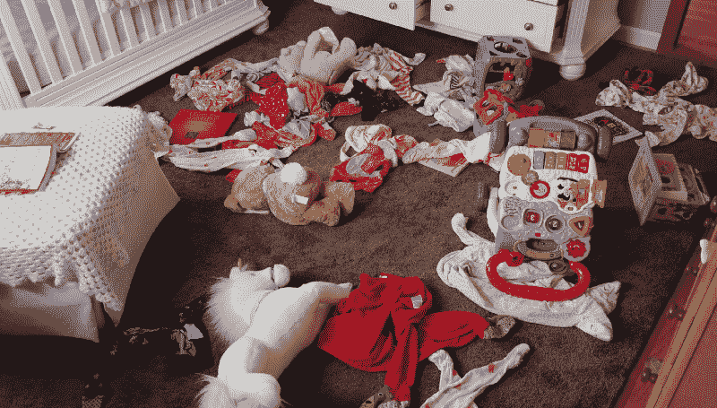
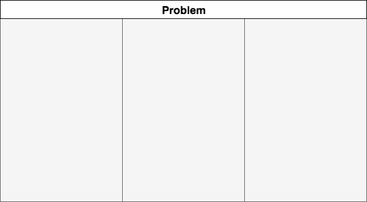
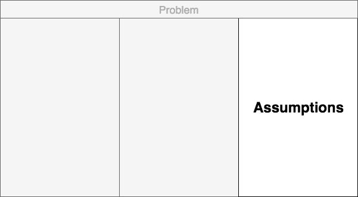
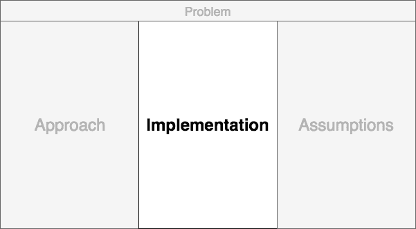
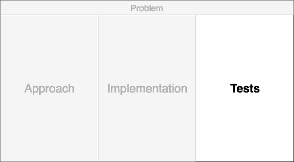
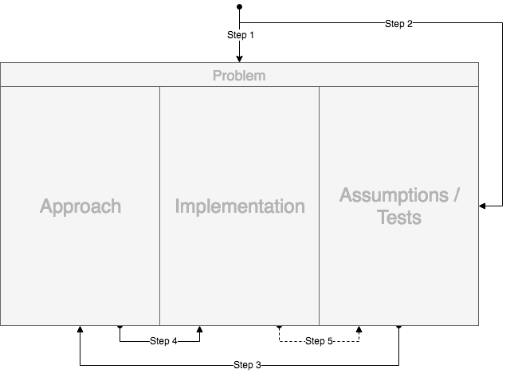
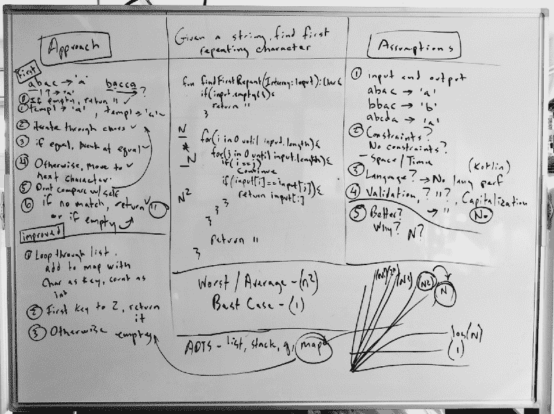

# 如何在白板上组织你的想法，粉碎你的技术面试

> 原文：<https://www.freecodecamp.org/news/how-to-organize-your-thoughts-on-the-whiteboard-and-crush-your-technical-interview-b668de4e6941/>

道格·阿库里

# 如何在白板上组织你的想法，粉碎你的技术面试

#### 关于组织技能和在软件工程工艺中将许多东西粘合在一起的应用科学

The [ABC’s of Programming](http://arthur-johnston.com/abcs/) did not include O for Organization.

几周前，一个聪明的人在[黑客新闻](https://news.ycombinator.com/item?id=16703553)上发表了一篇关于[软件开发中最重要的技能](https://www.johndcook.com/blog/2015/06/18/most-important-skill-in-software/)的经过深思熟虑的简洁帖子。在这篇文章中，约翰·d·库克提到了詹姆斯·黑格的文章[中的一段话。两位作者都将**组织** **的软件工程主题作为技能**来处理。他们将此与面试中测试的、学术界教授的或博客文章中吹捧的对计算机科学的掌握进行对比。他们的沉思让我思考如何改进我们的工艺。](http://prog21.dadgum.com/177.html)

深入思考两位作者的观点，我回顾了自己的经历。我同情那些经历过没有经过传统训练的技术面试的人。我几年前的最后一次经历是杂乱无章的。

我上一个完成的专业项目是一个历时三年的处理代码复杂性的系统，以及一个永无止境的滚动产品线。我们勇敢地战斗，组织越来越多的混乱。这两种想法有一个共同的线索，因为它们都是组织中大大小小的练习。它们围绕着焦虑、脆弱、压力和快乐的时刻。我(我们)非常关心结果。

这促使我用自己的方式写了一篇后续文章。这是因为我被这些帖子的严重性所感动。为什么不回答提出的问题，即使我的示例回答不完全匹配？所以我来回踢这个想法，挂在一个问题上。约翰问道:

> …你如何展示一个巧妙的组织？

稍微思考了一下，我把目光从屏幕上移开，看到了我面前的白板。我的头在柱子周围打转。艰难的技术面试？组织？管理状态？崩溃重量？代码复杂度？也许技术面试白板练习可以一直证明软件工程的一个突出点。

所以我开始在白板上紧张地独自解决一些典型的问题。

很少有人在白板上表现出色。你必须展现出高超的思维过程，并在头脑中记住很多东西。你必须与人交流，但是你如何在忽略你脑海中尖叫的声音的同时与人交流呢？一边热情地走动？

### 更好的方法

在大大小小的技术公司，都有白板技术面试。你和另一个代表公司的人被安排在一个有白板的白色房间里。他或她问了一个问题，我们被邀请去解决这个问题。然后，通常由受访者来解决问题。

这是我的脑袋开始因为焦虑和混乱而失去控制的地方。小号开始在我的脑海中演奏，我的思维过程变得混乱。时间加速。我的视野变窄，我变得头昏眼花。

也许有一种方法可以让你慢下来，调整节奏，和**组织**一起走过一个过程。这是我多年来面试候选人时从未见过的东西，但它可能有助于缓解紧张情绪，使之成为一次愉快的经历。首先，看黑板，把它分成三部分。

A typical 5' by 3' whiteboard cut into three sections.

这三个部分将被组织为临时空间，以解决问题。

#### 步骤 1:问题

确保在最上面用一个完整的句子写下这个问题。这将让你感觉到标记，并帮助你克服最初的“我如何解决这个问题？”

A problem statement above is very important to look over.

一旦你把问题写下来，看一会儿，开始思考问题。用充足的空间画线。不要担心停顿，让面试官知道你正在考虑要问的问题。

#### 第二步:假设

思考一些一般性的问题。比如，你更喜欢哪种编程语言？移到棋盘的右边。没有问题吗？问题可能包含你不知道的概念。问他们是什么。然后，开始解决问题。首先要问的是参数**输入**和**输出的例子是什么。**询问数据是否经过**预先分类。**

Assumptions are all the questions need answering.

澄清假设可以简化问题。当你问每一个问题时，你应该在假设区写下每一对答案。收到答案后，用第二支记号笔(不同颜色)突出显示答案。自带水彩笔可能会有帮助。

我们脑袋里只能装下这么多东西，所以要重重地靠在板上才能捕捉到所有的知识。把问题和答案写出来会让你的方法慢下来，这样就容易理解了。

#### 第三步:方法

一旦你在黑板的右边有了足够多的问题，身体移到左边。这是我们开始讨论解决方法的地方。

Approach is the strategy, the structure and the visualization scratch pad.

这里出现了非常粗略伪代码、步骤和可视化。让你的面试官知道这不是你的实现，而是你组织你对策略和方法的想法的地方，松散的数据结构和抽象数据类型。像画一幅画一样画出答案。

左边的框将展示一些非常有趣的东西，因为它应该揭示我们的问题中的漏洞。当你写作和思考你的方法时，如果一个问题没有得到回答，停止你的思考过程。回到正确的部分，写下问题并尝试得到答案。

在绝对最小的情况下，这种情况会发生几次，就像你认识到一般情况下的**，最好情况下的**，以及最差情况下的**。这取决于策略、限制和约束。请求**放松**方法，例如“对于这个例子，我可以使用一小组数据吗？”"我可以假设输入数组已经排序了吗？"输入验证也是另一个问题生成器。**

#### **步骤 4:代码实现**

**一旦生成了足够的假设和方法材料，这意味着您现在可以满怀信心地编写实现代码了。你会得到双方的支持。突出显示并指出编写代码时的每个步骤。小心地通过你左边列出的方法。当你写你的实现时，反复检查这些假设。**

**即使你很难解决，你也是组织的向导。**

**

The main event is centered so it can be supported from all sides.** 

**当然，也有可能在行为中发现什么。走回左侧，恢复该方法，抛锚并寻求帮助。新的问题出现了。往右走。从左到右来回到中心，直到成功。你会的。**

**做组织的主人。如果你碰壁了，或者发现了什么不对劲的地方，记住边会指引你。**

#### **额外的第五步:测试**

**如果你已经完成了你认为可以工作的代码的练习，那么开始讨论如何测试它。使用假设部分作为编写干净的测试代码的地方，如果你应该选择这样做的话。**

**

Tests should never be optional.** 

**到目前为止，最有可能安全的是从该区域移除所有问题。删除问题并尝试编写单元测试。最后，你会没事的，因为你自信地组织起来。**

### **综上**

**给你。那是几分钟没有太多理论的纯组织。它依赖于几个简单的概念。**

1.  ****切片** — 把问题从头到尾一片片的切片。**
2.  ****脚手架**——临时建筑的概念，或我们在周围建造时搭建支撑结构的地方。**
3.  ****选通** —在我们对解决问题的事情感到放心和有信心之前，我们不应该进行下一步。展示自信，但积极参与“我错过了任何假设吗？”或者“我的方法有漏洞吗？”继续之前。**
4.  ****状态** —可视化地处理组织，以保持问题的加权复杂性。如果可以的话，避免使用橡皮擦。**

**

Approaching the actual organization problem with a solution. If you are left handed, try reversing the setup** 

### **结论**

**我想以一些能让我的思考过程回家的趣闻来结束这篇文章。**

> **直到你经历了组织的混乱，你才能欣赏组织的壮举。—约翰**

**我同意。这适用于任何人类体验，包括有代码的项目、人员和那些技术白板体验。但是退一步，用一个组织过程来回答这个问题，这是一个工程学的壮举。一个问题和一个可能的解决方案。**

> **工程的关键是**潜在组织**。随着时间的推移，一个巨大的**动能**来自于敏捷而持续的组织行为。**

**千万不要低估这种现象。**

> **只有当混乱无序的局面是你的责任，对你来说比案例研究更有意义时，你才能理解并欣赏改进。—约翰**

**我们都有一个关于白板的故事。我想知道如何在提高工程思维的同时完成任务。许多工程师在白板上进行情感交流。我们都有失败的故事。**

**我们的大部分工艺是一门应用科学。很少，天才可以修补和篡改发明新的数据结构或算法。我们的是一种**模式语言**和一种**工艺**之一。这很少是艺术，如果有的话。它与识别最新的组织技能以及反复地将事物很好地结合在一起有很大的关系**。也许用工具箱里的一些工具。但是要小心那些被交换或热情推给我们的组织工具。****

**记住，通过组织和结构的方式在代码之上进行改进是值得骄傲的。我已经写了一些关于组织的[帖子](https://hackernoon.com/no-description-provided-8d9e0f3a3abb)和将组织与系统复杂性联系起来的[主题](https://hackernoon.com/the-decision-hypothesis-aa512e0113)。有很强的联系。这就是为什么我非常欣赏约翰和詹姆斯的思想。它们是没有*快点*时间到期的有组织的消息。**

**

What it may look like on a first try. Try iterating to discover more patterns.** 

***如果你发现自己处于这种[情况](https://www.youtube.com/watch?v=XKu_SEDAykw)，要求一个更大的白板！***