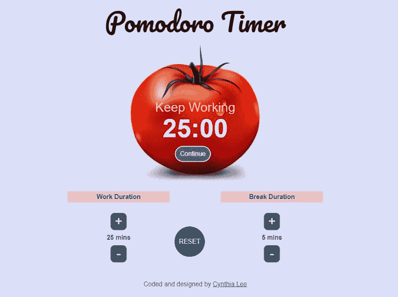
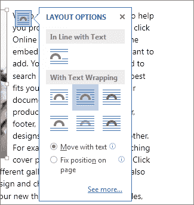
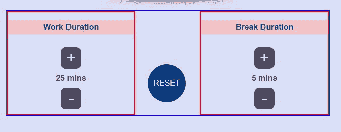

# 我如何建立我的番茄钟应用程序，以及我在这个过程中学到的经验教训

> 原文：<https://www.freecodecamp.org/news/how-i-built-my-pomodoro-clock-app-and-the-lessons-i-learned-along-the-way-51288983f5ee/>

辛西娅·李

# 我如何建立我的番茄钟应用程序，以及我在这个过程中学到的经验教训


我在 2017 年 12 月开始了我的 [freeCodeCamp](https://www.freecodecamp.org) 之旅，还差两个项目就要完成前端开发证书了。这篇文章记录了我完成番茄钟项目的过程。

### 什么是番茄钟？

[番茄工作法](https://francescocirillo.com/pages/pomodoro-technique/?utm_source=zapier.com&utm_medium=referral&utm_campaign=zapier)是一个简单而有效的时间管理框架——你用一个计时器把你的工作分成几个时间段(通常是 25 分钟),中间有 5 分钟的休息时间。每 4 个番茄后，你可以休息更长时间。

我必须完成以下用户故事:

*   我可以启动一个 25 分钟的番茄，一旦 25 分钟过去，计时器就会停止计时。
*   我可以为我的下一个番茄重新计时。
*   我可以定制每个番茄的长度。

### 设计/布局



我的设计原则是保持用户界面干净简单。我喜欢用西红柿作为计时器的想法。有一个工作/休息显示，计时器倒计时，和一个播放/暂停按钮。

在计时器下面，我有修改工作和休息时间的设置，还有一个重置按钮。

### 我遇到的布局问题

我有一个大问题，就是如何将番茄图片放置在其他元素的背景下。我多么希望有一个可以选择的布局选项！？



Good old Microsoft Word picture layout options

我发现的一个建议是用我喜欢的背景色保存番茄图像作为一个新的图像，然后在背景中使用这个图像。它的缺点是，一旦我测试了布局响应，它就开始看起来不可靠。

最后，我设法通过组合`absolute positioning`，修改`top`和`left`的百分比，以及`transform`得到了正确的结果。

```
#status {  position: absolute;  top: 45%;  left:50%;  transform: translate(-50%, -50%);}
```

```
.timerDisplay {  position: absolute;  top: 60%;  left: 50%;  transform: translate(-50%, -50%);}
```

```
#start-btn {  position: absolute;  bottom: 8%;  left: 48%;  transform: translate(-50%, -50%);}
```

底部设置相当简单。我使用 CSS Grid 将组件分成三列，中间的列是外部列宽度的一半。

```
.settings {  margin: auto;  width: 80%;  display: grid;  grid-template-columns: 2fr 1fr 2fr;  align-items: center;}
```

我再次使用`transform`来移动重置按钮，以便更好地对齐。



### 构建我的代码——然后把它拆开

如果我分解需求，我发现提出我的代码结构很有帮助:

*   当我单击“开始”按钮时，计时器将在开始和暂停之间切换。
*   一旦计时器归零，警报就会响起。
*   工作会议之后总是有休息会议。
*   可以修改工作和休息持续时间。
*   “重置”按钮将(你猜对了)重置计时器。

我之前在 Wes Bos [JavaScript30](https://javascript30.com/) 课程中完成了倒计时，所以我知道我可以使用`setInterval`方法。我还决定坚持使用普通的 JavaScript 来挑战自己，避免依赖 jQuery。

所以我开始写我的 JavaScript 代码。虽然我设法创建了一个功能性的 pomodoro 时钟，但我不会在这里介绍我的代码的第一个版本。这是因为我在 Reddit 上收到一位令人惊讶的陌生人的建设性反馈后，对它进行了重大修改。？

是的，Reddit 上确实有好事发生！

反馈的要点是:

*   `setInterval(timer, 1000)`触发至少需要 1000 毫秒，但可能需要更长时间。所以你应该检查一下实际过了多少时间，否则你的时钟可能会不准确。
*   将所有 HTML 更新分组在一个部分中，因为这使您的代码更容易更新和调试。
*   一般来说，不考虑表示的情况下编写代码是一个好主意。
*   确定计时器的逻辑，去掉不必要的代码。
*   确保变量名是描述性的。必要时留下评论。

你可以在 [GitHub](https://github.com/CynthiaLixinLee/pomodoro-timer/commit/dbf2d9f0afb4a7ad208a3326f520e1e5ab40e422#diff-42f69825340f0b5fa628d80900a46daa) 上查看我的第一次提交。

### 重构我的代码

在得到所有有价值的反馈后，我多次重构我的代码，直到我满意为止。

首先，我定义了所有的变量。因为我没有使用 jQuery，所以我确保使用`document.querySelector`捕获了所有的元素。

```
let countdown = 0; // variable to set/clear intervalslet seconds = 1500; // seconds left on the clocklet workTime = 25;let breakTime = 5;let isBreak = true;let isPaused = true;
```

```
const status = document.querySelector("#status");const timerDisplay = document.querySelector(".timerDisplay");const startBtn = document.querySelector("#start-btn");const resetBtn = document.querySelector("#reset");const workMin = document.querySelector("#work-min");const breakMin = document.querySelector("#break-min");
```

接下来，我创建了音频元素。

```
const alarm = document.createElement('audio'); alarm.setAttribute("src", "https://www.soundjay.com/misc/sounds/bell-ringing-05.mp3");
```

当点击“开始”按钮时，间隔被清除。如果`isPaused`从*真*变为*假*，则设置新的间隔。

“重置”按钮清除间隔，并重置变量。

```
startBtn.addEventListener('click', () => {  clearInterval(countdown);  isPaused = !isPaused;  if (!isPaused) {    countdown = setInterval(timer, 1000);  }})
```

```
resetBtn.addEventListener('click', () => {  clearInterval(countdown);  seconds = workTime * 60;  countdown = 0;  isPaused = true;  isBreak = true;})
```

**计时器功能**是倒计时魔术发生的地方。它从**秒** *中减去一秒。*如果**秒<**；0，则播放警报，该功能确定下一次倒计时应该是工作时段还是休息时段。

```
function timer() {  seconds --;  if (seconds < 0) {    clearInterval(countdown);    alarm.currentTime = 0;    alarm.play();    seconds = (isBreak ? breakTime : workTime) * 60;    isBreak = !isBreak;  }}
```

现在是时候为工作和休息时间使用+/-按钮了。最初，我为每个按钮创建了一个`onclick`函数。虽然它很实用，但肯定还有改进的余地。

```
document.querySelector("#work-plus").onclick = function() {         workDuration < 60 ? workDuration += increment : workDuration;                   }document.querySelector("#work-minus").onclick = function() {         workDuration > 5 ? workDuration -= increment : workDuration;              }document.querySelector("#break-plus").onclick = function() {     breakDuration < 60 ? breakDuration += increment : breakDuration;                     }document.querySelector("#break-minus").onclick = function() {        breakDuration > 5 ? breakDuration -= increment : breakDuration;                  }
```

同一类 Redditor 建议我使用一个[关联数组](http://www.i-programmer.info/programming/javascript/1441-javascript-data-structures-the-associative-array.html)，它本质上是一组键值对。

```
let incrementFunctions =    {"#work-plus": function () { workTime = Math.min(workTime + increment, 60)},     "#work-minus": function () { workTime = Math.max(workTime - increment, 5)},     "#break-plus": function () { breakTime = Math.min(breakTime + increment, 60)},     "#break-minus": function () { breakTime = Math.max(breakTime - increment, 5)}};
```

```
for (var key in incrementFunctions) {    if (incrementFunctions.hasOwnProperty(key)) {      document.querySelector(key).onclick = incrementFunctions[key];    }}
```

是时候更新 HTML 了！

我创建了更新倒计时显示和按钮显示的函数，并将这些函数合并到一个总体函数中，该函数还更新工作/休息状态和持续时间。

最后，我使用`document.onclick`在用户每次点击页面时运行**更新 HTML 函数**。为了更好的测量，我还使用了`window.setInterval`每秒运行该函数 10 次。

```
function countdownDisplay() {  let minutes = Math.floor(seconds / 60);  let remainderSeconds = seconds % 60;  timerDisplay.textContent = `${minutes}:${remainderSeconds < 10 ? '0' : ''}${remainderSeconds}`;}
```

```
function buttonDisplay() {  if (isPaused && countdown === 0) {    startBtn.textContent = "START";  } else if (isPaused && countdown !== 0) {    startBtn.textContent = "Continue";   } else {    startBtn.textContent = "Pause";  }}
```

```
function updateHTML() {  countdownDisplay();  buttonDisplay();  isBreak ? status.textContent = "Keep Working" : status.textContent = "Take a Break!";  workMin.textContent = workTime;  breakMin.textContent = breakTime;}
```

```
window.setInterval(updateHTML, 100);
```

```
document.onclick = updateHTML;
```

这就是我的项目总结！

你可以在这里查看我的最终项目[。](https://codepen.io/cynthiaLixinLee/full/xWzdRK/)

### 最后的想法

我从这个项目中最大的收获是，在代码设计方面，我应该以简单为目标，因为这是可靠性的先决条件。这将使我的代码易于理解，易于调试，易于更新。

我还想起了成对编程和代码审查的好处，尤其是当一个人是编码新手的时候。

还有很多东西要学。但是现在，让我奖励自己一盘番茄通心粉。


Photo by [OLA Mishchenko](https://unsplash.com/@olamishchenko?utm_source=medium&utm_medium=referral) on [Unsplash](https://unsplash.com?utm_source=medium&utm_medium=referral)