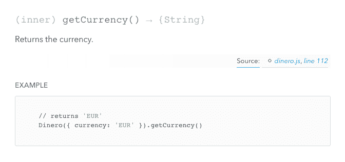
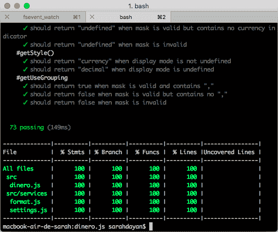

# 如何自动化您的开源 JavaScript 项目中最重复的任务

> 原文：<https://www.freecodecamp.org/news/how-to-setup-productivity-tools-for-an-open-source-javascript-project-c52d403c5087/>

莎拉·达扬

# 如何自动化您的开源 JavaScript 项目中最重复的任务


Photo by [Chad Kirchoff](https://unsplash.com/@cakirchoff) on [Unsplash](https://unsplash.com/)

当我开始我的职业生涯时，我的导师告诉我:

> “好的开发者是懒惰的开发者。不要把时间浪费在重复的任务上，而是花在建立自动化流程上。电脑为你工作，永远比你快。”

那是在 2010 年，我们拥有的工具比现在更少。然而，这条建议一直伴随着我。

从可执行脚本到 Yeoman 配置、IFTTT 设置和 Automator 工作流，更不用说我用来帮助我在电脑上移动的大量应用程序了。我将自动化视为一种游戏，并从中获得了极大的满足感。


从那时起，JavaScript 就开始爆炸式发展，并且变得越来越复杂。我们曾经在一个 HTML 页面上添加一个外部 JavaScript 文件，然后就收工了。但是现在构建一个 web 项目不仅仅是编码。我们也有更多的工具可以用来卸载重复的任务，所以找到自己的方式来完成这一切可能是压倒性的。

为了解决这个问题，我决定向您展示一个真实项目的详细设置——我最新的开源项目， [Dinero.js](https://github.com/sarahdayan/dinero.js) 。

**免责声明:**这不是一个关于如何制作开源库的教程，而是一个关于我使用什么、如何使用以及为什么使用的概述。要获得详细的分步指南，我推荐 Kent C. Dodds 的 egghead.io 课程[如何编写开源 JavaScript 库](https://egghead.io/courses/how-to-write-an-open-source-javascript-library)。

### 依赖性管理

#### npm 和纱线

在现代之前，我们习惯于手动下载依赖项，并在页面中全局加载它们。这使事情变得容易，但也导致了许多问题，如重复的库、沉重的存储库、困难的版本管理。

幸运的是，我们现在有了一个健壮的、值得信任的前端依赖管理器: [npm](http://npmjs.com/) 。如果你来自 PHP，你可以看到 npm 就像 Composer 和 Packagist 放在一起。它提供了最丰富的前端存储库，以及处理依赖关系的优秀命令行界面。

许多人(包括我)更喜欢使用 [Yarn](https://yarnpkg.com/) 虽然:一个更快的 CLI，集成了一个强大的缓存系统，并行下载，并提供离线模式。现在 Yarn 仅仅是 npm 库上面的一层:它浏览 npm 包，但是允许你使用他们的工具。

### 编码风格和惯例

#### EditorConfig

假设您正在处理几个项目，所有这些项目都有不同的约定。在这个库中，您选择了两个空格的缩进，但是您参与的另一个开源项目更喜欢四个空格的长制表符。每次切换时，您都要手动重新配置编辑器吗？

[EditorConfig](http://editorconfig.org/) 是一个配置文件，它位于您的项目中，定义编辑器设置。每次你处理一个有`.editorconfig`文件的项目时，你的编辑器都会遵守它的规则。

大多数编辑器可以解析`.editorconfig`文件，但是如果你的不能，你仍然可以[下载一个插件](http://editorconfig.org/#download)。

#### 较美丽

我最感激的工具之一是[更漂亮](https://prettier.io/)。我非常喜欢它，以至于在我的项目中把它作为一个 npm 脚本和一个代码编辑器插件。我的爱就是这么深。

更漂亮的解决了争论编码风格，浪费代码评审时间的问题。不再有围绕简单引号和双引号的激烈讨论。不会再有因为忘记在括号前加一个空格而被拒绝的拉请求。

最重要的是，不用再浪费时间手工格式化代码。漂亮是固执己见，所以你将得到有限的空间来定制默认规则。而且**那是最好的**:那不是你应该把宝贵的时间花在上面的。

#### 埃斯林特

就像语法和拼写一样，你的代码也不能避免输入错误。此外，不太可能意外添加可能引入 bug 的代码，比如全局变量或不需要的类型强制。

这就是 [ESLint](http://eslint.org/) 负责的事情。它不会像 Prettier 那样重写你的文件，但是你会在终端得到警告。

在 ESLint 和 Prettier 之间有一些共同的领域，这就是为什么我建议:

1.  你先跑得更漂亮，然后是埃斯林。
2.  你使用一个工具来确保它们不会互相冲突，比如[eslint-config-appellister](https://github.com/prettier/eslint-config-prettier)。

#### 提交和 cz-常规-变更日志

你可能在这里开始看到一种模式:是的，**我很喜欢传统**。我宁愿相信一个惯例，专注于我的工作，而不是掉进[自行车脱落](https://en.wiktionary.org/wiki/bikeshedding)的兔子洞，提交消息属于这一类。现在，传统提交消息背后的想法不仅仅是*做出漂亮的提交，它是关于自动化你的 CI 工作流的很大一部分。*

当您维护软件时，有一些繁琐的任务需要处理。其中有**更新变更日志**和**版本化项目**。

手工维护一个变更日志是一件痛苦的事情。您必须检查自最新发布以来的每一次提交，过滤掉与用户无关的内容(对构建系统的更改，不间断的重构)，找出进行了哪些有效的更改，并以人类可读的方式写下来。

版本也是如此。

根据不同的变化，您需要确定下一个版本是什么。无论你认为你对[sever](https://frontstuff.io/setup-for-an-open-source-javascript-project#semantic-release)有多了解，手工增加版本都是乏味的。人为错误很容易导致不正确的版本，这对用户来说是个大问题。

这就是[提交](https://github.com/commitizen/cz-cli)和[cz-常规-修改日志](https://github.com/commitizen/cz-conventional-changelog)拿掉你的盘子。与通常的提交方式不同，您运行了一个向您提问的脚本。然后它会按照[Angular Git Commit Guidelines](https://github.com/angular/angular.js/blob/master/DEVELOPERS.md#-git-commit-guidelines)为您提交一条格式正确的消息。稍后，当您使用[语义发布](https://frontstuff.io/setup-for-an-open-source-javascript-project#semantic-release)进行部署时，这些提交消息将用于生成 changelog 并解析新的版本号。自动地。不错吧。

#### 皮棉阶段

如果你在团队中工作，确保代码质量的最好方法之一就是做**代码评审**。最重要的是，进入生产阶段的代码至少要经过第二双眼睛的检查。

因为它们很耗时，所以代码评审遵守一些规则是很重要的。其中，**复习时间不应该用来发现林挺错误**。

所有格式化和林挺都应该在提交之前进行。它不应该分散评审员的工作，也不应该破坏构建。这就是为什么 [lint-staged](https://github.com/okonet/lint-staged) 如此有用:每次你提交时，它将作为一个预提交钩子，运行你选择的脚本。

在 Dinero.js 中，我的 lint-staged 配置如下所示:

```
{  "lint-staged":    { "*.js": ["npm run lint!", "git add"]  }}
```

命令依次触发另外两个脚本:`npm run format`(更漂亮)，然后是`npm run lint` (ESLint)。每次我尝试提交一个 JavaScript 文件，Prettier 都会重新格式化它。然后，ESLint 将执行一次扫描:如果扫描通过，提交将继续。否则，ESLint 将抛出一个错误，提交将被中止。

### 证明文件

#### JSDoc

文档应该尽可能地贴近它所描述的代码。这是一个很好的方法来保持它的最新性并保证它的详尽性。这个想法的一个很好的实现就是 **doc blocking** :使用格式化的注释来文档化代码，然后可以自动生成一个文档网站。在 JavaScript 中，最流行的文档生成器是 [JSDoc](http://usejsdoc.org/) 。

使用 JSDoc，你需要做的就是在代码的每一个有意义的部分(一个函数，一个模块，等等)添加一个带有特定标签和描述的注释。)

```
{  /**   * Returns the currency.   *   * @example   * // returns 'EUR'   * Dinero({ currency: 'EUR' }).getCurrency()   *   * @return {String}   */  getCurrency() {    return currency  }}
```

这个文档块有一个描述、一个例子和一个类型化的返回值。

一旦编写完成，只需一个命令，doc 块就可以变成一个文档网站。您可以使用任何预先存在的 JSDoc 模板来生成您的网站或创建您的网站。



Here’s how the doc block for `Dinero.getCurrency` looks like once compiled into a website.

#### 为什么不是 ESDoc？

这个街区的年轻人，ESDoc，采取了一种不同于 JSDoc 的方法。除此之外，ESDoc 被设计成可以很好地处理 ES6 类和一般的具体代码。缺点是[它不支持工厂功能](https://github.com/esdoc/esdoc/issues/300)。

工厂函数是动态对象生成器，这是 ESDoc 没有涉及的行为。如果您试图用 ESDoc 记录一个工厂，生成的文档将返回空的。

在我的情况下，工厂是 Dinero.js 的组成部分，这解释了我的选择。

如果您的项目使用 ES6 类语法，ESDoc 将满足您的所有需求。否则，使用 JSDoc:它支持所有 ES6 特性，以及“更老”的模式，如工厂函数和构造函数的原始语法。

#### Algolia DocSearch

你可能已经小心翼翼地编写了你的文档，并在一个漂亮的网站上展示了它，但最终，重要的是让用户尽快找到他们需要的东西。没有人喜欢中断自己的心流太长时间去寻找他们需要的东西。StackOverflow 如此受欢迎也就不足为奇了:人们需要他们问题的答案，而且需要得越快越好。

Algolia 是最好的搜索服务。他们的(免费) [DocSearch](https://community.algolia.com/docsearch) 解决方案让你为你的用户创造一个优秀的文档体验。DocSearch 是一项按需服务:一旦你的文档准备好了，给他们发送一个 URL，你就会得到一个代码片段添加到你的网站上。

### 试验

#### 摩卡和柴

单元测试至关重要。如果你只能为代码质量做**一件**的事情，忘记林挺，忘记格式化，忘记代码审查和**写单元测试**。

单元测试迫使你构建模块化的、单一职责的代码，并确保你不会破坏过去工作良好的东西。这是持续集成的关键部分。如果你对你正在构建的东西很认真，你应该对它进行 100%的单元测试。

如果你刚刚开始，单元测试可能看起来有点可怕。好消息是他们不必如此:由于有了像[摩卡](http://mochajs.org/)和[柴](http://chaijs.com/)这样的工具，编写测试变得非常接近于*乐趣*。

以下是我对 Dinero.js 的单元测试的摘录:

```
import chai from 'chai'import Dinero from '../../src/dinero'
```

```
const expect = chai.expect
```

```
describe('Dinero', () => {  describe('#getAmount()', () => {    it('should return the right amount as a number', () => {      expect(Dinero({ amount: 500 }).getAmount()).to.equal(500)    })    it('should return the default amount as a number when no amount is specified', () => {      expect(Dinero().getAmount()).to.equal(0)    })  })})
```

这个 JavaScript 文件称为“spec ”,使用 Mocha 框架和 Chai 断言库。公共 API 被构建成看起来像真实的英语句子:即使非技术人员也可以阅读规范文件并理解发生了什么。这对新的贡献者来说很容易，因为学习曲线几乎不存在。

使用 Mocha 和 Chai 的测试是在 Node.js 上运行的，这意味着它需要 CommonJS 模块作为规范和源文件。但是多亏了 Babel，如果我们不想写 CJS，就不必写了:我们仍然可以使用 ES 模块，并在运行测试时动态地传输它们！这就是我如何能够包含带有`import`而不是`require`的模块，并且仍然有完全工作的测试。

#### 伊斯坦布尔和工作服

编写单元测试很棒，但是随着项目的扩展，您可能会忘记需要测试什么。这不是你的错:你正忙着建造一些东西，有很多东西需要记住。这就是为什么我们自动化任务，以帮助我们自己，帮助我们记住我们忘记的事情。代码覆盖率定期(通常是每次运行测试时)监控您的代码，并向您报告单元测试覆盖的代码量。

伊斯坦布尔是一个代码覆盖工具。在 Dinero.js 中，我使用其命令行界面 [nyc](https://github.com/istanbuljs/nyc) 来生成报告。



An Istanbul report once unit tests are done.

伊斯坦布尔生成各种格式的报告:终端输出，HTML，还有 [LCOV](http://ltp.sourceforge.net/coverage/lcov.php) 。这一点在与像[工作服](https://coveralls.io/)这样的在线服务一起使用时特别有用。每次 [Travis CI](https://frontstuff.io/setup-for-an-open-source-javascript-project#travis-ci) 运行一个构建，它执行测试，nyc 生成一个 LCOV 文件。然后发送给工作服部门，由其生成详细的统计数据。这对于投稿特别有用:当有人提交一个拉请求时，一个工作服机器人会自动回复更新的覆盖率。这有助于使代码评审更加容易和快速。

### 建设

#### 巴比伦式的城市

ES6+给 JavaScript 带来了惊人的特性，但是它们仍然不是在所有地方都得到支持。这并不意味着你必须等待才能开始使用它:见见[巴别塔](https://babeljs.io/)。

巴别塔是一个运输者。它将代码翻译成另一种语言或同一种语言的另一个*版本*。您的源代码保持不变，但是用户得到的内容被翻译成另一种语法，以确保它在他们的环境中工作。你可以使用前沿的特性，简洁的语法，保持你的源代码整洁，而且你不用担心它能在旧的浏览器上工作。

我已经使用 ES6 特性编写了完整的 Dinero.js 源代码，比如胖箭头函数和 ES 模块。每次我发布一个版本，Babel 都会将源文件转换成可发布的 ES5 代码。

Babel 对于单元测试来说也很方便。为此我使用 Node.js，它本身还不支持 ES 模块，因此不能处理我的源文件。多亏了 Babel，我可以在每次运行我的测试命令时动态地传输它们。

#### 到达

一旦你的库准备好了，你需要把它打包，这样不同的人可以在不同的环境中使用它。有些人会将它与 Node 一起使用。有些人需要它作为脚本标签直接出现在浏览器中。其他人希望将它作为一个 ES 模块包含在他们自己的项目中，并与他们自己的工具捆绑在一起。

Rollup 是一个像 Webpack 或 package 一样的模块捆绑器，但它对构建 JavaScript 库特别有用。它被设计用于 ES 模块，并把它们转换成你想要的任何模块格式。

过去，我们编写的代码正是最终投入生产的代码。如果你想让你的代码尽可能无处不在，你可以手工把它包装成一个 [UMD](https://github.com/umdjs/umd) 模式。今天，由于 Rollup 这样的模块捆绑器，您可以完全按照您想要的方式编码，并为每个人提供不同的捆绑包。需要 UMD 版本吗？给你。还有一个 [AMD](http://requirejs.org/docs/whyamd.html#amd) ，一个 [CJS](https://nodejs.org/docs/latest/api/modules.html) ，一个[life](https://developer.mozilla.org/docs/Glossary/IIFE)，任何东西。

### 海峡群岛

#### 开源代码库

最流行的协作开源平台无需介绍。GitHub 是一款出色的产品，能够满足开发者的所有期望。我的大部分项目都在这里进行。它主持这个博客。它连接了市场上最好的 CI 工具。如果你想为你喜欢的开源项目做贡献，为自己建立声誉，为其他开发者创造下一个最好的工具，不要再犹豫了。

#### 特拉维斯·CI

你可以将 Travis CI 视为项目构建过程的指挥。

打造一个高质量的项目是很难的，编码只是其中的一小部分。在正确的时间，在正确的情况下，有任务要按一定的顺序运行。以下是我想为 Dinero.js 发货时需要做的所有事情的清单:

运行单元测试。**如果他们通过了**:

*   运行代码覆盖率
*   构建版本(分发文件)
*   重新编译文档
*   标记一个版本，并在 GitHub 上推送标签
*   增加版本并将构建推送到 npm
*   在变更日志中写入一个条目
*   将 docs 文件推送到 GitHub 页面

**否则**，修东西，冲洗，重复。

在安装 CI 管道之前，我尝试手工完成这项工作。你猜怎么着？我从来没有一次做对。为什么？因为作为一个典型的人，我容易出错，容易分心。另一方面，机器对命令反应良好。他们会完全按照你的想法去做。你要做的就是把它指定好，*一次*。

Travis CI 对于开源项目是免费的，并且可以很好地与第三方服务集成。你所要做的就是用你的 GitHub 账号登录，同步一个项目。默认情况下，Travis 会在您每次推送到远程存储库时执行测试。然后，你可以[告诉 Travis 当测试通过时该做什么](https://docs.travis-ci.com/user/customizing-the-build)，并在项目的根处有一个`.travis.yml`文件。

#### 语义释放

在进入语义发布做什么之前，你需要理解[语义版本](https://semver.org/)(又名“semver”)。

简而言之，semver 是基于 X.Y.Z 数字格式的约定，分别表示主要、次要和补丁:

*   当你修复了一个 bug，但是你的修改是向后兼容的，你就增加了补丁。
*   当您添加一个特性，但您的更改仍然是向后兼容的，您增加了次要的。
*   当你做任何向后不兼容的改变时，你就增加了大调。

这有助于依赖您的项目的人知道他们是否可以安全地升级，并简化了一般的依赖性管理。

语义版本控制在软件开发中被广泛使用，但是很难实施。再说一遍，我们人类是容易犯错和多愁善感的生物。如果你忘记考虑一个提交，对一个变化的本质有疑问，或者仅仅是还没有完全理解，你可以给一个新版本贴上错误的标签。如果你修复了一个在新版本发布后被忽略的小 bug，你可能会忍不住偷偷把它放进去，装作什么都没发生。这就是语义释放发挥作用的地方。

简而言之，semantic-release **会为您负责版本管理**。你对此没有发言权。它使用你的[常规编写的提交消息](https://frontstuff.io/setup-for-an-open-source-javascript-project#commitizen--cz-conventional-changelog)来决定下一个版本会是什么。将它添加到您的 CI 管道中(例如，在您的 [Travis CI](https://frontstuff.io/setup-for-an-open-source-javascript-project#travis-ci) 工作流中)，您将获得一个完全自动化的系统，该系统将读取您的提交，更改版本，标记它，推送至 GitHub，推送至 npm，并编写您的 changelog。唷。

### 是不是有点过了？

这可能看起来需要设置很多东西。“我真的需要这些吗？”你可能会好奇。我来回答几个问题:你目前手动处理多少任务？一次发布要花你多长时间？做的时候有多自信？你上一次执行整个工作流程而没有忘记任何事情是什么时候？

我个人不能在没有备忘单的情况下手工部署一个版本。林挺、格式化、测试、代码覆盖、文档、构建、语义版本化、发布、更新变更日志，所有这些都按照这个顺序进行，同时确保我在正确的分支上……唉。真的希望我没有留下错别字！这个过程非常耗时，你可以用很多方式把它搞砸，而且它会反复占用你实际工作的大量时间，因此**实现自动化应该是一件很容易的事情**。

当你不习惯的时候看起来很棘手，但是一旦你建立了你的工作流程，你所要做的就是维护它。更新依赖关系，关注创新的新工具，改进流程。您甚至可以使用搭建工具来保存您的整个配置并部署现成的项目模板。试试看！

你呢？你的网络项目工作流程是怎样的？什么让你的生活变得更轻松？来和我在 Twitter 上聊一聊吧！

另外，你可以在我的博客上查看我的更多文章。