# #LearnByDIY -如何从头开始创建一个 JavaScript 单元测试框架

> 原文：<https://www.freecodecamp.org/news/learnbydiy-how-to-create-a-javascript-unit-testing-framework-from-scratch-c94e0ba1c57a/>

作者阿尔西德斯·奎罗斯

# #LearnByDIY -如何从头开始创建一个 JavaScript 单元测试框架

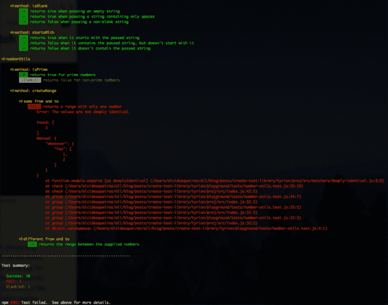

This is how the output of our testing framework will look like

我保证，这会很有趣的。=)

很可能，自动化测试是你日常工作的一部分(如果不是，请停止阅读这篇文章，从开始开始，向 TDD 之父学习)。你使用测试框架如 [Node-tap](https://www.node-tap.org/) (或 [Tape](https://github.com/substack/tape) )、 [Jasmine](https://jasmine.github.io/) 、 [Mocha](https://mochajs.org/) 或 [QUnit](https://qunitjs.com/) 已经有一段时间了，只是接受它们做一些神奇的事情，而不去问太多关于它们的问题。或者，如果你像我一样，也许你总是对事物如何工作感到好奇，当然包括测试框架。

本文将指导您从头开始创建一个 JavaScript 测试框架的过程，它有一个相当不错的 DSL 和一个非常详细的输出。这是我的 **#LearnByDIY** 系列的第一篇文章。这个想法是通过创建更简单的版本来揭开我们所熟悉的某些软件的神秘面纱。

#### 放弃

开始之前，请注意一些重要事项:

*   本文的目标是**而不是**创建一个生产就绪的工具。请，**不要使用我们将要创建的框架来测试产品代码。其目的纯粹是教育。=)**
*   自然，我们的小框架不会是全功能的。诸如异步测试、并行执行、更丰富的匹配器集、CLI(带有类似`--watch`的选项)、可插拔报告器和 DSL 等。，不会出现在我们的最终版本中。然而，我**强烈建议**继续摆弄这个项目，也许**尝试实现这些缺失的部分**。也许你可以把它转变成一个严肃的开源项目。我很想知道这个玩具项目成为一个“实际的”测试框架。

### ⚔️·提利昂——一个微型测试框架

我们的框架将会很小，但是对于它的大小来说是“勇敢”的。所以，没有比提利昂更好的名字了(是的，他也是我最喜欢的角色)。


Tyrion is small, but brave.

我们将在这个项目中使用 Node.js，包括好的和旧的 CommonJS 模块。您需要的最低节点版本是 v8.6.0。如果您有旧版本，请更新它。

哦，我差点忘了…我在整篇文章中使用了[纱线](https://yarnpkg.com/lang/en/docs/install/)，用于类似`yarn init`、`yarn link`等事物，但是你可以以类似的方式使用“香草”NPM(`npm init`、`npm link`、…)。

#### 创建项目文件夹结构

首先，让我们创建以下文件夹结构:

```
tyrion/||______ proj/|      ||      |______ src/||______ playground/       |       |______ src/       |______ tests/
```

换句话说:

```
$ mkdir -p tyrion/proj/src tyrion/playground/src tyrion/playground/tests
```

我们需要两个文件夹，每个文件夹对应一个独立的项目。

*   `proj`文件夹将包含 Tyrion 框架包。
*   `playground`文件夹将包含一个可任意处理的节点项目，用于使用我们的框架。它将作为我们开发过程中的实验室。

#### 初始化节点项目

转到`playground`文件夹并运行`yarn init -y`。这个命令生成一个基本的 package.json 文件。打开它，删除`"main": "index.js",`行，并添加一个“脚本”条目，如下例所示:

```
{  "name": "playground",  "version": "1.0.0",  "scripts": {    "test": "node tests"  },  "license": "MIT"}
```

创建这个文件后，让我们对另一个项目，Tyrion 包本身做同样的事情。在`proj`文件夹中，运行`yarn init`。它将提示您输入一些信息，以便正确创建 package.json 文件。输入以下值(粗体):

```
question name (proj): tyrion <enter>question version (1.0.0): <enter>question description: <enter>question entry point (index.js): src/index.js <enter>question repository url: <enter>question author: <enter>question license (MIT): <enter>question private: <enter>
```

现在，我们需要将 Tyrion 作为开发依赖项安装在我们的 playground 项目中。如果它是一个已发布的包，我们只需要通过`npm i --dev`或`yarn add --dev`直接安装它。因为我们只有提利昂在本地，这是不可能的。幸运的是，Yarn 和 NPM 都有一个特性可以在这个包的“初始”阶段帮助开发者，允许我们模拟两个包之间的链接(一个作为另一个的依赖)。

要创建这个依赖关系链接，请转到`proj`文件夹并运行:

```
$ yarn link
```

然后，在`playground folder`中，运行:

```
$ yarn link tyrion 
```

仅此而已。现在提利昂是游乐场项目的附属品。

#### 创建一些模块作为我们的“试验品”

在`playground/src`文件夹中，让我们创建两个要由提利昂测试的模块:

#### 编写一些测试

现在是发挥我们想象力的时候了。提利昂的 DSL 应该是什么样子？你是否厌倦了`expect`、`assert`等等？让我们把它变得不同，只是为了好玩。我建议用`guarantee`作为我们的断言函数。你喜欢吗？

我们写几个测试看的更清楚一点。当然，什么都不会起作用，因为我们没有在我们的框架中实现任何东西。

和一个`tests/index.js`文件，只在一个地方导入我们的测试。

提利昂将借用 Node-tap 的一个原则:

> 测试文件应该是可以直接运行的“正常”程序。

> 这意味着它不需要一个特殊的运行器来将魔法函数放入全局空间。是一种非常好的运行测试的方式，它应该和运行测试的人运行测试时的功能完全一样。JavaScript 测试应该是 JavaScript 程序；不是标点符号怪异的英文诗。

> [https://www . node-tap . org/# all-I-tas-sono-tas](https://www.node-tap.org/#tutti-i-gusti-sono-gusti)。

您可能还记得，在我们 playground 的 package.json 文件中，我们有一个简单运行`node tests`的`test`脚本。因此，要执行它，只需键入`npm test`并按回车键。是的，做吧。让我们看看它崩溃了:

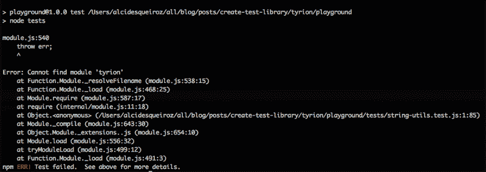

这个错误很明显。我们的框架里什么都没有。根本没有模块被导出。要修复它，在`proj`文件夹中，创建一个导出空对象的`src/index.js`文件，如下所示:

```
module.exports = {};
```

现在，我们将再次运行`npm test`:


Node 在抱怨，因为我们的`guarantee`函数不存在。这也很容易解决:

```
const guarantee = () => {};
```

```
module.exports = { guarantee };
```

再次运行测试脚本:

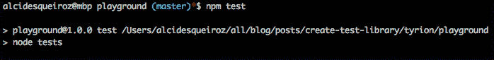

瞧啊。没有错误，但是也什么都没发生。=(

#### 保障功能

如果提供的值是 [*truthy*](https://developer.mozilla.org/en-US/docs/Glossary/Truthy) ，我们的断言函数应该完美执行，但是如果是 [*falsy*](https://developer.mozilla.org/en-US/docs/Glossary/Falsy) ，应该抛出一个错误。

让我们来实现它:

为了测试它是否有效，让我们将另一个断言附加到我们的`number-utils.test.js`文件的末尾:

```
guarantee(123 === 321); // This should fail 
```

现在再运行一次:

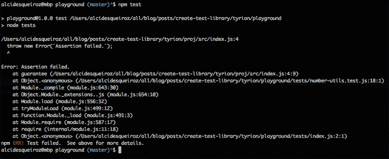

啊哈！有用！很丑，但是很实用。

#### 检查功能

我们需要一种方法将断言包装到测试单元中。基本上，所有的测试框架都有这个特性，比如 Jasmine 中的`it`函数或者 Node-tap 中的`test`函数。

在 Tyrion 中，我们的测试单元函数将被称为`check`。它的签名应该是`check(testDescription, callback)`。我们还希望它给我们一个更友好的输出，描述通过和失败的测试。

这将是它的样子:

现在，我们可以重写我们的测试来使用新的`check`函数:

重新运行我们的测试套件:

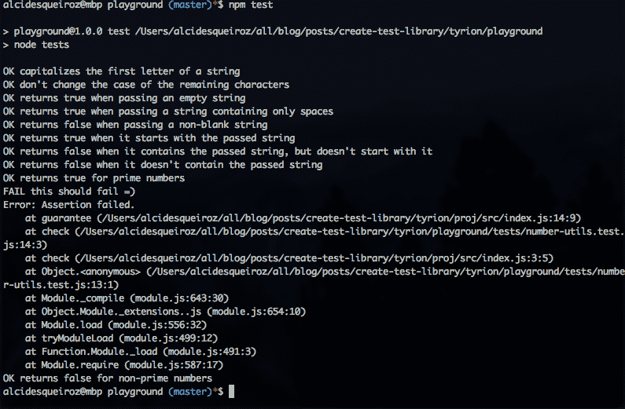

酷毙了。但是…有些颜色呢？？区分测试通过和失败不是更容易吗？

添加[颜色](https://www.npmjs.com/package/colors)模块作为依赖:

```
yarn add colors
```

因此，将其导入到`proj/src/index.js`文件的顶部:

```
const colors = require('colors');
```

让我们在输出中加入一些颜色:

```
const check = (title, cb) => {  try{    cb();    console.log(`${' OK '.bgGreen.black} ${title.green}`);  } catch(e) {    console.log(`${' FAIL '.bgRed.black} ${title.red}`);    console.log(e.stack.red);  }};
```

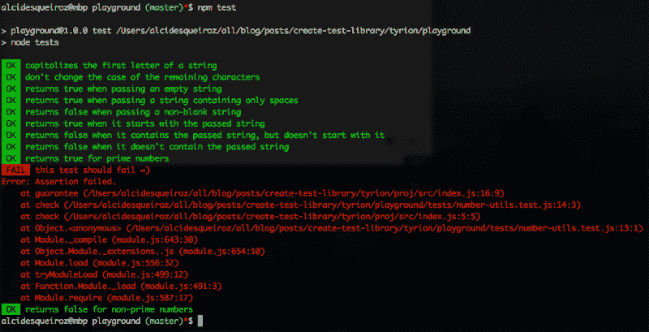

那更好。=)

#### xcheck 函数

如果有一种简单的方法来禁用特定的测试就好了，比如 Jasmine 中的`xit`函数。这可以很容易地通过创建一个无操作函数来实现，该函数只输出一个测试被禁用(嗯，它不是完全无操作，但几乎是):

```
const xcheck = (title, cb) => {  console.log(`${' DISABLED '.bgWhite.black} ${title.gray}`);};
```

```
module.exports = { guarantee, check, xcheck };
```

因此，在`number-utils.test.js`文件中导入`xcheck`函数并禁用我们的一个测试:

```
const { guarantee, check, xcheck } = require('tyrion');const numberUtils = require('../src/number-utils');
```

```
// method: isPrimexcheck('returns true for prime numbers', () => {  guarantee(numberUtils.isPrime(2));  guarantee(numberUtils.isPrime(3));  guarantee(numberUtils.isPrime(5));  guarantee(numberUtils.isPrime(7));  guarantee(numberUtils.isPrime(23));});
```

这是它的行为方式:

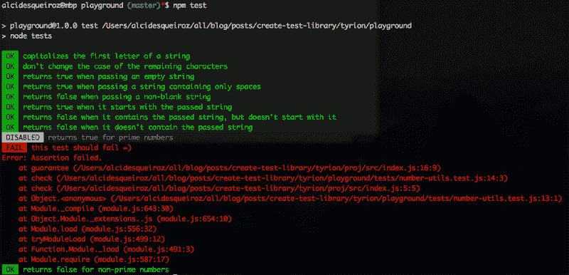

#### 测试总结和退出代码

如果我们想在 CI 服务器中使用 Tyrion，它需要用不同的错误和成功退出代码来完成它的过程。

另一个理想的特性是测试摘要。如果能知道有多少测试通过了、失败了或者跳过了(禁用的测试)，那就太好了。为此，我们可以在`check`和`xcheck`函数中增加一些计数器。

我们将创建`end`函数，它打印测试摘要并以适当的退出代码结束:

不要忘记在`playground/tests/index.js`文件中调用它:

```
const { end } = require('tyrion');
```

```
require('./string-utils.test');require('./number-utils.test');
```

```
end();
```

或者也许:

```
const tyrion = require('tyrion');
```

```
require('./string-utils.test');require('./number-utils.test');
```

```
tyrion.end();
```

现在，让我们重新运行`npm test`:

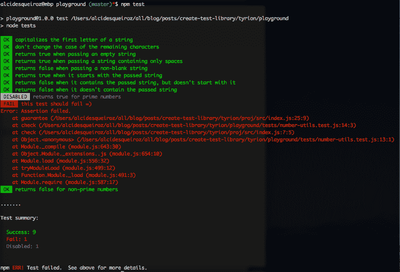

太好了，有用。

#### 群体功能

许多测试框架都有一些将相关测试分组的方法。例如，在 Jasmine 中，有一个`describe`函数。为此，我们将实现一个`group`函数:

并更新我们的测试以使用这个新功能:

这是新的输出:

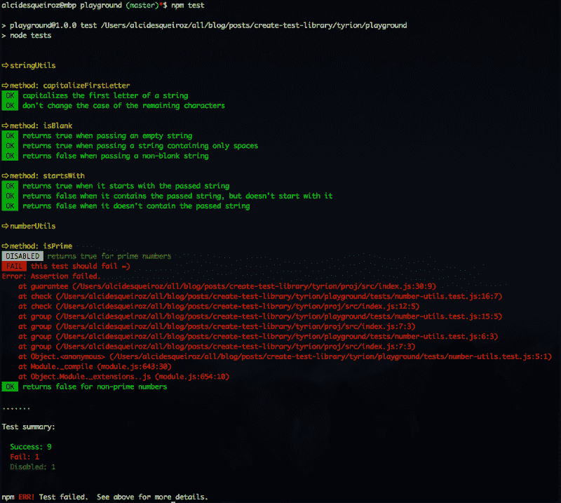

好消息是这很有效。坏消息是越来越难理解了。我们需要一种方法来缩进这个输出，以使它更具可读性:

再次运行:

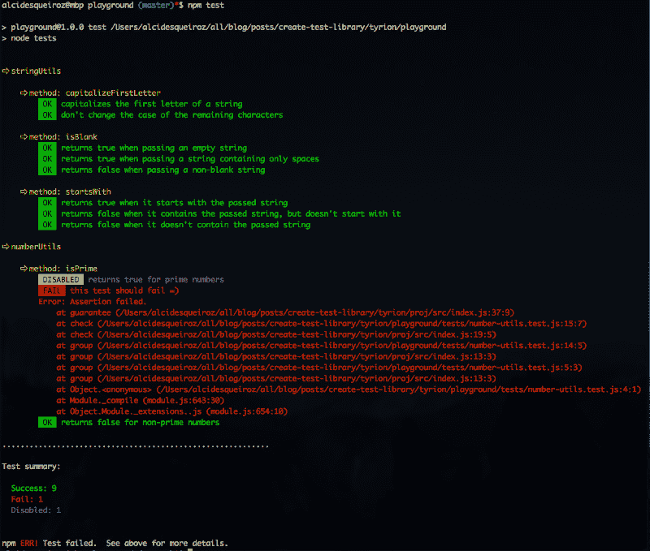

这样好多了！

那么，它是如何工作的呢？

*   `repeat`函数重复字符串`n`次。
*   通过使用`repeat`函数，`indent`函数重复缩进(四个空格)`n`次。
*   `indentLines`函数通过在每一行的开头添加`n`缩进来缩进多行的字符串。我们用它来缩进错误堆栈。
*   `indentLevel`变量在每个组执行开始时递增，在组执行结束时递减。这样，嵌套组可以正确缩进。

#### 更多匹配者

对于很多场景来说,`guarantee`函数不够灵活。为了使我们的测试更有意义，我们需要一组更丰富的匹配器。

首先，创建`matchers`文件夹:

```
$ mkdir proj/src/matchers
```

现在，我们将在一个单独的文件中创建每个匹配器:

`same`匹配器使用严格的相等操作符(===)来测试两个参数是完全相同的对象(对于引用类型)还是相等的(对于基本类型)。它的行为类似于 Jasmine 中的`toBe`匹配器和 node-tap 中的`t.equal`。

**注:** Node-tap 也有一个名为`t.same`的匹配器，但它的工作方式不同(它不会验证两个对象是否完全相同，而是验证两者是否深度等价)。

匹配器验证两个参数是等价的。它使用`==`运算符来比较值。

匹配器对两个对象进行深度比较。这种比较可能相当复杂，或者至少对于本文的目的来说太复杂了。因此，让我们安装一个现有的模块来处理深度相等，并在我们的匹配器中使用它:

```
$ yarn add deep-equal
```

然后:

错误看起来是这样的:

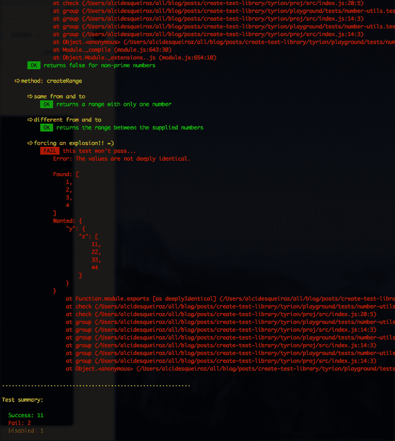

如果提供的值是真实的，匹配器将失败。

`truthy`匹配器的工作方式类似于我们的`guarantee`函数。当提供的值为真时通过，如果为假则中断。

如果函数抛出错误，匹配器将通过。可以指定想要的错误消息，但这不是强制性的。

一个用于重新导出所有匹配器的`index.js`文件:

最后，让我们把它们粘在一起:

你可以这样使用我们的新匹配器:

```
const { guarantee, check } = require('tyrion');
```

```
check('playing with our new matchers', () => {  // The original guarantee function still works  guarantee(123 === 123);
```

```
 guarantee.truthy('abc');  guarantee.falsy(null);
```

```
 const a = { whatever: 777 };  const b = a;  guarantee.same(a, b);  guarantee.identical(undefined, null);
```

```
 const c = { whatever: { foo: { bar: 'baz' } } };  const d = Object.assign({}, c);  guarantee.deeplyIdentical(c, d);
```

```
 function boom() { throw new Error('Some error...'); }  guarantee.throws(boom);  guarantee.throws(boom, 'Some error...');});
```

#### beforeEach 函数

为了实现一个`beforeEach`函数，我们需要使用一个堆栈来累积所有的`beforEach`回调。每次声明一个组时，都会为创建的每个新的作用域级别执行此操作:

它是如何工作的？

*   每次声明一个组时，我们都将一个新数组推送到`beforeEachStack`变量。该数组将累积在该作用域中声明的所有`beforeEach`回调。
*   在一个组执行完成后，我们移除回调堆栈顶部的数组。
*   `beforeEach`函数接收一个回调，并将其附加到回调堆栈顶部的数组中。
*   在每个`check`函数的开始，我们调用堆栈中所有级别的每个`beforeEach`回调。

#### beforeAll 函数

我们最后添加的是`beforeAll`函数。**为了简单起见**，我们假设对`beforeAll`函数的调用总是放在所有组和测试之前(**或**，当作用域在一个组内时，在它的最顶端)。

否则，如果我们想确保`beforeAll`函数即使在一个组的中间或末尾也能正常工作，我们应该极大地改变我们现有的逻辑。我们不会这么做，因为这不是这个函数的合理用法。

我们的版本`beforeAll`将只是接收一个回调并立即执行它。

```
const beforeAll = cb => cb();
```

```
module.exports = {   group, check, xcheck, guarantee, beforeAll, end };
```

用法示例:

```
const { guarantee, check, group, beforeAll } = require('tyrion');
```

```
let a;beforeAll(() => {  a = { something: 'example' };});
```

```
group('playing with the beforeAll function', () => {  let b;  beforeAll(() => {    b = { something: 'example' };  });
```

```
 check('some test', () => {    guarantee.deeplyIdentical(a, b);  });
```

```
 check('another test', () => {    guarantee.identical(11, 11);  });});
```

#### 提利昂的最终版本

这是一段漫长的旅程，但提利昂终于完成了。=)

我添加了一个静默选项来禁用日志记录。它被用来使测试 Tyrion 变得更容易(是的，测试框架也需要被测试)。

完整的项目可在[这里](https://www.github.com/alcidesqueiroz/tyrion)获得。

#### 可能的改进

提利昂缺少很多特性，比如:

*   支持异步测试
*   测试的并行执行
*   `afterEach`和`afterAll`功能
*   一个`xgroup`功能，禁用整个组
*   类似于[茉莉的合体](https://jasmine.github.io/api/edge/global.html#fit)的功能
*   间谍
*   从报告逻辑中分离 DSL。
*   可插入的记者
*   终端 CLI(带`--watch`选项)
*   更多的匹配
*   更友好的错误堆栈

我鼓励你继续玩这个项目。可以随意使用和扩展。请在下面留言，让我知道你的想法、建议和实验。=)