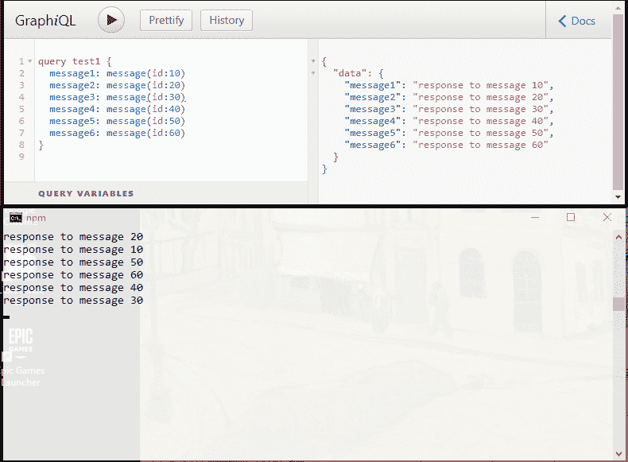
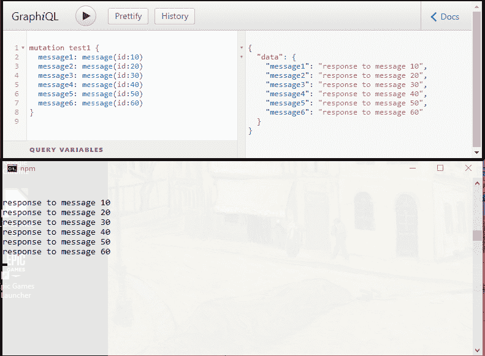

# 如何在 GraphQL 中包装流 I/O 接口

> 原文：<https://www.freecodecamp.org/news/wrapping-an-streaming-i-o-interface-in-graphql-931650dafd3b/>


Photo by [Ezra Comeau-Jeffrey](https://unsplash.com/@emcomeau?utm_source=ghost&utm_medium=referral&utm_campaign=api-credit) / [Unsplash](https://unsplash.com/?utm_source=ghost&utm_medium=referral&utm_campaign=api-credit)

这篇文章将讨论如何使用 GraphQL 来处理一个使用 I/O 流在客户机和服务器之间进行交互的服务。在之前的一篇文章中，我为[通用国际象棋接口](http://wbec-ridderkerk.nl/html/UCIProtocol.html) (UCI)模拟了一个 GraphQL API。UCI 使用 [stdio](https://www.urbandictionary.com/define.php?term=stdio) 进行通信，从输入流接受命令，并通过输出流发送响应。我将以 UCI 为例，但不会详细描述 UCI。

### 晒干的鱼类

Stockfish 是著名的支持 UCI 的国际象棋引擎。使用 NodeJS 和模块 stockfish.js(原始的 JavaScript transpilation ),很容易设置一个运行引擎，通过 stdio 实现 UCI:

*   创建并刻录到文件夹中
*   `npm init`
*   `npm install stockfish`
*   `node node_modules/stockfish/src/stockfish.js`

然后你可以在终端窗口中输入 UCI 命令并查看结果。

### [查询 vs 变异](http://graphql.org/learn/schema/#the-query-and-mutation-types)综述

查询是并行执行的。这对于无状态 API 来说不是问题，因为无论结果返回的顺序如何，每个查询都将返回相同的结果。UCI 不是无状态的，所以命令和结果必须按顺序操作。下面是命令行“客户端”和象棋引擎之间的交互示例:

```
GUI     engine

// tell the engine to switch to UCI mode
uci

// engine identify  
    id name Shredder
		id author Stefan MK

// engine sends the options it can change
		option name Hash type spin default 1 min 1 max 128
		option name NalimovPath type string default 
		option name NalimovCache type spin default 1 min 1 max 32
// the engine has sent all parameters and is ready
		uciok

// now the GUI sets some values in the engine
// set hash to 32 MB
setoption name Hash value 32
setoption name NalimovCache value 1
setoption name NalimovPath value d:\tb;c\tb

// this command and the answer is required here!
isready

// engine has finished setting up the internal values
		readyok

// now we are ready to go
```

These commands are abstracted from the [UCI documentation](http://wbec-ridderkerk.nl/html/UCIProtocol.html)

引擎对客户端命令的响应是缩进的。第一个状态转换是启动 UCI 协议，其中引擎以默认选项设置和指示完成的 **uciok** 信号进行响应。此时，客户端可以配置选项。这些只有在命令**就绪**发出后才会生效。当所有选项设置好后，引擎以 **readyok** 响应。稍后的状态转换将在游戏设置和分析期间发生(未显示)。

并行运行几个查询可能会过早地发出命令，因为没有一个查询会等待另一个查询的响应。这个问题可以用一个模拟异步服务的简单 GraphQL API 来说明:

```
import {makeExecutableSchema} from 'graphql-tools';

const typeDefs = `
type Query {
  message(id: ID!): String!
}
type Mutation {
  message(id: ID!): String!
}
`

const resolvers = {
  Query: {
    message: (_, {id}) => new Promise(resolve => {
      setTimeout(function() {
        let message = `response to message ${id}`;
        console.log(message)
        resolve(message);
      }, Math.random() * 10000)
    })
  },
  Mutation: {
    message: (_, {id}) => new Promise(resolve => {
      setTimeout(function() {
        let message = `response to message ${id}`;
        console.log(message)
        resolve(message);
      }, Math.random() * 10000)
    })
  }
}

const schema = makeExecutableSchema({typeDefs, resolvers});
export {
  schema
};
```

结果是:



Order of resolution differs from response.

在控制台窗口(下半部分)中，您可以看到何时返回响应。现在通过变异执行相同的请求:



Order of resolution matches order of response

获得响应需要更长的时间，因为每个操作必须在调用下一个操作之前完成。

#### 这对 GraphQL UCI 包装器意味着什么

在之前的一篇文章中，我解释了为什么 GraphQL 可以用来包装 UCI。也许最简单的方法是使用 GraphQL 的订阅服务。这将通过 web 套接字将事件发送回客户端。命令通过查询或变异发送，响应作为订阅的事件返回。

在 UCI 相互作用的情况下，突变将用于确保命令以预期的顺序执行。在执行命令之前，您将首先设置一个订阅来接收响应。通过使用 GraphQL，订阅响应是类型安全的，很像查询或变异请求的返回值。

客户端调用 GraphQL 变体通过 HTTP 发送请求，然后通过 web socket 接收响应(如果有)。虽然在服务器上实现起来很简单，但是基于套接字的接口对于客户端来说很笨拙，因为它是多步骤的:

1.  订阅预期的响应事件
2.  通过 HTTP 发送命令
3.  接收 HTTP 响应(收到请求的确认，而不是实际结果)
4.  等待真正的响应通过 web 套接字到达。
5.  根据回应采取行动

#### 简化客户端-服务器交互

让我们对 UCI 发送的回复类型进行分类:

1.  单线响应
2.  不响应
3.  多行、多值响应，带终止符

*(旁白:没有明确的时间限制也可以开始分析(“无限 **go** ”)。这将属于类别 2，因为分析将到达最佳移动终止点，通过用尽或通过**停止**命令。)*

第一类是简单的调用和响应，这些可以作为普通的 GraphQL HTTP 请求来处理。不需要订阅响应:解析器可以在响应到达时返回它。

**类别 2** 没有收到来自引擎的响应，但是 HTTP 需要响应。在这种情况下，需要做的就是确认请求。

**类别 3** 有两个子类型:具有多行但固定响应的请求(例如**选项**，以及具有流式、中间响应的请求( **go** )。前者也可以通过 HTTP 处理，因为响应是可预测的和及时的。后者具有变化的(可能很长的)完成时间，并且可能向客户端发送一系列感兴趣的中间响应，客户端希望实时接收这些响应 ***。*** 由于我们不能对一个 HTTP 请求发回多个响应，后一种情况不能单独由 HTTP 处理，所以上面描述的订阅接口还是合适的。

尽管 UCI 是一个流接口，但在大多数情况下，HTTP 响应/请求可以用于通过 GraphQL 进行交互。

### 结论

1.  GraphQL 模式应该由突变组成，因为 UCI 是有状态的，命令必须按顺序执行
2.  对于 1 类和 2 类命令，HTTP 请求/响应是最简单的。在后端仍然有流在进行，但是 GraphQL 解析器会在将命令发送到引擎之前实例化一个特定于预期 UCI 命令响应的 UCI 流侦听器。当来自引擎的响应到达时，该侦听器将通过 HTTP 解析 GraphQL 请求。这使得客户的工作更轻松。
3.  服务器还将跟踪 UCI 状态，以确保命令在正确的上下文中执行。如果客户端试图在引擎能够处理命令之前执行该命令，将会返回 HTTP 状态错误
4.  对于那些没有来自 UCI 的预期响应的情况，GraphQL 解析器将只确认收到了命令。
5.  类别 3 的确定情况(有可靠和快速的响应)可以由 HTTP 处理。
6.  在终止前有中间响应的不确定情况可以通过 web socket 来处理。反过来，这可以包装在 GraphpQL 订阅服务中。

[模拟实现](https://github.com/JeffML/chessQ/tree/chessQ-mock)几乎涵盖了所有的要点，但是这个简短的分析提供了一个继续实现的蓝图。

这篇文章的代码可以在找到[。](https://github.com/JeffML/query_async)