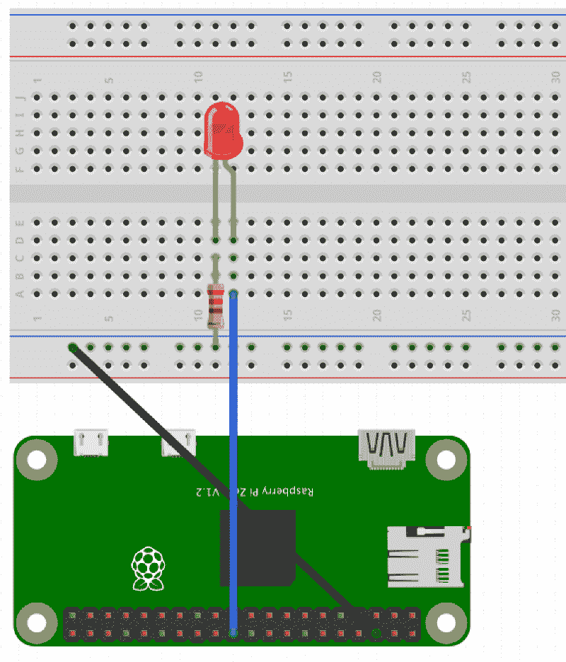
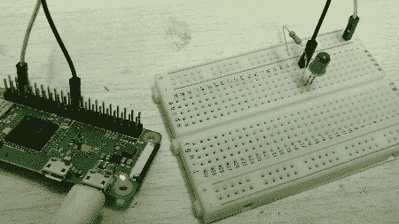

# 使用 Raspberry Pi 和 GPIO 引脚控制外部 LED

> 原文：<https://www.freecodecamp.org/news/hello-gpio-blinking-led-using-raspberry-pi-zero-wh-65af81718c14/>

作者:shahbazahme

# 使用 Raspberry Pi 和 GPIO 引脚控制外部 LED

Image [source](https://www.raspberrypi.org/blog/logo-competition-we-have-a-winner/)

在这篇文章中，我们将通过创建一个“Hello World”GPIO 程序来探索 Raspberry Pi GPIO 引脚，该程序会导致红色 LED 闪烁。我们将使用 Python 编程语言。我使用的是无头的 Raspberry Pi Zero WH(带焊接头的无线)和 Raspbian Stretch Lite(基于 Debian Stretch 的最小映像的 Raspberry Pi 操作系统)。

我将使用`ssh`与我的无头 Pi 对话，并使用`scp`命令将必要的文件从我的 Mac 传输到 Pi。我假设您已经安装了 Raspbian 操作系统并运行了您的 Raspberry Pi。如果没有，那么网上有很多文章描述如何设置你的 Pi 和安装 Raspbian，包括官方的 [Raspberry Pi 文档](https://www.raspberrypi.org/documentation/)。

你需要的东西:

*   1 x Raspberry Pi(我使用的是 Pi 零 WH 模型)
*   1 块面包板
*   1 个红色 LED 灯
*   1 x 330 欧姆电阻器
*   2 根母到公跳线电缆

### GPIO 引脚配置

**GPIO** 代表**通用输入输出**。借助 GPIO 引脚，Raspberry Pi 可以与外部电子组件连接和交互。最近的 Raspberry Pi 型号(Pi 3、Pi Zero、Pi W 和 Pi WH 型号等)包含 40 个 GPIO 引脚。每个引脚都可以打开或关闭，或者用电子术语来说是进入`HIGH`或`LOW`。如果引脚是`HIGH`，它输出 3.3 伏，如果引脚是`LOW`，它关闭。

在我们的例子中，我们将使用`pin 6`(地)和`pin 25`。要了解更多关于树莓 Pi 中 GPIO 引脚的信息，请查看 [pinout.xyz](https://pinout.xyz/) 。

### 设置电路

构建电路时，您应该关闭 Pi。我们将创建一个电路，如下图所示:

**注**:图中的电阻为 220 欧姆，但我在电路中使用了 330 欧姆。

1.  使用母头对公头跨接电缆将`pin 6`(接地)(上图中的黑色电缆)连接到试验板负极排。
2.  使用另一根母到公跳线将 GPIO `pin 25`连接到试验板上由行`A`和列`12`表示的点，如上图所示(上图中的蓝色电缆)。
3.  将 330 欧姆**电阻器**的一端连接到负极行(上面黑色电缆先前连接的绿色高亮行)，并将另一端连接到试验板上由行`C`列`11`表示的点，如上图所示。
4.  **LED** 的短端为负端，长端为正端。较长的一端应始终连接到电路中电压较高(即电位较高)的点。 **LED** 的较短一端通过蓝色电缆连接到 GPIO `pin 25`(可以输出 3.3V)，较长一端通过黑色电缆连接到地`pin 6`(为 0V，相当于电池的负极)，两者之间有一个电阻。

### 电阻器

请记住，我很久以前(大约 4 到 5 年前)上过电气和电子工程的入门课。)，我有两个问题需要答案。请原谅我在这种情况下的幼稚。

1.  为什么电路中需要电阻？
2.  我们如何确定电阻应该是多少欧姆(电阻的量度)？

需要一个电阻来耗散树莓 Pi 的额外电能(电压)。Raspberry Pi 在 3.3V 时的额定电源为 50mA。假设我们的红色 LED 可以具有大约 2V 的正向电压(正向电压是 LED 开启时使用的“负电压”)，消耗 4mA 电流。因此，剩余的 1.3V 应该由电阻消耗掉。

利用欧姆定律，`V = IR`、`R` = `(3.3V - 2V) / (4/1000)`，得出大约`325 ohms`——所以我推荐使用一个 **330 欧姆的电阻**。

我是在[树莓派论坛讨论](https://www.raspberrypi.org/forums/viewtopic.php?t=84240)中发现这一点的。

### 使用 Python 使 LED 闪烁

既然我们已经有了一个完整的电路，下一步就是对 GPIO 端口进行编程，让奇迹发生:让 LED 闪烁。我们将使用 GPIO `pin 25`的输出来使 LED 闪烁。

启动您的 Pi 并使用 ssh 连接到它。在终端中，使用下面的命令安装 Python 库`gpiozero`。`gpiozero`库使得使用 GPIO 引脚和连接的外部组件变得非常简单。

要安装 Python 库，请键入`sudo apt-get install python3-gpiozero`。

现在我们将运行一些 Python 代码。将下面的代码保存到您的 Pi 文件系统的一个名为`blink1.py`的文件中。该脚本基本上打开连接到`pin 25`的 LED，休眠 1 秒，然后关闭 LED，再次休眠 1 秒。并且这在一个循环中持续进行，直到程序终止(按下`ctrl` + `c`)。

现在从终端进入保存脚本的目录，使用命令:`python3 blink1.py`运行它。

您将看到红色 LED 像这样闪烁:

使用类似的设置，我们可以用`gpiozero`创建许多有趣的东西。查看[关于`gpiozero`的文档](https://gpiozero.readthedocs.io/en/stable/recipes.html)，其中展示了一些有趣的例子。尝试建立一个交通灯系统。

*最初发布于[shahbaz.co](http://shahbaz.co)2018 年 4 月 7 日。*