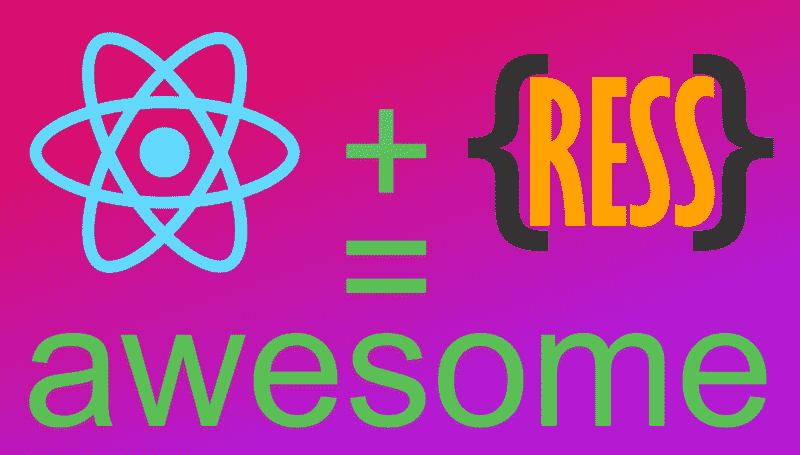
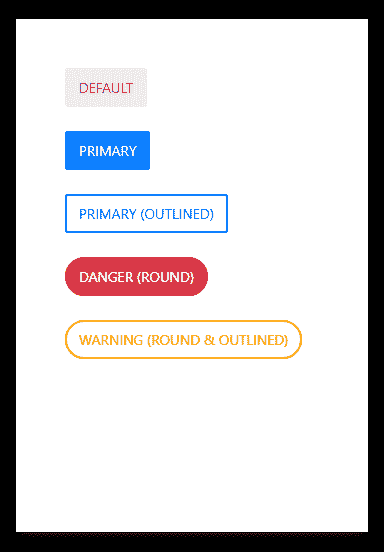
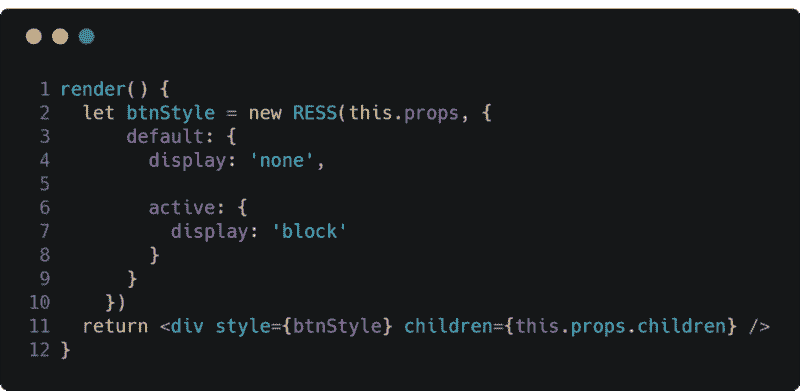

# 反应+ RESS =更多

> 原文：<https://www.freecodecamp.org/news/react-ress-awesome-6086d784195/>

作者布哈里·穆罕默德

# 反应+ RESS =更多



React + RESS = More

**RES sheet**(*React Evaluated style sheet)*，更好地被称为 **RESS** ，是一个微小的预处理器，旨在为 **React** ( **Native** )做 **LESS** 对 **CSS** 的作用。 **RESS** 使用了一种少**多**的风格方法，以避免重复的风格定义。我在 RESS 设计了以下按钮。



The code to accomplish this could be found in this [Gist](https://gist.github.com/bukharim96/e0b415d99847aac3799bc25b33873a83).

#### 一点历史

我第一次想到为 **React** 编写一个更好的样式解决方案，是在为 **React Native** 开发一个新的 **UI** 包的时候。在开发过程中，困扰我的传统`StyleSheet`组件的第一个问题是它严重缺乏 **CSS** 所呈现的重要特性。此外，**内联样式**对于那些在过去五年里一直鼓吹反对它的人来说是相当忌讳的。我对此很虔诚。

我开始为我的 **UI** 框架构建一个类似自举的按钮组件。我首先使用了`StyleSheet`组件来实现这一点，最后我使用了一系列的`if`语句，以便在相应地设计按钮样式之前检查某些道具是否存在。例子:`<Button primary>Submit<`；/Button >应该渲染出一个蓝色的按钮，以此类推。

由于这种低效的方法，>组件上的`<Butt`文件变得不必要的大。没过多久，我就决定放弃这种乏味的造型技术，寻找一种更强大的解决方案。

我首先测试了一些试图在**反应**中提供更好造型的软件包——即:[风格组件](https://www.npmjs.com/package/styled-components)、[镭](https://www.npmjs.com/package/radium)和[魅力](https://www.npmjs.com/package/glamorous)——结果发现大多数都有自己的缺点。我主要不欣赏大多数产品的性能曲线和大封装尺寸。而最糟糕的是，他们都没有对 **React Native** 的支持。

我终于下定决心，我应该构建一个简单的解决方案，来满足我的需求以及那些与我有着同样恐惧的人的需求。我基本上想要一个解决方案，它能让我更舒服地为 **React** 和 **React 本机**组件编写样式。

出于“少即是多”的背景，我决定编写一个轻量级的包，模仿一些我最喜欢的 **CSS** 和 **LESS** 特性——比如多选器(通过道具完成)、嵌套样式和层叠样式特性。所有这一切都不会影响性能，也不会引入一种完全陌生的学习方法。

这就是导致 **RESS** 的想法。

#### 在后台

**RESS** 基于两个必需的参数输出一个样式对象，即:一个`props`对象和一个 **RESSheet** 对象。它自动验证道具的存在，并返回 **RESSheet** 对象中提供的“选择器”(对象键)的相应样式。 **RESSheet** 对象是一个普通的 **React 样式表**对象——在`StyleSheet.create({…})`中使用的那个——具有一些额外的有用特性:

*   自动应用于组件的`default`选择器。例如:`default: {fontSize: 16}` —这将最初应用于组件，而不管其`props`。
*   能够指定**多属性**作为选择器— `‘h1, h2, h3, h4, h5, h6’: {fontWeight: ‘bold’}`，这将*加粗*具有 h1 — h6 属性范围的组件的文本。
*   **嵌套样式** —默认情况下，具有以下 **RESSheet** 的组件将被隐藏，当它具有`active` prop 时显示，这可用于 tab / accordion 行为:



然后返回的对象将被放入组件的`style`属性中。

在不久的将来，我已经为 **RESS** 计划了一些更棒的功能。

#### 与其他解决方案相比，RESS

与 **RESS** 相比，人们可能会认为默认的`StyleSheet`组件在处理组件风格上是非常反**干巴巴的**(不要重复自己)模式的。我注意到了这一点，当我以大量试图动态设计组件样式的`if`语句结束时。

我发现[样式组件](https://www.npmjs.com/package/styled-components)是最接近竞争对手 **RESS** 的，只是因为它的性能问题和巨大的文件大小。更不用说，它在错误报告和语法突出显示方面的不足，这是由于使用了 ES6 模板字符串。我懒得去读它庞大的脚本，因为人们可以想象在它的引擎盖下发生的`string`解析和解释的类型——从可能转换 **CSS** 样式属性一直到 regex 复杂性。

相比之下， **RESS** 使用**样式对象**而不是解释的`strings`，以便不牺牲**反应**强大的错误报告和你最喜欢的文本编辑器的语法亮点。

现在不要误解我的意思，我认为[风格化组件](https://www.npmjs.com/package/styled-components)以及我提到的其他解决方案是一个不错的尝试，为**反应**沉闷的风格化方法增加了一些味道。我想说的是，它们并不适合我个人。

#### 底线…

**RESS** 只是一个很棒的小脚本，它允许我为我的 React 和 React 本地项目编写更好的 **UI** ，通过利用**不太像**的模式来鼓励抽象和减少重复。

如果你觉得有趣，一定要点击这个帖子，在 [GitHub](https://github.com/bukharim96/ressheet) 上启动这个项目的资源库，通过 NPM 安装来试试看:

```
npm install ressheet --save
```

要获得这个库的最新进展以及一些很酷的 JavaScript / React 相关技巧，请在 twitter 上关注我: [@bukharim96](https://twitter.com/bukharim96)

我希望听到积极的回应和批评，所以请随意。享受；)