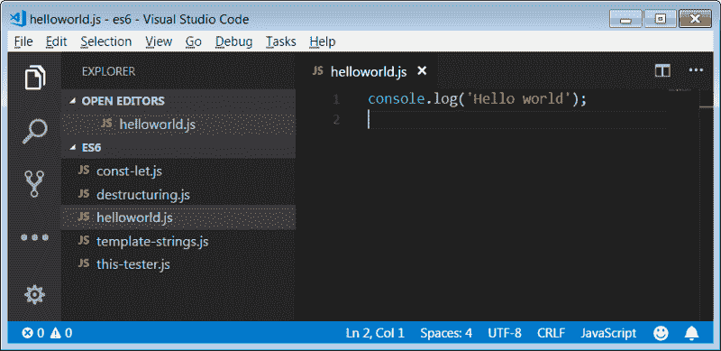
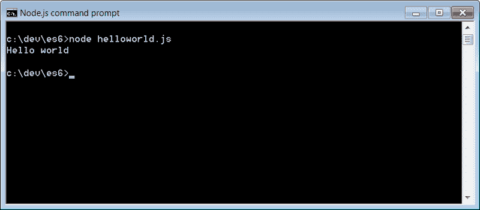
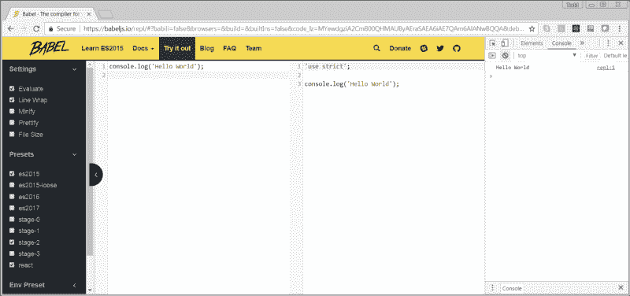

# 使用一些我最喜欢的东西开始使用 ES6

> 原文：<https://www.freecodecamp.org/news/getting-started-with-es6-using-a-few-of-my-favorite-things-ac89c27812e0/>

托德·帕尔默

# 使用一些我最喜欢的东西开始使用 ES6


Forest Path in Western Finland by [Miguel Virkkunen Carvalho](https://www.flickr.com/photos/miguelvirkkunen/ "Go to Miguel Virkkunen Carvalho's photostream")

本教程将带您通过一些简单的步骤开始学习最新版本的 JavaScript: **ES6。**

为了感受这种语言，我们将深入研究一些我最喜欢的特性。然后，我将提供一些学习 ES6 的优秀资源的简短列表。

### ES6 还是 ECMAScript 2015？

> *“名字里有什么？”*
> *——莎士比亚《罗密欧与朱丽叶》中的朱丽叶*

ECMAScript 第**6 版**的正式名称为 **ECMAScript 2015，**于 2015 年 6 月定稿。然而，总的来说，人们似乎把它简称为 **ES6** 。

以前，你必须使用像[巴别塔](https://babeljs.io/)这样的 **transpiler** 才能开始使用 ES6。现在，似乎除了微软，几乎所有人都支持 ES6 的大部分功能。平心而论，微软确实支持 Edge 中的 ES6。如果你想了解更多细节，可以看看 **kangax 的** [兼容表](https://kangax.github.io/compat-table/es6/)。

### ES6 学习环境

学习 ES6 的最好方法是编写并运行 ES6。有许多方法可以做到这一点。但是我做实验时用的两个是:

*   [Node.js](https://nodejs.org)
*   Babel.io 的[试用](https://babeljs.io/repl/)页面

#### Node.js 和 Visual Studio 代码

探索 ES6 有趣之处的最佳方式之一是在类似于 [Visual Studio Code](https://code.visualstudio.com/) 的编辑器中编写代码，然后在 [Node.js](https://nodejs.org) 中运行它

安装 Visual Studio 代码并创建一个名为`helloworld.js`的文件。将以下代码粘贴到:

```
console.log('Hello world');
```

省省吧。它应该是这样的:



从版本 6.5 开始，Node.js 已经支持大多数 ES6 标准。要运行我们的示例，打开 Node.js 命令提示符，进入您创建了`helloworld.js`文件的文件夹。并且，只需键入:

```
node helloworld.js
```

我们的`console.log`语句输出如下:



#### Babel.io

它没有 Node.js 有趣，但运行 ES6 代码的一种便捷方式是 [Babel.io](https://babeljs.io/repl) 上的[尝试一下](https://babeljs.io/repl)页面。展开**设置**并确保**评估**被选中。然后打开你的浏览器**控制台**。



Babel REPL

在左侧的列中键入 ES6。Babel 将其编译成普通的旧 JavaScript。您可以使用`console.log`并在右侧的 Web 控制台中查看输出。

### 我最喜欢的一些功能

> “这是我最喜欢的几样东西。”罗杰斯和汉默斯坦的《音乐之声》中的玛丽亚

在本节中，我们将快速浏览 ES6 的一些新功能，包括:

*   使用`let`和`const`代替`var`
*   箭头功能
*   模板字符串
*   解构

#### const 和 let 与 var

现在你在 ES6 中编码:停止使用`var`！说真的，再也不用`var`了。

从现在开始，要么用`const`要么用`let`。使用`const`设定一次值。当您想要改变数值时，使用`let`。

```
let bar = { x: 'x'};const foo = { x: 'x'};
```

```
bar.x = 'other'; // This is finefoo.x = 'other'; // This is fine
```

```
bar = {}; // This is also finefoo = {}; // This will throw an error
```

通常，我喜欢先用`const`。然后，如果它报错，我会查看我的代码，确保我真的需要能够修改变量。如果有，我改成`let`。

请务必查阅本文后面的参考资料，以获得关于`let`和`const`的更多信息。你会发现它们比`var`更直观。

#### 箭头功能

箭头功能是 ES6 的定义特性之一。箭头函数是一种编写函数的新方法。例如，以下函数的工作方式相同:

```
function oneMore(val){  return val+1;}console.log('3 and one more is:', oneMore(3));
```

```
const oneMore = (val) => val+1;console.log('3 and one more is:', oneMore(3));
```

关于箭头函数，有一些事情需要记住:

*   它们自动返回计算出的值。
*   他们有词汇`this`。

我第一次看到这个的时候，我想知道，“这个到底是什么词汇？而且，我真的在乎吗？”让我们看一个例子，为什么词法 this 如此有用，以及它如何使我们的代码更加直观:

在第 1–31 行，我们定义了一个名为`ThisTester`的类。它有两个功能`thisArrowTest()`和`thisTest()`，基本上做同样的事情。但是，一个使用箭头函数，另一个使用经典的函数符号。

在第 33 行，我们基于我们的`ThisTester`类创建了一个新的对象`myTester`，并调用了我们类中的两个函数。

```
const myTester = new ThisTester();console.log('TESTING: thisArrowTest');myTester.thisArrowTest();console.log('');console.log('TESTING: thisTest');myTester.thisTest();
```

在`thisTest()`函数中，我们看到它试图在第 26 行使用`this`。

```
console.log('function this fails', this.testValue);
```

但是，它失败了，因为那个函数有自己的`this`，并且它和类不是同一个`this`。如果你认为这是令人困惑的，那是因为它是。这一点也不直观。而且，新开发人员有时会像我一样，在第一周与`this`在回调函数和承诺上争论不休。

最终，在回顾了一堆例子之后，我发现了使用一个名为`self`的变量来保存我们想要使用的`this`的标准“技巧”。例如，在第 17 行:

```
let self = this;
```

然而，请注意在第 10 行的箭头函数中，我们可以直接访问`this.testValue`并神奇地工作:

```
let myFunction = (x) =>console.log('arrow "this" works:', this.testValue)
```

那就是**词法这个**在起作用。箭头函数中的`this`与调用它的周围函数中的`this`相同。因此，我们可以直观地使用`this`来访问我们的对象中的属性，如`this.testValue`。

#### 模板字符串

模板字符串(有时称为模板文字)是一种构造字符串的简单方法。它们非常适合多行字符串，例如那些在角度模板中使用的字符串。模板字符串使用**反勾**代替引号或撇号。

以下是创建多行长字符串的示例:

```
const myLongString = `This stringactually spans many lines.And, I don't even need to use any "strange"notation.`;console.log (myLongString);
```

您可以轻松地将变量绑定到字符串，例如:

```
const first = 'Todd', last = 'Palmer';console.log(`Hello, my name is ${first} ${last}.`)
```

看着这个变量赋值回避了这个问题:
“如果我需要在我的字符串中使用`$`、`{`或`}`字符呢？”

嗯，唯一需要特殊处理的是序列`${`。

```
console.log(`I can use them all separately $ { }`);console.log(`$\{ needs a backslash.`);
```

模板字符串在创建 HTML 模板的 [Angular](https://angular.io/) 和 [AngularJS](https://angularjs.org/) 中特别有用，因为它们往往是多行的，有很多引号和撇号。下面是一个利用反勾号的角度模板的小例子:

```
import { Component } from '@angular/core';
```

```
@Component({  selector: 'app-root',  template: `    <h1>{{title}}</h1>    <h2>My favorite hero is: {{myHero}}</h2>  `})export class AppComponent {  title = 'Tour of Heroes';  myHero = 'Windstorm';}
```

#### 解构

析构让你获得对象或数组的一部分，并把它们赋给你自己的命名变量。关于析构的更多信息，请查看我在 [ITNEXT](https://itnext.io/es6-destructuring-b8c50a20b46c) 上的文章。

### ES6 资源

这只是对 ES6 中几个新特性的简要概述。这里有一些很好的资源，可以帮助您继续学习 ES6:

*   [在巴别塔
    上了解 ES2015](https://babeljs.io/learn-es2015/) 这是所有新功能的概述。虽然没有深入探讨，但这是一个很好的页面，可以作为示例的快速参考。
*   让你的代码更干净、更简短、更易读的 ES6 提示和技巧！作者[萨姆·威廉姆斯](https://medium.freecodecamp.org/@samwsoftware)
    这是[自由代码营的](https://medium.freecodecamp.org/)媒体发表的一篇很棒的文章。
*   [MPJ](https://www.bing.com/search?q=funfunfunction) 的视频系列: [ES6 JavaScript 特性](https://www.youtube.com/playlist?list=PL0zVEGEvSaeHJppaRLrqjeTPnCH6vw-sm)
    如果你喜欢视频，MPJ 就是你要找的人。他不仅技术好，他的作品也很有趣。
*   [ES6 深度](https://hacks.mozilla.org/category/es6-in-depth/)系列关于 [Mozilla Hacks](https://hacks.mozilla.org/)
    这是一个优秀的深度系列。
*   埃里克艾略特的系列[作曲软件](https://medium.com/javascript-scene/composing-software-an-introduction-27b72500d6ea)
    通读这一个真正的挑战。不过预先警告一下，Eric 的一些东西是大学水平的计算机科学。

本文基于我 2018 年 3 月的一次讲座。