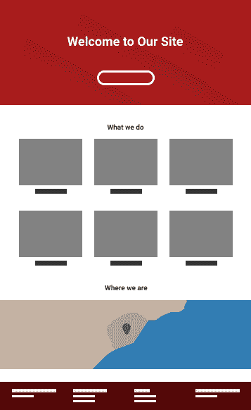
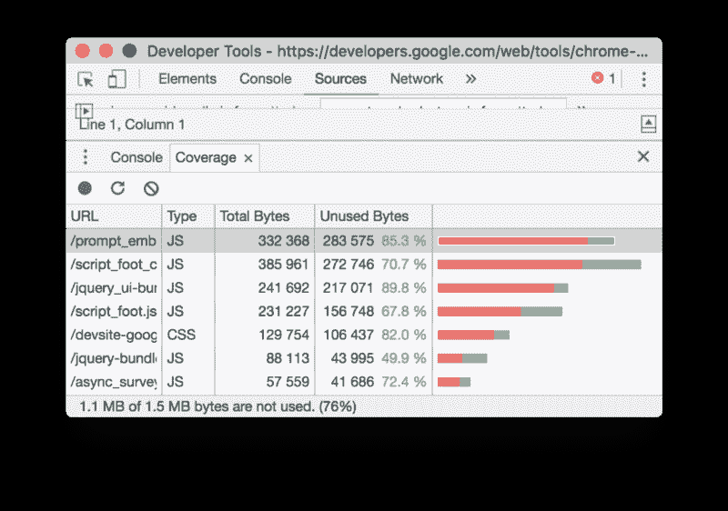
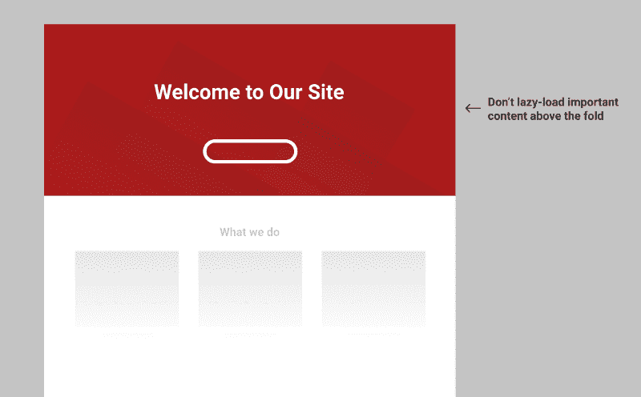
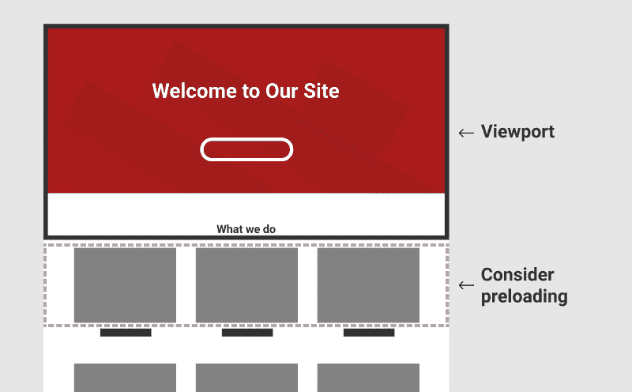
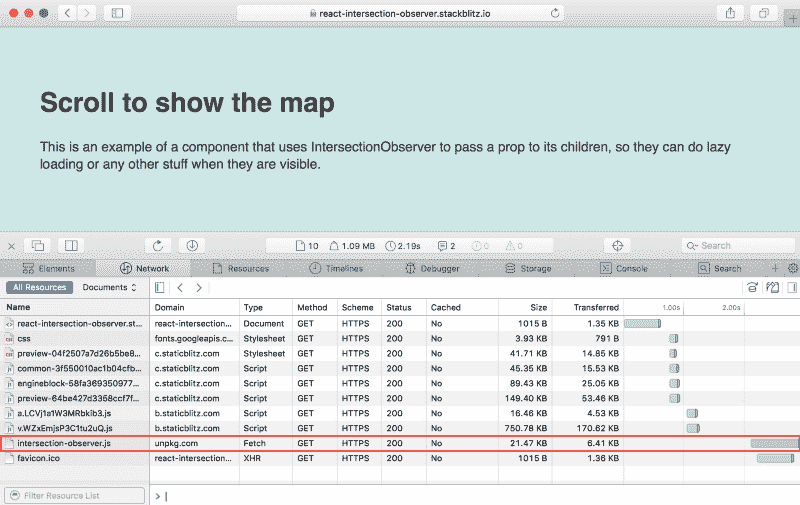

# 通过延迟加载和代码分割提高网站的性能

> 原文：<https://www.freecodecamp.org/news/increase-the-performance-of-your-site-with-lazy-loading-and-code-splitting-87258bbfc89b/>

何塞·m·佩雷斯

# 通过延迟加载和代码分割提高网站的性能

#### 如何使用高阶组件在需要的时候加载需要的内容。

组件化在 web 开发中标志着一个前和后。通常提到的主要优势是可重用性和模块化。组件是定义明确的部分，我们可以用它来构建我们的站点，就像乐高积木一样。事实证明，这种组件结构为提高我们网站的性能提供了一个很好的基础。


[Picture by](https://unsplash.com/photos/sX9_SHIqH4w) Marvin Ronsdorf

我们清楚我们的依赖关系，所以我们知道我们需要什么代码来运行一个特定的组件。延迟加载和束分裂会对页面性能产生巨大影响:请求、解析和执行的代码更少。这不仅适用于 JavaScript，也适用于所有类型的资产。

我看到许多网站可以利用这一点。我想展示一些根据需要加载内容的基本技术。

本文将使用 Preact/React，但是这些思想可以应用于任何其他组件库。

我们将涉及几个主题。

开始吧！

### 成分模式

在组件中，世界组件不仅仅用于在屏幕上渲染实际的像素。它们还可以包装传递给子组件的功能。

这通常通过使用[高阶元件(HOC)](https://reactjs.org/docs/higher-order-components.html) 来实现。这些组件接收另一个组件并添加一些功能，比如一个行为。

如果您使用了 redux，`connect`函数是一个接收您的非连接组件的特设函数。你可以在 Fran Guijarro 的《[深度反应高阶组件](https://medium.com/@franleplant/react-higher-order-components-in-depth-cf9032ee6c3e)》中找到更多的例子。

```
const MyComponent = props => (  <div>    {props.id} - {props.name}  </div>);
```

```
// ...
```

```
const ConnectedComponent = connect(mapStateToProps, mapDispatchToProps)( MyComponent );
```

作为子组件的函数(也称为“[呈现回调](https://reactpatterns.com/#render-callback)”)是类似场景中使用的另一种模式。近来它变得相当受欢迎。你可能在[反应媒体](https://github.com/ReactTraining/react-media)或[未声明](https://github.com/jamiebuilds/unstated)中见过他们。

看看这个取自 react-media 的例子:

```
const MyComponent = () => (  <Media query="(max-width: 599px)">    {matches =>      matches ? (        <p>The document is less than 600px wide.</p>      ) : ( <p>The document is at least 600px wide.&lt;/p>      )    }  </Media>);
```

`Media`组件通过传递一个`matches`参数来调用其子组件。这样，子组件不需要知道媒体查询。组件化通常使测试和维护更容易。

### 通过只加载需要的内容来提高我们网站的性能

想象一个典型的网页。你可以查看[网站雷同](https://css-tricks.com/website-sameness/)或[网页设计趋势:为什么所有网站看起来都一样？](https://www.friday.ie/journal/why-do-all-websites-look-the-same/)寻求一些灵感:)。我们将使用的示例页面包含几个部分或块:

*   一个头球(如今，一个巨大的英雄形象占据了整个折叠区)
*   有一些图像的部分
*   另一个像地图一样有沉重分量的部分
*   页脚



The basic structure of a page we will be using as an example.

映射到 React 组件的内容如下:

```
const Page = () => {  <div>    <Header />    <Gallery />    <Map />    <Footer />  </div>};
```

当用户访问页面时，他们很可能会在屏幕上看到标题。毕竟是最顶级的组件。除非滚动，否则他们不太可能看到图库、地图和页脚。

大多数情况下，当用户访问页面时，您会包含呈现所有部分所需的所有脚本和 CSS。直到最近，还很难定义一个模块的依赖关系，并加载所需的内容。

几年前，在 ES6 之前，大公司想出了自己的解决方案来定义依赖项并根据需要加载它们。雅虎建立了 [YUI 加载器](https://books.google.com/books?id=E7p-07kNfXYC&pg=PA65&lpg=PA65&dq=yahoo+yui+loader&source=bl&ots=UOcpQHdaRp&sig=AGTHNZvPYXWdU9lkj9klzTEa3ys&hl=en&sa=X&ved=0ahUKEwjn26Wti8PZAhUJDSwKHQOsCbIQ6AEIVDAG#v=onepage&q=yahoo%20yui%20loader&f=false)和脸书写了[匆忙，引导加载器和引物](https://jmperezperez.com/facebook-frontend-javascript/)。

当你发送不需要的用户代码时，你就浪费了你和用户的资源。传输数据需要更多的带宽，解析和执行数据需要更多的 CPU，需要更多的内存。这些资产将从更迫切需要资源的其他关键资产那里窃取有限的资源。

请求用户不需要的资源有什么意义呢，比如用户拿不到的图片？或者加载一个第三方组件，比如谷歌地图，以及渲染这个东西所需的所有附加资源？

像谷歌 Chrome 提供的 **这样的代码覆盖报告对我们没有太大帮助**。将执行 JS 代码，并将 CSS 应用于不可见的元素。



Code coverage tab on Google Chrome ([source](https://developers.google.com/web/updates/2017/04/devtools-release-notes#coverage))

和其他事情一样，**延迟加载**也是有代价的。我们不想对所有事情都应用延迟加载。以下是需要考虑的几点。

*   **褶皱上方不要偷懒装载**。在大多数情况下，我们希望尽可能快地呈现上述内容。每种延迟加载技术都会引入延迟。浏览器必须运行将 HTML 注入文档的 JS，解析它并开始请求引用的资产。



在哪里设置折叠？这很棘手，它将取决于用户的设备(变化很大)和你的布局。

*   **延迟加载比需要的时候早一点**。您希望避免向用户显示空白区域。为此，您可以在资产足够接近可见区域时加载所需的资产。例如，用户向下滚动，如果要加载的图像在视窗底部 100 像素以下，开始请求它。



*   **某些场景下看不见的内容**。您需要考虑到，在某些情况下，延迟加载的内容不会显示:

1)如果延迟加载的内容没有被加载，那么它在打印页面时不会显示出来。

2)当页面显示在可能不执行加载内容所需的 Javascript 的 RSS 阅读器中时，也会发生同样的情况。

3)当涉及到 SEO 时，你可能会在 Google 上索引惰性加载的内容时遇到问题。在撰写本文时，Googlebot 支持 IntersectionObserver。它用折叠上方的视口中的变化调用其回调。但是，**不会触发文件夹**下内容的回调。因此，**谷歌不会看到这些内容，也不会将其编入索引**。例如，如果你的内容很重要，你可以渲染文本和延迟加载组件，比如图像和其他小部件(比如地图)。

在这里，我使用谷歌网站管理员工具的“获取为谷歌”，渲染了一个测试页面(你可以在这里看到源代码)。Googlebot 呈现视口中显示的框中的内容，而不是其下方的内容。

### 检测某个区域何时可见的小组件

我过去曾经谈到过[延迟加载图像](https://jmperezperez.com/lazy-loading-images)。这只是一种我们可以延迟加载的资产，但是我们可以将这种技术应用到其他元素中。

让我们构建一个简单的组件，它将检测该部分何时在视口中可见。为了简洁起见，我将使用[交叉点观察器 API](https://developer.mozilla.org/docs/Web/API/Intersection_Observer_API) ，这是一种实验性的技术，有[很好的支持](https://caniuse.com/#search=intersectionobserver)。

```
class Observer extends Component {  constructor() {    super();    this.state = { isVisible: false };    this.io = null;    this.container = null;  }  componentDidMount() {    this.io = new IntersectionObserver([entry] => {      this.setState({ isVisible: entry.isIntersecting });    }, {});    this.io.observe(this.container);  }  componentWillUnmount() {    if (this.io) {      this.io.disconnect();    }  }  render() {    return (      // we create a div to get a reference.      // It's possible to use findDOMNode() to avoid      // creating extra elements, but findDOMNode is discouraged      <div        ref={div => {          this.container = div;        }}      >        {Array.isArray(this.props.children)          ? this.props.children.map(child => child(this.state.isVisible))          : this.props.children(this.state.isVisible)}      </div>    );  }}
```

该组件使用 IntersectionObserver 来检测容器是否与视口相交(意味着它是可见的)。我们利用 React 的生命周期方法清理 IntersectionObserver，在卸载时断开它的连接。

这个基本组件可以用额外的属性作为选项传递给 intersect observer 来扩展，比如边距或阈值。这允许我们检测靠近但不与视口相交的元素。这些选项是在构造函数中设置的，并且是只读的。因此，增加对选项的支持意味着当选项改变时，我们需要用新的选项重新实例化 IntersectionObserver，在`componentWillReceiveProps`中增加一些额外的逻辑，我们不打算在这里讨论。

现在，我们可以使用这个组件来延迟加载我们的两个组件，`Gallery`和`Map`:

```
const Page = () => {    <div>        <Header />        <Observer>          {isVisible => <Gallery isVisible />}        </Observer>        <Observer>          {isVisible => <Map isVisible />}        </Observer>        <Footer />    </div>}
```

在上面的代码中，我只是将`isVisible`属性传递给`Gallery`和`Map`组件，以便它们处理它。或者，如果可见，我们可以返回组件，否则返回空元素。

在任何情况下，**确保为惰性加载组件**保留区域。你不希望内容跳来跳去，所以如果你知道你的`Map`是 400px 高度，在地图渲染之前渲染一个 400px 高度的空容器。

`Map`和`Gallery`组件如何使用`isVisible`属性？让我们来看看`Map`:

```
class Map extends Component {  constructor() {    super();    this.state = { initialized: false };    this.map = null;  }
```

```
initializeMap() {    this.setState({ initialized: true });    // loadScript loads an external script, its definition is not included here.    loadScript("https://maps.google.com/maps/api/js?key=<your_key>", () => {      const latlng = new google.maps.LatLng(38.34, -0.48);      const myOptions = { zoom: 15, center: latlng };      const map = new google.maps.Map(this.map, myOptions);    });  }
```

```
componentDidMount() {    if (this.props.isVisible) {      this.initializeMap();    }  }
```

```
componentWillReceiveProps(nextProps) {    if (!this.state.initialized && nextProps.isVisible) {      this.initializeMap();    }  }
```

```
render() {    return (      <div        ref={div => {          this.map = div;        }}      />    );  }}
```

当容器显示在视口中时，我们请求注入 Google Map 的脚本。加载后，我们创建地图。这是一个很好的延迟加载 JavaScript 的例子，从一开始就不需要，其余的资源需要显示地图。

该组件有一个状态来避免重新注入谷歌地图的脚本。

让我们来看看`Gallery`组件:

```
class Gallery extends Component {  constructor() {    super();    this.state = { hasBeenVisible: false };  }  componentDidMount() {    if (this.props.isVisible) {      this.setState({ hasBeenVisible: true });    }  }  componentWillReceiveProps(nextProps) {    if (!this.state.hasBeenVisible && nextProps.isVisible) {      this.setState({ hasBeenVisible: true });    }  }  render() {    return (      <div>        <h1>Some pictures</h1>        Picture 1        {this.state.hasBeenVisible ? (                  ) : (          <div className="placeholder" />        )}        Picture 2        {this.state.hasBeenVisible ? (                  ) : (          <div className="placeholder" />        )}      </div>    );  }}
```

上面的例子定义了另一个有状态的组件。事实上，我们在状态中存储的信息与我们在`Map`中存储的信息相同。

如果图库显示在视口内，然后又显示在视口外，图像将保留在 DOM 中。在大多数情况下，这就是我们在处理图像时想要的。

### 无状态子组件

无状态组件也很有趣。它将允许我们卸载不再可见的图像，显示占位符:

```
const Gallery = ({ isVisible }) => (  <div>    <h1>Some pictures</h1>;    Picture 1    {isVisible ? (          ) : (      <div className="placeholder" />    )}    Picture 2    {isVisible ? (          ) : (      <div className="placeholder" />    )}  </div>);
```

如果这样做，请确保图像具有正确的缓存响应头。这是因为来自浏览器的后续请求命中缓存，它不会再次下载图像。

如果您发现自己让惰性加载的组件有状态只是为了跟踪它们至少可见一次，那么您可以将这个逻辑添加到`Observer`组件中。毕竟，`Observer`已经是有状态的，它可以很容易地用一个额外的`hasBeenVisible`参数调用其子节点。

```
const Page = () => {  ...  <Observer>    {(isVisible, hasBeenVisible) =>      <Gallery hasBeenVisible /> // Gallery can be now stateless    }  &lt;/Observer>  ...}
```

另一个选择是拥有一个`Observer`组件的变体，它只传递像`hasBeenVisible`这样的道具。这样做的好处是，只要元素在视图中，我们就可以断开 IntersectionObserver，因为我们不会改变它的值。我们将把这个组件称为`ObserverOnce`:

```
class ObserverOnce extends Component {  constructor() {    super();    this.state = { hasBeenVisible: false };    this.io = null;    this.container = null;  }  componentDidMount() {    this.io = new IntersectionObserver(entries => {      entries.forEach(entry => {        if (entry.isIntersecting) {          this.setState({ hasBeenVisible: true });          this.io.disconnect();        }      });    }, {});    this.io.observe(this.container);  }  componentWillUnmount() {    if (this.io) {      this.io.disconnect();    }  }  render() {    return (      <div        ref={div => {          this.container = div;        }}      >        {Array.isArray(this.props.children)          ? this.props.children.map(child => child(this.state.hasBeenVisible))          : this.props.children(this.state.hasBeenVisible)}      &lt;/div>    );  }}
```

### 更多使用案例

我们已经使用了`Observer`组件来按需加载资源。我们也可以用它在用户一看到组件时就开始制作动画。

这里有一个取自 React Alicante 网站的例子。当用户滚动到该部分时，它会显示一些会议号码。

我们可以像这样重新创建它(参见 Codepen 上的[示例):](https://codepen.io/jmperez/pen/LQXjYv)

```
class ConferenceData extends Component {  constructor() {    super();    this.state = { progress: 0 };    this.interval = null;    this.animationDuration = 2000;    this.startAnimation = null;  }  componentWillReceiveProps(nextProps) {    if (      !this.props.isVisible &&      nextProps.isVisible &&      this.state.progress !== 1    ) {      this.startAnimation = Date.now();      const tick = () => {        const progress = Math.min(          1,          (Date.now() - this.startAnimation) / this.animationDuration        );        this.setState({ progress: progress });        if (progress < 1) {          requestAnimationFrame(tick);        }      };      tick();    }  }  render() {    return (      <div>        {Math.floor(this.state.progress * 3)} days ·        {Math.floor(this.state.progress * 21)} talks ·        {Math.floor(this.state.progress * 4)} workshops ·        {Math.floor(this.state.progress * 350)} attendees      </div>    );  }}
```

然后，我们会像使用其他组件一样使用它。这显示了将可见性检测逻辑抽象到需要它们的组件之外的能力。

### 按需聚合填充交叉观察器

到目前为止，我们一直使用 IntersectionObserver 来检测元素何时变得可见。在撰写本文时，一些浏览器(如 Safari)不支持它，因此 IntersectionObserver 的实例化将失败。

当 IntersectionObserver 不可用时，可以选择将`isVisible`设置为`true`。实际上，这将禁用延迟加载。在某种程度上，我们可以将延迟加载视为一种渐进的增强:

```
class Observer extends Component {  constructor() {    super();    // isVisible is initialized to true if the browser    // does not support IntersectionObserver API    this.state = { isVisible: !(window.IntersectionObserver) };    this.io = null;    this.container = null;  }  componentDidMount() {    // only initialize the IntersectionObserver if supported    if (window.IntersectionObserver) {      this.io = new IntersectionObserver(entries => {        ...      }    }  }}
```

另一个选择，我更喜欢，是包含一个聚合填充，像 w3c 的 IntersectionObserver 聚合填充。这样 IntersectionObserver 将在所有浏览器中工作。

在按需加载资源的主题之后，为了以身作则，我们将利用代码分割，仅在需要时请求 polyfill。这样，支持 API 的浏览器不需要获取 polyfill:

```
class Observer extends Component {  ...  componentDidMount() {    (window.IntersectionObserver      ? Promise.resolve()      : import('intersection-observer')    ).then(() => {      this.io = new window.IntersectionObserver(entries => {        entries.forEach(entry => {          this.setState({ isVisible: entry.isIntersecting });        });      }, {});      this.io.observe(this.container);    });  }  ...}
```

你可以在这里看到[的一个演示](https://react-intersection-observer.stackblitz.io/)(查看[的代码来源](https://stackblitz.com/edit/react-intersection-observer))。Safari 将额外请求加载`intersection-observer` npm 包，因为它不支持 IntersectionObserver。



Safari requests the polyfill for intersection-observer on demand. No need to ship it to browsers that support it natively.

这要归功于代码分割。有像[package](https://parceljs.org/code_splitting.html)或 [Webpack](https://webpack.js.org/guides/code-splitting/) 这样的工具可以为导入的包创建一个包，以及请求文件所需的逻辑。

### 代码分割和 CSS-in-JS

到目前为止，我们已经看到了如何使用一个 HOC 来检测一个元素是否在视口中。我们还看到了如何在需要时加载额外的 JavaScript。

代码拆分在路由级实现起来非常普遍和简单。当用户浏览网站上不同的 URL 时，浏览器会加载额外的包。像 [react-router](https://github.com/ReactTraining/react-router) 和 [Next.js](https://github.com/zeit/next.js/) 这样的工具使得这一点很容易实现。

通过这篇文章中的例子，我们已经看到，通过按需加载组件的代码，同样的事情也可以在相同的途径中实现。如果我们的组件需要大量的特定代码，而不仅仅是 JavaScript，这将非常有用。

一个组件可以链接到其他资源，甚至内联它们。想想 SVG 或 CSS 样式。

请求不会应用于任何元素的样式是没有意义的。动态请求和注入 CSS 会导致 FOUC(非样式内容的闪烁)。浏览器显示具有现有样式的 HTML 元素。一旦注入了额外的样式，它就会重新设置内容的样式。随着 CSS-in-JS(或 JSS)解决方案的出现，这不再是一个问题。CSS 被内联在组件中，我们为组件获得了真正的代码拆分。有了 CSS-in-JS，我们进一步进行代码拆分，按需加载 CSS。

### 有用的实现

在这篇文章中，我解释了如何实现一个基本的观察者组件。类似组件的现有实现经过了更多的战斗测试，支持更多的选项，并提供了额外的方法来集成到您的项目中。

我强烈推荐你去看看这两个图书馆:

### 结论

希望我已经展示了组件化是如何使代码拆分和按需加载资源比以往任何时候都更容易。定义您的代码依赖于什么，并利用捆绑器和现代工具在用户导航到页面上显示的新路径或新组件时根据需要请求依赖关系。

我要感谢 [@alexjoverm](https://twitter.com/alexjoverm) 、 [@aarongarciah](https://twitter.com/aarongarciah) 和 [@FlavioCorpa](https://twitter.com/FlavioCorpa) 审阅帖子、研究类似主题并推荐工具以提供页面上的示例。

有没有看到什么错别字或者错误信息？这样的话，[给我写封短信](https://twitter.com/jmperezperez)。

在我的[网站](https://jmperezperez.com)上阅读我的更多信息。