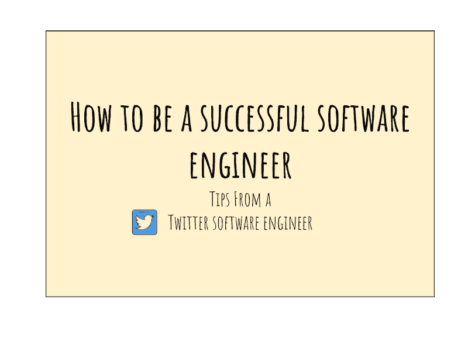
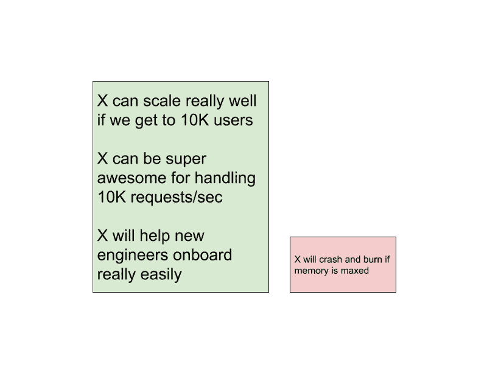
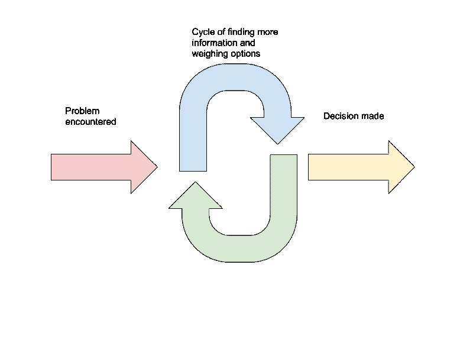
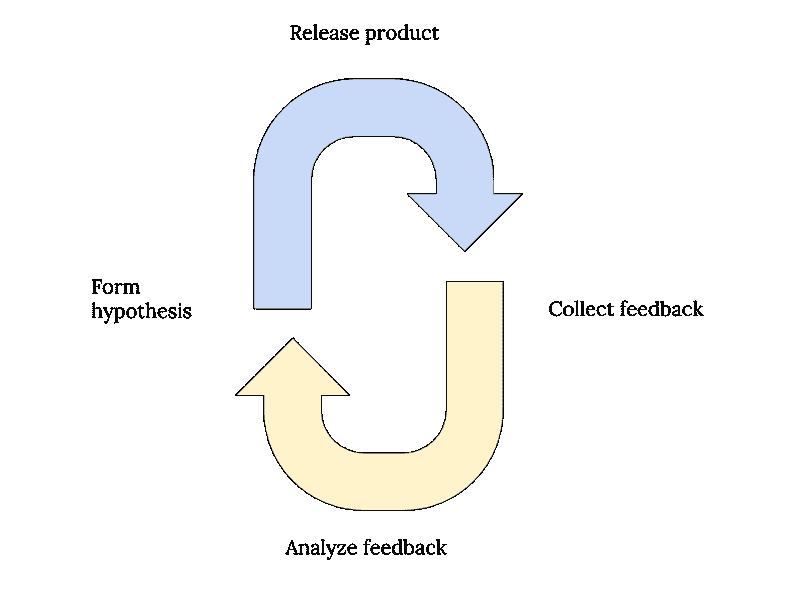

# 如何成为一名成功的软件工程师

> 原文：<https://www.freecodecamp.org/news/how-to-be-a-successful-software-engineer-6f82a5b1a82e/>

对于刚刚开始职业生涯的年轻、聪明的软件工程师来说，这里是我作为软件工程师读过或收到的一些最好的建议。

这里的大部分建议都是迎合软件工程人群的，但是我相信有很多小技巧是不管你的职业都适用的。

Best career and life advice I’ve received

简而言之，我的最佳建议是:

*   交货不足，交货过多
*   完美是好的敌人
*   保持在一条路上
*   尽早收集反馈
*   问之前先找
*   为简单性而优化

如果你喜欢看视频，我在 Youtube 上做了一个视频:

#### 交货不足，交货过多

低估完成一个功能所需的工作量是新的，甚至是有经验的工程师中极其常见的错误。

如果你看看超出预算和/或交付延迟的项目数量，你会非常惊讶。这是一个疯狂的数字，大约是 50%。

让我们考虑一下: **50%的项目要么超出预算，要么延迟交付。**

这意味着在每 1000 个项目中，有 500 个项目，或者说其中的一半，被延迟或者超出预算交付。这让我很困惑。

我清楚地记得在我的第一个技术项目中，我被赋予了领导功能开发的自主权。这意味着我是一个关键人物，他会写一份技术设计文档，详细说明开发整个功能需要多少时间，我们需要多少工程师，等等。

作为一名热切的年轻工程师，我严重低估了完成工作所需的时间。大约 2 到 3 倍。

当时我对自己非常失望，因此，我和一些同事的关系也很紧张。

然后，我的经理让我坐下，给了我一些改变人生的建议。他对我说，总是少言寡语，多言寡语。

这意味着你应该保守你的估计，为你的估计提供足够的缓冲，以应对各种可能出错的情况(因为[任何可能出错的事情，都会](https://en.wikiquote.org/wiki/Murphy%27s_law))，并致力于提前/低于成本交付你的项目。

好处:

1.  给你充足的时间开发 ***和*** 根据需要重构*。*特性开发总是回过头来修复你(或你之前的团队)多年来积累的一些[技术债务](https://en.wikipedia.org/wiki/Technical_debt)的好时机。
2.  留出时间来找出最好的设计，而不仅仅是可行的设计。
3.  在特性开发过程中，有许多事情可能会出错。一个同事去度假，你生病，开会，你的孩子生病，你的车被撞，等等。重要的是要认识到事情可能会出错，你要确保你的时间表中有一个缓冲。
4.  由于#2，你能够始终如一地完成高质量的工作，由于#3，你能够每次都按时交付，现在你被认为是公司中的**高绩效者，他知道你在说什么，可以信赖。双赢！**

你可能会说，承诺不足的坏处是，别人会认为你在偷懒，因为你估计两周就能完成的工作需要 10 周的时间。

说实话，我也为此纠结了一段时间。然而，我随后意识到，只要**你开诚布公地沟通，并在整个过程中与利益相关者保持一致**，你就会没事。

你是负责提供费用的人，因为其他人依赖你的专业知识。他们知道你是最熟悉代码库的人，他们相信你能提供最佳猜测。在特性开发过程中可能会发生各种各样的事情，而且**只要你公开交流**，一切都会好的。

#### 完美是好的敌人

作为一名软件工程师，你会发现一个项目在出门之前缺少这个或者需要那个。一个项目可以是一个编码项目，或者只是一个你需要写的技术设计文档。

经常发生的情况是，随着你对项目的深入研究，你开始发现有更多你没有考虑到的东西。然后你卷起袖子，把目光投向事情的真相。你决定在接下来的几个小时里进行研究，试图把一切都搞定。

十个小时过去了，实际上什么也没做，你却堆积了比以前更多的工作。

如果这听起来很熟悉，那么你并不孤单。

这发生在每个人身上——也发生在我们当中最好的人身上。我相信，我们从小就习惯于创作“完美”或“完整”的作品然而，在现实中，并不存在完美的解决方案。

我们生活在一个充满约束的世界里，我们做出的每一个重要决定都需要权衡。

这里的关键是认识到我们并不知道所有的事情。你可能没有意识到，但是你做的大多数决定背后都有无数的选择。

例如，作为一名计算机科学专业的学生，你应该为大学毕业后的第一份工作做些什么？除了为初创公司或大型科技公司工作，你还可以作为自由职业者在海外工作，开设 Youtube 频道，在 Udemy 上教授计算机科学，开设博客，或者创办自己的公司。选项列表是无限的，你今天的决定将基于几个关键标准。

你最终会做出最适合你的决定，但不一定是客观上最好的，因为每个人都是独一无二的，没有放之四海而皆准的方法。

在这种情况下，我们能做的最好的事情就是收集尽可能多的信息，承认我们不知道的风险，并据此做出最佳决策。

Probabilities of failing

我思考这个问题的方式是，我为最坏的情况分配一个概率，并将其用于我的决策过程。这是我从一本名为《T0 原则》的书中学到的，作者是雷伊·达里奥，这是一本我极力推荐的好书。

如果发生可怕错误的概率在统计上是显著的，我要么:

1.  寻找更好的解决方案或
2.  找到降低风险的方法，使其不再具有统计学意义。

一旦做了决定，我就会执行并继续前进。

冲洗，并重复我遇到的每一个问题。我在解决这些问题的过程中找到了快乐，在某种程度上，生活的快乐在于解决不同程度和复杂性的问题。

Decision-making framework

#### 保持在道路上

特性蔓延是一个很自然的反例。

你一直想添加更多的功能，因为你觉得当前的功能看起来像是从 90 年代的万维网上下载的。你觉得还没准备好。你认为没人会想用你的产品。

然而，请注意所有这些事情都是在你自己的头脑中进行的。这些都没有被证实。你不知道人们想要什么，直到你把东西放到他们手里。

你应该瞄准的是在你的项目开始时就设定一个固定的目标，无论如何都要努力实现它。

好处是双重的:

1.  **这减少了特征蠕变，迫使你集中注意力**。关于这一点已经写了很多书，我不会用具体的细节来烦你。不管你的位置如何，保持激光聚焦是至关重要的。
2.  我们人类喜欢即时的满足。如果你能在 2 周内发布一些东西，那就去做吧！提前计划你的项目应该在 2 周内实现什么，然后把它交给你的用户！这是一种非常令人满意的感觉，即使它确实悲惨地失败了，至少你坚持了你的目标，并且你现在已经收集了有价值的反馈来迭代。

这就引出了我的下一点。

#### 尽早收集反馈

我个人认为，我们应该始终以早期发布为目标，经常发布，并尽快收集反馈。

当然，我认识到这主要对于软件项目是可能的。但是听我说完。

经常发布和提前发布可以让你提前收集反馈。拥有一个健康的反馈回路是你项目中非常重要的方面，如果不是最重要的方面的话。

The feedback loop for product

你应该在产品开发的早期就整合一个反馈回路，这样你就知道你是在用正确的约束为正确的人开发正确的产品。

同样需要注意的是**提前发布并不意味着发布一个残破的产品。一个坏的产品对任何人都没用，这是对用户的不尊重。**

你应该找出并交付一个最小可行产品(MVP ),这意味着你的产品应该以最少的方式来满足需求。

需要注意的一点是，收集反馈并不意味着需要来自每个用户的反馈。

考虑细分你的用户。获得一小群用户，最好来自各种背景(不仅仅是朋友和家人)。把你的产品交到他们手中，这样如果你搞砸了，至少你的其他用户还没有意识到，而你有时间去解决它。

#### 问之前先找

许多年轻的工程师倾向于提出问题，而不试图自己找到答案。当他们遇到以前没有遇到过的事情时，他们的第一反应是向高级工程师请教这是如何做到的，以及如何完成某件事情。

在问任何人之前，自己寻找答案会对你有很大好处。原因有两个:

1.  深潜可以让你探索你以前从未探索过的领域。这给了你一个接触和熟悉不同代码库的机会。
2.  当你升到更高的职位时，人们会依赖你的指导。假以时日，你将成为团队中的*前辈*。人们向你寻求帮助，无论如何，你以后都需要学习这项技能。

许多开发人员开玩笑说，他们的大部分时间都花在了 Googling 和 StackOverflow 上。我完全同意这一点，但不是出于你可能会想到的原因。

找到一个模糊问题的答案的能力是一项非常令人垂涎的技能。随着时间的推移，互联网已经发展成为一个易于访问的信息宝库，你可以在任何时间、任何地点、任何设备上插入其中。

然而，提出正确问题的能力比回答这些问题的能力更难获得。

随着你职业生涯的发展，你会开始意识到找出正确的问题是你需要学习的技能，如果你真的掌握了它，它会给你带来奇迹。

#### 为简单性而优化

努力让你的工作和生活变得简单。

我经常看到初级开发人员从事编码项目，他们会使用抽象、继承、接口和一些非常有趣的框架。然而，尽管有这些花哨的东西，他们正在编写新的代码，增加了不必要的复杂性。

大多数时候，维护这些代码的人不会是编写它们的人。任何额外增加的复杂性都将使新工程师的加入变得更加困难。

随着你成为一名成熟的软件工程师，你会意识到写代码不仅仅是优化性能的问题，也是优化人的问题。同样重要的是，要编写其他人能够容易理解的代码。

这就是代码可读性和代码组织发挥作用的地方。

除非性能是一个真正的问题，否则总是选择更简单、更干净的方法。

我相信简单也延伸到工作之外的生活。让你的生活不受干扰。减少生活中不必要的物品。专注于对你重要的事情。优化你的生活是为了体验，而不是财产。这些是你在生活中要记住的一些事情。

#### 我读过的书和我喜欢的资源

*   雷伊·达里奥的原则？我最近读过的最好的书之一。作者谈到了我们可以在生活和工作中应用的原则。我把他解决问题的框架融入到我的日常生活中
*   [如何赢得朋友并影响他人](https://amzn.to/2Gmb3xq) —关于建立和管理人际关系的经典书籍？。这本书帮助我理解了如何管理我在工作场所的人际关系。
*   [高级软件工程师](https://amzn.to/2pPZUhq) —？一本关于如何成为一名成熟的软件工程师的好书。在这里，我学会了如何在你开口之前寻求答案。
*   关键对话——一本关于如何在高风险情况下与人打交道的好书。非常适用于生活的不同方面。无论是谈判加薪。或者解决与配偶的沟通问题？这本书有一些解决这些问题的好建议。
*   精益创业公司(Lean Startup)——关于如何在进一步投资之前使用最小可行产品(MVP)来测试一个想法的好书。过去，我用这个测试过几个创业想法。
*   [紫牛](https://amzn.to/2InAGi4) —？喜欢这本书。主要是用这个来测试我脑海中不同的创业想法。它讲述了如何营销你的创业公司，以及是什么让它脱颖而出。
*   [Evernote](https://www.evernote.com/referral/Registration.action?sig=3dbd8660e92a8ca68faeb24c552fd32a492c1e620fe4c77e45844685fed05492&uid=18085328) —最佳记笔记 app？我用过的。强烈推荐！
*   鼹鼠皮笔记本 —我真的很喜欢这本。它的质量非常高。价格略高，但由于我每天都在使用它，我认为这是一项不错的投资。每天手里拿着一个漂亮的笔记本，让我更兴奋的去写更多的笔记。
*   [Pilot G2(黑色)](https://amzn.to/2Gwb9qj) —这是我用过的最好的笔，也是我唯一会用的笔。我从亚马逊上批量购买它们，并把它们放在我去的任何地方。我的背包里有一本，办公室里有一本，家里的办公室里也有一本，这样我就可以随身带着一支笔。它写起来很棒，墨水流动顺畅，我喜欢在上面写字的感觉。再加上鼹鼠皮，有时候我真想拿起 G2 在上面随便写点东西，因为这两个实在是太完美了。

*在 [Twitter](https://twitter.com/zhiachong) 、[脸书](https://www.facebook.com/zhiachong.tech)、 [LinkedIn](https://www.linkedin.com/in/zhiachong/) 上关注我。注册[我的邮件列表](http://eepurl.com/dnt9Sf)，在那里我会定期发送提示、技巧和行业知识。*

如果你喜欢这篇文章，请在下面评论:**你给软件工程师的第一条建议是什么？**