# 学习 HTML5 在这个自由和互动的初学者课程

> 原文：<https://www.freecodecamp.org/news/want-to-learn-how-to-built-websites-heres-our-free-full-length-html5-course-4ca68cd4a39a/>

HTML 是 web 的核心构件之一，因为它封装了您访问的网站上的内容。然而，尽管它的影响力巨大，但很少有人真正知道它是如何工作的。

因此，为了提高世界的技术素养，我们与开发者、设计师和教师合作，在 html 5 上创建了一个[免费课程。](https://scrimba.com/g/ghtml?utm_source=freecodecamp.org&utm_medium=referral&utm_campaign=ghtml_launch_article)

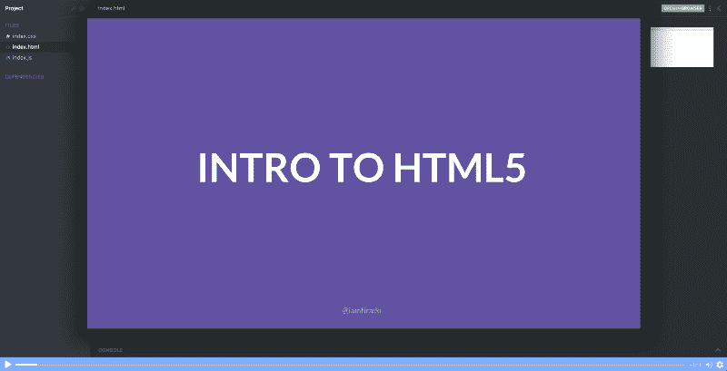

*[*Click the* here *to get to the course page*](https://scrimba.com/g/ghtml?utm_source=freecodecamp.org&utm_medium=referral&utm_campaign=ghtml_launch_article)*

在整个课程中，埃里克将带你从初学者到精通 HTML，同时向你展示如何建立一个网站。最棒的是:你只需不到一个小时就能完成这门课程！

现在让我们看看它是如何建立起来的。

### 课程内容

本课程包含 14 个互动的截屏。每个角色处理一个 HTML 的核心概念，大部分在三到六分钟之间。在其中的一些中，你将被鼓励跳入代码并自己进行实验，因为这在 Scrimba 平台上是可能的。

#### 第一课:网络入门

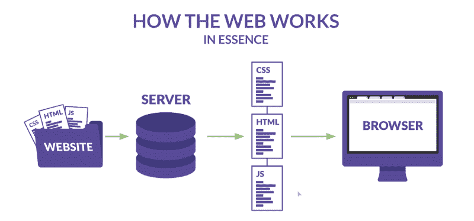

它从教你一点关于 web 的一般知识开始，着眼于客户机、服务器和浏览器使用的三种语言:HTML、CSS 和 JavaScript。

这为你接下来的课程打下了良好的基础，因为你将更好地掌握 HTML 在万维网上的整体角色。

#### 第 2 课:创建 HTML 文档

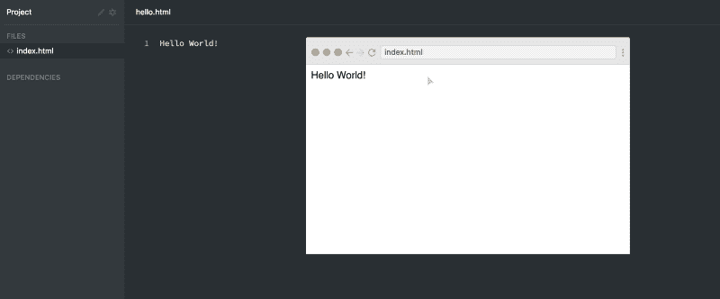

下一步是创建您的第一个 HTML 文档。这堂课将会解释 HTML 文件是如何工作的，并且会给你一个关于浏览器中 URL 栏的快速入门。

#### 第 3 课:嵌套元素

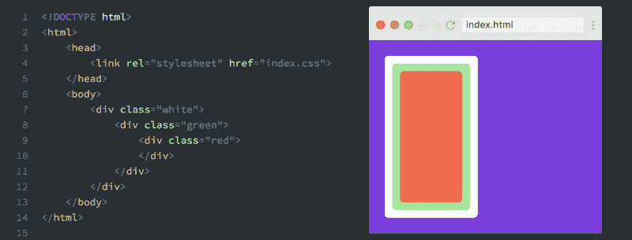

嵌套是 HTML 中的一个重要概念，因此将在第三课中讨论。嵌套基本上意味着您可以将标签嵌套在彼此内部。要嵌套一个 HTML 元素，只需将它添加到另一个 HTML 元素的开始和结束标记之间。

#### 第 4 课:Head 元素和脚本

```
<head>  
  <title>Learning HTML</title>  
  <meta charset="UTF-8">  
  <meta name="desctiption" content="My first HTML website">  
  <meta name="viewport" content="width=device-width, intial-scale=1.0">  
  <link rel="stylesheet" href="index.css">  
  <link rel="stylesheet" href="https://use.fontawesome.com/releases/v5.0.6/css/all.css">  
  <style>  
    h1 {  
      text-align: center;  
    }  
  </style>  
  <script>  
    document.getElementById("h1").innerHTML = "Hello Universe!";  
  </script>  
</head> 
```

head 元素是`<html>`标签本身之后的第一个 HTML 标签。它是元数据的容器，通常定义标题**、**字符集、样式、链接、脚本和其他元信息。

所以在这堂课中，你将学习如何用不同的内容类型填充 meta 标签，正如你在上面的片段中看到的。

#### 第 5 课:布局元素

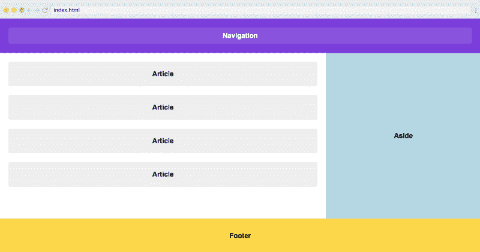

HTML5 引入了许多布局元素，使 HTML 更具语义性。这些新标签现在加强了最常用布局元素的意义，如`<header>` `<article>` `<aside>`和`<footer>`，而在过去，我们只有像`<div>`这样无意义的元素可以使用。在这个截屏中，你会学到最有用和最重要的。

#### 第六课:图形和图像元素


图像是几乎所有网站的核心部分。在这堂课中，你将学习如何给网站添加图片，以及如何给图片添加标题。

#### 第 7 课:嵌入视频

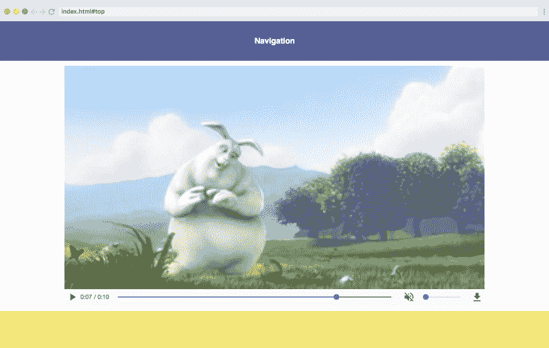

你可能已经注意到 YouTube 上的视频遍布网络，对吗？不仅仅是在 youtube.com。这是有可能的，这要归功于 HTML 的一个特性，它可以将媒体从网络上的其他地方嵌入到页面中。在本课中，我们将介绍从 YouTube 等网站嵌入视频以及直接从视频文件嵌入视频的方法。

#### 第 8 课:导航栏和列表项

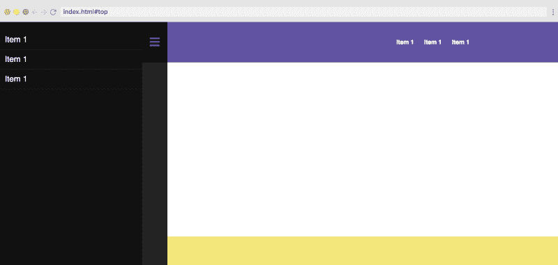

在这堂课中，你将学习如何使用无序列表和列表项来构建导航栏。这包括水平和垂直导航栏，用于我们网站的标题和侧边栏。

#### 第九课:标题

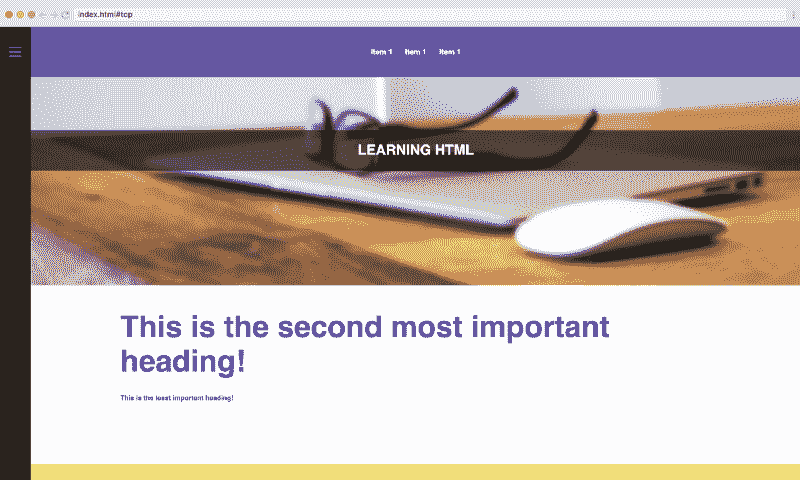

标题是使用`<h*>`标签创建的，其中的*号将由 1 到 6 的数字代替。标题的重要性随着数字的增加而下降，这意味着`<h1>`通常是页面上最重要的标题或文本。

#### 第十课:段落和文本格式(第一部分)

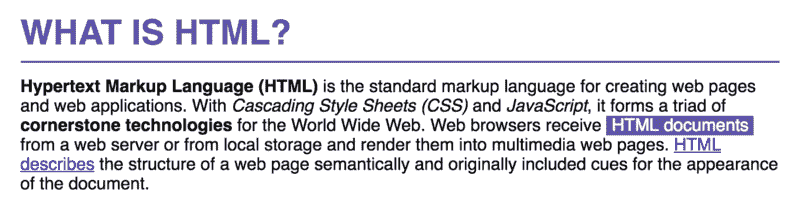

为了建立网站，格式化文本也很重要，在这堂课中，你会学到它的基础知识。您可能会从 Word 和 Pages 等文本处理器中认出许多概念。

#### 第十一课:文本格式(第二部分)

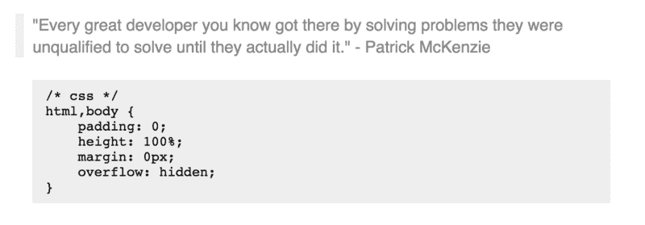

在本课中，您将了解更多有关格式化的内容，但标签会影响大块文本。这方面的例子有`<code>`元素和`<blockquote>`元素。

#### 第十二课:表格(第一部分)

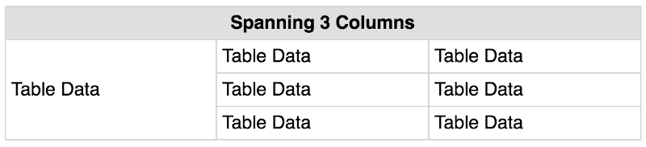

表格可能有点复杂，但这堂课试图尽可能简单地解释它。第二，有两节课会专门讲这个主题，这样你们就能正确理解了。

#### 第十三课:表格(第二部分)

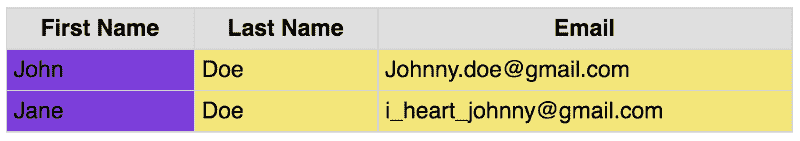

在本课中，您将学习表格中更高级的元素，如`<thead>`、`<tbody>`和`<tfoot>`。这些允许您分别控制页眉、正文和页脚中的元素。

您还将接触到`<colgroup>`，它允许您向特定的列添加样式。

#### 第 14 课:页面链接和最后润色

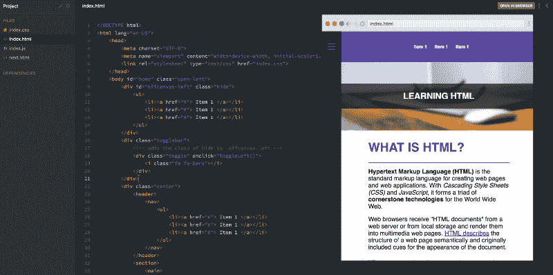

在最后的截屏中，我们会把它全部包起来，完成这个网站。我们将从导航中添加一个链接到页面上的各个部分，并介绍另一个页面，以便您了解页面之间的链接是如何工作的。

至此，您应该对 HTML 以及该语言中最重要的标签有了坚实的理解。

注意:Eric 也将在 4 月推出后续课程，为初学者解决 CSS 问题。[如果您想尽早访问，请在此留下您的电子邮件地址](http://eepurl.com/dpcHV5)。

### 辛巴格式

最后，让我们也来看看课程背后的技术，因为它非常巧妙。该课程是使用交互式编码截屏工具 [Scrimba](https://scrimba.com) 构建的。Scrimba 看起来像普通的视频，但它们是完全互动的。您可以编辑类型转换中的代码！

这里有一张解释这个概念的 gif 图:

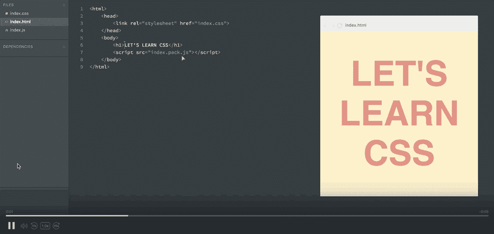

暂停截屏→编辑代码→运行！→查看您的变化

当您觉得需要试验代码以便正确理解它时，或者当您只想复制一段代码时，这是非常有用的。

你还在等什么？前往[课程](https://scrimba.com/g/ghtml?utm_source=freecodecamp.org&utm_medium=referral&utm_campaign=ghtml_launch_article)页面，立即开始！

* * *

感谢阅读！我的名字叫 Per Borgen，我是最简单的学习编码方法——Scrimba 的联合创始人。如果你想学习建立专业水平的现代网站，你应该看看我们的[响应式网页设计训练营](https://scrimba.com/g/gresponsive?utm_source=freecodecamp.org&utm_medium=referral&utm_campaign=ghtml_launch_article)。


[Click here to get to the advanced bootcamp.](https://scrimba.com/g/gresponsive?utm_source=freecodecamp.org&utm_medium=referral&utm_campaign=ghtml_launch_article)