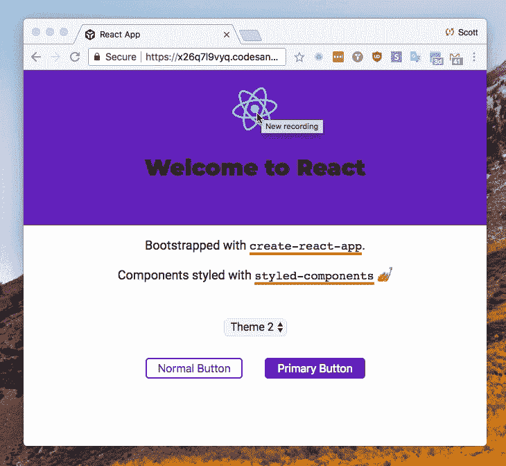
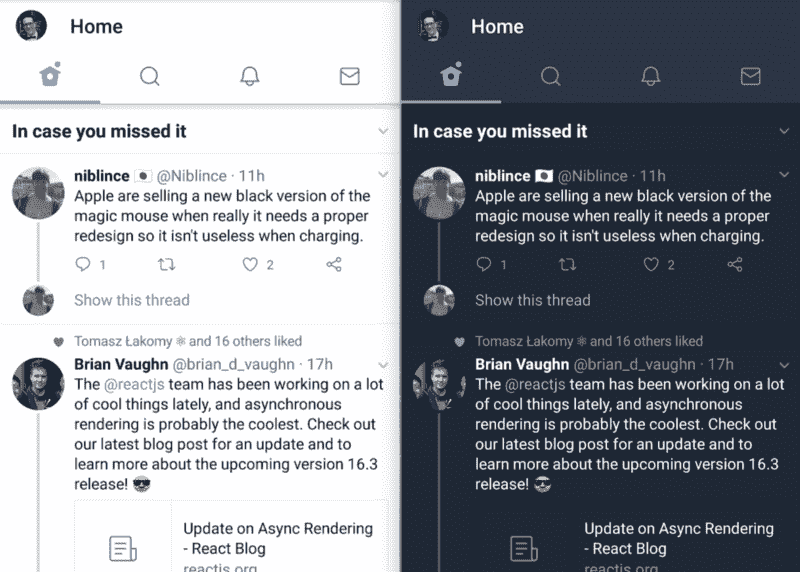

# 样式组件？入门指南

> 原文：<https://www.freecodecamp.org/news/styled-components-getting-started-2018/>

我们将使用样式化组件对基本的 create react 应用程序进行样式化，如下所示:



但是首先，preamble✨:，我一直在为设计网站而努力，这似乎是开始网站开发的一个方面，要么是事后想起的，要么是被掩盖的。直到去年 12 月，我都不喜欢用 CSS 来设计任何东西，这是一件苦差事，而不是我喜欢做的事情。

直到我开始使用样式化组件，当我加入了一个为[Chingu](https://medium.com/chingu)voyage([`grad.then()`](https://github.com/chingu-voyage3/grad.then/)如果你感兴趣的话)的构建学习项目，我们决定使用 CSS-in-JS 包，我团队中的 [Marina](https://twitter.com/mar_biletska) 在观察组件是如何被样式化的过程中给了我很大的启发，并真正给了我开始使用样式化组件的信心。

###### 我以前用 css


我想分享我到目前为止通过设计一个基本的 react 应用程序所学到的东西。

这篇文章中有一些基本的 CSS 概念，在开始讨论样式化组件之前我并不知道，我认为这些组件是在设计网页样式时假定的。

网站的 body 元素的样式是假定的，所以当你从一个空白画布开始时，你添加到你的网站的所有现代 web 浏览器都有一些默认设置，比如保持 16px(或 1rem)或`box-sizing:` `border-box;`的字体大小，也有一些包为你处理这些。

### 安装样式组件

好的，让我们引导你在使用 [Create react App](https://github.com/facebook/create-react-app#create-react-app-) 和 [`npx`](https://medium.com/@maybekatz/introducing-npx-an-npm-package-runner-55f7d4bd282b) 时得到的基本 React 应用程序，如果你已经全局安装了 Create React App，那么你可以使用不带`npx`的命令。

```
npx create-react-app style-with-styled-components
cd style-with-styled-components/
npm i styled-components 
```

好了，现在我们有了可以进行样式化的基本应用程序，谢天谢地 [Dan](https://github.com/gaearon) 好心地为我们提供了开始样式，所以让我们开始将它们用于样式化组件。

CRA CSS 的布局方式假设每个组件都有一个相应的 CSS 文件，这有助于维护 CSS，并符合 React 将所有文件分成不同组件的思想。

我们可以从`App.js`文件及其伴随的`App.css`文件开始。让我们先来看看`App.js`:

```
import React, { Component } from 'react';
import logo from './logo.svg';
import './App.css';
class App extends Component {
  render() {
    return (
      <div className="App">
        <header className="App-header">
          
          <h1 className="App-title">Welcome to React</h1>
        </header>
        <p className="App-intro">
          To get started, edit <code>src/App.js</code> and save to reload.
        </p>
      </div>
    );
  }
}
export default App; 
```

在 styled-components 中，我们将为这些元素中的每一个创建组件，以替换前面提到的`className`。好的，我们可以从将样式迁移到组件开始，让我们先做一个组件，以了解我们的发展方向。

首先，将`styled`导入`App.js`模块:

```
import styled from 'styled-components'; 
```

现在让我们看一下`<div className="App">`，它是这个组件的顶层 div，我喜欢称它为组件的包装器。所以让我们给它起一个富有想象力的名字 AppWrapper。

参考 App.css 有`text-align: center;`属于这个，所以:

```
const AppWrapper = styled.div`
  text-align: center;
`; 
```

所以在这里，我们将`AppWrapper`常量定义为`styled.div`后跟反勾号，在反勾号内，我们可以使用与普通`.css`文件完全相同的 CSS 语法编写任何常规 CSS。

现在我们有了我们的`AppWrapper`，我们可以替换`App.js`组件上的顶层 div。

```
import React, { Component } from 'react';
import styled from 'styled-components';
import logo from './logo.svg';
import './App.css';
class App extends Component {
  render() {
    return (
      <AppWrapper>
        <header className="App-header">
          
          <h1 className="App-title">Welcome to React</h1>
        </header>
        <p className="App-intro">
          To get started, edit <code>src/App.js</code> and save to reload.
        </p>
      </AppWrapper>
    );
  }
}
export default App; 
```

### 样式-组件所有的东西

所以让我们对剩下的四个 CSS 类也这样做，看一看，我将在这里的`AppWrapper`下面定义它们:

```
const rotate360 = keyframes`
  from {
    transform: rotate(0deg);
  }
  to {
    transform: rotate(360deg);
  }
`;
const AppLogo = styled.img`
  animation: ${rotate360} infinite 120s linear;
  height: 80px;
`;
const AppHeader = styled.div`
  background-color: #222;
  height: 150px;
  padding: 20px;
  color: white;
`;
const AppTitle = styled.h1`
  font-size: 1.3em;
`;
const AppIntro = styled.p`
  font-size: large;
`; 
```

首先，我们为 React svg [动画](https://www.styled-components.com/docs/basics#animations)创建了一个变量，你需要从样式组件中导入`keyframes`助手，如下所示:

```
import styled, { keyframes } from 'styled-components'; 
```

这现在可以在整个`App.js`组件中使用，我们可以在这个模块中的任何样式化组件中添加一个 on `hover`选择器。这里我们将把它添加到`AppLogo`中，以保持超甜的旋转 React 标志。

```
const AppLogo = styled.img`
  animation: ${rotate360} infinite 120s linear;
  height: 80px;
  &:hover {
    animation: ${rotate360} infinite 1.5s linear;
  }
`; 
```

好了，我们的应用程序看起来不应该有任何不同，因为我们还没有在 app `render()`方法中添加样式组件，所以现在让我们开始吧。

让我们也改变介绍文本。您可以为`<code>`标签添加一个包装器，如下所示:

```
const CodeWrapper = styled.code`
  font-size: 1.3rem;
`; 
```

但是如果您愿意，您可以在组件中嵌套选择器，比如:

```
const AppIntro = styled.p`
  color: ${props => props.theme.dark};
  font-size: large;
  code {
    font-size: 1.3rem;
  }
`; 
```

现在让我们来看看`render()`方法…

```
render() {
  return (
    <AppWrapper>
      <AppHeader>
        <AppLogo src={logo} alt="logo" />
        <AppTitle>Welcome to React</AppTitle>
      </AppHeader>
      <AppIntro>
        Bootstrapped with <code>create-react-app</code>.
      </AppIntro>
      <AppIntro>
        Components styled with <code>styled-components</code>{' '}
        <EmojiWrapper aria-label="nail polish"></EmojiWrapper>
      </AppIntro>
    </AppWrapper>
  )
} 
```

现在所有最初在`App.js`中使用的类都已经被替换了，所以不再需要`import './App.css'`映射，去掉 AAAA 和！还是没有变化！！这是一件好事，因为目前我们正在用样式化组件替换掉`.css`文件。

酷，我们现在已经用样式组件替换了所有的 css，现在我们可以看看`injectGlobal`。

在我们继续之前，让我们看看`App.js`文件应该是什么样子:

```
import React, { Component } from 'react';
import styled, { keyframes } from 'styled-components';
import logo from './logo.svg';

const AppWrapper = styled.div`
  text-align: center;
`;

const rotate360 = keyframes`
  from {
    transform: rotate(0deg);
  }
  to {
    transform: rotate(360deg);
  }
`;

const AppLogo = styled.img`
  animation: ${rotate360} infinite 120s linear;
  height: 80px;
  &:hover {
    animation: ${rotate360} infinite 1.5s linear;
  }
`;

const AppHeader = styled.div`
  background-color: #222;
  height: 12rem;
  padding: 1rem;
  color: white;
`;

const AppTitle = styled.h1`
  font-weight: 900;
`;

const AppIntro = styled.p`
  font-size: large;
  code {
    font-size: 1.3rem;
  }
`;

const EmojiWrapper = styled.span.attrs({
  role: 'img',
})``;

class App extends Component {
  render() {
    return (
      <AppWrapper>
        <AppHeader>
          <AppLogo src={logo} alt="logo" />
          <AppTitle>Welcome to React</AppTitle>
        </AppHeader>
        <AppIntro>
          Bootstrapped with <code>create-react-app</code>.
        </AppIntro>
        <AppIntro>
          Components styled with <code>styled-components</code> <EmojiWrapper aria-label="nail polish" />
        </AppIntro>
      </AppWrapper>
    );
  }
}

export default App; 
```

### 用 injectGlobal 设计几何体

为了设计 react 应用程序的主体，我们目前有一个`index.css`文件，它被导入到我们的应用程序的挂载点的`index.js`文件中。

要对正文进行样式化，我们可以使用 styled-components 中的 [`injectGlobal`](https://www.styled-components.com/docs/api#injectglobal) ，将样式直接添加到样式表中。

为此，您引入名为 export from styled-components 的`injectGolabl`,并在反勾号之间添加您的样式。

当前的`index.css`看起来是这样的:

```
body {
  padding: 0;
  margin: 0;
  font-family: sans-serif;
} 
```

让我们在`src`目录中添加一个`theme`文件夹，并添加一个`globalStyle.js`文件，我们可以在其中保存我们想要在整个应用程序中使用的所有样式，将样式保存在一个地方会使更改更简单。

在`src/theme/globalStyle.js`中，我们需要从样式化组件导入名为导出的`injectGlobal`,并将`index.css`样式添加到其中:

```
import { injectGlobal } from 'styled-components';

injectGlobal`
  body {
    padding: 0;
    margin: 0;
    font-family: sans-serif;
  }
`; 
```

好了，现在我们将正文样式直接添加到样式表中，这样就不需要`index.js`中的`index.css`文件映射了，它现在应该是这样的:

```
import React from 'react' import ReactDOM from 'react-dom'

import App from './App'

import registerServiceWorker from './registerServiceWorker'

ReactDOM.render(<App />, document.getElementById('root'))

registerServiceWorker() 
```

我们应该继续使用我们漂亮的`sans-serif`字体，但是让我们在我们的`globalStyle.js`模块中为主体添加一些漂亮的 Roboto，为标题添加 Montserrat。我们可以在`injectGlobal`中导入带有`@import`的谷歌字体，并将 Roboto 应用于正文:

```
injectGlobal`
  @import url(‘https://fonts.googleapis.com/css?family=Montserrat|Roboto');

  body {
    padding: 0;
    margin: 0;
    font-family: Roboto, sans-serif;
  }
`; 
```

酷，现在我们可以添加我们的导入字体或应用程序标题，如果我们希望我们所有的`<h1>`使用相同的字体，我们可以在我们的`globalStyle.js`模块中添加到 injectGlobal。

```
injectGlobal`
  @import url(‘https://fonts.googleapis.com/css?family=Montserrat:400,900|Roboto');
  body {
    padding: 0;
    margin: 0;
    font-family: Roboto, sans-serif;
  }
  h1 {
    font-family: Montserrat;
  }
`; 
```

然后我们可以调整`AppTitle`组件的重量:

```
const AppTitle = styled.h1`
  font-weight: 900;
`; 
```

要添加 Montserrat 和 Roboto 等字体的其他样式，您可以在`@import url()`中指定它们，您会注意到 Montserrat 后面有`:400,900`，它指定了常规(400)和黑色(900)样式，您可以从 Google fonts (CDN)中导入尽可能多的样式，但是您导入的越多，加载它们所需的时间就越长，如果您的应用程序中有许多您想要的字体和样式，那么可以考虑将它们添加到项目中的一个文件夹中，例如:

```
import Montserrat from './fonts/Montserrat-Regular.ttf';

injectGlobal`@font-face { font-family: Montserrat; src: url(${Montserrat}); }`; 
```

### 主题

主题通常用于一次改变多种事物的外观和感觉。例如，你可能有一个类似 Twitter 的日夜模式。您也可以在样式组件中创建自己的主题。



### 使用样式化组件主题提供者

现在，假设我们希望我们的应用程序中有几个组件使用 CSS 颜色属性`color: #6e27c5`，而不是通过应用程序对每个使用它的组件进行硬编码，我们可以使用 styled-components `ThemeProvider`。

为此，我们需要从 styled-components 导入名为 export 的`ThemeProvider`,然后定义一个`theme`对象，我们的颜色将存在于其中:

```
export const theme = {
  primary: '#6e27c5',
}; 
```

让我们将新创建的`theme`添加到我们之前创建的`globalStyle`模块中。

为了使主题对象在整个应用程序组件中可用，我们将把我们的应用程序组件包装在`ThemeProvider`中，并导入我们的 awesome 主题以便在`ThemeProvider`中使用:

```
import React, { Component } from 'react';
import styled, { keyframes, ThemeProvider } from 'styled-components';
import logo from './logo.svg';
import { theme } from './theme/globalStyle';

// our styled-components

class App extends Component {
  render() {
    return <ThemeProvider theme={theme}>{/* all children can access the theme object */}</ThemeProvider>;
  }
}
export default App; 
```

现在,`theme`属性可以在我们的样式化组件中用作道具，让我们改变`AppHeader`组件中的`background-color:`,同时让我们给我们的`theme`对象添加一个`dark: #222`属性，并将其用于`color`属性:

```
const AppHeader = styled.div`
  height: 12rem;
  padding: 1rem;
  color: ${props => props.theme.dark};
  background-color: ${props => props.theme.primary};
`; 
```

现在，我们可以在全球范围内改变我们的应用主题

### 好酷，你能改变主题吗？

这就是我所想的，事实证明你可以，上面有一个来自 [Max](https://twitter.com/mxstbr) 的很棒的[栈溢出答案](https://stackoverflow.com/a/42899979/1138354)。

这让我想到，你是否可以在主题之间切换，而不是像 SO 回答中那样为不同的部分定义主题。

我首先在`globalStyle.js`模块中定义了两个主题(具有富有想象力的名称):

```
export const theme1 = {
  primary: '#ff0198',
  secondary: '#01c1d6',
  danger: '#eb238e',
  light: '#f4f4f4',
  dark: '#222',
};

export const theme2 = {
  primary: '#6e27c5',
  secondary: '#ffb617',
  danger: '#f16623',
  light: '#f4f4f4',
  dark: '#222',
}; 
```

现在我们需要一种在两个`theme`对象之间切换的方法，让我们为它们使用一个选择框，让我们创建一个组件文件夹，在那里创建一个`ThemeSelect.js`组件，当我不在这里时，我们可以担心重构`App.js`组件:

#### ThemeSelect.js

```
import React from 'react';
import styled from 'styled-components';

const Select = styled.select`
  margin: 2rem 0.5rem;
  padding: 0rem 0.5rem;
  font-family: Roboto;
  font-size: 1rem;
  border: 1px solid ${props => props.theme.light};
  box-shadow: 0px 0px 0px 1px rgba(0, 0, 0, 0.1);
  background: ${props => props.theme.light};
  border-radius: 2px;
`;

export const SelectOpt = styled.option`
  font-family: Roboto;
  font-size: 1rem;
`;

class ThemeSelect extends React.Component {
  render() {
    return (
      <div>
        <Select onChange={e => this.props.handleThemeChange(e)}>
          <SelectOpt value="theme1">Theme 1</SelectOpt>
          <SelectOpt value="theme2">Theme 2</SelectOpt>
        </Select>
      </div>
    );
  }
}

export default ThemeSelect; 
```

您可能已经注意到了`onChange={e => this.props.handleThemeChange(e)`事件，我们将把该方法和一些状态一起添加到`App.js`组件中，以管理选择了什么主题。

#### App.js

```
import React, { Component } from 'react';
import styled, { keyframes, ThemeProvider } from 'styled-components';

import logo from './logo.svg';

import { theme1, theme2 } from './theme/globalStyle';
import ThemeSelect from './components/ThemeSelect';

// our lovely styled-components here

class App extends Component {
  state = {
    theme: theme1,
  };
  handleThemeChange = e => {
    let theme = e.target.value;
    theme === 'theme1' ? (theme = theme1) : (theme = theme2);
    this.setState({ theme });
  };
  render() {
    return (
      <ThemeProvider theme={this.state.theme}>
        <AppWrapper>
          <AppHeader>
            <AppLogo src={logo} alt="logo" />
            <AppTitle>Welcome to React</AppTitle>
          </AppHeader>
          <AppIntro>
            Bootstrapped with <code>create-react-app</code>.
          </AppIntro>
          <AppIntro>
            Components styled with <code>styled-components</code> <EmojiWrapper aria-label="nail polish" />
          </AppIntro>
          <ThemeSelect handleThemeChange={this.handleThemeChange} />
        </AppWrapper>
      </ThemeProvider>
    );
  }
}

export default App; 
```

总结一下我们对`App.js`所做的事情，添加一些默认状态到主题 1，其中两个主题作为`globalStyle.js`模块的命名导出导入。

添加一个方法来处理`ThemeSelect.js`组件`handleThemeChange`的变化，这是我们可以在两个`theme`对象之间切换的地方。

让我们试一下，我们应该能够在我们现在定义的两个主题之间切换。

### 扩展样式组件

到目前为止，我们的应用程序还没有很多类似的样式组件，但是如果我们添加一些按钮会怎么样…

```
export const Button = styled.button`
  font-size: 1rem;
  border-radius: 5px;
  padding: 0.25rem 1rem;
  margin: 0 1rem;
  background: transparent;
  color: ${props => props.theme.primary};
  border: 2px solid ${props => props.theme.primary};
  ${props =>
    props.primary &&
    css`
      background: ${props => props.theme.primary};
      color: white;
    `};
`; 
```

在这里，我给`globalStyle.js`添加了一个`Button`组件，供我们在`App.js`组件中使用。为了方便起见，我们将把它添加到这里，您可能会发现，如果您在整个应用程序中重用了许多类似的组件，那么把它们都添加到一个`components`文件夹中可能是个好主意。

我们可以像导入任何其他组件一样导入`Button`并在模块中使用它，因为我们正在扩展它，这意味着我们只需要为该按钮应用我们想要的特定样式。但是首先在`App.js`组件中，我们可以指定一个普通按钮和一个主按钮:

```
<button>Normal Button</button> <button primary>Primary Button</button> 
```

现在，要指定另一个与导入的按钮具有相同 css 的按钮，我们可以扩展它，就像在这个示例中，我们将使按钮占据 40%的屏幕宽度，并使角落更圆:

```
const BigButt = Button.extend`
  height: 3rem;
  font-size: 2rem;
  width: 40vw;
  border-radius: 30px;
`; 
```

让我们通过添加一个`Underline`样式的组件，将主题应用于`create-react-app`和`styled-components`上的下划线:

```
const Underline = styled.span`
  border-bottom: 4px solid ${props => props.theme.secondary};
`; 
```

现在，我们可以切换主题，并使用主题将它应用到我们的组件中，非常简洁，对吗？

我已经把所有的例子都放在了一个工作示例中，供你在主题化和样式化组件上玩，尽情享受吧。

[https://codesandbox.io/s/x26q7l9vyq?from-embed](https://codesandbox.io/s/x26q7l9vyq?from-embed)

### 想了解更多？

真正帮助我开始使用样式组件的一个很好的资源是 [Simon Vrachliotis](https://twitter.com/simonswiss) 的[egghead . io](https://egghead.io/)styled-components[playlist](https://egghead.io/playlists/styled-components-4169206d)，它是开始使用样式组件的一个很好的基础？第一课是为专业会员准备的，但其他课程目前可以免费观看。

还有 [spectrum.chat](https://spectrum.chat/?t=54887141-57a9-4386-807c-ed950c4d5132) 社区，当然还有[栈溢出](https://stackoverflow.com/questions/tagged/styled-components)。

### 感谢阅读

如果我错过了什么，或者如果你有更好的方法，请告诉我。

在 Twitter 上找到我或者在 GitHub 上问我任何问题。

> 你可以在我的博客上阅读其他类似的文章。