# 以下是 ECMAScript 2016、2017 和 2018 中新增内容的示例

> 原文：<https://www.freecodecamp.org/news/here-are-examples-of-everything-new-in-ecmascript-2016-2017-and-2018-d52fa3b5a70e/>

作者 rajaraodv

# 以下是 ECMAScript 2016、2017 和 2018 中新增内容的示例

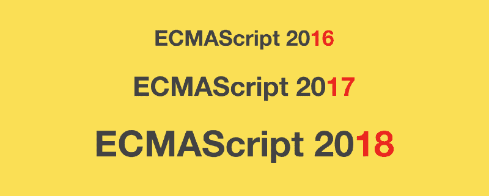

很难跟踪 JavaScript (ECMAScript)中的新内容。而且更难找到有用的代码示例。

因此，在本文中，我将涵盖在 ES2016、ES2017 和 ES2018(最终草案)中添加的 [TC39 最终提案](https://github.com/tc39/proposals/blob/master/finished-proposals.md)中列出的所有 18 项功能，并通过有用的示例展示它们。

> 这是一个相当长的帖子，但应该很容易阅读。**把这看作是“网飞的狂读”**学完本课程后，我保证你会对所有这些功能有大量的了解。

#### 好的，让我们一个一个地检查一下。


### `1\. Array.prototype.includes`

`includes`是数组上的一个简单的实例方法，有助于容易地找到数组中是否有项目(包括`NaN`，不像`indexOf`)。

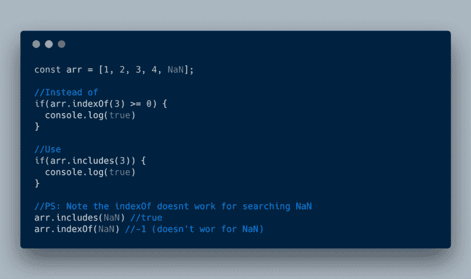

ECMAScript 2016 or ES7 — Array.prototype.includes()

> 花絮:JavaScript 规范的人想把它命名为`contains`，但这显然已经被 Mootools 使用了，所以他们使用了`includes`。

#### `2\.` 求幂运算 `infix operator`

像加法和减法这样的数学运算分别有像`+`和`-`这样的中缀运算符。与它们类似，`**`中缀运算符通常用于指数运算。在 ECMAScript 2016 中，引入了`**` 而不是`Math.pow`。

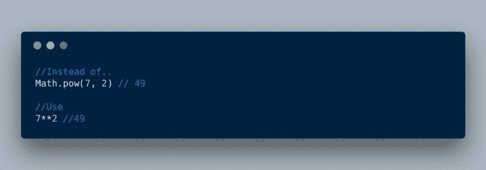

ECMAScript 2016 or ES7 — ** Exponent infix operator


### 1.Object.values()

`Object.values()`是一个类似于`Object.keys()`的新函数，但是返回对象自身属性的所有值，不包括原型链中的任何值。

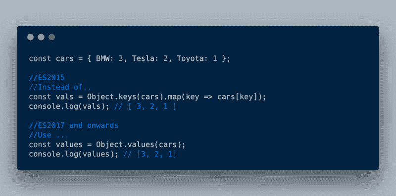

ECMAScript 2017 (ES8)— Object.values()

### 2.Object.entries()

`Object.entries()`与`Object.keys`相关，但是它不是只返回键，而是以数组的形式同时返回键和值。这使得在循环中使用对象或者将对象转换成贴图变得非常简单。

**例 1:**

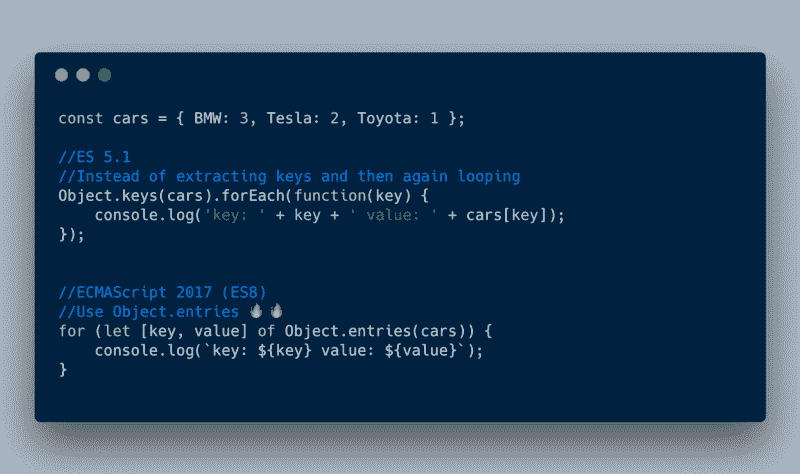

ECMAScript 2017 (ES8) — Using Object.entries() in loops

**例 2:**


ECMAScript 2017 (ES8) — Using Object.entries() to convert Object to Map

### 3.字符串填充

String 中增加了两个实例方法——`String.prototype.padStart` 和`String.prototype.padEnd`——允许在原始字符串的开头或结尾追加/前置一个空字符串或其他字符串。

```
'someString'.padStart(numberOfCharcters [,stringForPadding]); 

'5'.padStart(10) // '         5'
'5'.padStart(10, '=*') //'=*=*=*=*=5'

'5'.padEnd(10) // '5         '
'5'.padEnd(10, '=*') //'5=*=*=*=*='
```

> 当我们想在漂亮的打印显示或终端打印等场景中对齐事物时，这很方便。

#### 3.1 padStart 示例:

在下面的例子中，我们有一个不同长度的数字列表。我们希望在前面加上“0 ”,这样所有的条目都有相同的 10 位数长度，以便显示。我们可以使用`padStart(10, '0')`轻松实现这一点。

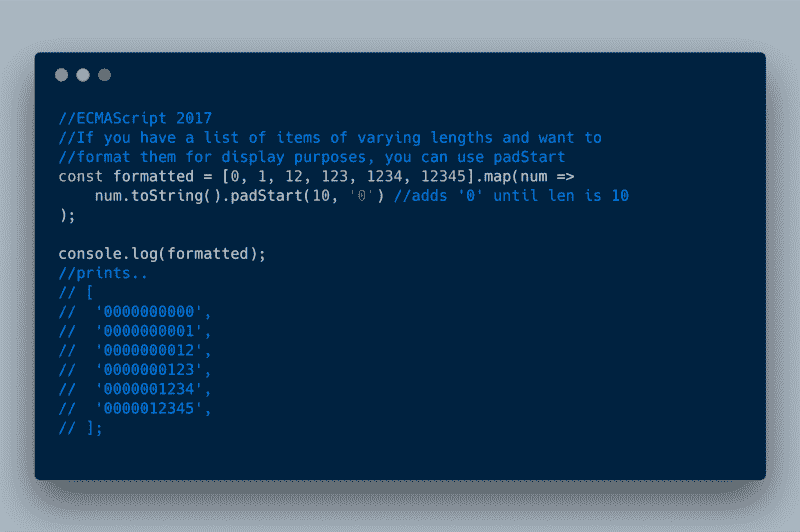

ECMAScript 2017 — padStart example

#### 3.2 padEnd 示例:

当我们打印不同长度的多个项目并希望正确对齐它们时，这真的很方便。

下面的例子是一个很好的现实例子，展示了`padEnd`、`padStart`和`Object.entries`如何一起产生一个漂亮的输出。

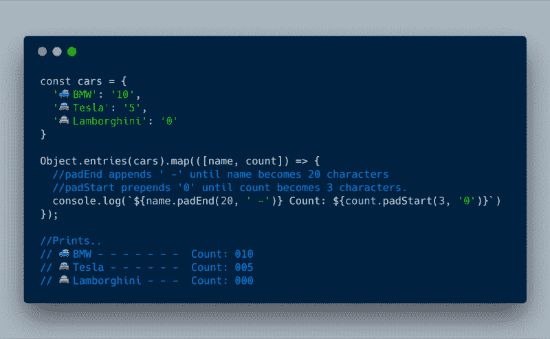

ECMAScript 2017 — padEnd, padStart and Object.Entries example

```
const cars = {
  '?BMW': '10',
  '?Tesla': '5',
  '?Lamborghini': '0'
}

Object.entries(cars).map(([name, count]) => {
  //padEnd appends ' -' until the name becomes 20 characters
  //padStart prepends '0' until the count becomes 3 characters.
  console.log(`${name.padEnd(20, ' -')} Count: ${count.padStart(3, '0')}`)
});

//Prints..
// ?BMW - - - - - - -  Count: 010
// ?Tesla - - - - - -  Count: 005
// ?Lamborghini - - -  Count: 000
```

#### 3.3 表情符号和其他双字节字符上的⚠️ padStart 和 padEnd

表情符号和其他双字节字符使用多个字节的 unicode 表示。因此 padStart 和 padEnd 可能无法按预期工作！⚠️

例如:假设我们试图用❤️表情符号填充字符串`heart`以达到`10`个字符。结果将如下所示:

```
//Notice that instead of 5 hearts, there are only 2 hearts and 1 heart that looks odd!
'heart'.padStart(10, "❤️"); // prints.. '❤️❤️❤heart'
```

这是因为❤️有 2 个码点长(`'\u2764\uFE0F'`)！单词`heart`本身是 5 个字符，所以我们总共只剩下 5 个字符需要填充。所以发生的事情是，JS 用`'\u2764\uFE0F'`填充了两个红心，产生了❤️❤️.对于最后一个，它简单地使用产生❤的心脏的第一个字节`\u2764`

所以我们以:`❤️❤️❤heart`结束

> PS:你可以使用[这个链接](https://encoder.internetwache.org/#tab_uni)来检查 unicode 字符转换。

### 4.`Object.getOwnPropertyDescriptors`

这个方法返回给定对象的所有属性的所有细节(包括 getter `get`和 setter `set`方法)。添加这个的主要动机是允许将一个对象浅层复制/克隆到另一个对象中，该对象也复制 getter 和 setter 函数，而不是`Object.assign` **。**

除了原始源对象的 getter 和 setter 函数之外的所有细节。

下面的例子展示了`Object.assign`和`Object.getOwnPropertyDescriptors`的区别，以及`Object.defineProperties`将原始对象`Car`复制到新对象`ElectricCar`中。您将看到，通过使用`Object.getOwnPropertyDescriptors`，`discount` getter 和 setter 函数也被复制到目标对象中。

之前…

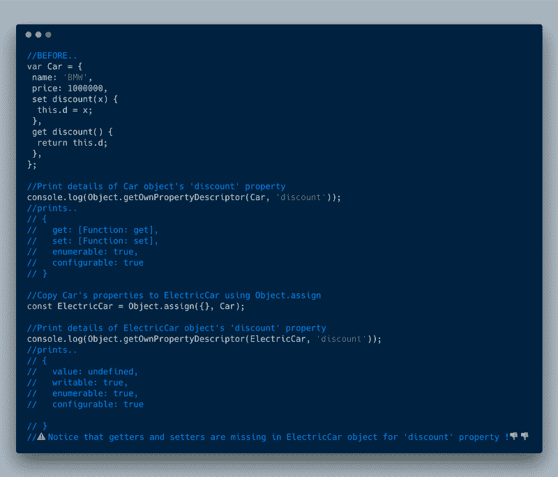

Before — Using Object.assign

之后…

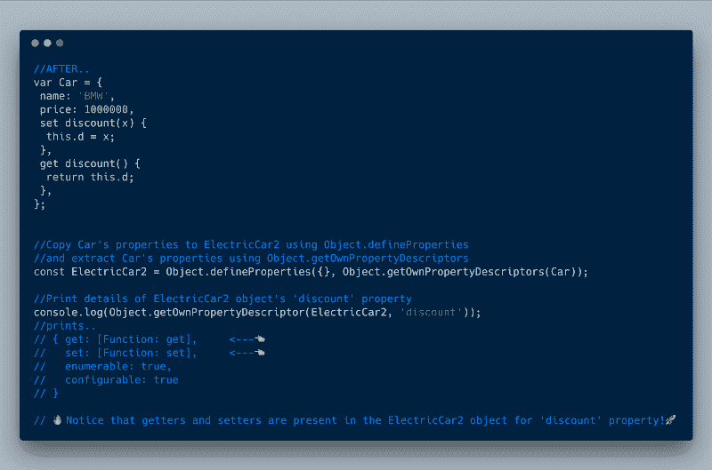

ECMAScript 2017 (ES8) — Object.getOwnPropertyDescriptors

```
var Car = {
 name: 'BMW',
 price: 1000000,
 set discount(x) {
  this.d = x;
 },
 get discount() {
  return this.d;
 },
};

//Print details of Car object's 'discount' property
console.log(Object.getOwnPropertyDescriptor(Car, 'discount'));
//prints..
// { 
//   get: [Function: get],
//   set: [Function: set],
//   enumerable: true,
//   configurable: true
// }

//Copy Car's properties to ElectricCar using Object.assign
const ElectricCar = Object.assign({}, Car);

//Print details of ElectricCar object's 'discount' property
console.log(Object.getOwnPropertyDescriptor(ElectricCar, 'discount'));
//prints..
// { 
//   value: undefined,
//   writable: true,
//   enumerable: true,
//   configurable: true 
// }
//⚠️Notice that getters and setters are missing in ElectricCar object for 'discount' property !??

//Copy Car's properties to ElectricCar2 using Object.defineProperties 
//and extract Car's properties using Object.getOwnPropertyDescriptors
const ElectricCar2 = Object.defineProperties({}, Object.getOwnPropertyDescriptors(Car));

//Print details of ElectricCar2 object's 'discount' property
console.log(Object.getOwnPropertyDescriptor(ElectricCar2, 'discount'));
//prints..
// { get: [Function: get],  ??????
//   set: [Function: set],  ??????
//   enumerable: true,
//   configurable: true 
// }
// Notice that getters and setters are present in the ElectricCar2 object for 'discount' property!
```

### 5.`Add trailing commas in the function parameters`

这是一个小的更新，允许我们在最后一个函数参数后有尾随逗号。为什么？使用像 git 责备这样的工具来帮助确保只有新开发人员受到责备。

以下示例显示了问题和解决方案。

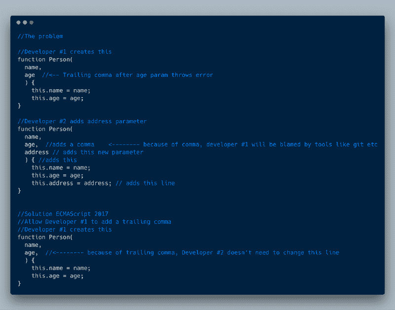

ECMAScript 2017 (ES 8) — Trailing comma in function parameter

> 注意:你也可以用逗号来调用函数！

### 6.异步/等待

如果你问我，这是迄今为止最重要和最有用的特性。异步函数允许我们不用处理回调问题，让整个代码看起来简单。

关键字`async`告诉 JavaScript 编译器对函数进行不同的处理。每当编译器到达该函数中的关键字`await`时就会暂停。它假设`await`后的表达式返回一个承诺，并等到承诺被解决或拒绝后再继续。

在下面的例子中，`getAmount`函数正在调用两个异步函数`getUser`和`getBankBalance`。我们可以在 promise 中做到这一点，但是使用`async await`更加优雅和简单。


ECMAScript 2017 (ES 8) — Async Await basic example

#### **6.1** 异步函数本身返回一个承诺。

如果您正在等待一个异步函数的结果，您需要使用 Promise 的`then`语法来捕获它的结果。

在下面的例子中，我们想使用`console.log`记录结果，但不是在 doubleAndAdd 中。所以我们想等待并使用`then`语法将结果传递给`console.log`。

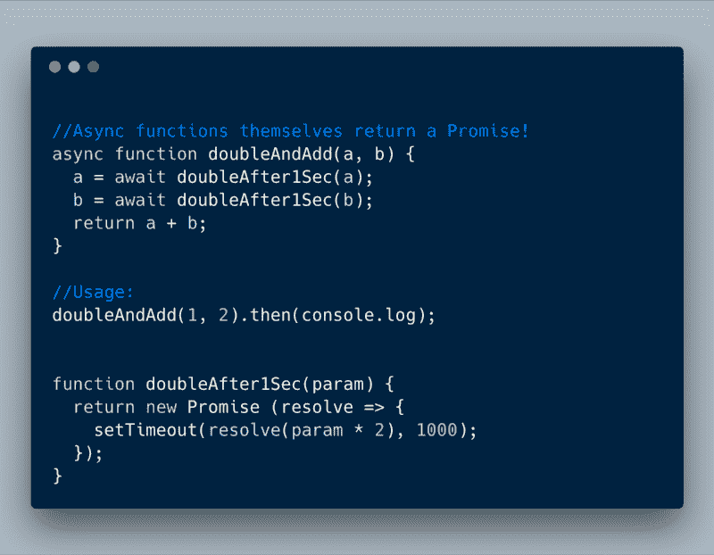

ECMAScript 2017 (ES 8) — Async Await themselves returns Promise

#### **6.2 并行调用 async/await**

在前面的例子中，我们调用了 await 两次，但是每次我们都等待一秒钟(总共 2 秒钟)。相反，我们可以将其并行化，因为`a`和`b`使用`Promise.all`并不相互依赖。

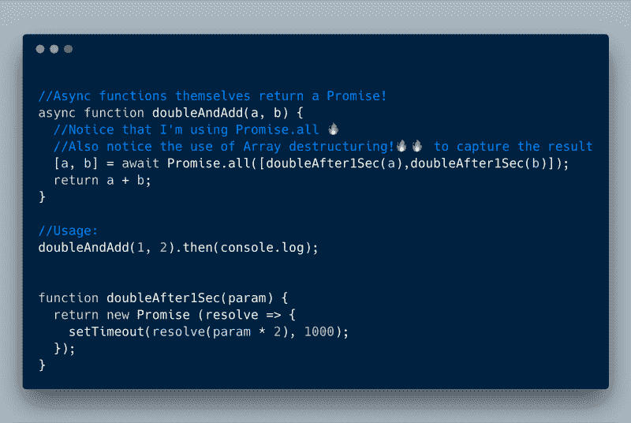

ECMAScript 2017 (ES 8) — Using Promise.all to parallelize async/await

#### 6.3 处理异步/等待函数的错误

使用异步 await 时，有多种方法来处理错误。

#### **选项 1 —在函数**中使用 try catch

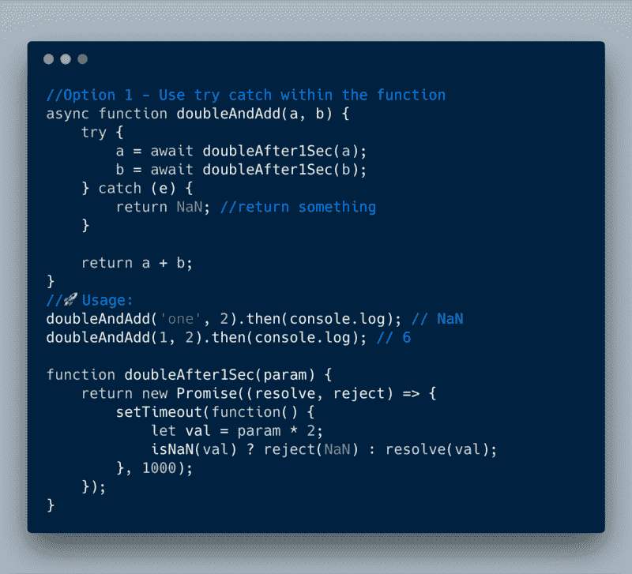

ECMAScript 2017 — **Use try catch within the async/await function**

```
//Option 1 - Use try catch within the function
async function doubleAndAdd(a, b) {
 try {
  a = await doubleAfter1Sec(a);
  b = await doubleAfter1Sec(b);
 } catch (e) {
  return NaN; //return something
 }
return a + b;
}

//?Usage:
doubleAndAdd('one', 2).then(console.log); // NaN
doubleAndAdd(1, 2).then(console.log); // 6

function doubleAfter1Sec(param) {
 return new Promise((resolve, reject) => {
  setTimeout(function() {
   let val = param * 2;
   isNaN(val) ? reject(NaN) : resolve(val);
  }, 1000);
 });
}
```

#### **选项 2—捕捉每个 await 表达式**

因为每个`await`表达式都返回一个承诺，所以您可以在每一行捕捉错误，如下所示。

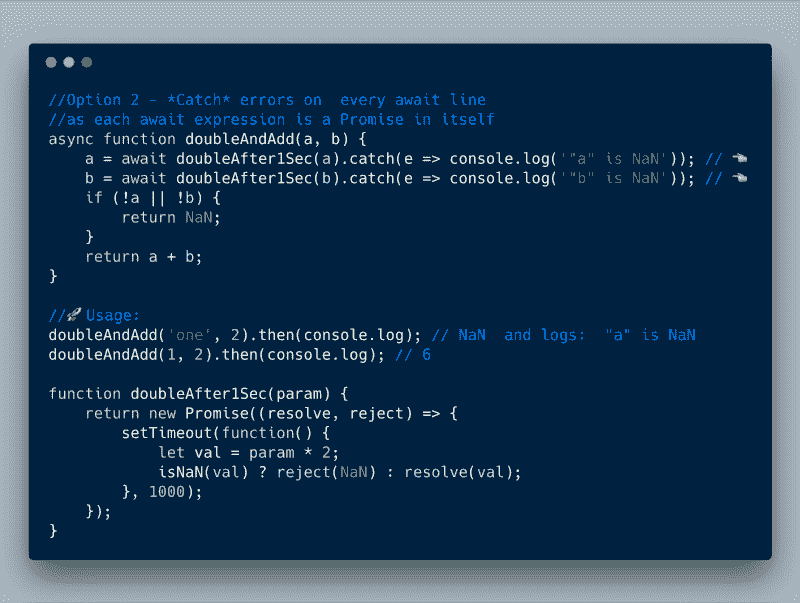

ECMAScript 2017 — **Use try catch every await expression**

```
//Option 2 - *Catch* errors on  every await line
//as each await expression is a Promise in itself
async function doubleAndAdd(a, b) {
 a = await doubleAfter1Sec(a).catch(e => console.log('"a" is NaN')); // ?
 b = await doubleAfter1Sec(b).catch(e => console.log('"b" is NaN')); // ?
 if (!a || !b) {
  return NaN;
 }
 return a + b;
}

//?Usage:
doubleAndAdd('one', 2).then(console.log); // NaN  and logs:  "a" is NaN
doubleAndAdd(1, 2).then(console.log); // 6

function doubleAfter1Sec(param) {
 return new Promise((resolve, reject) => {
  setTimeout(function() {
   let val = param * 2;
   isNaN(val) ? reject(NaN) : resolve(val);
  }, 1000);
 });
}
```

#### **选项 3 —捕获整个异步等待函数**

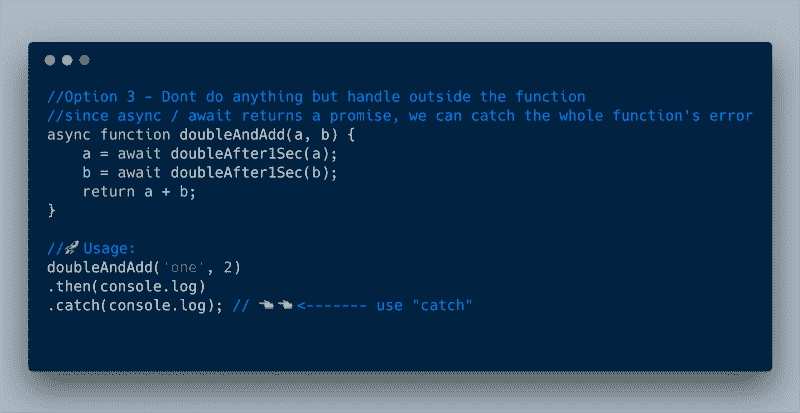

ECMAScript 2017 — **Catch the entire async/await function at the end**

```
//Option 3 - Dont do anything but handle outside the function
//since async / await returns a promise, we can catch the whole function's error
async function doubleAndAdd(a, b) {
 a = await doubleAfter1Sec(a);
 b = await doubleAfter1Sec(b);
 return a + b;
}

//?Usage:
doubleAndAdd('one', 2)
.then(console.log)
.catch(console.log); // ???<------- use "catch"

function doubleAfter1Sec(param) {
 return new Promise((resolve, reject) => {
  setTimeout(function() {
   let val = param * 2;
   isNaN(val) ? reject(NaN) : resolve(val);
  }, 1000);
 });
}
```


> ECMAScript 目前处于最终草案阶段，将于 2018 年 6 月或 7 月问世。以下涵盖的所有功能都处于第 4 阶段，将成为 ECMAScript 2018 的一部分。

#### 1.[共享内存和原子](https://github.com/tc39/ecmascript_sharedmem)

这是一个巨大的、非常先进的特性，是 JS 引擎的核心增强。

主要想法是给 JavaScript 带来某种多线程特性，这样 JS 开发人员就可以通过允许他们自己管理内存来编写高性能的并发程序，而不是让 JS engine 管理内存。

这是通过一种叫做 [SharedArrayBuffer](https://developer.mozilla.org/en-US/docs/Web/JavaScript/Reference/Global_Objects/SharedArrayBuffer) 的新型全局对象来完成的，它本质上是将数据存储在一个 ***共享*** **内存空间**中。所以这些数据可以在主 JS 线程和 web worker 线程之间共享。

到目前为止，如果我们想要在主 JS 线程和 web workers 之间共享数据，我们必须使用`postMessage`复制数据并发送给其他线程。不再是了！

您只需使用 SharedArrayBuffer，主线程和多个 web 工作线程都可以立即访问数据。

但是线程之间共享内存会导致争用情况。为了帮助避免竞态条件，引入了“[](https://developer.mozilla.org/en-US/docs/Web/JavaScript/Reference/Global_Objects/Atomics)*”原子级全局对象。 *Atomics* 提供了各种方法来在线程使用其数据时锁定共享内存。它还提供了在共享内存中安全更新这些数据的方法。*

> *建议通过一些库来使用这个特性，但是目前还没有建立在这个特性之上库。*

*如果你有兴趣，我推荐阅读:*

1.  *[*从工人到共享内存*](http://lucasfcosta.com/2017/04/30/JavaScript-From-Workers-to-Shared-Memory.html) *y — [卢卡斯科斯塔](http://lucasfcosta.com/)**
2.  *[*一部漫画介绍 SharedArrayBuffers*](https://hacks.mozilla.org/category/code-cartoons/a-cartoon-intro-to-sharedarraybuffers/)*——[林克拉克](https://www.freecodecamp.org/news/here-are-examples-of-everything-new-in-ecmascript-2016-2017-and-2018-d52fa3b5a70e/undefined)**
3.  *[](http://2ality.com/2017/01/shared-array-buffer.html)**——[阿克塞尔·劳施迈尔博士](http://rauschma.de/)***

#### **2.已移除标记模板文字限制**

**首先，我们需要澄清什么是“带标签的模板文字”,这样我们才能更好地理解这个特性。**

**在 ES2015+中，有一个称为标记模板文字的功能，允许开发人员自定义字符串的插值方式。例如，在标准的方式下，字符串被插值如下…**

**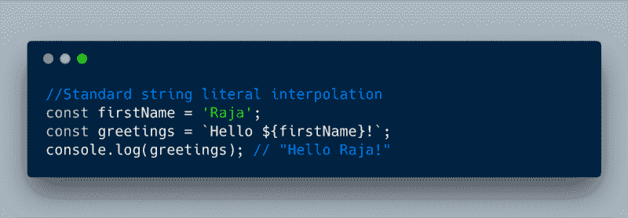**

**在标记文字中，您可以编写一个函数来接收字符串文字的硬编码部分，例如`[ ‘Hello ‘, ‘!’ ]`，以及替换变量，例如`[ 'Raja']`，作为自定义函数(例如`greet`)的参数，并从该自定义函数返回您想要的任何内容。**

**下面的例子显示了我们的自定义“标签”函数`greet`附加了一天中的时间，如“早上好！”“下午好”等等，并返回一个自定义字符串。**

**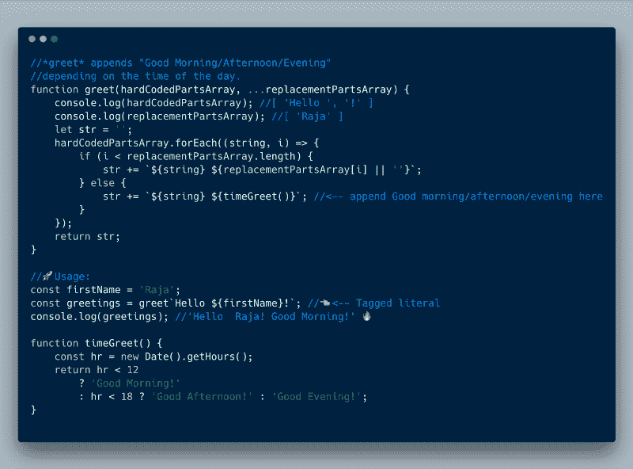

Tag function example that shows custom string interpolation** 

```
**`//A "Tag" function returns a custom string literal.
//In this example, greet calls timeGreet() to append Good //Morning/Afternoon/Evening depending on the time of the day.

function greet(hardCodedPartsArray, ...replacementPartsArray) {
 console.log(hardCodedPartsArray); //[ 'Hello ', '!' ]
 console.log(replacementPartsArray); //[ 'Raja' ]

let str = '';
 hardCodedPartsArray.forEach((string, i) => {
  if (i < replacementPartsArray.length) {
   str += `${string} ${replacementPartsArray[i] || ''}`;
  } else {
   str += `${string} ${timeGreet()}`; //<-- append Good morning/afternoon/evening here
  }
 });
 return str;
}

//?Usage:
const firstName = 'Raja';
const greetings = greet`Hello ${firstName}!`; //??<-- Tagged literal

console.log(greetings); //'Hello  Raja! Good Morning!' ?

function timeGreet() {
 const hr = new Date().getHours();
 return hr < 12
  ? 'Good Morning!'
  : hr < 18 ? 'Good Afternoon!' : 'Good Evening!';
}`**
```

**既然我们讨论了什么是“带标签的”函数，许多人希望在不同的领域使用这个特性，比如在终端中使用命令和 HTTP 请求来编写 URIs，等等。**

#### **标记字符串文字的⚠️The 问题**

**问题是 ES2015 和 ES2016 规范不允许使用像“\ u”(unicode)、“\x”(十六进制)这样的转义字符，除非它们看起来完全像“\u00A9”或\ f804 }或\xA9。**

**因此，如果您有一个标记函数在内部使用了一些其他域的规则(如终端的规则)，可能需要使用看起来不像\u0049 或\u{@F804}的 **\ubla123abla** ，那么您将会得到一个语法错误。**

**在 ES2018 中，规则被放宽到允许这种看似无效的转义字符，只要标记的函数返回带有“熟”属性(其中无效字符是“未定义的”)的对象中的值，然后是“原始”属性(带有您想要的任何内容)。**

```
**`function myTagFunc(str) { 
 return { "cooked": "undefined", "raw": str.raw[0] }
} 

var str = myTagFunc `hi \ubla123abla`; //call myTagFunc

str // { cooked: "undefined", raw: "hi \\unicode" }`**
```

### **3.正则表达式的“dotall”标志**

**目前在 RegEx 中，虽然点(".)应该匹配单个字符，它不匹配像`\n \r \f etc`这样的新行字符。**

**例如:**

```
**`//Before
/first.second/.test('first\nsecond'); //false`**
```

**这种增强使得点运算符可以匹配任何单个字符。为了确保这不会破坏任何东西，我们需要在创建正则表达式时使用`\s`标志。**

```
**`//ECMAScript 2018
/first.second/s.test('first\nsecond'); //true   Notice: /s ??`** 
```

**以下是来自[提案](https://github.com/tc39/proposal-regexp-dotall-flag)文档的整体 API:**

**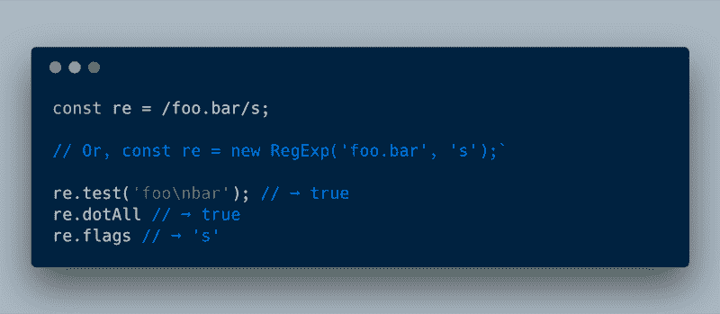

ECMAScript 2018 — Regex dotAll feature allows matching even \n via “.” via /s flag** 

### **4.RegExp 命名组捕获？**

**这一增强带来了来自 Python、Java 等其他语言的一个有用的 RegExp 特性，称为“命名组”。这个特性允许开发人员编写 RegExp，以格式`(?<name>...)`为 RegExp 中的组的不同部分提供名称(标识符)。然后，他们可以使用该名称轻松获取他们需要的任何组。**

#### **4.1 基本命名组示例**

**在下面的例子中，我们使用`(?<year>) (?<month>) and (?<day>)`名称对日期正则表达式的不同部分进行分组。结果对象现在将包含一个`groups`属性，其属性`year`、`month`和`day`具有相应的值。**

**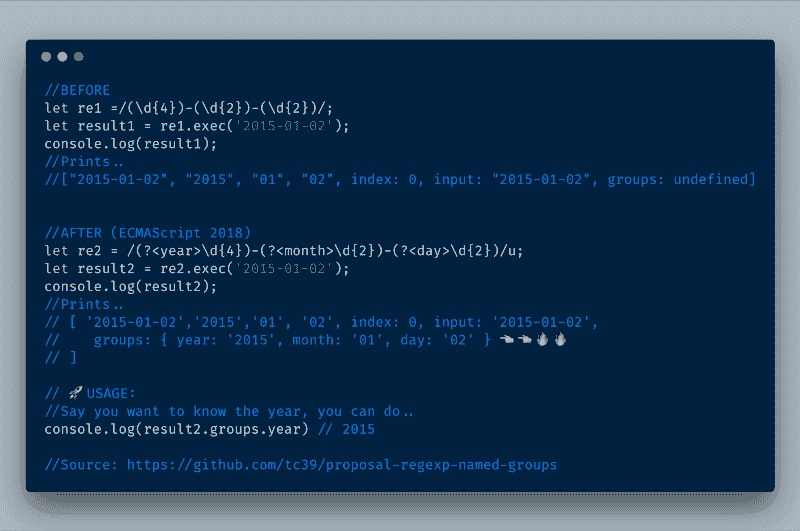

ECMAScript 2018 — Regex named groups example** 

#### ****4.2 在正则表达式本身内部使用命名组****

**我们可以使用`\k<group name>`格式反向引用 regex 本身中的组。下面的例子展示了它是如何工作的。**

**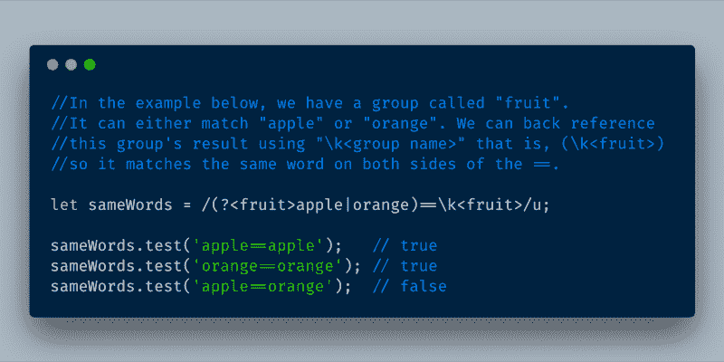

ECMAScript 2018 — Regex named groups back referencing via \k<group name>** 

#### ****4.3 在 String.prototype.replace 中使用命名组****

**命名的组特性现在被嵌入到 String 的`replace`实例方法中。所以我们可以很容易地交换字符串中的单词。**

**例如，将“名字，姓氏”更改为“姓氏，名字”。**

**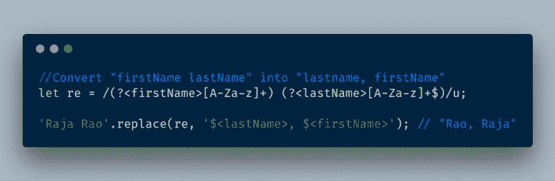

ECMAScript 2018 — Using RegEx’s named groups feature in replace function** 

### **5.对象的 Rest 属性**

**Rest 操作符`...`(三个点)允许我们提取尚未提取的对象属性。**

#### ****5.1 你可以使用 rest 来帮助提取你想要的属性****

**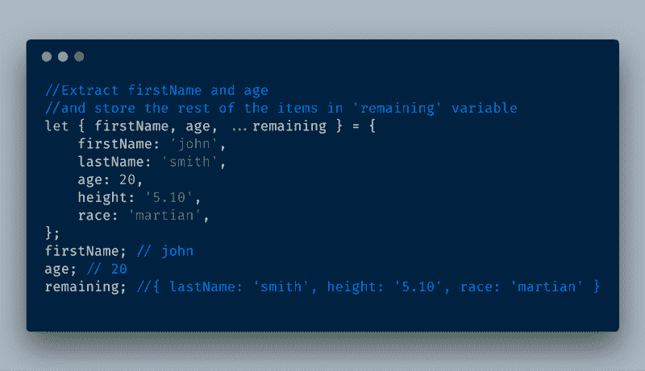

ECMAScript 2018 — Object destructuring via rest** 

#### **更好的是，您可以删除不需要的项目！？？**

**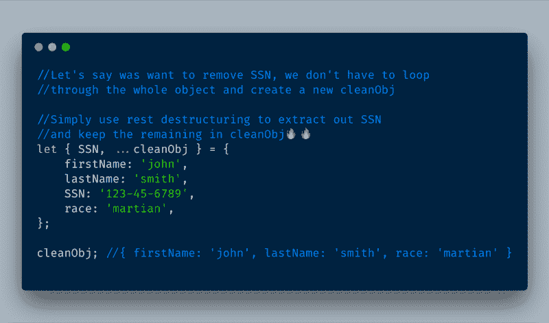

ECMAScript 2018 — Object destructuring via rest** 

### ****6。对象的扩散属性****

****展开属性看起来也像带有三个点的 rest 属性`...`,但是不同的是你使用展开来创建(重组)新的对象。****

> ****提示:扩展运算符用在等号的右边。其余的用在等号的左边。****

**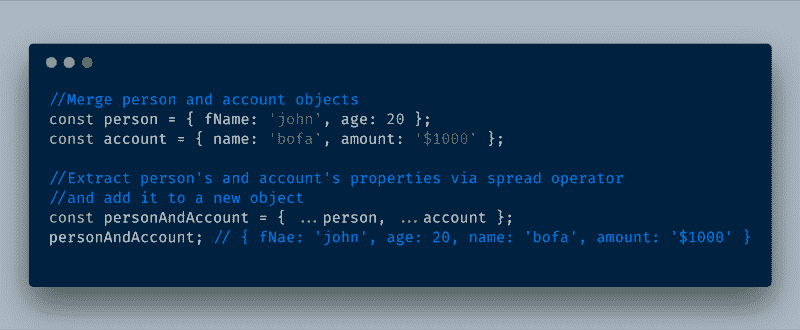

ECMAScript 2018 — Object restructuring via spread** 

### ****7。正则表达式后视断言****

**这是对正则表达式的一个增强，它允许我们确保某个字符串在* 之前立即* **。****

*你现在可以用一组`(?<=…)` **(问号，小于，等于)** 来寻找后面的肯定断言。*

*进一步，你可以用`(?<!…)` **(问号，小于，感叹号)** ，去寻找后面的否定断言。本质上，只要-ve 断言通过，这就会匹配。*

*****肯定断言:**** 假设我们希望确保`#`符号存在于单词`winning`(即:`#winning`)之前，并希望正则表达式只返回字符串“winning”。你应该这样写。*

*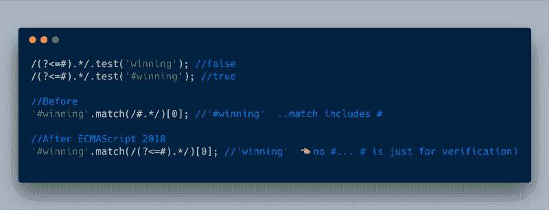

ECMAScript 2018 — `(?<=…) for positive assertion`* 

*****否定断言:**** 假设我们想从那些数字前面有{\\符号而不是＄\\符号的行中提取数字。*

*

ECMAScript 2018 — (?<!…) for negative assertions* 

### *****8。 [RegExp Unicode 属性逃出](https://github.com/tc39/proposal-regexp-unicode-property-escapes)*****

*编写正则表达式来匹配各种 unicode 字符并不容易。像`\w`、`\W`、`\d`等只匹配英文字符和数字。但是像印地语、希腊语等其他语言中的数字呢？*

*这就是 Unicode 属性转义的由来。原来 Unicode 为每个符号(字符)添加了元数据属性，并使用它来分组或表征各种符号。*

*例如，Unicode 数据库将所有北印度语(characters(हिन्दी语)分组到一个名为`Script`的属性值`Devanagari`和另一个名为`Script_Extensions`的属性值`Devanagari`下。所以我们可以搜索`Script=Devanagari`，得到所有的北印度文字。*

***[梵文](https://en.wikipedia.org/wiki/Devanagari_(Unicode_block))可用于各种印度语言，如马拉地语、印地语、梵语等等。***

*从 ECMAScript 2018 开始，我们可以使用`\p`对字符进行转义，同时使用`{Script=Devanagari}`来匹配所有那些印度字符。 ****也就是说，我们可以在正则表达式中使用:**** `****\p{Script=Devanagari}****` ****来匹配所有的梵文字符。*****

*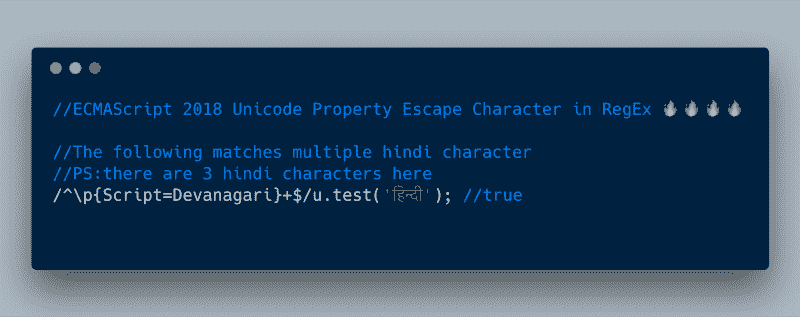

ECMAScript 2018 — showing \p* 

```
*`//The following matches multiple hindi character
/^\p{Script=Devanagari}+$/u.test('हिन्दी'); //true  
//PS:there are 3 hindi characters h`*
```

*类似地，Unicode 数据库将所有希腊字符分组到值为`Greek`的`Script_Extensions`(和`Script`)属性下。因此，我们可以使用`Script_Extensions=Greek`或`Script=Greek`搜索所有希腊字符。*

*****也就是说，我们可以在 RegEx 中使用:**** `****\p{Script=Greek}****` ****来匹配所有的希腊字符。*****

*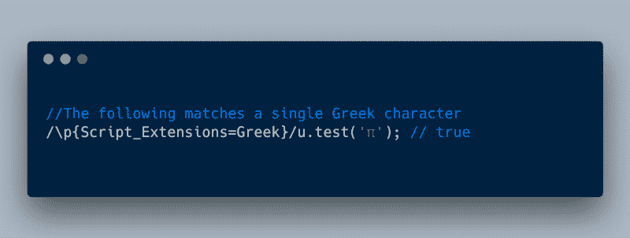

ECMAScript 2018 — showing \p* 

```
*`//The following matches a single Greek character
/\p{Script_Extensions=Greek}/u.test('π'); // true`*
```

*此外，Unicode 数据库在布尔属性`Emoji`、`Emoji_Component`、`Emoji_Presentation`、`Emoji_Modifier`和`Emoji_Modifier_Base`下存储各种类型的表情符号，属性值为“真”。因此，我们可以通过简单地选择`Emoji`为真来搜索所有表情符号。*

*****也就是我们可以用:****`****\p{Emoji}****`**`****\Emoji_Modifier****`****等等来搭配各种表情符号。*******

***下面的例子将使这一切变得清晰。***

***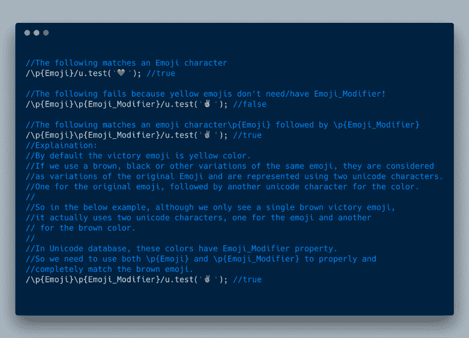

ECMAScript 2018 — showing how \p can be used for various emojis*** 

```
***`//The following matches an Emoji character
/\p{Emoji}/u.test('❤️'); //true

//The following fails because yellow emojis don't need/have Emoji_Modifier!
/\p{Emoji}\p{Emoji_Modifier}/u.test('✌️'); //false

//The following matches an emoji character\p{Emoji} followed by \p{Emoji_Modifier}
/\p{Emoji}\p{Emoji_Modifier}/u.test('✌?'); //true

//Explaination:
//By default the victory emoji is yellow color.
//If we use a brown, black or other variations of the same emoji, they are considered
//as variations of the original Emoji and are represented using two unicode characters.
//One for the original emoji, followed by another unicode character for the color.
//
//So in the below example, although we only see a single brown victory emoji,
//it actually uses two unicode characters, one for the emoji and another
// for the brown color.
//
//In Unicode database, these colors have Emoji_Modifier property.
//So we need to use both \p{Emoji} and \p{Emoji_Modifier} to properly and
//completely match the brown emoji.
/\p{Emoji}\p{Emoji_Modifier}/u.test('✌?'); //true`***
```

*******最后，我们可以用大写的“P”(****`\P`****)转义符代替小 p (**** `\p` ) ****)，来否定火柴。*******

***参考资料:***

1.  ***[**ECMAScript 2018 提案**](https://mathiasbynens.be/notes/es-unicode-property-escapes)***
2.  ***[*【https://mathiasbynens.be/notes/es-unicode-property-escapes】*](https://mathiasbynens.be/notes/es-unicode-property-escapes)***

### *****8。promise . prototype . finaly()*****

***`finally()`是添加到 Promise 中的新实例方法。主要思想是允许在`resolve`或`reject`之后运行回调来帮助清理问题。`****finally****` ****回调函数在没有任何值的情况下被调用，并且无论如何都会被执行。*******

***我们来看各种案例。***

***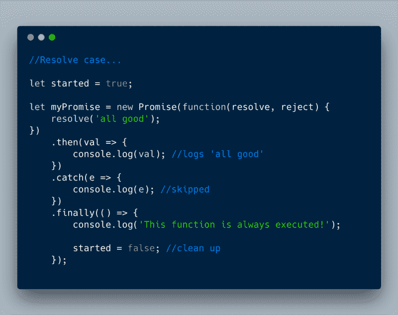

ECMAScript 2018 — finally() in resolve case*** ***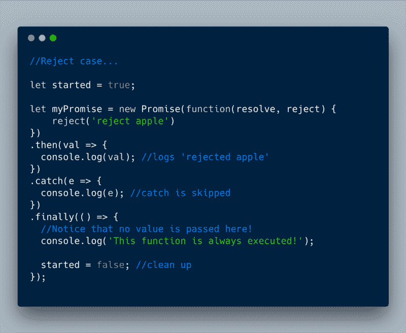

ECMAScript 2018 — finally() in reject case*** ***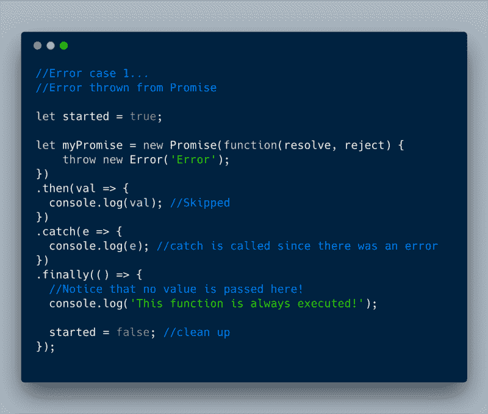

ECMASCript 2018 — finally() in Error thrown from Promise case*** ***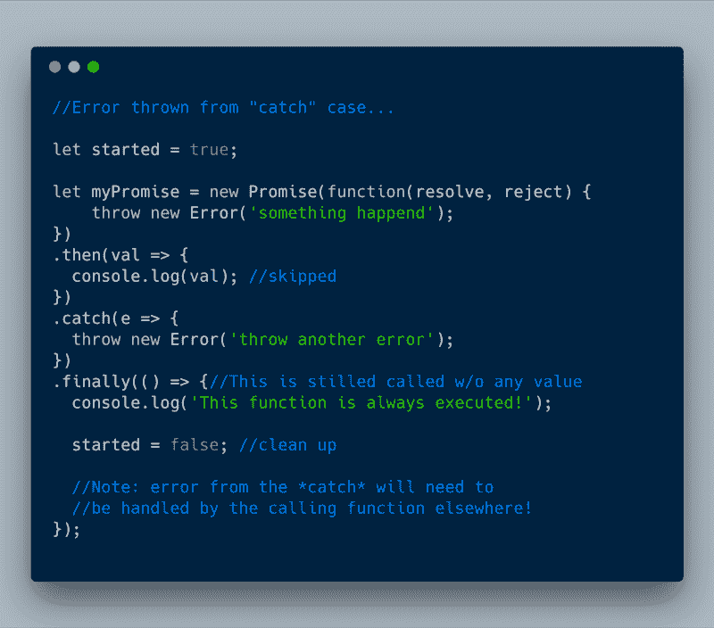

**ECMAScript 2018 — Error thrown from within **catch** case***** 

### *****9。异步迭代*****

***这是一个非常有用的特性。基本上，它允许我们轻松地创建异步代码循环！***

***这个特性增加了一个新的****【for-await-of】****循环，允许我们在一个循环中调用返回承诺(或带有一堆承诺的数组)的异步函数。有趣的是，该循环在进行下一个循环之前，会等待每个承诺完成。***

***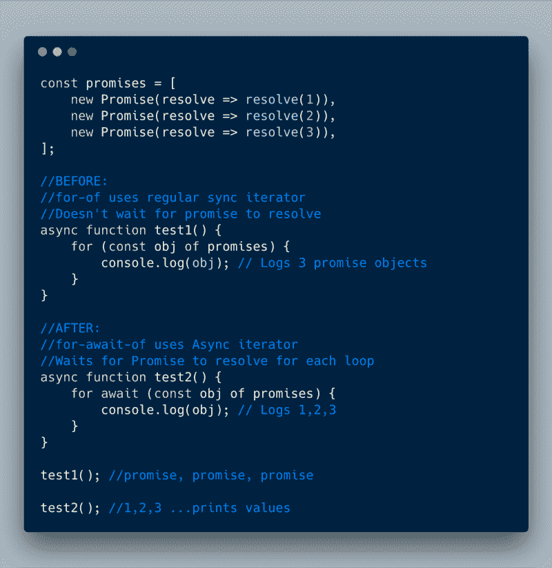

ECMAScript 2018 — Async Iterator via for-await-of*** 

***差不多就是这样！***

***如果这有用，请点击拍手？下面扣几下，以示支持！⬇⬇⬇ ?？***

### ***我的其他帖子***

*****[【https://medium.com/@rajaraodv/latest】](https://medium.com/@rajaraodv/latest)*****

#### *****相关 ECMAScript 2015+帖子*****

1.  *****[*看看这些有用的 ECMAScript 2015 (ES6)小技巧和窍门*](https://medium.freecodecamp.org/check-out-these-useful-ecmascript-2015-es6-tips-and-tricks-6db105590377)*****
2.  *****[*5 ES6*](https://medium.com/@rajaraodv/5-javascript-bad-parts-that-are-fixed-in-es6-c7c45d44fd81#.7e2s6cghy)**中修复的 JavaScript“坏”部分***
3.  *****[*ES6 中的“类”是新的“坏”的部分吗？*](https://medium.com/@rajaraodv/is-class-in-es6-the-new-bad-part-6c4e6fe1ee65#.4hqgpj2uv)*****