# 我从数据驱动的设计方法中学到了什么

> 原文：<https://www.freecodecamp.org/news/3-takeaways-from-a-data-driven-design-approach-70c6b52540b/>

迈克尔·洛斯卡佐

# 我从数据驱动的设计方法中学到了什么

#### 当先入为主的观念让位于从度量学得的经验教训时，会发生什么？

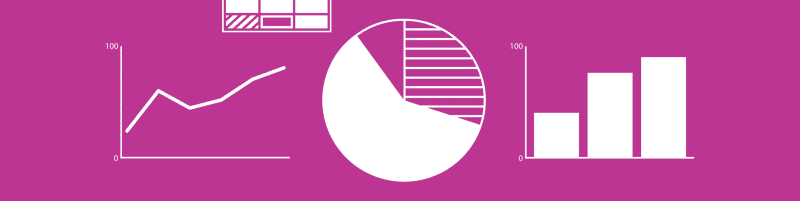

### 让我们从结尾开始…

？我的博客指标显示，60%的读者不会阅读全文。所以，让我们非常快速地看看我从数据驱动的网站重新设计中学到了什么！

#### 外卖#1

如果展示得当，访问者会花*多*的时间浏览*少*的内容。尽管页面数量减少了，每页字数也减少了，但我观察到平均会话持续时间增加了。

**变化:**

*   长篇大论的文本被重新评估，并被删节成更简洁的导语。
*   整合的网站结构使访问者能够快速找到相关内容。

The increase in average session duration indicates that visitors are staying on the website longer.

#### 外卖#2

设计模式起作用了！打破所有的规则可能很有诱惑力，但事实是，设计模式对参观者来说是熟悉的，并且利用了一种利用观众自然眼球运动的构图。

**变化:**

*   改版后的主页采用了 [z 形图案](https://uxplanet.org/z-shaped-pattern-for-reading-web-content-ce1135f92f1c)(桌面)，并优先显示最常浏览的内容。在有大文本块的页面上，使用了 f 形图案(桌面)。
*   主要导航被修改为更加直观和移动友好。

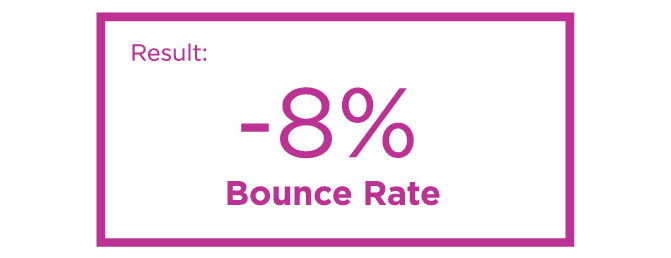

The 8% decrease in the bounce rate indicates a deeper visit to the website.

#### 外卖#3

**去除用户旅程中的步骤，提高转化率。**用户旅程中的单个步骤的去除导致了转化率的大幅增加。

转换是通过提交调查表的访问者的百分比来衡量的。

**变化:**

*   访问者需要更少的步骤来填写问卷表，获得关于产品的足够信息。
*   形体的突出性增加。
*   这份表格不是一个长表格(15 个问题)，而是分成三个小部分(每部分 5 个问题)。

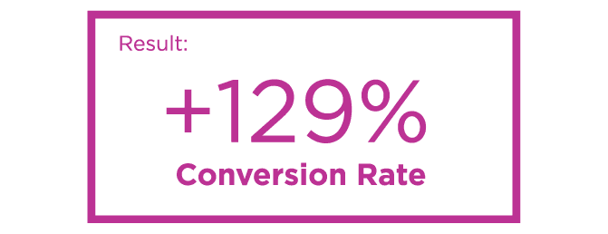

A large increase in conversion rate indicates that more visitors are taking a desired action in response to a call to action (CTA).

谢谢你读到这里！

下面，我提供了一个更加详细的检查，说明为什么进行了某些更改，以及在关键性能指标(KPI)中观察到的改进。

### 客户

1980 年，卡罗尔·伊尔马斯和其他九位父母为他们有天赋的孩子寻求合适的教育。他们一起创立了长岛天才学校****【LISG】，这是一所男女同校的私立走读学校。****

******LISG 使命宣言:******

> ****为从幼儿园到九年级的天才儿童提供适当的教育，在一个培养环境中，他们将在智力上受到挑战，在社交上感到舒适，从而为这些儿童提供成长和发展其潜力的机会。****

****LISG 网站旨在为潜在学生及其家长提供该校独特课程的详细信息。申请流程的第一步是填写“介绍性问卷”表格，该表格可在网站上填写。此外，该网站将为注册学生及其家长提供有价值的信息。****

### ****LISG 网站:2014-2017****

****在 2014 年之前，LISG 网站基本上是静态的。2014-2017 年网站的特色是照片转盘、数字学生活动日历和[介绍性问卷](http://lisg.org/admissions.html)表格，这将有助于准父母快速启动申请流程。****

****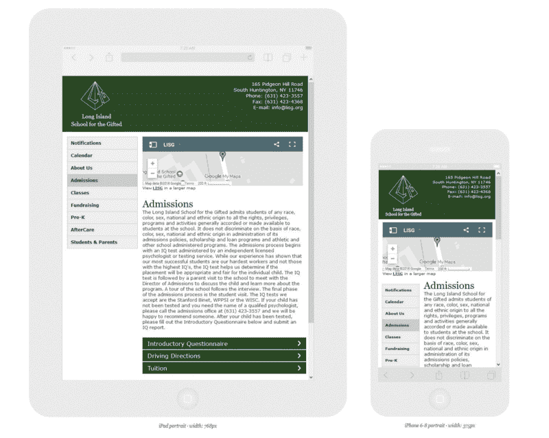

The 2014–2017 website when viewed on a tablet and a smartphone.**** 

****虽然 2014-2017 年 LISG 网站的重新设计比以前的设计有所改进，但收集的指标表明还可以进一步改进。****

#### ****分析工具****

*   ******谷歌分析:**测量网站、应用、数字和离线数据，以获得客户洞察。****
*   ****JotForm: 是一个在线应用程序，允许网站管理员快速创建定制的在线表单。JotForm 提供了一个表单[分析](https://www.jotform.com/form-analytics/)工具。****

#### ****主要发现****

*   ******不同的用户类型:**根据网站流量和行为流，似乎有两种不同的用户类型，有两种不同的内容需求。这两种用户类型是预期的家长/学生和注册的家长/学生。****
*   ******平均会话持续时间:**典型的访问者在每个页面上只花很短的时间，这表明很长的文本块没有被阅读。****
*   ******转换:**大约 0 . 69%的访问者正在完成介绍性问卷。****
*   ******移动流量的增长:**网站的移动流量在三年内增长了近 50%。****

### ****LISG 网站:2017 年改版****

****在检查了 2014-2017 年的数据后，我们怀着明确的目标开始了重新设计的过程。****

#### ****重新设计的目标****

1.  ******优化网站结构:**巩固网站内容，减少文字。****
2.  ******改进移动用户界面:**移动流量的增加凸显了改进移动导航的需求。****
3.  ******利用已建立的设计模式:**已建立的设计模式为访问者所熟悉，并利用了一种利用观众自然眼球运动的构图。****
4.  ******改善用户旅程:**消除不必要的障碍，让访客快速便捷地找到自己想要的东西。****
5.  ******提高转化率:**提高介绍性问卷表单的可见性，使其填写起来不那么令人生畏。****

****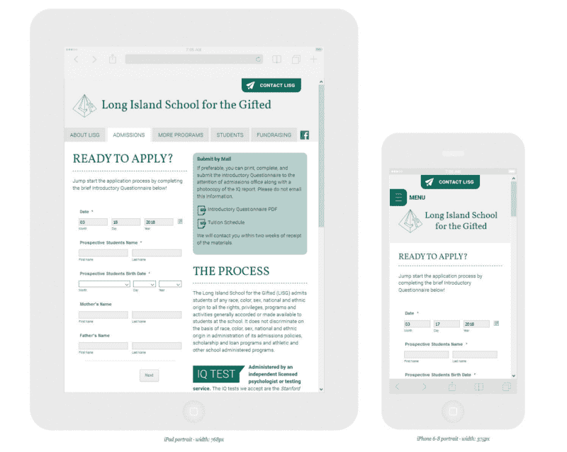

The 2017 website redesign when viewed on a tablet and a smartphone.**** 

#### ****目标 1:优化网站结构****

****尽管网站的大部分内容可能与潜在的和注册的学生/家长都相关，但还是努力确定哪种用户类型主要对每个页面感兴趣。此外，内容在适当的时候被整合或删除。****

****这种方法使我们能够将网站的大小减少四页，目标是创建一个更直观的网站结构。****

****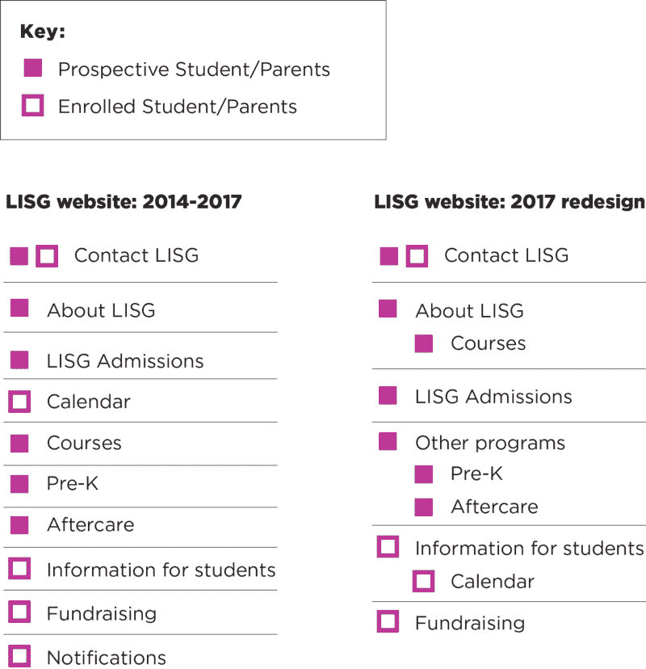

Evaluating content by user type and consolidating content to fewer pages.**** 

****当我们在 2014 年开发第一个重新设计时，有一种分享大量信息并使网站看起来强大的愿望。对于那些可能一口气调查和评估几所学校的访问者来说，大段的文字可能会让他们感到不快。****

****

Long blocks of text became more concise blurbs or bullets.**** 

#### ****目标 2:改进移动用户界面****

****出现在 2014–2017 网站上的导航在手机上的视口左侧被压扁了。更糟糕的是，在一些设备上，一些按钮消失在折叠下面。这些问题可能导致智能手机跳出率上升。****

****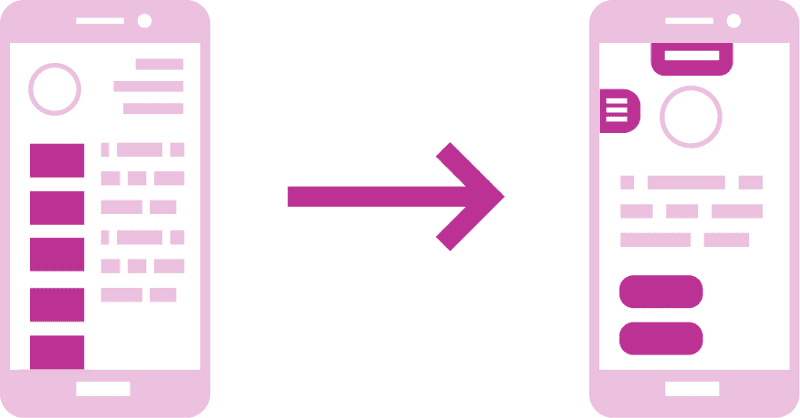

Left: The mobile navigation became squished on mobile. Right: The simplified layout offers simple CTAs and a “hamburger” menu.**** 

#### ****目标 3:利用已建立的设计模式****

****使用 F 和 Z 模式有助于在网页设计中创造视觉层次。****

> ****“这种(Z 形)模式很有效，因为大多数西方读者会像扫描一本书一样扫描你的页面——从上到下，从左到右。”****

> ****—尼克·巴比奇，UX 星球****

****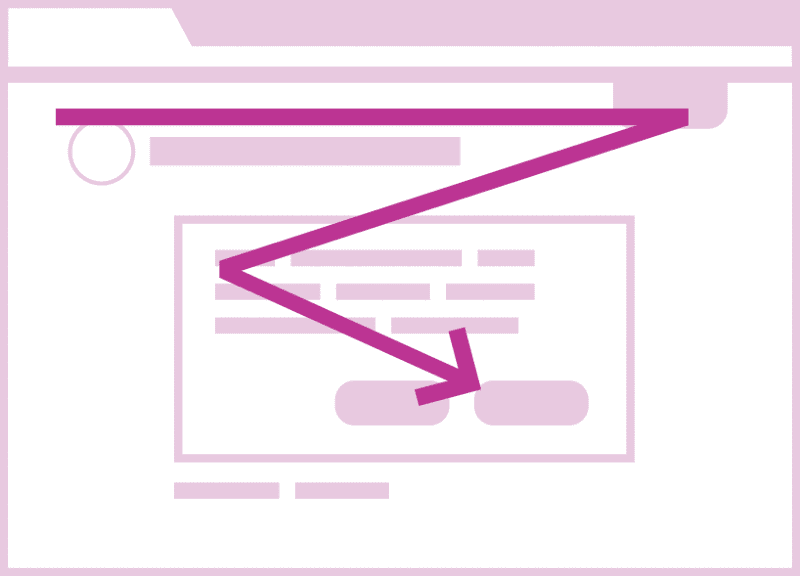

Approximate “Z” eye movement pattern on the 2017 LISG homepage.**** ****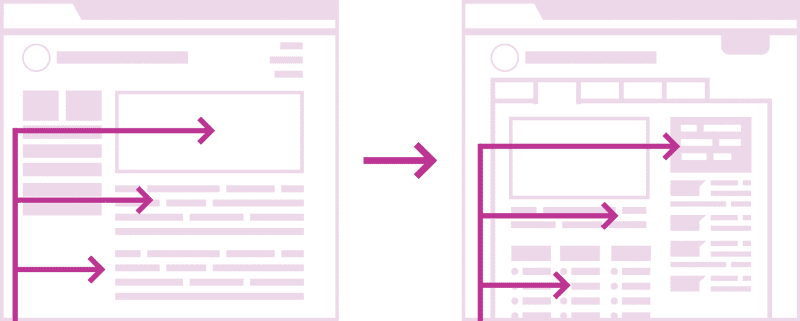

Right: The 2017 website redesign removes the navigation from the left column and organizes content for an F-shaped viewing pattern.**** 

#### ****目标 4:改善用户体验****

****根据人口统计数据和页面流量，我们能够得出结论，大多数网站访问者是潜在的学生/家长。理想情况下，未来的家长可以通过网站了解学校，确定他们的孩子是否有资格入学，他们甚至可以通过填写介绍性问卷开始申请过程。****

> ****“用户旅程是用户为达到目标而采取的一步一步的旅程。这个旅程通常由许多网站页面和决策点组成，将用户从一个步骤带到另一个步骤……然后这个旅程被重新设计，以形成一个没有挫折的‘理想’用户之旅。”****

> ****— [体验 UX](https://www.experienceux.co.uk/faqs/what-are-user-journeys/)****

****使用行为流度量，我们可以看到，在他们填写介绍性问卷之前，进行了三次交互。每次互动，都有访客离开。****

****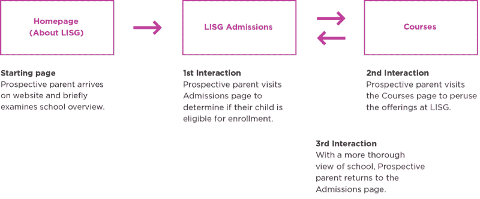

The most common behavior flow on the 2014–2017 version of the website.**** 

****在该网站 2014-2017 年的版本中，指标表明，只有大约 5%的访问者在访问招生页面时获得了足够的学校信息，可以自信地确定他们是否想要填写介绍性的问卷表格。****

****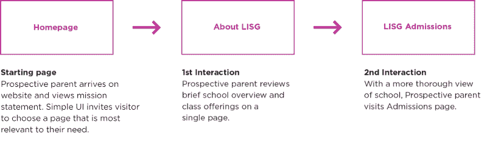

The most common behavior flow on the 2017 version of the website.**** 

****在 2017 年的重新设计中，近 15%的访问者在访问招生页面时会获得关于学校的足够信息。****

#### ****目标 5:提高转化率****

****基于 2014-2017 年的数据，我们假设用户可能很难找到介绍性的问卷表(它位于折叠菜单中)。此外，这种形式可能看起来令人生畏，因为它是纵向长。****

****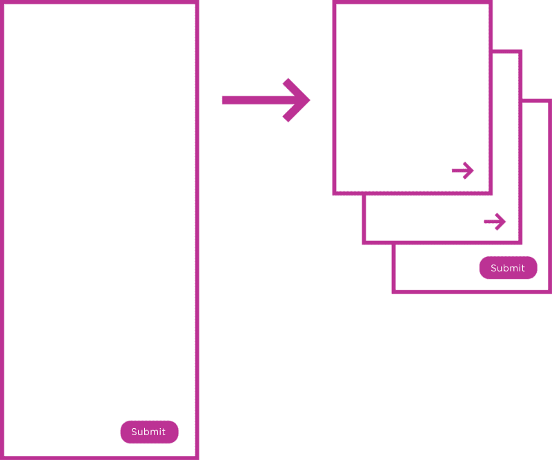

The long from was broken into three smaller segments.**** 

****一页有 15 个问题的表格比一页有 5 个问题的 3 页表格更不容易完成。****

****表单提交量增加了 129%。转化率从. 69%上升到近 1.6%。****

****这就是我们如何成功完成重新设计的。感谢您的阅读！如果你喜欢这个故事，你可以 **[阅读更多](https://medium.com/@MichaelLoscalzo)** 或 **[在 Twitter 上关注我](https://twitter.com/MichaelLoscalzo)。******