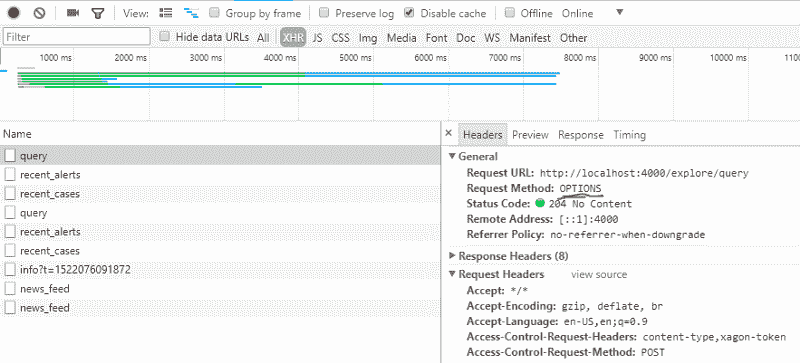

# 使用 Angular CLI 连接到服务器的最佳方式

> 原文：<https://www.freecodecamp.org/news/the-best-ways-to-connect-to-the-server-using-angular-cli-b0c6b699716c/>

作者:摩西·维尔纳

# 使用 Angular CLI 连接到服务器的最佳方式


每个使用过 [Angular CLI](https://cli.angular.io/) 的人都知道，它是一个强大的工具，可以将前端开发工作提升到一个完全不同的水平。它有所有常见的任务，如实时重新加载，类型脚本传输，缩小，等等。这一切都是预先配置好的，只需一个简单的命令即可使用:

```
ng build, ng serve, ng test.
```

但是一旦应用程序准备好开始显示来自服务器的一些数据，就需要配置一项(也是非常重要的一项)任务…

是的，不管 Angular 框架有多好，它的组件有多快多好——最终，SPA(单页应用程序)的目的是通过 HTTP 请求与服务器交互。

而这里是出现在每个 Angular CLI 新手面前的第一个障碍:Angular 项目运行在自己的服务器上(默认运行在 [http://localhost:4200](http://localhost:4200)) )。因此，对 API 服务器的请求是**跨域**，正如您可能知道的，web 浏览器的安全性不允许跨域请求。

### 方法 1:代理

当然，Angular CLI 的人员预见到了这个问题，甚至建立了一个使用代理配置运行 Angular 项目的特殊选项:

```
ng serve  —-proxy-config proxy.conf.json
```

你可能会问，什么是代理？浏览器不允许你跨域请求，但是服务器允许。使用代理选项意味着您告诉 Angular CLI 的服务器处理从 Angular 发送的请求，并从开发服务器重新发送它。这样，与 API 的服务器“对话”的就是 Angular CLI 的服务器。

代理配置需要将***proxy . conf . JSON****文件添加到项目中。这是一个带有一些基本设置的 JSON 文件。下面是 ***proxy.conf*** 的内容示例:*

```
*`{  "/api/*": {    "target": "http://localhost:3000",    "secure": false,    "pathRewrite": {"^/api" : ""}  }}`*
```

*这段代码意味着所有以 **api/** 开头的请求都将被重新发送到[**http://localhost:3000**](http://localhost:3000)**(这是 api 服务器的地址)***

### ***方法二:CORS***

***浏览器安全不允许你进行跨域请求，除非服务器的响应中存在`Control-Allow-Origin`头。一旦您将 API 服务器配置为使用此头进行“应答”,您就可以从不同的域获取和发布数据。***

***这种技术被称为跨源资源共享，或 CORS。大多数常见的服务器和服务器框架，如 Node.js' [Express](https://expressjs.com/) ，或 [Java Spring Boot](https://projects.spring.io/spring-boot/) 都可以很容易地配置，使 CORS 可用。***

***下面是一些将 Node.js Express 服务器设置为使用 CORS 的示例代码:***

```
***`const cors = require('cors'); //<-- required installing 'cors' (npm i cors --save)const express = require('express');const app = express();app.use(cors()); //<-- That`s it, no more code needed!`***
```

***注意，当使用 CORS 时，在发送每个 HTTP 请求之前，它将跟随在选项请求之后(在相同的 URL)，检查是否理解了 **CORS** 协议。这种“双重要求”可能会影响你的表现。***

******

### ***生产方法***

***好了，你的 Angular 项目正在和 server 流畅地“对话”，在开发者环境中获取和发送数据。但是部署的时候终于来了，你需要你漂亮的、性能良好的 Angular app 托管在某个地方(远离 Papa Angular CLI)。所以你再次面临同样的问题:如何连接到服务器。***

***只是现在有了很大的不同:在生产环境中(运行`ng build`命令后)，Angular app 不过是一堆 HTML 和 JavaScript 文件。***

***实际上，关于如何在生产服务器上托管应用程序的决策是一个架构决策，而架构远远超出了本文的范围。但是我建议你考虑一个选择。***

### ***从 API 的服务器提供静态文件***

***是的，您可以在提供数据(API)的同一台服务器上托管您的 Angular 项目(一旦它只有 HTML 和 JavaScript 文件)。***

***这种策略的一个优点是，现在您不会面临任何“跨域”的问题，因为客户机和 API 实际上在同一个服务器上！***

***当然，这种方法需要正确配置 API 的服务器。***

***以下是公开“公共”目录的代码，在使用 Node Express 服务器时，Angular 文件可以存放在该目录中:***

```
***`app.use(express.static('public'));  //<-- public directory that contains all angular files`***
```

***请注意，在这种情况下，您的应用程序在开发环境中访问 API 的方式将不同于 API 在生产环境中访问它的方式。因此，您可能需要在不同的环境中使用不同的 HTTP URLs(比如在开发环境中使用 **api/users/1** ，在生产环境中使用 **users/1** )。您可以使用 Angular CLI 的环境选项来实现这一点:***

```
***`// users.service.ts`***
```

```
***`const URL = 'users';return this.http.get(`${environment.baseUrl}/${URL}`);...`***
```

```
***`// example of environment.ts file:export const environment = {  production: false,  baseUrl: 'api',//<-- 'API/' prefix needed for proxy configuration };`***
```

```
***`// example of environment.prod.ts file:export const environment = {  production: true,  baseUrl: '', //<-- no 'API/' prefix needed};`***
```

### ***结论***

***Angular CLI 无疑是一个非常强大和健壮的工具。它在许多方面使我们作为前端开发人员的生活变得更加容易。但是它也要求您对到 API 服务器的连接做出架构上的决定。因此，您需要清楚地了解建立客户端-服务器通信的各种方式。***

***本文列出了在开发人员环境中处理这个问题的两种方法，以及一个关于产品架构的建议。尝试使用各种编译，看看哪个对你和你的团队来说更方便。***

***玩得开心，让我知道进展如何！***