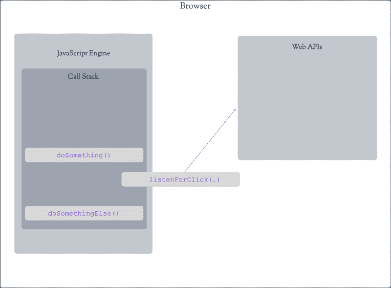
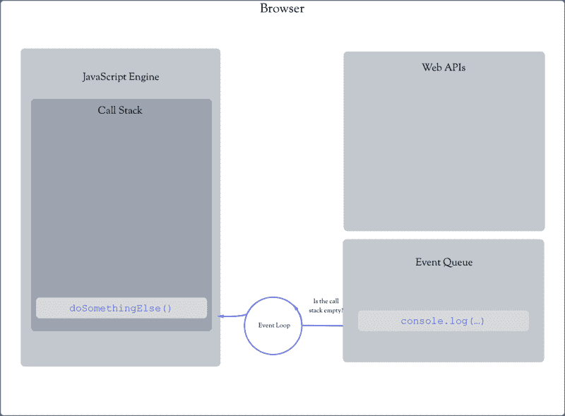

# 抛出循环:理解 JavaScript 中的循环和超时

> 原文：<https://www.freecodecamp.org/news/thrown-for-a-loop-understanding-for-loops-and-timeouts-in-javascript-558d8255d8a4/>

通常，JavaScript 只是工作。因为它是用人类可读的语法编写的，某些东西看起来很直观。但是很容易忽略更深层次上发生的事情。然而，最终，这种缺乏理解导致无法解决问题。

> 直觉是一种不需要有意识的推理就能立即理解事物的能力。—谷歌

我花了相当多的时间试图解决二维问题，花了稍微多一点的时间试图解决三维问题。

虽然我喜欢在业余时间练习编程，但白天我是一名空中交通管制员。作为空中交通管制员，我们面临的问题和其他工作没什么不同。有常规解决的常规问题，也有独特解决的独特问题。只有通过更深入的了解，我们才能解决那些独特的问题。

从外面看空中交通管制，似乎一切都是一个独特的问题——有一个内在的必要技能来完成这项工作。然而，虽然某些能力可以让学习任何技能变得更容易，但最终是经验将解决问题的能力提升到潜意识的水平。结果就是直觉。

直觉跟随观察。对一个独特的问题观察足够多的次数，它和它的解决方案就会成为常规。它注意到每种情况下的一致性，我们开始意识到接下来应该发生什么。

直觉不需要深刻的理解。我们经常可以指出正确的解决方案，但却不能清楚地说明它是如何或为什么起作用的。然而，有时我们选择的解决方案看起来*很直观，但实际上却被一套不熟悉的规则所控制。*

### 这段代码输出了什么？

```
for(var i = 1; i < 6; i++) {
  setTimeout(function() {
     console.log(i);
  },1000);
}
console.log('The loop is done!');
```

花点时间想想这段代码会输出什么。我们将开始构建回答这个问题的基础，稍后我们将回到这个问题。

#### JavaScript 是一种语言方言。

我在美国东北部长大。虽然我说英语，但我的讲话不可否认地包含了地区差异。这个变种叫做*方言*。我的特殊方言是英语语言标准的一个*实现*(或版本)。

标准似乎会催生方言，但正是方言最初推动了对标准的需求。JavaScript 也类似。JavaScript 是方言，不是标准。该标准是由欧洲计算机制造商协会 ECMA 创建的 ECMAScript。ECMAScript 是对 JavaScript 进行标准化的尝试。

ECMAScript 有多种实现，但 JavaScript 碰巧是最流行的，因此，JavaScript 和 ECMAScript 这个名称经常互换使用。

### JavaScript 在引擎中运行。

JavaScript 只是一个文本文件。就像没有车的司机，走不了多远。有些东西必须运行或解释你的文件。这是由 JavaScript 引擎完成的。

JavaScript 引擎的几个例子包括谷歌 Chrome 使用的 V8 引擎；SpiderMonkey，Mozilla Firefox 使用的引擎；以及苹果 Safari 使用的引擎 JavaScriptCore。语言标准 ECMAScript 确保了不同 JavaScript 引擎之间的一致性。

### JavaScript 引擎运行在一个环境中。

虽然 JavaScript 可以在不同的*位置*运行(例如，Node.js，一种流行的服务器端技术，运行 JavaScript 并使用与 Google Chrome 相同的 V8 引擎)，但最常见的 JavaScript 引擎是 web 浏览器。

在浏览器中，JavaScript 引擎只是一个更大的环境的一部分，它帮助我们的代码变得生动。这个环境有三个主要部分，它们共同组成了所谓的*运行时环境*。

#### 调用堆栈

第一部分是当前运行代码的位置。这被命名为*调用栈。*JavaScript 中只有一个调用栈，随着我们继续构建我们的基础，这将变得非常重要。

下面是调用堆栈的一个简化示例:

```
function doSomething() {
   //some other code
   doSomethingElse();
   //some other code
}

function doSomethingElse() {
 //some other code
}

doSomething();
```

初始调用堆栈是空的，因为没有正在运行的代码。当我们的 JavaScript 引擎最终到达第一个函数调用`doSomething()`时，它被添加到堆栈中:

```
--Call Stack--

doSomething;
```

在`doSomething()`内部，我们运行一些其他代码，然后到达`doSomethingElse():`

```
--Call Stack--

doSomething
doSomethingElse
```

当`doSomethingElse()`完成运行时，它被从调用堆栈中移除:

```
--Call Stack--

doSomething
```

最后，`doSomething()`完成剩余的代码，并且也被从调用堆栈中删除:

```
--Call Stack--

Empty
```

#### Web APIs

我们浏览器环境的第二部分填补了一些空白。令人惊讶的是，诸如与 DOM 交互、发出服务器请求以及大多数基于浏览器的任务都不是 ECMAScript 语言标准的一部分。

幸运的是，浏览器为我们提供了 JavaScript 引擎可以插入的附加功能。这些特性扩展了浏览器中 JavaScript 的功能。它们允许我们做一些事情，比如监听事件或发出服务器请求——这些事情是 JavaScript 本身做不到的。并且它们被称为 w*EB API*。

许多 web APIs 允许我们监听或等待某些事情发生。当事件发生时，我们运行一些其他代码。

下面是我们的调用栈示例，它被扩展为包括一个(假装的)web API。

```
function doSomething() {
   //some other code
   listenForClick();
   doSomethingElse();
   //some other code
}

function doSomethingElse() {
 //some other code
}

listenForClick() {
   console.log('the button was clicked!')
}

doSomething();
```

当浏览器遇到`doSomething()`时，它被放入调用堆栈:

```
--Call Stack--

doSomething
```

然后，它运行一些其他代码，然后遇到`listenForClick(...)`:

```
--Call Stack--

doSomething
listenForClick
```

被插入到一个 web API 中，在这种情况下，它被从我们的调用栈中移除。

JavaScript 引擎现在转到`doSomethingElse()`:

```
--Call Stack--

doSomething
doSomethingElse
```

`doSomethingElse()`和`doSomething()`结束，调用栈为空。但是`listenForClick()`怎么了？



#### 事件队列

这是我们介绍浏览器环境的最后一部分。通常，我们的 web API 代码是一个接受回调的函数。回调只是我们想在另一个函数运行后运行的一些代码。例如，监听一个点击事件，然后`console.log`什么的。为了确保我们的`console.log`不会干扰任何当前正在运行的代码，它首先传递给一个叫做*的事件队列*。

事件队列充当等待区域，直到我们的调用堆栈为空。一旦调用堆栈为空，事件队列就可以将我们的代码传递到调用堆栈中运行。让我们继续上一个例子:

```
function doSomething() {
   //some other code
   listenForClick();
   doSomethingElse();
   //some other code
}

function doSomethingElse() {
 //some other code
}

listenForClick() {
   console.log('the button was clicked!')
}

doSomething();
```

现在，我们的代码是这样运行的:

我们的引擎遭遇`doSomething()`:

```
--Call Stack--

doSomething
```

`doSomething()`运行一些代码然后遇到`listenForClick(...)`。在我们的示例中，这需要一个回调，这是我们希望在用户单击按钮后运行的代码。引擎将`listenForClick(…)`传递出调用堆栈，并继续运行，直到遇到`doSomethingElse()`:

```
--Call Stack--

doSomething
doSomethingElse
```

运行一些代码，然后结束。此时，我们的用户点击按钮。web API *听到*点击，然后将`console.log()`语句发送到事件队列。我们会假装`doSomething()`没有完成；所以调用栈不为空，`console.log()`语句必须在事件队列中等待。

```
--Call Stack--

doSomething
```

几秒钟后，`doSomething()`完成并从调用堆栈中删除:

```
--Call Stack--

EMPTY
```

最后，`console.log()`语句可以被传递到调用堆栈中执行:

```
--Call Stack--

console.log('The user clicked the button!')
```

请记住，我们的代码运行得非常快——需要一位数的毫秒来完成。这是不现实的，我们可以开始我们的代码，我们的用户可以点击一个按钮之前，代码完成运行。但是在我们简化的例子中，我们假设这是真的，以突出某些概念。

所有这三个部分(调用栈、web APIs 和事件队列)一起形成了所谓的并发模型，由*事件循环*管理从事件队列进入调用栈的代码。



### 从上面的例子中可以看出:

#### JavaScript 一次只能做一件事。

有一种误解认为人们可以一心多用。这不是真的。然而，人们可以在任务之间切换，这个过程称为*任务切换*。

JavaScript 在不能多任务的意义上是类似的。因为 JavaScript 只有一个调用栈，所以 JavaScript 引擎一次只能执行一个任务。我们说这使得 JavaScript *成为单线程*。然而，与人不同的是，没有我们的 web APIs 的帮助，JavaScript 无法进行任务切换。

#### JavaScript 必须在继续之前完成一项任务。

因为 JavaScript 不能在任务之间来回切换，如果你有任何代码需要一段时间才能运行，它会阻止下一行代码运行。这叫做*阻塞代码*，它的发生是因为 JavaScript 是*同步的*。同步仅仅意味着 JavaScript 必须在开始另一个任务之前完成一个任务。

阻塞代码的一个例子可能是要求我们等待数据返回的服务器请求。幸运的是，浏览器提供的 web APIs 为我们提供了一种解决方法(使用回调)。

通过将阻塞代码从调用堆栈移到事件循环中，我们的引擎可以继续处理调用堆栈中的下一项。因此，随着代码在我们的调用堆栈中运行，并且代码同时在 web API 中运行，我们有了一个*同步*行为。

然而，并不是所有的 web APIs 都会进入事件循环。比如`console.log`是一个 web API，但是由于它没有回调，不需要等待什么，所以可以立即执行。

请记住，单线程并不等同于同步。单线程意味着“一次做一件事”同步意味着“在继续前进之前完成”没有异步 API 的帮助，核心 JavaScript 既是单线程的又是同步的。

### **独家报道范围**

在我们回到最初的问题之前，我们需要谈谈范围。范围是用来描述我们代码的哪些部分可以访问哪些变量的术语。

直觉上，似乎由一个`for loop`声明和初始化的变量只在那个`for loop`中可用。换句话说，如果你试图在循环之外访问它，你会得到一个错误。

事实并非如此。用`var` 关键字声明变量会创建一个在其父作用域中也可用的变量。

这个例子表明由`for loop`中的`var`声明的变量在父作用域(在这个例子中是全局作用域)中也是可用的。

```
for(var a = 1; a < 10; a++) {} // declared "inside" the loop
console.log(a); // prints "10" and is called "outside the loop"
```

### **答案揭晓**

至此，我们已经讨论了足够多的内容来构建我们的答案。

下面是我们的例子:

```
for(var i = 1; i < 6; i++) {
  setTimeout(function() {
     console.log(i);
  },1000);
}
console.log('The loop is done!');
```

凭直觉，您可能认为这将打印数字 1 到 5，每个数字之间有一秒钟的间隔:

```
// one second between each log

1
2
3
4
5
The loop is done!
```

然而，我们实际输出的是:

```
The loop is done!

// then about one second later and all at once

6
6
6
6
6
```

#### 发生了什么事？

回想一下我们关于 web APIs 的讨论。异步 web API，或者那些带有回调的 API，会经历事件循环。`setTimeout()`恰好是一个异步 web API。

每次循环时，`setTimeout()`都被传递到调用堆栈之外，并进入事件循环。因此，引擎能够移动到下一段代码。下一段代码恰好是循环的剩余迭代，后面是`console.log(‘The loop is done!’)`。

为了显示`setTimeout()`语句正在从调用堆栈中传递，并且循环正在运行，我们可以在`setTimeout()`函数之外放置一个`console.log()`语句并打印结果。我们还可以放置一个内置的计时器方法来显示所有事情发生的速度。我们使用`console.time()`和`console.timeEnd()`来做这件事。

```
console.time('myTimer');
for(var i = 1; i < 6; i++) {
   console.log('Loop Number' + i); // added this
   setTimeout(()=>{
      console.log(i);
   },1000);
}
console.log('The loop is done!');
console.timeEnd('myTimer');
```

结果:

```
Loop Number 1
Loop Number 2
Loop Number 3
Loop Number 4
Loop Number 5
The loop is done!

// then, about one second later and all at once:

6
6
6
6
6
myTimer: 1.91577ms   // Wow, that is quick!
```

首先，我们可以看到循环实际上正在运行。此外，我们添加的计时器告诉我们，除了我们的`setTimeout()`函数之外，其他所有函数的运行时间都不到两毫秒！这意味着每个`setTimeout()`函数在它包含的代码进入事件队列并最终进入调用堆栈之前还有大约 998 毫秒的剩余时间。还记得之前我说过用户很难比我们的代码更快吗！

如果您多次运行这段代码，您可能会注意到计时器输出会略有变化。这是因为您的计算机的可用资源总是在变化，每次都可能稍快或稍慢。

事情是这样的:

1.  我们的引擎遇到了我们的 for 循环。我们声明并初始化一个名为`i`的全局变量等于 1。
2.  循环的每一次迭代都将`setTimeout()`传递给 web API 并进入事件循环。因此，我们的`for loop`完成得非常快，因为它里面没有其他代码要运行。事实上，我们的循环唯一做的事情就是将`i`的值改为 6。
3.  此时，循环结束了，我们的`setTimeout()`函数仍在递减计数，调用堆栈中剩下的只有`console.log(‘The loop is done!’)`。
4.  快进一点，`setTimeout()`函数已经完成，`console.log(i)`语句进入事件队列。到这个时候，我们的`console.log(‘The loop is done!’)`已经被打印出来，调用栈是空的。
5.  由于调用栈是空的，五个`console.log(i)`语句从事件队列传递到调用栈。
6.  记住，`i`现在等于 6，这就是为什么我们看到 5 个 6 被打印到屏幕上。

### 让我们创建我们认为会得到的输出

到目前为止，我们已经讨论了几行简单代码的*实际*输出，这些代码并不简单。我们已经在更深层次上讨论了正在发生的事情以及结果是什么。但是，如果我们想要创造出我们*认为*会得到的产出呢？换句话说，我们如何对以下结果进行逆向工程:

```
1 // after one second, then
2 // one second later (2 seconds total)
3 // one second later (3 seconds total)
4 // one second later (4 seconds total)
5 // one second later (5 seconds total)
'The loop is done!' // one second later (6 seconds total)
```

#### 我们超时的持续时间会改变什么吗？

将超时持续时间设置为零似乎是一个可行的解决方案。让我们试一试。

```
for(var i = 1; i < 6; i++) {
   setTimeout(()=>{
      console.log(i);
   },0);
}
console.log('The loop is done!');
```

结果:

```
// Everything appears (essentially) at once

The loop is done!
6
6
6
6
6
```

还是不行。发生了什么事？

记住，正因为`setTimeout()`的持续时间为零，所以它仍然是异步的，由一个 web API 处理。不管持续时间有多长，它都将被传递到事件队列，然后传递到调用堆栈。因此，即使超时为零，过程仍然相同，输出相对于 T2 保持不变。

注意我说的*相对于*。你可能已经注意到有一点不同，那就是几乎所有的东西都是一次性打印出来的*。这是因为`setTimeout()`的持续时间立即到期，它的代码从 web API 进入事件队列，最后几乎立即进入调用堆栈。在前面的例子中，我们的代码在进入事件队列和调用堆栈之前必须等待 1000 毫秒。*

*因此，如果将持续时间更改为零不起作用，现在该怎么办？*

#### *重访范围*

*这段代码会输出什么？*

```
 *`function myFunction1() {
   var a = 'Brandon';
   console.log(a);
}
function myFunction2() {
   var a = 'Matt';
   console.log(a);
}
function myFunction3() {
   var a = 'Bill';
   console.log(a);
}
myFunction1()
myFunction2()
myFunction3()`*
```

*注意每个函数是如何使用同一个名为`a`的变量的。似乎每个函数都可能抛出一个错误，或者可能覆盖`a`的值。*

*结果:*

```
*`Brandon
Bill
Matt`*
```

*没有错误，`a`每次都是唯一的。*

*似乎变量`a`对于每个函数都是唯一的。这与地址的工作原理非常相似。街道名称和号码总是在世界各地共享。有不止一个 123 大街。它是城市和州提供*范围*哪个地址属于哪里。*

*函数以同样的方式工作。函数就像一个保护气泡。那个泡泡里面的任何东西都不能被外面的任何东西接触到。这就是为什么变量`a`实际上不是与*相同的*变量。这是三个不同的*变量，位于内存中的三个不同位置。他们只是碰巧都有相同的名字。**

#### **将范围原则应用于我们的示例:**

**我们知道我们可以访问`i`的迭代值，只是不能在`setTimeout()`语句结束时访问。如果我们把`i`的值和`setTimeout()`语句打包在自己的泡泡里(作为保存`i`的一种方式)，会怎么样？**

```
**`for(var i = 1; i < 6; i++) {
   function timer(){ // create a unique function (scope) each time
      var k = i; // save i to the variable k which
      setTimeout(()=>{
         console.log(k);
      },1000);
   }
   timer();
}`**
```

**结果:**

```
**`The loop is done!
1
2
3
4
5`**
```

#### **它几乎起作用了。我们做了什么？**

**我们开始进入*闭包的话题。关于闭包的深入讨论超出了本文的范围。不过简单介绍一下有助于我们的理解。***

**记住，每个函数都创建一个唯一的作用域。正因为如此，同名变量可以存在于单独的函数中，互不干扰。在我们最近的例子中，每一次迭代都创建了一个新的惟一的范围(以及一个新的惟一的变量`k`)。当`for loop`完成时，`k`的这五个唯一值仍然在内存中，并由我们的`console.log(k)`语句适当地访问。简而言之，这就是终结。**

**在我们最初的例子中，我们用`var`声明`i`，每次迭代都覆盖了`i`的值(在我们的例子中是一个全局变量)。**

### **ES6 让这个更干净。**

**2015 年，ECMAScript 发布了对其标准的重大更新。更新包含许多新功能。其中一个特性是声明变量的新方法。至此，我们已经使用了`var`关键字来声明变量。ES6 引入了`let`关键字。**

```
**`for(let i = 1; i < 6; i++) {
   setTimeout(()=>{
      console.log(i);
   },1000);
}
console.log('The loop is done!');`**
```

**结果:**

```
**`The loop is done!
1
2
3
4
5`**
```

**只要把`var`改成`let`，我们就离想要的结果近多了。**

#### **浅谈“让”与“变”**

**在我们的例子中，`let`做了两件事:**

**首先，它使得`i`只能在我们的 for 循环中使用。如果我们试图在循环之外记录`i`，我们会得到一个错误。这是因为`let`是一个块范围变量。如果它在一个代码块中(比如一个`for loop`)，那么它只能在那里被访问。`var`函数是否有作用域。**

**展示`let`与`var`行为的示例:**

```
**`function variableDemo() {
   var i = 'Hello World!';
   for(let i = 1; i < 3; i++) {
      console.log(i); // 1, 2, 3
   }
   console.log(i); // "Hello World!" 
   // the for-loop value of i is hidden outside of the loop with let
}

variableDemo();
console.log(i); //Error, can't access either value of i`**
```

**请注意，在函数`variableDemo()`之外，我们无法访问任何一个`i`。这是因为`‘Hello World’`是函数范围的，而`i`是块范围的。**

**`let`为我们做的第二件事是在每次循环迭代时创建一个唯一的值`i`。当我们的循环结束时，我们已经创建了六个独立的`i`值，它们存储在我们的`console.log(i)`语句可以访问的内存中。对于`var,`,我们只有一个变量一直在重写。**

### **循环没有完成。**

**我们快到了。我们仍然首先记录`'The loop is done!'`,并且我们不会每隔一秒记录一次。首先，我们来看两种处理`The loop is done!`输出的方法。**

#### **选项 1:使用 setTimeout()和我们有利的并发模型。**

**这相当简单。我们希望`The loop is done!`通过与`console.log(i)`语句相同的过程。如果我们将`The loop is done!`包装在持续时间大于或等于`for loop`超时的`setTimeout()`中，我们确保`The loop is done!`在最后一次`for loop`超时之后到达并过期。**

**我们将对代码进行一些分解，使其更加清晰:**

```
**`function loopDone() { // we will call this below
   console.log('The loop is done!)'
}

for(let i = 1; i < 6; i++) {
   setTimeout(()=>{
      console.log(i);
   },1000);
}

setTimeout(loopDone, 1001);`**
```

**结果:**

```
**`1
2
3
4
5
The loop is done!`**
```

#### **选项 2:检查最终的 console.log(i)完成情况**

**另一个选择是检查`console.log(i)`语句何时完成。**

```
**`function loopDone() {
   console.log('The loop is done!');
}
for(let i = 1; i < 6; i++) {
   setTimeout(()=>{
      console.log(i);
      if(i === 5){ // check when the last statement has been logged
         loopDone();
      }
   },1000);
}`**
```

**结果:**

```
**`1
2
3
4
5
The loop is done!`**
```

**请注意，我们将循环完成检查放在了函数`setTimeout()`中，而不是放在了 for 循环的主体中。**

**检查循环何时完成对我们没有帮助，因为我们仍然必须等待超时完成。我们想要做的是检查`console.log(i)`语句何时完成。我们知道这将是之后的*，`i`的值是 5，*之后的*我们已经记录了它。如果我们将循环完成检查放在 console.log(i)语句之后，我们可以确保在运行`loopDone()`的*之前，我们已经记录了最后的`i` *。***

### **让所有事情都在一秒钟内发生。**

**所有事情基本上都是同时发生的，因为循环速度非常快，所有超时都在几毫秒内到达 web API。因此，它们大约在同一时间到期，并且大约在同一时间进入事件队列和调用堆栈。**

**当它们到达 web API 时，我们不能轻易改变。但是我们可以利用每个`i`的独特价值，延迟它们在那里停留的时间。**

```
**`function loopDone() {
   console.log('The loop is done!');
}
for(let i = 1; i < 6; i++) {
   setTimeout(()=>{
      console.log(i);
      if(i === 5){ 
         loopDone();
      }
   },i * 1000); // multiple i by 1000
}`**
```

**由于`i`现在是唯一的(因为我们正在使用`let`，如果我们将`i`乘以 1000，那么每次超时都会比前一次超时多持续一秒。第一次超时持续时间为 1000 毫秒，第二次为 2000 毫秒，依此类推。**

**虽然它们同时到达，但现在每个超时都比前一个超时多一秒钟才能传递到事件队列。因为我们的调用栈此时是空的，所以它立即从事件队列进入调用栈执行。随着每个`console.log(i)`语句在事件队列中相隔一秒到达，我们将*几乎*得到我们想要的输出。**

```
**`1 // after one second, then
2 // one second later (2 seconds total)
3 // one second later (3 seconds total)
4 // one second later (4 seconds total)
5 // one second later (5 seconds total)
'The loop is done!' // still occurs with the final log`**
```

**请注意，`The loop is done!`仍在到达*，而*是最后一条`console.log(i)`语句，而不是在它之后一秒。这是因为当`i===5`和`loopDone()`正在运行的时候。这将同时打印出`i`和`The loop is done!` 语句。**

**我们可以简单地将`loopDone()` 包装在`setTimeout()`中来解决这个问题。**

```
**`function loopDone() {
   console.log('The loop is done!');
}
for(let i = 1; i < 6; i++) {
   setTimeout(()=>{
      console.log(i);
      if(i === 5){ 
         setTimeout(loopDone, 1000); // update this
      }
   },i * 1000);
}`**
```

**结果:**

```
**`1 // after one second, then
2 // one second later (2 seconds total)
3 // one second later (3 seconds total)
4 // one second later (4 seconds total)
5 // one second later (5 seconds total)
'The loop is done!' // one second later (6 seconds total)`**
```

**我们终于得到了我们想要的结果！**

**这篇文章大部分源于我自己的挣扎和后来的啊哈！试图理解闭包和 JavaScript 事件循环的时刻。我希望这能使基本过程变得有意义，并作为该主题更深入讨论的基础。**

**谢谢！**

**沃兹**