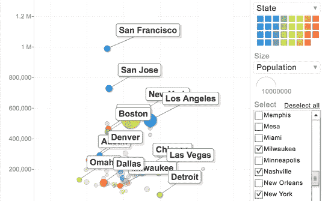
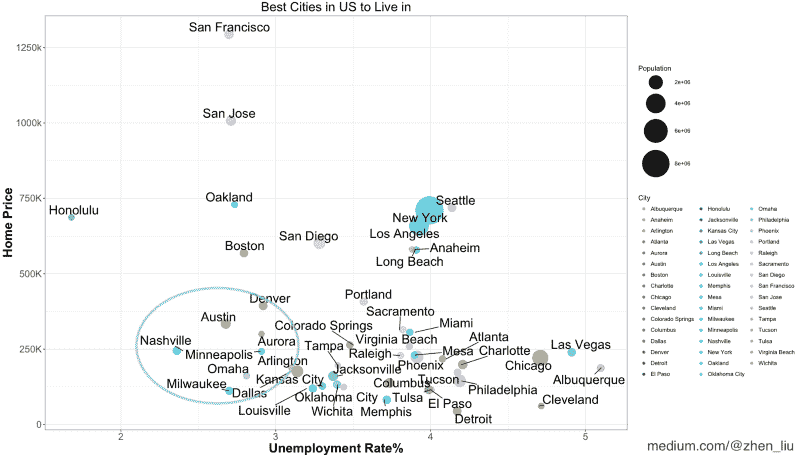
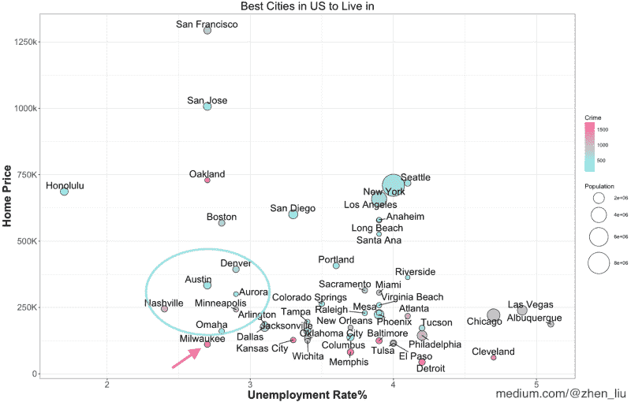
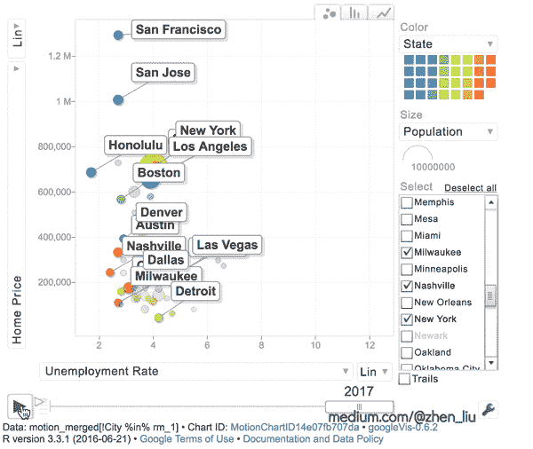
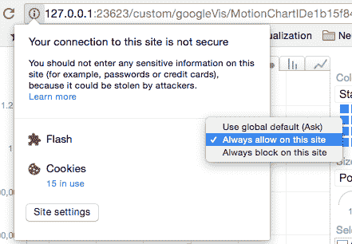

# 泡沫图如何揭示美国最适宜居住的城市

> 原文：<https://www.freecodecamp.org/news/how-a-bubble-plot-can-reveal-the-best-places-to-live-in-the-us-e2054c844062/>

作者:刘臻

# 泡沫图如何揭示美国最适宜居住的城市



在这篇文章中，我将向你展示一些关于美国城市的令人兴奋的事实，泡沫图在决定住在哪个城市中的价值，以及如何创造这些图。

2018 年你在考虑投资房产吗？搬到一个新的城市？在考虑这些决定时，你需要权衡不同的因素，如失业率、房价、城市规模、安全等。即使有了所有的数据和四个相应的条形图，你仍然会茫然地盯着那张表。你会努力找到最好的候选人，但是这些因素在讲述不同的故事…听起来像是一个复杂的问题。


那么，有没有一种方法可以让我们在一张图表中看到所有这些因素，并对它们进行比较？是的，我们可以用一个泡泡图！

#### *什么是泡泡剧情？*

气泡图是一种显示二维以上数据的图表(与传统散点图相比)。除了在 X-Y 平面上绘制点之外，它还使用点的大小、颜色或形状来显示更多的维度。

我们用失业率作为 X 轴，房价中位数作为 Y 轴，T2 人口作为点的大小。这是一个很好的第三度空间。颜色随机分配给每个城市。

### 美国最适合居住的城市是……(等等)



获胜者 *:* **纳什维尔！**

其他推荐:**奥斯汀、奥马哈、密尔沃基、达拉斯、明尼阿波利斯、丹佛、奥罗拉。**

他们失业率低(因此有更高的机会找到工作)，房价低，因为他们在地块的左下方。那是什么意思？

这意味着你可以根据这个情节做出选择。

例如，如果你认为失业率更重要，并且不介意更高的房价，那么檀香山、奥克兰、波士顿和圣地亚哥是强有力的候选城市

### 把安全作为另一个因素加入怎么样？

当然可以。让我们把安全作为第四个因素(其他三个因素仍然是房价、失业率和人口)。我们没有为一个城市随机分配一种颜色，而是使用**色标来衡量犯罪**(每 10 万人中的犯罪率)。**红色**意味着更多的犯罪，**蓝色**意味着更少。

#### 结果有变化吗？



确实如此。如果安全对你来说非常重要，那么密尔沃基可能不是之前推荐的一个很好的选择(即使它在图表的左下方)。

现在你看到了气泡图的威力:在一个二维图中展示多个因素的能力。如果你只有这些因素的条形图，你很难确定哪些城市有理想的因素组合。泡泡图基本上为你创造了一个“视觉目标函数”，优化一个多变量的决策问题。

### 失业率和房价如何随时间变化？

我们可以创建一个交互式运动图表，将时间作为一个维度(2013 年至 2017 年)添加进来，以查看这些因素如何随着时间的推移而变化。



为了避免过多的视觉信息，我没有使用犯罪数据，而是用不同的颜色来代表几个选定的城市。

好消息是，几乎所有城市的失业率都显著下降(从右向左)。但坏消息是，房价上涨相当快(尤其是旧金山、圣何塞、洛杉矶、纽约和西雅图)。

想要自己创建图表吗？这是我在 r 中的气泡图和运动图的代码。玩这些图玩得开心点:)

```
################ Bubble Plot ################library(data.table)library(ggplot2)library(ggrepel)
```

```
bubble_data <-fread("https://raw.githubusercontent.com/zhendata/Medium_Posts/c007346db1575aca391a6623c87bb5a31a60b365/bubble_plot_merged_city_data.csv",sep=",")
```

```
bubble_plot <- ggplot(bubble_data,                aes(x = Unemployment_Rate, y = Home_Price/1000)) + 
```

```
geom_point(aes(size = Population, fill = Total_Crime),shape=21) +# Create 'Bubble' by assigning size a variable #
```

```
scale_fill_continuous(low = "#33FFFF", high ="#FF6699" ) +scale_size_area(max_size = 20)+# Select bubble color scale and bubble maximum size #
```

```
geom_text_repel(          aes(label = City),nudge_x = 0,nudge_y = 0.75,size = 6) +# Use geom_text_repel to repel the labels away from each other #
```

```
theme_bw()+# Use white background instead of the default grey one #
```

```
ggtitle("Best Cities in US to Live in") +labs(x = "Unemployment Rate%", y = "Home Price",       size = "Population",fill="Crime") +theme(plot.title = element_text(size=25, hjust = 0.5),        axis.title=element_text(size=20, face = "bold"),        axis.text=element_text(size=15)) +# Style title and axis #
```

```
scale_y_continuous(name="Home Price", breaks = seq(0, 1500, by=250),                       labels=c("0", "250K", "500K", "750K", "1000k",    "1250k", "1500K"))# Make y-axis more readable by replacing scientific number by "K" #
```

```
print(bubble_plot)
```

```
################# Motion Chart #################library(data.table)library(googleVis)
```

```
motion_data <-fread("https://raw.githubusercontent.com/zhendata/Medium_Posts/c007346db1575aca391a6623c87bb5a31a60b365/motion_chart_merged_city_data.csv",sep=",")
```

```
motion_chart <- gvisMotionChart(motion_data, idvar = "City", timevar = "Year",xvar = "Unemployment Rate",yvar= "Home Price",sizevar="Population")
```

```
plot(motion_chart)# R automatically opens a tab in the browser for you# The flash player needs to be enabled in browser 
```



Click the “⌽” icon to enable Flash

```
######### Data #########"""The datasets I used are from Zillow (medium housing), FBI’s UCR program, census.gov (population), Bureau of Labor (unemployment). I did some data cleaning and joining for the format I needed in this article, and you can click the links below to download."""bubble_plot_merged_city_data.csv, motion_chart_merged_city_data.csv
```

如果你觉得这有帮助，请跟我来，给我几下掌声！

您也可以阅读我以前关于数据科学、房地产和决策制定的文章:

如何分析季节性和趋势以节省公寓租赁费用。
[*当我在寻找新的公寓出租时，我开始想知道:是否有一种数据驱动的决策策略…*medium.freecodecamp.org](https://medium.freecodecamp.org/how-to-analyze-seasonality-and-trends-to-save-money-on-your-apartment-lease-714d1d82771a)[**如何使用数据来预测租金并优化您的租赁期限，以便您可以节省资金**](https://medium.freecodecamp.org/https-medium-freecodecamp-org-how-to-predict-rent-and-select-the-best-lease-duration-to-save-money-5cf35145d398)
[*在我的上一篇帖子中，我们谈到了如何根据季节性选择最佳月份签订租约。现在，多久……*medium.freecodecamp.org](https://medium.freecodecamp.org/https-medium-freecodecamp-org-how-to-predict-rent-and-select-the-best-lease-duration-to-save-money-5cf35145d398)