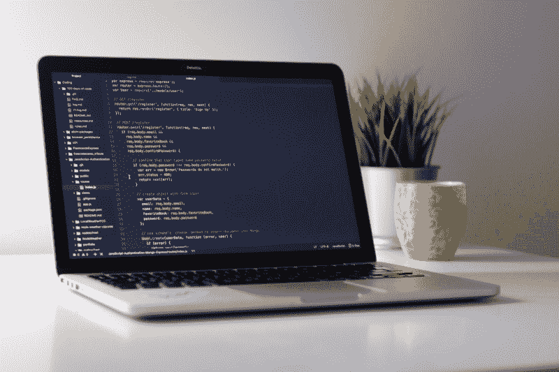
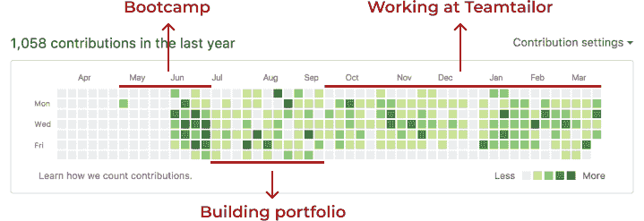
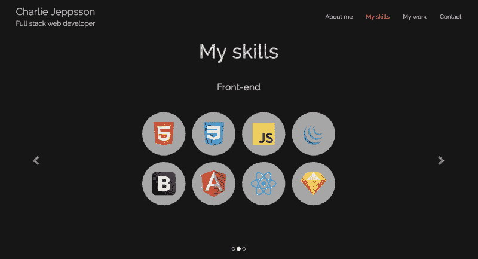
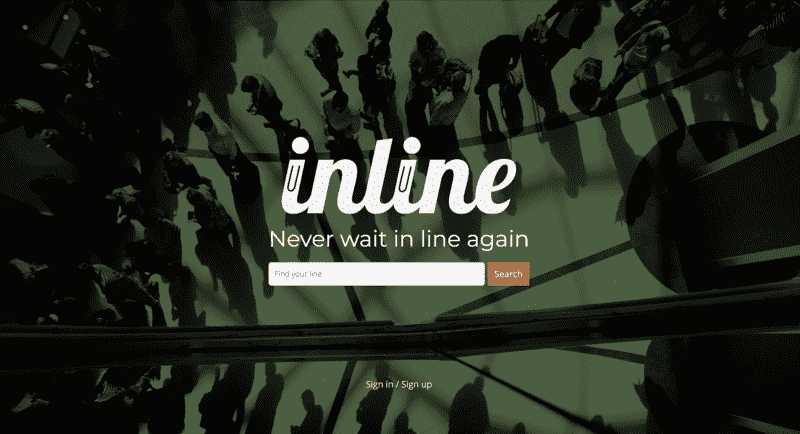
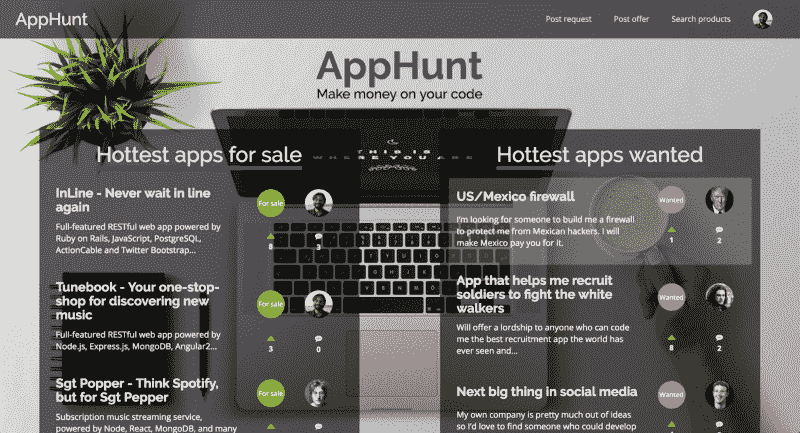
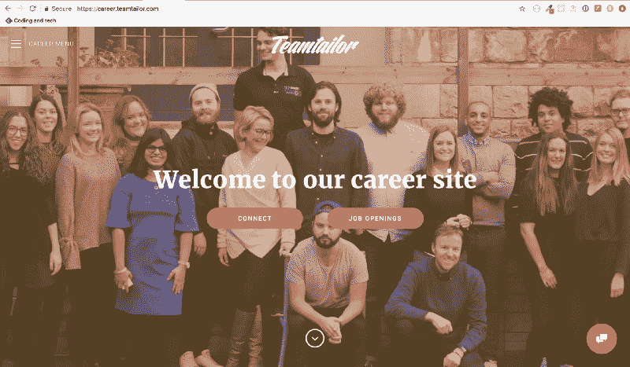
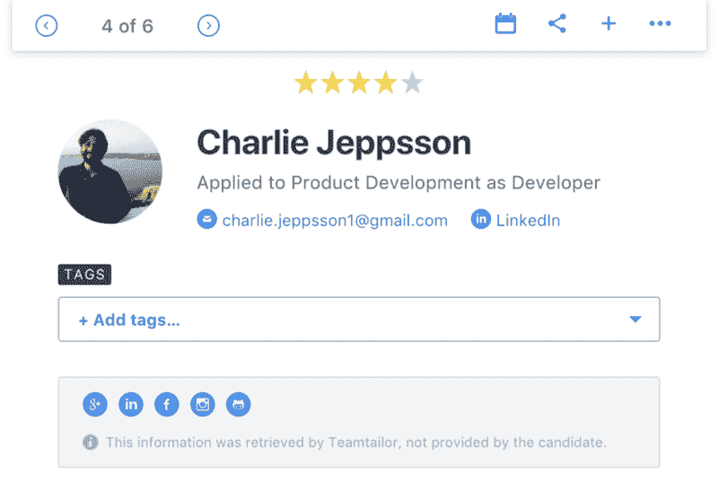
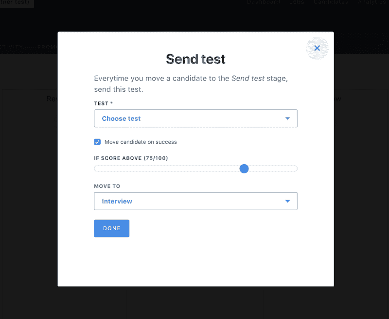
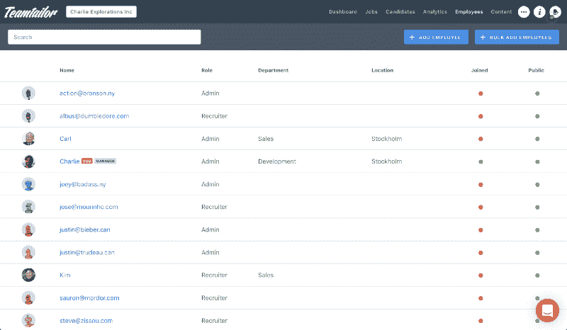

# 我是如何在没有技术学位或工作经验的情况下获得一份完整的开发工作的

> 原文：<https://www.freecodecamp.org/news/how-i-landed-a-full-stack-developer-job-without-a-tech-degree-or-work-experience-6add97be2051/>

作者查理·杰普森

# **我如何在没有技术学位或工作经验的情况下获得一份完整的开发工作**

六个月前，我得到了第一份开发工作，是一家初创公司的全栈 web 开发人员。我没有相关的工作经验，没有技术学位，甚至没有一年的编程经验。然而，我设法得到了我梦寐以求的工作，今天，我生平第一次可以说，我热爱我的工作。我是这样做的——长话短说。

### **第一部分:拥抱四分之一生命危机**

大约三年前，我正处于激烈的四分之一生活危机之中。我从商学院毕业，得到了一份有吸引力的投资银行工作，然后在意识到我讨厌这份工作的一切后，仅仅几个月就辞职了。

我完全迷失了，相当老套，独自旅行了几个月来“寻找自我”。虽然我以为我知道，但我没有。反正不够。但它实际上帮我弄清楚了一些事情。

首先，我无法继续从事金融职业。我只是看不到任何能让我开心的未来场景。

第二件事是，尽管背包旅行和冲浪很棒，但并不能帮助我找到我一直在寻找的“召唤”。唯一合理的做法似乎是经典的试错法。

所以当我回家后，我决定尝试一些我认为既能让我快乐又能提供某种体面生活的事情。这是一个反复试验的过程。

首先，我想我会认真对待写作。所以我开始兼职为一家在线商业杂志写作和编辑。有一段时间很酷。每周在快节奏的编辑部工作三天，撰写任何与商业、金融、科技或可持续发展相关的文章。

与此同时，我在旅行中听说了很多关于自由职业者的生活，所以我想我应该尝试一下。所以我成立了自己的公司，很快就发现了一些商业分析项目。当自己的老板起初当然非常令人兴奋，能够在任何地方工作对我来说都是全新的。

我就这样过了大约八个月，身兼作家/编辑和自由职业商业分析师。但最终我开始对杂志社的工作失去兴趣。

任何处理数字内容的正常人都知道，点击诱饵文化是以牺牲创造力和质量为代价的。换句话说，当你的内容的主要动机是点击时，所有捕捉这些点击所需的最高级手段将很快消磨掉任何最初就有的创作雄心。此外，我无法摆脱这样一种感觉:作为一名作家/编辑，我总是离我所报道的事情太远。

所以我辞职了。根据我自己的反复试验，这是可以的。但是感觉还是很糟糕，因为我实际上已经在写作这件事上投入了八个月的时间。但正如某个聪明人可能说过也可能没说过的:当一扇门关闭时，另一扇门就会打开。

我的试错清单上还有一件事要核对。

### **第二部分:改变我生活的午餐**

生活很奇怪，有时它会在你最意想不到的地方隐藏最大的、最能改变生活的灵感。当我经历第一次对编码的“拉动”时，对我来说肯定是这样的。

尽管辞去杂志社的工作感觉像是一种失败，但这种经历终究不会被证明是完全白费的。写了这么多关于科技创业公司和企业家精彩生活的文章后，我下定决心也要尝试一下这种生活方式。

经过大约一个月的研究和求职，我设法在北欧一家当时被认为是最有前途的金融科技公司找到了一份工作。短短几年后，它已经发展成为欧洲最大的股权众筹平台之一。

我没有真正申请任何具体的职位空缺。但由于我真的相信公司的使命，并对他们的成功印象深刻，我宁愿直接联系他们的首席财务官，告诉他这一点。我们见过几次面，突然之间，我就在那里从事一些模糊的业务开发工作。

尽管我希望从事战略和分析项目，但我最终还是做了模糊业务开发人员通常会做的事情:销售。这也是为什么这份工作最终也没有成功。

但是，还有更多。

就像杂志上的上一份工作经历一样，这份工作也不会被证明是徒劳的。事实上，如果没有它，我可能不会成为今天的开发人员。因为那是我遇见桑德拉的地方。

她是产品团队的前端开发人员，就坐在我们当时拥挤的小联合办公室的另一端。

从技术上来说，我们是同事，但任何在一家运转不良的科技公司工作过的人都会知道，销售团队和产品团队之间的距离常常让人感觉像是天各一方。

管理层刚刚决定将整个开发团队外包给乌克兰的一个远程团队，这也于事无补。这意味着 Sandra 和所有其他开发人员将被解雇，或多或少只是服务于他们的两个月通知。

尽管距离很远，有一天我和桑德拉还是一起吃了午饭。这基本上是我与专业开发人员的第一次真正对话，我认为这是真正的好奇心和我不断加剧的生存危机的混合，很快或多或少地将午餐变成了采访。

我们的午餐对我来说是一次彻底改变人生的经历。更具体地说，**三个启示**造就了这一切。

1.  当我得知她没有接受过“真正的”web 开发教育时，我感到非常震惊，因为这在当时对我来说无异于一个学位。她所知道的一切，都是从 MOOC 平台(大规模开放在线课程)上学来的，比如 freeCodeCamp 和 Codecademy。
2.  她告诉我她有金融背景，和我一样。事实上，她已经做了几年的业务总监，直到最近，她加入了和我一样的创业公司，就在几个月前，她还是一名前端实习生。
3.  当她向我展示她用仅仅六个月的编码经验建立的作品集页面时，我简直不敢相信。太不可思议了。

那顿午餐为我打开了一个充满可能性的世界。桑德拉的故事让我渴望更多。

因此，我花了几周时间研究人们成为开发人员的不同途径。我参加了各种论坛和文章，其中很多都是我在 Medium 上找到的。

例如， [Stackoverflow 的年度开发人员调查](https://medium.freecodecamp.org/stack-overflow-2018-developer-survey-faac8d3eb357) (100，000 名受访者)表明，所有专业开发人员中只有一半拥有学士学位，而在这一半人中，整整三分之一的人主修与计算机科学和软件工程完全无关的专业。

我读得越多，就越意识到我对教育的定义是多么狭隘。如果你不需要一个计算机科学学位就能进入像软件工程这样复杂的领域，那么你需要一个学位做什么呢？虽然我当时可能看不到，但我现在清楚地看到了学术体系是多么的破碎。

它是为工人的工业时代设计的，在这个时代，你可以专攻一门手艺，然后在你的余生中使用同样的技能。它肯定不是为今天的知识社会设计的，在这个社会里，世界历史的所有信息从来不会超过几下鼠标的距离，事物变化如此之快，以至于教育实际上必须是一个终身的过程，而不是一次性的学习。

但是这个话题本身就足够写一篇文章了。与桑德拉共进午餐的重要之处在于，它点燃了我内心的某些东西，激励我从破坏性的循环中挣脱出来，我发现我目前半吊子的商业生涯就是如此。

尽管我总是羡慕我周围的程序员——甚至几年前我参加了 Python 101 暑期课程——但我从未认为这是我可行的职业道路。至少没有回到大学 3-5 年。

如果你正在读这篇文章，桑德拉，谢谢你！如果我的这篇文章能像你激励我那样激励一个人，我会认为写这篇文章的努力得到了一千倍的回报。

### 第三部分:花了我 6000 美元的文本

在接下来的几个月里，我花了数百个小时在在线平台上，如 [Codecademy](https://www.codecademy.com/) 和 [freeCodeCamp](https://www.freecodecamp.org) 。我甚至购买了付费平台[代码学校](https://www.codeschool.com/)的订阅。

我不确定我真的知道我的目标是什么。让我开始的是我不断重复的职业失望的绝望。但是让我坚持下去的是我发现编码练习是多么可笑的有趣和有益。

我甚至无法告诉你，从什么时候开始，编码从一个不经意的业余项目变成了一本正经的“我将成为一名专业开发人员”但可能就在这附近。我刚要从 freeCodeCamp 领取前端证书，我的下一个改变人生的事件发生了。

辞去商业开发人员的工作后，我决定逃离瑞典寒冷的冬天，去中美洲旅行。我想，如果我要花数百个小时独自自学编程，我最好去一个温暖、便宜、不压抑的地方。

我在萨尔瓦多的一家旅馆里用笔记本电脑编写代码，这时我收到了朋友玛丽的一条短信。

“我得到工作了！”上面写着。

玛丽也在学习如何编码。我回想起几个月前她是如何告诉我她去的这个代码学校的。“编码训练营”

当时我基本上是在嘲笑她——所以。你要为 12 周的课程支付 5000 美元？你没有因此得到一个大学学分？你为了这个放弃了你的顶级 MBA？听起来很合理。

然而她就在那里。四个月后，Marie 被埃森哲的一家数字机构正式聘用为初级后端开发人员。我真的为她高兴，但当然也非常嫉妒。

我停下手头的工作，做了一些计算。如果我能保持目前的速度，平均每天编码 6 小时，大约一周 5 天，我会每周编码 30 小时。因此，要完成 freeCodeCamp 的全部 1200 小时课程，我至少还需要 8 个月的时间。如果我能跟上步伐，那就是。这是我绝对不能做的，因为我的钱快用完了，我必须马上回瑞典找一份新工作。

我后悔没有从一开始就和玛丽走同一条路，把钱花在了训练营上，而不是背包旅行了 4 个月。好吧，木已成舟，我心想。我仍然不得不接受这样一个事实，即训练营是最快达到就业水平的最佳选择。

回到好的旧谷歌研究。

在某种程度上，我觉得我又回到了和桑德拉共进午餐后的起点。只是这一次，我用一双新鲜的眼睛看待整个训练营现象。了解了玛丽的故事，我知道并不是所有的都是好得令人难以置信的骗局，但实际上是打入这个行业的貌似合理的方法。

后来， [Stackoverflow 的年度开发者调查](https://medium.freecodecamp.org/stack-overflow-2018-developer-survey-faac8d3eb357)再次向我保证，有 88.1%的编码训练营校友在训练营结束后的一年内被录用。

多亏了 [Switchup](https://www.switchup.org/research/best-coding-bootcamps) 和 [Coursereport](https://www.coursereport.com/best-coding-bootcamps) ，没过多久我就发现了 [Le Wagon](https://www.lewagon.com/) ，这是一个法国编码训练营初创公司的成功故事，在全球拥有超过 15 个地点，在这两个排名中都名列前五(在撰写本文时，实际上两个排名都是第一，共有 27 个地点！).

在将它与 Hack Reactor、Ironhack、General Assembly 和 NYCDA 等替代产品进行比较后，有几个主要原因让我更喜欢它:

*   相对较低的价格(当时为 6000 美元)。
*   对企业家精神和产品开发的关注。
*   全球存在和社区。

尽管如此，我对这个项目仍有一些疑问。

1.  后端语言 Ruby 和 MVC 框架 Rails 的选择。虽然这在其他公认的训练营中似乎很常见，但我读过的几乎所有关于这个主题的文章都表明 Javascript 真的很热门，也是雇主们想要的。例如，我的朋友 Marie 的 bootcamp 教授了一个基于 Node.js 和 Express.js 的后端堆栈，这两个都是基于 Javascript 的技术。一些常见的观点似乎是，Ruby 是一种很好的学习语言，但是 Node 和 Express 是雇主更看重的技能。鲁比真的是可以下注的马吗？
2.  9 周的课程时间似乎有点短。大多数参赛项目看起来至少需要 12 周，对于一个可雇佣的 web 开发人员来说，这已经显得太短了。
3.  完成训练营后，Le Wagon 没有提供实际的求职帮助。许多竞争对手要么提供就业保障，要么提供看似可靠的职业服务功能。

我将在下一节的结尾用我的训练营结束后的结论逐一解决这三个疑问。

然而，尽管我担心，但我认为这是我最好的选择，这就是为什么我决定申请他们在巴塞罗那的学校。几天后，当地的学校经理 Gus 联系我，接受 Skype 采访。

在 El Tunco 慵懒的冲浪小镇的一家咖啡馆里，我们连接上一个蹩脚的无线网络，聊了一会儿天。但是比我想象的要非正式得多。我觉得我们心有灵犀，这让我更想被录取。然后，甚至不到 24 小时后，我收到了我一直在等待的电子邮件。格斯告诉我，他很乐意让我成为下一批学员，我接下来要做的唯一一件事就是支付 1200 美元的订金来预订我的位置。

那基本上是我当时剩下的所有钱了，本来是用来支付我在萨尔瓦多最后几周的费用的——包括最终回家的路费。但是如果我能设法坚持一个更紧的预算，并预订一个比预期更早的航班回家，我知道我能做到。

所以，在短暂的犹豫之后，想起我对马车的担忧，我凭直觉把押金转给了格斯。后来，我记得感觉有点尴尬。我真的承诺为一个 9 周的编程课程支付近 6000 美元吗？作为一个从来没有为教育支付过一分钱的瑞典人，这种情况感觉很奇怪。

然而没过多久，那种诡异的感觉变成了兴奋。至少现在我知道，在不久的将来，我不用回去从事金融、销售或网络媒体工作。同一天，我开始安排训练营开始前的时间。

在剩下的三个月里，我必须想办法赚到剩下的 4800 美元。加上房租和生活费。好吧。

我联系了我之前咨询过的一家公司，幸运的是，他们有一个完美的商业分析师项目。由于他们最初不会接受少于 4 个月的合同，我必须说服他们我可以在两个月内完成这项工作。不知何故，成功了。

唷！就在一周前，我还是一个离家出走的旅行者，从未想过要回家。现在，我将在不到两周的时间里在斯德哥尔摩开始为期两个月的新工作，然后去巴塞罗那。激动人心的事情还在后头。

### 第四部分:巴塞罗那训练营

快进三个月..现在是 2017 年 5 月 1 日，我正在教室里参加我的第一次 Le Wagon 讲座。

在我周围有大约 25 个来自世界各地的人。德国的基利安、委内瑞拉的丹尼尔、法国的弗朗西丝卡、意大利的阿尔比、美国的考特尼等等。有些人根本没有编程经验，有些人有一点，还有一些人实际上正在获得计算机科学学位的途中。

我们正在听当地学校经理 Gus 和 Ruby 老师 Ruben 解释未来计划的结构。

我们后来都知道，这个时间表非常有条理。在接下来的 9 周里，我们将在 6 个不同的模块上花费大致相同的时间，每个模块处理一个自己的主题，最后花两周时间规划和开发我们自己的 web 应用程序。

我记得在整个第一周，我对课程内容非常有信心。在 freeCodeCamp 上花了数百个小时之后，日常编码挑战的难度似乎有点低。

尽管 Ruby 对我来说还很陌生，但它的基础似乎与 Javascript 和 Python 非常相似。听讲座和做练习来学习变量、数组、散列、基本函数和迭代感觉相当重复。所以我变得自大，怀疑我是否真的能从这个训练营中得到什么。然而，甚至不到一周之后，这一切都将改变。我从感觉自己是班上的第一名，到实际上努力跟上。

在我意识到这一点之前，我们已经从基础转向了面向对象编程、MVC 架构和数据库，并且有很多天我甚至觉得我还没有理解前一天的概念，并且已经被期望转向下一个主题。

所以我不得不挂上下一档。每天在教室里呆 10 个小时对我来说是不够的。我每天晚上多花几个小时，周末的大部分时间都在重复上周最棘手的事情，这已经成了惯例。不能像前几周那样享受巴塞罗那让我感觉有点糟糕，但是事实上我已经把我所有的积蓄都投入到了训练营中，这是一个很大的动力。

沮丧的另一个来源是我们所学的东西的分散性。感觉就像给了我们一百块拼图，却没有指导我们如何把它们拼在一起。知道如何编写基本的 Ruby、HTML、CSS、Javascript 和 SQL 真的很有力量，但是这些知识如何帮助我组装一个实际的应用程序呢？

然后是我恍然大悟的时刻。

这是第 6 周，我们终于到达了 Ruby on Rails 模块。在我意识到之前，我看着我的 Chrome 浏览器窗口，读着“耶！你在铁轨上！”。“那是我的第一个网络应用，”老师说。

Default landing page for any new Rails project.

什么？我所做的只是在我的终端上运行几个简单的命令，然后在我的浏览器上浏览 [http://localhost:3000/](http://localhost:3000/) 。我到底在看什么？

直到我在文本编辑器中打开应用程序目录，我才明白这一点。Rails 将这一切展示得如此美丽简单。

一个文件夹用于 HTML，一个用于 CSS 和 Javascript，一个用于控制器，一个用于模型。一个文件用于路由。和一个文件，描绘出整个数据库，就像它不比一个杂货店购物清单更复杂一样。

在最终了解了所有这些部分如何在像 Rails 这样的 MVC 框架中紧密结合之后，花费我所有的夜晚和周末来编码不再是一件难事。恰恰相反，我经常在晚上挣扎着离开笔记本电脑去睡觉。

我的运气很好，每天都能获得大量新的见解。这种醉人的效果仍然很难用语言表达出来。

*   所以我可以在我的 erb 文件中混合 HTML 和 Ruby？
*   我可以从关联的 html.erb 文件中的控制器访问实例变量吗？
*   我可以导入别人用 Gems 写的代码？
*   我可以在 assets/javascript 目录中写尽可能多的普通 JavaScript？
*   我可以在终端中使用 Rails 控制台对整个数据库做任何我想做的事情？

这只是一个令人难以置信的令人满意的啊哈时刻永无止境的流。就像你刚刚意识到你身上的原力其实很强大，每学到一点新知识，你就离成为完全的绝地武士更近了一步。即使是现在，九个月过去了，我感觉我仍然处于同样的兴奋状态，我开始认为这实际上可能是永久的。那该多好啊。

无论如何，训练营的训练并没有慢下来，很快我们就到了最后两个星期，我们应该建立自己的应用程序。这两个星期将以一个大型演示日结束，每个小组将在摄像机和大量观众面前推销和演示他们的应用程序。

压力。

令我们惊讶的是，规划是迄今为止最耗时的部分。尽管我们在过去几周准备了很多东西——推介应用创意、组建团队、用草图设计功能——但直到编写了几天代码后，我们才意识到我们太过雄心勃勃了。

这款应用最初的想法是“专业联系的快乐”更具体地说，让用户为其他用户可以参加和签到的网络活动创建页面。“但那是 Meetup，”你可能会想。但是我们的想法有一个转折:只有当你在活动现场时，你才能签到。因此“职业关系的幸福”

一旦在活动中签到，用户就可以使用通过 LinkedIn 的 API 收集的数据来查看其他签到用户的职业资料，并与符合他们兴趣的人联系和聊天，从而不会错过潜在的良好关系。

这是我们最初的 MVP(最小可行产品),我们决定将其命名为 Unify。我知道，超级老套和硅谷的崇拜者。但是在我们的辩护中，我们有更好的事情去做，而不是去想更好的名字。

比如关于实际功能的头脑风暴。但后来我们实际上头脑风暴有点太多了，功能被添加和删除，直到我们最终得到一个完全不同的应用程序，

1.  不会在剩下的十天内准备好演示，而且
2.  并不像我们最初想的那样具有破坏性。

所以我们不得不将功能缩小到 MVP，实际上最终得到了几乎完全相同的产品，Le Wagon 经理 Gus 从一开始就推荐我们使用。

我们当时认为这是浪费时间。但是这个过程至少教会了我一些关于产品开发的真正重要的事情:

*   如果做得好，它应该更多的是关于计划而不是实际的编码。
*   清理旧的代码错误比从一开始就彻底计划和做正确的事情要耗费更多的时间。
*   MVP 总是比你一开始想的要小。

大约 10 天后，经过 100 多个小时的编码、设计、争论、测试、数据库迁移和数据库回滚，我们奇迹般地到达了演示日，实际上对我们的应用程序感觉非常好。当然，它离完美还很远，但是所有的主要功能实际上都像我们希望的那样工作。

然而，就在演示前几个小时，我们都差点心脏病发作。

谷歌的地理定位 API 没有对我们的请求做出应有的响应，所以我们无法登记我们将用于演示的事件。我们什么都试过了。切换计算机和用户。删除和创建新事件。更改活动街道地址。什么都没用。

我们三个努力保持冷静，不要惊慌。这可能只是一个负责地理定位功能的家伙知道如何轻松解决的 bug。

但是他要迟到了，所以我们试着给他打电话。

没有回答。

我们试着再打一次。

又没人接。

然后我们就慌了。

直到最后一分钟，多亏了我们一位了不起的助教，Antoine，我们才找到了这个错误。结果是我们不小心把距离范围设置得太低了，这就是为什么应用程序无法确认我们确实在活动地点。我们只是简单地增加了几公里的半径，提交并将更改推送到我们的生产服务器。

瞧，这款应用运行得非常完美。演示也是如此。

总的来说，**，**我的 Le Wagon 体验简直太棒了。我可能从来没有在这么短的时间里学到这么多东西。事后看来，很难相信我们大多数人仅仅用了 9 周的开发经验就能开发出功能齐全的 web 应用。

但是不要欺骗自己，训练营不会为你做这些工作。要从中获得任何东西，你必须全力以赴。我自己看到许多人落后甚至辍学，因为他们

*   对难度没有正确的预期，
*   没有做好充分准备，或者
*   我们忙于其他事情，跟不上。

最后，我认为许多新手犯的一个错误是，把计算机科学学位视为自学或训练营的替代品，作为成为网络和/或移动开发者的一种手段。根据我的经验，这是不准确的。

即使你正在攻读计算机科学学位，你仍然需要填补大量的实践知识空白，才能变得富有成效。我实际上在我的训练营同学身上看到了第一手资料，他们有 2-3 年的计算机科学研究经验。同样，这是因为学术模型是破碎和过时的，因此无法跟上现实世界软件开发变化的极端步伐。

从我的角度来看，如果目标是成为一名开发人员，自学或训练营在某种程度上是必要的。因此，计算机科学学位应该被视为对 T1 的补充，而不是对 T3 的替代。

一个(好的)训练营能比自学更快地让你成为开发人员的原因是以下几点的结合:

*   详尽而简洁的课程，
*   一个无缝的在线平台，有教程和练习，最重要的是；
*   当你碰壁时，一个人的随叫随到的支持。

在结束这一部分之前，我想用我从那以后获得的见解来解决我在参加训练营之前的三个问题。

#### **1。学习 Ruby on Rails 而不是基于 JavaScript 的堆栈**

如果你现在处在我加入 Rails 训练营之前的位置，被充斥互联网的所有 JavaScript 宣传所淹没，你可能会问自己 Ruby 是不是一种过时的语言，Rails 是不是一个过时的框架。如果是这样的话，我的简短回答是否定的。

然而，最长的答案是这样的。

我现在工作的公司有一个后端用 Rails 搭建的高流量 web app，前端是 Ember.js 前端框架。在全职工作了大约六个月之后，我用 Javascript 编写的代码和用 Ruby 编写的代码一样多，这让我对这两种技术之间的差异和相似之处有了一些了解。

当然，当涉及到客户端 HTML/CSS 呈现(或“视图”)时，Rails 的用户体验甚至无法与大型 JavaScript 框架相比。我必须给那些讨厌铁路的人。

例如，以一篇文章或博客帖子的基本评论部分为例。作为一个用户，你会希望你提交的任何评论立即出现在你的屏幕上。

在现代 JavaScript 框架中，这只是将新数据(注释)推入客户端数据存储，并确保注释列表更新其状态以显示新的注释。这样，您就不必一直等待新记录被发送到后端，存储在数据库中，然后由客户端再次请求。相反，新的评论会立即出现在你的屏幕上。

如果 Rails HTML 代码上没有任何 JavaScript，用户就必须刷新页面才能看到文章上的任何新评论。这是可怕的 UX。为了避免这种情况，您可以采取几种不同的方法。

在 JS 框架出现之前，主要的解决方案是在 HTML 之上加入一些非结构化的 AJAX 逻辑，从长远来看，随着应用程序变得越来越大，这通常会变得很难维护。Rails 最近推出的另一个选择是使用类似 Action Cable 的 pubsub(发布-订阅)websocket 解决方案。例如，这是我们在训练营中创建的应用程序中用于聊天的内容。问题是，如果没有包装 JavaScript 框架，websocket 逻辑很容易变得不必要的复杂，并且难以维护。

然而，幸运的是，今天我们有更好的选择来使用 JavaScript 框架解决这类问题。在我看来，客户端是 Rails 最薄弱的地方，这也是我为什么不应该放弃 Rails 的主要原因，比如不应该放弃 Laravel 或 MERN 堆栈。只需在上面添加一个清晰的 JavaScript 框架，比如 React 或 Ember，就万事大吉了。

我个人非常喜欢 Rails 和 Ember 之间的集成，以及它们是如何互补的。他们固执己见的天性、坚实的记录、远见卓识的领导和巨大的贡献者社区使他们稳定、值得信赖，并适合像我们这样的初级开发人员。

尽管我尽了最大努力，如果你仍然对把 Ruby 作为你的第一个后端语言犹豫不决，我想提醒你，六个月前我对 JavaScript 几乎一无所知(除了一些基本的普通 JS、React 和 jQuery 语法)，而今天我每天都在使用这些语言和框架，并在它们之间无缝转换。并且爱它的每一分钟(打个比方)。

所以，不管你把什么作为你的第一语言，不要担心，你总能在工作中学会第二语言？

#### **2。9 周的时间学东西是不是太短了？**

我担心训练营的持续时间——仅仅 9 周——可能太短了，无法真正学到有价值的东西，Le wagon 也帮助我打破了这个神话。事后看来，很明显我更喜欢 9 周，而不是大多数训练营提供的 12 周。

原因是训练营本身并没有真正把你带到一个可以就业的水平。至少对我来说不是。相反，它为我提供了一个坚实的介绍，介绍了我达到高效水平所需的所有必要工具，以及如何将它们组合在一起。因此，即使他们给了我三周的时间，那也只是意味着更多的工具介绍。这些工具是我后来不得不深入学习如何使用的。这个清单已经够长了。

直到训练营结束后，在我花了几周时间构建自己的作品集应用程序后，我才明白这些工具到底是如何工作的。所以，如果你已经决定要参加训练营，但是在几周的时间里比较不同的选择，我的建议是把这个变量从等式中去掉。因为如果你像我一样，你仍然需要自己重新学习每一个工具。

回过头来看，Le Wagon 的工具集是多么的精确，这是非常值得注意的。在我目前的工作中，我每天都会用到这些工具。例如 Postgres、Git、GitHub、Sidekiq、Pundit、Heroku 和 Cloudinary。我希望我的老师能花更多时间在两件事上，一是如何使用像 React 这样的 JavaScript 框架，二是如何使用像 Rspec 这样的技术编写测试。因为后来事实证明，自学这两项技能对我获得第一份开发工作至关重要。

#### **3。工作保障和/或职业服务对我有帮助吗？**

正如我前面提到的，许多训练营都有“要么被雇佣，要么退钱”的政策。更多的公司有职业服务机构，帮助你接触潜在的雇主，并指导你申请和面试。

虽然对许多人来说，这听起来可能是一个很好的交易，但实际上我不认为这对我有什么影响。不过话说回来，在训练营结束后的两个月里，我也有时间花了大约 500 个小时编写代码，我有幸在简历上获得了一个精英学校的学位，还有很多求职和面试的经验。如果这些事情对你不适用，也许这是在训练营中选择时要考虑的一个因素。我不知道。

### **第五部分:建立投资组合**

今年夏天的七月末，训练营结束了。但我才刚刚开始。

在训练营中开发 Unify 应用并带着它穿过终点线给了我很大的动力，我决心充分利用这种动力。

我在银行里还有一些存款，巴塞罗那公寓的分租合同还有几周到期。基本上我在这个城市认识的每个人都离开了。所以我完全没有理由不继续吃饭、睡觉和做梦。我下意识地为自己建立了一些新的惯例和习惯:

*   我每天都会编码，直到我达到我的目标，当然是得到第一份开发人员的工作。意味着周一到周日，白天和晚上。
*   我会把我写的每一段代码推送到 Github ，这是潜在雇主检验你的代码技能和雄心水平的第一站。即使我觉得自己没有做出什么值得承诺的事情，我还是会去做，只是为了让全世界都看到那段甜蜜的绿色承诺历史。

My Github commit history from [https://github.com/charliejeppsson](https://github.com/charliejeppsson).

*   **我会尽可能让自己完全沉浸在软件内容中**。这意味着每当我做些事情、外出跑步或做饭时，就听播客，如[软件工程日报](https://softwareengineeringdaily.com/)和 [SE 电台](http://www.se-radio.net/)。这意味着观看来自 Youtube 频道的代码讲座、教程和讲座，如[编码技术](https://www.youtube.com/channel/UCtxCXg-UvSnTKPOzLH4wJaQ)、[旅行媒体](https://www.youtube.com/user/TechGuyWeb)和 [CS50](https://www.youtube.com/user/cs50tv) 。这意味着阅读像[黑客正午](https://hackernoon.com/)、[自由代码营](https://medium.freecodecamp.org/)和[代码爆发](https://codeburst.io/)这样的媒体出版物以及像 [Techcrunch](https://techcrunch.com/) 和 [The Next Web](https://thenextweb.com/) 这样的杂志。这意味着在我的笔记本电脑上安装 [Dash](https://kapeli.com/dash) ，这样我就可以随时轻松地查找到我在任何时候遇到的语法问题的相关文档(对我来说，主要是 [MDN web docs](https://developer.mozilla.org/en-US/) 、[api.rubyonrails.org](http://api.rubyonrails.org/)和 [RubyDocs](http://ruby-doc.org/) )。

换句话说，我成为一名开发人员的动力比以往任何时候都强，我知道我没有任何学术或专业的优点可以炫耀，除非我有一个很棒的投资组合，否则我可能永远不会被叫到面试。所以这就是我下一步要做的事情。

在演示日的第二天，我从接下来的夜晚中清醒过来，开始构建我的第一个自己的 Rails 应用程序(这是多么强劲的势头啊！).尽管我很自大，但我认为第一个应用程序需要几周才能完成，因为我已经用 Unify 应用程序完成了一次。再说一次，我错了。

完成它将花费我将近两个月的时间。在训练营的最后两周，有太多的过程过得太快了，我还没有完全理解它们。我被各种各样的东西卡住了好几天，从令人尴尬的简单到有点高级。仅仅配置一个日期时间选择器就需要在 Stackoverflow 上花费几天时间。更不用说聊天功能，使用 websockets 和 Action Cable，这花了我大约两周的时间。

但是投入的时间非常值得。这个应用程序实际上非常棒:它实际上是我可以向人们演示的东西，并感到自豪。虽然有很多绝望的时刻，但我学到了很多。事实上，经历这一切给了我很大的安慰，因为训练营可能是一个不错的选择。

如果在我对所有东西都很熟悉的情况下，现在编写这些东西都这么难，如果我第一次做这些事情时没有助教、平台和课程，它会有多难？

所以在八月下旬的某个时候，我完成了这个应用程序。我回到了斯德哥尔摩的家，住在我父亲的公寓里，身无分文，感觉非常可怜。我尽力利用这种自怜来不断提高我的编码努力。它运行得相当好。

很快就到了编写真正的投资组合网站的时候了。就这一次，我决定保持简单。所以我做了一个非常简洁的静态网页，在那里我可以收集我做过的东西。完成后，我的计划是开始申请工作。但是有件事困扰着我。还记得我说过在加入 Le Wagon 之前，我对 Ruby on Rails 有点犹豫吗？嗯，虽然我真的爱上了 Ruby 的极简主义和使用 Rails 的简单性，但我仍然觉得我在某个地方走了捷径。

在我的作品集页面的“技能”部分，你可以找到 Ruby、Rails、SQL、Postgres、HTML/CSS、jQuery、Bootstrap、Sketch、Git 和 Heroku。和 JavaScript。

是最后一个困扰我的。感觉像是在撒谎。

如果我现在开始申请工作，我可能会找到一份体面的 Rails 开发工作。但是，如果所有的反对者都是对的，Rails 实际上已经过时并正在消亡，那该怎么办呢？如果我找到了理想的工作，却发现他们使用了先进的 JS 技术，那该怎么办？我在 freeCodeCamp 上的 200 个小时和训练营的 2-3 个 jQuery 日+ 1 个 React.js 日都没有机会。

我大脑中的傲慢部分再次对我说:“我有一个想法:如果我也能学习平均堆栈呢？”我指的是 MongoDB、Express.js、Angular.js 和 Node.js，这有点像 Rails 对于 Ruby 的 JavaScript 等价物。根据 LinkedIn 和 Glassdoor 上的搜索结果，这将意味着我的开发工作数量将比我有资格做的多一倍。

我记得训练营的经理格斯告诉我，我还需要一个月的时间才能学会。会有多难呢？我想，我大概可以在两周内完成。

这就是我如何陷入我称之为“教程沼泽”的原因。

所以我再一次求助于我的老朋友谷歌来研究学习策略。但几个小时后，我似乎仍然无法找到一个好的在线课程来满足我的基本需求。他们似乎每次都专注于一个部分，如果你想深入理解一个框架，这绝对是正确的方法。但是因为我想在两周内尽可能多的学习，刚好能够给我的投资组合增加一个新项目，所以我没有时间。

就在那时，我发现了发展教育的一个全新领域:YouTube 教程。外面有那么多。对于我能想到的每种技术或堆栈，我至少找到了五个不错的教程。

最终我找到了去旅行媒体频道的路，而系列教程[是指从前到后的堆栈。十个视频，每个 20 分钟，向您展示如何构建一个基本的 RESTful web 应用程序，包括用户注册和登录验证。完美。](https://www.youtube.com/watch?v=uONz0lEWft0&list=PLillGF-RfqbZMNtaOXJQiDebNXjVapWPZ)

我马上开始，在笔记本电脑上对每个视频进行编码。够疯狂的是，几天后我就完了。实际上，我已经使用完全陌生的技术编写了一个全功能的 web 应用程序。Node 用于后端，Mongo 用于管理数据库，Angular 用于前端，Express 用于将它们结合在一起。

真的有这么简单吗？我现在知道这些了吗？虽然我很高兴这比我想象的要容易得多，但一股难以置信的寒颤顺着我的脊椎传来。

好吧，既然我比计划提前了，我想，为什么不在应用程序的基础上更进一步呢？我的想法是通过启用基本的博客帖子 CRUD 操作(创建、读取、更新、删除),将它变成一个中型克隆，就像我们在 Rails boot camp 的一个项目中所做的那样。

不过，我没走多远。我想我只需要添加一些新的路线、模型、控制器和视图，就可以了。问题是我仍然以“Rails 的方式”思考，其中“约定胜于配置”使得这样的特性构建起来非常容易和快速。

正如我多次读到和听到的那样，MEAN stack 遵循相反的咒语:“配置优于约定”，这意味着通过放弃一些“神奇的”自动化，您可以获得一个更加灵活的框架。就像将某个名称的控制器动作连接到具有相同名称的视图，开箱即用。对于初学者来说，这是一件非常美妙的事情。

因此，第一次意识到遵循“配置优于约定”的编码有多难，就像是一记响亮的耳光。因为它证明了我对整个辅导过程好得不像真的预感是正确的。但直到我开始编写脚本外的代码，没有布拉德·特拉弗斯的安慰性指导，我才意识到这一点。

我就在那里，齐膝深的一大滩泥巴里，那对我来说是一堆烂泥。这款应用还远没有准备好添加到我的作品集页面。它实际上没有任何特征。只是用户注册，登录，什么也不做，只是看一些静态引导设计的可能性。

另一个选择是坚持试错法。与训练营不同，我过早地移除了我的训练轮，可能需要在 Stackoverflow 上花费数周时间才能按照我计划的方式完成应用程序。我没有几周时间。我本应该昨天开始申请工作。

具有讽刺意味的是，事实证明，走出我自己陷入的教程沼泽的唯一方法，是通过跟随更多的教程继续涉水而过。幸运的是，我在同一个 Youtube 频道上找到了一个相当不错的视频，并决定将它作为我的生命线。

这就是为什么被认为是一个中型克隆的 web 应用程序最终变成了一个音乐发现应用程序，使用了 Spotify 搜索 API。

尽管如此，在决定尝试学习均值堆栈两周后，我实际上部署了一个不错的 web 应用程序。这是我的目标。当然，这有点像作弊，但我认为只要我能在求职面试中演示并解释它的所有部分，没人会在意我是否遵循了教程。

嘣。突然之间，我的投资组合中有了三个应用程序，并且可以在我的技能清单中增加一堆新技术。最后，是时候进入我的开发者之旅的下一个阶段了:找工作。这一天并不算太早。

### 第六部分。求职

总之，我花了大约 4 周的时间，30 份申请，10 次面试，3 份工作机会才找到那份完美的工作。具有讽刺意味的是，这实际上是我申请加入的第一家公司。我当然可以称之为巧合，但我认为这更像是在开始发送申请之前的彻底筛选过程的结果。

我不得不承认，我认为我的快速求职成功有相当大的运气成分。但不管怎样，我将描述我遵循的过程，因为我认为它教会了我一些关于第一份开发工作应该关注什么工作和公司的事情。

我做的第一件事是建立一个电子表格，列出一些有趣的工作(我原本是一个迟钝的经济学家，记得吗？).然后，我花了几天时间在 LinkedIn、Glassdoor 和 Stackoverflow 的招聘板上搜索工作，搜索的关键词包括 web、开发、软件、前端、后端、Ruby、Rails、Javascript、Angular、Node 和 Postgres。

不足为奇的是，仅在斯德哥尔摩地区，搜索就返回了数百个职位。他们背后的公司从初创公司到数字机构、媒体公司、云服务提供商、游戏开发商，以及介于两者之间的所有公司。

在过去的几个月里，我已经想出了一套非常狭窄的标准，来衡量我对下一任雇主的要求。

如果我可以选择任何我想要的工作，我的优先事项大致如下:

1.  我会在整个堆栈中编码，这意味着我要做和 UX/UI 一样多的数据库和架构工作，而且主要是用 JavaScript。围绕 React 的所有炒作可能都与后者有很大关系。就像我之前告诉你的，就我所知，Rails 基本上已经奄奄一息，而 JavaScript 才是未来。
2.  我的学习曲线会非常陡峭，以至于我必须夜以继日地编写代码才能跟上。都是为了在最短的时间内尽我所能变得更好。
3.  我的同事应该聪明、有抱负、风趣、不拘小节，最好同时具备这一切。
4.  该公司将是一家高增长的初创公司，具有有意义的使命和与区块链、人工智能和/或可持续发展相关的产品，或者是一家拥有此类项目的顶级数字机构。
5.  我会得到公平的报酬。

大概就是这样。有人可能会认为这对新手来说要求很高。但请注意，高薪不是标准的一部分(现在也不是，有 6 个月的专业经验)。也许我说的是显而易见的事情，但是如果你从一个完全不同的领域转移到一个纯粹的开发角色，我认为重要的是要知道你以前的收入是多少并不重要。

例如，我知道我在金融业的市场价值大约是每月 5000 美元。但是意识到软件开发是一个完全不同的行业，我将我的目标定在 3700 美元左右，但也可以低至 3000 美元(这大大低于瑞典 4000 美元左右的平均工资)。

考虑到以上所有的标准，我开始一个接一个地浏览招聘广告，把我喜欢的加入我的候选名单，放弃我不喜欢的。过了一会儿，我注意到一些模式:

首先，大多数纸上公司需要的技术技能和经验比我能提供的要多得多。这并不令人惊讶。从我自己的研究和训练营中，我了解到“初级开发人员”的职位正在消亡。

许多公司认为把资深开发人员的宝贵时间花在指导新手上太昂贵了。这就是为什么他们更喜欢雇佣高级开发人员，这是非常高的需求，但供应极低。

这里最大的矛盾当然是，如果没有人承担起培养和教授初级开发人员的责任，我们怎么能弥补市场上高级开发人员的短缺呢？然而，在意识到这是当今行业的运作方式后，我也意识到我必须申请我不胜任的职位。

其次，我看到越是热门、越是大的公司，越有可能包含一些计算机科学相关学位和职业发展经验的要求。我认为，当然，一份像样的作品集和求职信可能会让你得到一家公司的面试机会，这家公司需要“Rails 忍者”或“React 超级明星”，而不是像我这样的新手。

但是如果招聘广告明确要求 3 年以上的专业 JavaScript 经验，以及计算机科学相关领域的理学硕士学位，我获得面试的机会可能非常渺茫。

第三，几乎每一个招聘广告都有反应。尽管它在网上被大肆宣传，但我仍然对其疯狂的高需求感到惊讶。

以至于我决定每天花几个小时构建一个小型的 React web 应用程序，在前面使用 React.js，在后面使用 Rails，这样我就可以将它添加到我的作品集和简历中。

为此，我实际上主要使用了 Le Wagon 训练营中 one React 讲座的笔记，但如果你有兴趣学习它，你会很容易找到免费指南，尤其是 freeCodeCamp 中的指南。

除了我可以把 React 放在我的简历上之外，这次经历的最大好处是可以轻松地使用组件(而不是 Rails 方式的控制器和视图)构建 web 应用程序，以及使用道具和状态。

很有可能你迟早需要和某种 JavaScript 框架成为朋友，然后这些概念迟早会派上用场，无论是 React、Angular、Vue、Ember 还是其他任何一种 JavaScript 框架。

有了以上这些新的见解，我可以发展和完善我已经有的标准，来决定某个工作是否应该加入我的候选名单。很快我就有了一份大约 50 个职位空缺的名单，是时候实际开始发送申请了。我曾在数百家公司申请和面试过，这似乎是迄今为止最简单的部分。

这可能与我是那种写一封普通求职信发给每个人的人有关。我知道你在想什么:和你交谈过的每个导师/老师/招聘人员都建议不要这么做。但是拜托。这是一份工作申请。不是你最好朋友婚礼上的演讲。

不管怎样，招聘人员在这上面花的时间不会超过一分钟。因此，如果你提到该公司获得的奖项，或者你对去年的同比增长印象深刻，或者你对为什么他们的文化比竞争对手 X 的文化好得多的完全推测性的看法，都没有关系。

重要的是你能够用文字来表达为什么你值得他们花一个小时来见你——以一种令人信服的、数据驱动的、语法完美的方式。如果你想看看我的，就给我写信，我会寄给你的！得到了一些非常讨人喜欢的反馈，只是说…

我做的下一件事是更新我的简历和 LinkedIn 简介。在这里，我怎么强调关键词的重要性都不为过。确保你知道的(或者想假装知道的)所有技术的名称都包含在两者中。这样，你更有可能出现在搜索结果中(这里也一样，只要问我，我会把我的简历发给你)。

寄出所有的申请后，一周左右的时间过去了，我没有收到任何公司的回复。事实证明，那是我非常需要的休息时间。我花了一些时间与过去几个月被我忽略的朋友和家人重新联系，被我新的困扰所困扰。

然后我开始收到回复。

### **第七部分:采访**

第一个回复来自一家非常年轻的初创公司。它基本上由两个人组成，一个前银行家 CEO 和一个高级开发者 CTO。这封邮件来自 CTO，他邀请我参加我的第一次开发者面试。

意识到积极的回应总是在拒绝之前出现，我努力保持冷静，不要太激动。

但是，仅仅是这个家伙，一个有着 10 多年经验的高级开发人员，看了我的 LinkedIn 简介、求职信、简历，最重要的是我在 Github 简介上的投资组合和背后的代码，仍然认为我可以为他们写好代码，这让我感到非常自豪。

虽然我不认为这家公司实际上符合我的所有标准(主要是因为团队很小，薪资前景很差)，但我立即做出了回应，接受了邀请。

尽管我一直在努力，但我并没有花太多时间来准备技术面试。但是从我所听到和读到的来看，它本身应该是一门艺术，在许多情况下，人们会花几个月的时间来准备。

通常，bootcamp 校友和具有更多实践经验的自学程序员会因为缺乏计算机科学基础理论知识而无法通过技术面试。就像 CS 毕业生经常会失败一样，因为他们缺乏用现代技术构建应用程序的经验。

但是由于我的时间和金钱都快用完了，我想这也是我必须通过实践来学习的东西。我不能再推迟面试了。就像我在学习如何进行金融类面试时多次被烧伤一样，我知道这些烧伤对我最终找到如何赢得面试至关重要。为什么技术面试会有所不同？

于是我接受了邀请，几天后我走进了他们办公室的大厅。他们在接待处等我。

这个地方是一个垃圾场。如果你曾经见过这个办公室，那感觉就像我刚刚走进了邓德米夫林纸业公司的办公室。他们告诉我，这里曾经是一家大型审计公司的办公室，在计划进行翻修之前，这里被改造成了一个廉价的临时办公场所。我们走进一间会议室，在一张大木桌旁坐下。

他们开始给我讲了很多关于他们自己和公司的情况。他们刚刚为杰出的生活方式作家发布了一个新的中型应用程序的测试版，并在种子期从朋友和家人那里筹集了一些资金。但它们仍然是预发布的，而且肯定是预收入的。

大约一个小时后，感觉更像是推销而不是面试，首席执行官离开了，我被告知首席技术官和我将继续面试的技术部分。我的心脏漏跳了一拍。从我读到的所有关于技术面试的资料中，我预料会有各种各样的脑筋急转弯、编码挑战和关于复杂数据结构的问题抛给我。

但是没有人来。相反，首席技术官开始问我所有这些非常开放的问题。

比如我喜欢什么技术和框架。如果我可以选择下一步要学习的新技术，那会是什么。我对 [ES6](http://es6-features.org/) 引入的新语法的看法(2015 年 Javascript 更新，引入了许多新的酷东西，如箭头函数、承诺和常数)。

我们愉快地交谈了大概半个小时。但是，当首席技术官决定把所有的卡放在桌子上时，强烈的反弹随之而来。

他告诉我，由于他们的财务状况紧张，他们只能给我提供一个为期 6 个月的实习职位，并象征性地支付报酬(意味着实际上没有报酬)。然而，如果实习进展顺利，他们会很乐意提供公平和体面的报酬。

“如果到那时公司还在的话，”我几乎是补充道。

虽然我很高兴他们当场给了我一份工作，但我立刻意识到这不是我要找的公司或产品。然而，我没有马上拒绝他们。我认为，要约仍然是要约，在以后与其他公司谈判时总能派上用场。

尽管对这份工作感到失望，而且技术面试并没有真正教会我任何新东西，但我仍然收到了一份工作，这给了我接下来面试的巨大信心。

我得到的第二个回应来自一家规模稍大的初创公司 Teamtailor。他们是一家总部位于斯德哥尔摩的公司，其使命是将招聘和雇主品牌行业数字化，目前该行业由完全非技术性的招聘顾问和人力资源经理统治。

这主意不错。虽然 10 天中有 9 天以“招聘”和“人力资源”这样的词开头的招聘广告会把我吓跑，但这家公司有一些东西引起了我的兴趣。

根据我相当彻底的研究，我发现他们已经存在了大约 4 年，拥有大约 30 名员工，在 4 或 5 个国家开展业务，600 个客户(企业)，收入增长率超过 100%，并且实现了盈亏平衡。一点也不差。

最重要的是，他们的 instagram 账户显示了他们的办公室:一个布鲁克林风格的旧红砖啤酒厂，位于斯德哥尔摩最好的地区 dermalm。

米（meter 的缩写））嗯。

一切都表明，他们正处于公司生命周期的最佳阶段。足够年轻，能够让你觉得你们在一起旅行，有一种非正式的文化，有很多主动和成长的空间。但仍然足够大，可以建立一些结构，当你学习新东西时，可以很好地依靠这些结构。

总之。还是那个给我写信的 CTO。几天后，我们在他们的办公室进行了第一次面试。我被告知，他和另一位联合创始人将与我会面。

在和他们中的任何一个人见面之前，我对整件事都有一种很好的感觉。这很糟糕。至少在我的脑海里。我想，因为现在我可能更想得到他们，而不是他们想要我。走上旧啤酒厂的楼梯后，我终于走到了他们办公室的门口，正好进入了一个相当特殊的场景。

首先，一张巨大的粉红色海报贴在我的面前，上面用醒目的白色字母冲我尖叫:“teamtraft 是欧洲 100 家最热门的创业公司之一——连线杂志。”在我的左边是一个看起来像客厅的地方，一群 20 多岁的年轻人正在一个巨大的屏幕上玩 FIFA。在我面前是一个更大的房间，离我最近的桌子上坐满了开发人员，他们随意地在清晰的大屏幕上工作。在我周围，轻柔的 hiphop 节拍从 Sonos 扬声器中发出。

就在那一刻，我对他们作为人力资源公司的所有偏见都消失了。这地方太棒了。该死的。

对于典型的硅谷办公室，你可以说很多坏话。但在我看来，即使是这种最差的办公室也比典型的公司办公室要好一千倍。所以对我来说这是天堂。这对我面试时试图表现出的冷静非常不利。

一个带着棒球帽的瘦高个儿冲我笑了笑，从椅子上站起来迎接我。是首席技术官。我们走进一间会议室，玻璃墙和绿色假草覆盖着地板。另一位联合创始人加入了我们，我们开始了面试。

与我上次的采访不同，他们一开始就告诉了我当时的情况。第一次见面的目的主要是为了更好地了解我。如果我继续，第二步将是技术面试。听到这个消息，我松了一口气。冒名顶替综合症是真的。

第一个问题或多或少是经典的“你为什么想成为一名开发人员？”他们告诉我，最吸引他们眼球的是我的求职信和简历。很难找到有商业头脑的开发人员，而拥有商业学位和商业开发及金融经验的开发人员就更少了。那么，为什么我决定放弃我的道路，去追求这条完全不同的道路呢？

从面试经验中，我明白了在这种情况下诚实几乎总是最好的方法。所以我基本上告诉了他们我在本文开始时告诉你的，我讨厌销售，热爱技术，想过渡到事物的创造性方面。

从这一点开始，谈话有了自己的生活。有一次，我告诉他们，如果我知道我现在知道的事情，我可能会选择学习计算机科学而不是商业。出乎我意料的是，CTO 对这句话很惊讶。他笑着问我为什么。

我犹豫了。我意识到这是我说过的话之一，因为我认为这是他们想听到的。他放了我一马，告诉我他也是自学成才的开发者。他在大学里学的唯一一门课是电影研究。我对此感到有点震惊。但是还有更多。

事实上，公司的 10 个开发人员中没有一个拥有真正的计算机科学学位。他们中的一些人花了一两年时间学习一些私人网站开发项目，但大多数人实际上都是自学的。

听到这个人这么说让我很开心。他刚刚证实了我以前的同事桑德拉一年前告诉我的话- **成为一名伟大的开发人员不需要学位。**好东西。

对话进行得非常顺利，直到最后几分钟，他们才问我的投资组合。他们中只有一个人真正看了它，他真的说他只是“看了一眼”面试进行得非常顺利，我告诉他们我很乐意演示我的一个应用程序。

立刻，他们的脸亮了起来，他们在椅子上挺直了身子，点头示意我继续。我正要意识到我刚刚犯了一个大错误。

唯一能向这些人展示的足够好的应用程序是我在训练营结束后一个月内开发的。我已经至少一个月没碰过它了。我把我的 MacBook 连接到我们面前的大屏幕上，在浏览器中输入网址。

第一个尴尬是加载主页花了 20 秒。我口干舌燥，试图解释我使用的是 Heroku 的免费版本，这意味着每当与该域相关的服务器超过一个小时没有收到任何请求，它就会进入这种“睡眠模式”，需要很长时间才能醒来。我最不想让他们觉得我的应用程序很慢。

当它真正加载后，我花了一些时间来解释产品背后的想法。它基本上是一种创建虚拟线路的服务，允许航空公司、银行和医院等组织在线排队，而不是在物理位置排队。

然后是第二次尴尬。当我尝试使用脸书认证登录我的帐户时，失败了。当我意识到时已经太晚了，原因是我在获得新的 SSL 证书后没有更新我的脸书 API 设置中的 URL。所以脸书期待来自 http://域的请求，而我的请求来自 https://域。新手错误。

我最终设法手动登录，并演示了一些主要功能，没有任何问题。但是最尴尬的事情发生了。我似乎无法让我的应用程序的皇冠上的宝石工作:聊天。当我点击聊天链接时，我进入了聊天页面，但看不到任何可以聊天的假冒用户。

然后我基本放弃了。我真的不该这么做。因为仅仅几个小时后，我就会意识到聊天进行得非常好。我的用户帐户根本没有注册任何线路参与，这就是为什么我也看不到任何用户聊天。

我们说了再见，他们告诉我他们会保持联系。我带着愤怒和失望离开了面试。为什么我没有为演示做更好的准备？在最后一部分之前，一切都进行得很顺利。

然而，不到一个小时，大卫又给我写信了。他告诉我，我已经进入了下一步。我简直不敢相信，我也再高兴不过了。但是当然，我也有点害怕参加我的第一次真正的技术面试。

然而，最终，第二次面试也不会像我在网上读到的那些恐怖故事一样。在邀请邮件中，CTO 已经告诉我，我将会见他们的两位高级开发人员，他们只是希望我更彻底地展示我的一个应用程序，以及它背后的代码。

主要目的是了解我对他们的后端框架(Rails)有多了解，以及我能多快学会他们的前端框架 Ember.js(在这一点上我甚至没有听说过)。

我立刻意识到，这个演示应用肯定是我用 Rails 和 React.js 构建的。它之所以完美，有两个原因:

1.  它构建在集成了 JavaScript 框架的 Rails 上(就像它们的堆栈一样)，并且
2.  我在不到两周的时间里学会了所有我用过的 React 的东西，这让他们很好地意识到我学习 Ember 有多快。

这个案例是一个很好的例子，说明了为什么在建立投资组合时，不要把所有的鸡蛋放在一个篮子里，而是尝试几个不同的组合会有回报。

很快，重要的一天到来了，我回到了他们的办公室，在他们的另一个假草坪会议室里。我开始展示应用程序的 UI 流程。

我在网络应用程序上冲浪，很快，工作标题“AppHunt”在屏幕上用紫色粗体字亮了起来。这有点像产品搜索，但更像是严格意义上的应用市场。因此，任何用户都可以浏览销售和购买应用程序的主页。如果他们创建了一个帐户并登录，他们还可以搜索和过滤应用程序项目，给它们评分，并在评论栏中写东西。基本上就是这样。

但幸运的是，对我来说，这就足够了。两位高级开发人员显然非常喜欢我向他们展示的东西，他们向 CTO 竖起了大拇指。他们后来告诉我一些他们特别喜欢的事情:

*   实时特性——比如评论、搜索结果和评分的即时变化——表明我知道如何使用状态和道具，这在任何 JavaScript 框架中都是至关重要的。
*   我使用 JBuilder 来序列化前端和后端之间的 JSON 请求。
*   我用 Elasticsearch 作为搜索功能。
*   他们喜欢这个设计，而且在开始编码之前，我已经用 Sketch 自己画了草图。
*   CSS 代码没有很好的上下文风格或者嵌套。相反，他们发现大部分内容在整个应用程序中都是可重用的，这很好。他们告诉我，如果我也遵循所谓的 [BEM CSS 命名](http://getbem.com/naming/)惯例，会让他们印象更加深刻。

直到第二次面试后几周，CTO 才再次主动联系我，向我提出了一个提议。经过一番反复讨论，我们决定试用期 6 个月，月薪 3300 美元，当我达到生产水平时，我的目标是 3700 美元。

我当场接受了，并在第二周开始了我的新工作。✌️

**在整个 Teamtailor 流程的同时，**我还面试了另外 4 家公司。最值得注意的是瑞典金融科技现象 iZettle，这是几种不同金融产品的保护伞，但他们的无线卡终端可能是他们最出名的一种。

随着这家成功的初创公司接近独角兽估值，我了解到他们对经验和技能水平的要求明显高于我此前采访过的较小的初创公司。我在他们更彻底的招聘过程中看到了这一点(5 次面试！)和面试问题的难易程度。

我认为，像我这样的新手能在那里获得面试机会的主要原因，很大程度上是因为一位朋友的推荐和我毕业的商学院的名字。所以我可以说，我是靠作弊进来的。但是我显然没有准备好。

就像其他公司一样，第一次面试全是些无关紧要的软技能。但这次更“HR”。你为什么想从事开发工作？你喜欢使用什么技术？你的强项/弱项是什么？诸如此类。简单的东西。

然而，第二次面试将会是一次相当痛苦的经历。这一切都是从我和他们的两位网络开发人员坐在会议室开始的。我们重复了整个“互相了解”的对话，我变得非常舒服和自信。然后我被打了有生以来最大的一拳。

不知从哪里，桌子对面的那个家伙递给我一张巨大的白色 A3 纸和一支笔。他告诉我，他们希望我画出以下场景中涉及的数据流和流程的草图:

> “一个小企业主在 iZettle 拥有一个帐户，并使用他们的卡终端。在他/她自己的客户使用终端完成购买后，他/她希望登录 web 应用程序和/或移动应用程序来查看交易。”

这确实让我措手不及，但我犹豫地点头接受了挑战。然后那个人说了一些类似的话:“我们只是去喝杯咖啡，然后大约 5 分钟后我们会回来，让你解释你的想法。”

5 分钟！那是个玩笑吗？我真的不知道。当他们离开后，我认真考虑这是不是一个恶作剧，我应该意识到这个任务太大了，不能在这么短的时间内完成。但是时间已经不多了，风险太大了。所以我决定试一试。

事后，我意识到这是一个系统设计问题，这意味着他们希望我基本上只是绘制一个 web 应用程序和移动应用程序如何向一些 API 发出请求的总体视图，这些 API 将它们连接到服务器和数据库(如果你想提高你的系统设计技能，我真的会推荐[这个 Youtube 频道](https://www.youtube.com/channel/UC-vYrOAmtrx9sBzJAf3x_xw))。

但我什么都没做。在我惊慌失措的状态下，我跳过了几个步骤，开始尝试用一个表、列和外键来勾画用户帐户的数据库模型(我假设他们使用的是关系数据库)。当我完成这些时，我还有大约 30 秒的时间来绘制架构的其他组件。我压力太大了，以至于变得很有哲理，并开始质疑 API 和服务器的实际角色是什么。不是个好兆头。

5 分钟过去了，两个开发者回到了一个勉强配得上一个 5 岁孩子的草图。我基本上只画了三个圆圈。一个在左边，代表数据库，两个在右边，代表 web 和移动应用客户端。

当然，我面试惨败。这也是我没有继续第三部的原因。然而，他们很容易让我失望，告诉我他们喜欢我，当我有一两年的经验时，我应该再次申请。

整个经历让我很失望，因为我认为我没有机会向他们展示我的实际技能。虽然我能看出在一张纸上展示系统架构有一定的价值，但我真的认为通过实际练习展示您的技能更有价值，比如编码挑战或应用程序演示。但是，嘿，每次失败都有一个教训要吸取，对吧？

总之，在我为期 4 周的求职过程中，我参加了 6 家公司的 11 场面试，其中 3 家公司给了我工作机会。所以尽管被烧伤过几次，但这真的是一次神奇的经历。如果让我说出一个最大的回报(除了得到我梦寐以求的工作机会)，那就是**我和开发人员谈论软件**时感觉很舒服。如果你像我一样患有冒名顶替综合症(查一下，这是一件事)，没有更好的方法来治疗它。

另一个关键的收获是，在我的 11 次面试中，只有**一次**需要实际的理论计算机科学知识。没有复杂数据结构的问题，没有迂回的脑筋急转弯。只有一个关于系统架构的问题。其余的 100%都是围绕实践或软技能。因此，除非你申请的是谷歌或脸书的一份华而不实的软件工程工作，否则我肯定会建议你把重点放在实践上，以后再学习理论。

最后，我想强调一个事实，我不认识任何与我最终被聘用的公司有关的人。我知道有很多内容声称强大的人际网络是获得第一份开发工作的最重要的因素。虽然从统计上看这可能是真的，但是没有推荐人的冷敷绝对不是浪费时间。

### 第八部分:我今天做了什么

在写这篇文章的时候，我已经在 [Teamtailor](https://www.teamtailor.com/en) 工作了六个月。时间过得比我想象的还要快。我几乎没有注意到漫长、黑暗和寒冷的冬天，在斯德哥尔摩，这通常是一种挣扎。

我是一个 12 人团队中的一员，除了一名设计师，其他人都是全栈 Rails 和 JavaScript 开发人员。有些人有 10 年以上的经验，有些人只有几年，但只有两人拥有真正的学术技术学位。我们其余的人或多或少都是自学的。

我花了很多时间在我们的 Rails/Ember 平台上，每天都试图让这个应用比我在同一天早上发现它时更好一点。该产品本身是一个招聘网站应用程序，让公司毫不费力地建立和管理自己的职业网站，完全不需要任何编码技能。

[https://career.teamtailor.com](https://career.teamtailor.com/)

反过来，这个求职网站背后的应用程序有两个主要维度:

1.  它让用户处理雇主品牌，旨在吸引人才，通过工作岗位、社交媒体内容、博客、图像、视频和 gif 等方式。
2.  它提供了一套庞大的工具来处理流量和申请人——比如跟踪候选人，聊天，给他们发电子邮件和短信，用测试评估他们，设置自动触发器以在候选人从一个阶段转移到另一个阶段时执行一些操作，以及在所有主要的求职板上推广招聘广告等等。

#### **我们如何工作**

在我们的产品团队中，我们尽力遵循敏捷原则 [Scrum](https://en.wikipedia.org/wiki/Scrum_%28software_development%29) 、[看板](http://www.everydaykanban.com/what-is-kanban/)和结对编程。实际上，对我们来说，这意味着我们以循环的方式执行我们的工作，我们将新特性的实现分成每次运行 6 周的项目。反过来，每个项目都有两两一组的开发人员，负责在 6 周内发布新功能。两人根据预先定义的 Trello 板，在每个计划的功能中部署他们的工作。

当然，我们不只是制造新东西。我们还维护应用程序。在这种维护的核心，我们有一个我认为是相当不寻常的例行程序:**“技术随叫随到”的职责。**这意味着每周轮换一次，每个开发人员轮流花整整一周的时间通过[对讲机](https://www.intercom.com/)协助我们的用户和支持人员。

如果你认为这听起来像是一个恼人的和令人沮丧的任务，它是。直到我们决定，每个待命技术人员在执行支持任务时都会暂停所有其他项目。突然，当我不再觉得花在对讲机上的每一分钟都是从我的项目和截止日期中偷走的一分钟时，我实际上开始享受它了。

想一想——当你花时间去倾听时，你会意识到你基本上拥有一支志愿质量保证测试人员的队伍，随时准备对产品的实际 UX 和用户痛点给出即时反馈。考虑到这一点，我只想说，我从我的技术待命周中学到的东西和我一直在处理的任何其他项目或 bug 一样多。

最后，在每个 6 周的周期之间，我们花 2 周时间共同努力，消灭我们 Trello bug 板中排列的所有 bug。我们还利用这两周时间为我们自己希望在应用程序中看到的新功能进行推介。然后，每个开发人员都有机会在我们每 8 周一次的共享推介会议上推介这些想法，这对于那些不仅希望解决棘手的代码问题，而且希望通过现有产品的新酷添加来解决业务问题的人来说，确实是一种激励。

#### **到目前为止我做了什么**

尽管这款应用包含了如此多的功能和技术，以至于一开始对我来说是完全陌生的，但在我工作的第二周，我就已经投入到了工作当中。入职过程——也就是让一名高级开发人员向我展示诀窍——只持续了五天。在第一周之后，理论上，我应该或多或少是独立的。

这意味着我需要了解平台的架构、开发工具包、团队的工作流程、我们的风格指南、如何为用户和同事提供技术支持，以及其他用于开发、测试、调试、审查和部署代码的内部例程。换句话说，对于刚从训练营出来的人来说，有很多新东西。

如果你现在感到恐慌，因为你认为我实际上在一周内学会了所有这些，放松。我绝对没有。直到几个月之后，我才开始习惯这些东西。随着时间的推移，其他人会注意到，我会被委以越来越多的责任。从那时起，我开始参与我参与过的一些最激动人心、最具挑战性的项目。

My candidate profile with some fetched social media URLs in the gray box.

第一个严重的问题是更新我们用来获取用户信息的方法，这些用户只用一封电子邮件就注册了我们的应用。我们已经为此集成了第三方 API，我们请求它获取数据，如全名和社交媒体简介和头像图片的 URL。

然而，由于我们发现提取的数据经常不正确，产品团队决定转向另一个提供商。因为它会让我接触到应用程序的几个关键领域和数据流，所以对我来说这是完美的下一步。

要实现它，我必须从客户端层最前端的用户输入获取电子邮件，到理解数据如何从 Ember 前端通过适配器和序列化器传输到 Rails 后端并最终存储在数据库中。

An example of how the call to action button can be used on a career site.

我自己的第二个特色是开发我们称之为“行动号召按钮”的东西，这意味着我们允许用户在我们的编辑器工具中为他们的职业网站添加自定义按钮。

例如，我们想让他们重定向到某个职位空缺、某个部门或某个完全外部的 URL。这实际上比我预期的要容易得多。大部分后端架构已经就绪，所以我所要做的就是创建一些新的 Ember 组件，并将它们添加到职业网站编辑器的其他选项中。

The modal form for our new automated candidate testing feature.

**我参与的第三个功能**是让我们的用户能够与外部评估提供商整合，这意味着他们能够将候选人送到 Hackerrank 这样的测试平台。当他们完成一项测试时，结果会通过我们和提供者的 API 之间的集成自动发送。这是一个大项目，所以我主要是作为负责这个项目的高级开发人员(也就是我们团队的 Ember grandmaster)的助手。尽管如此，它还是教会了我很多关于如何正确设置 API 集成和使用触发器自动化工作流的知识。

One of the pages in the Employees section, rewritten in Ember.js.

我的第四个项目是迄今为止最大的项目，无论是好是坏，我最终还是独立完成了这个项目。整个应用程序最初是在 Rails 中构建的，大多数视图都是用 JavaScript 和 Ember 逐一重写的。只有一个应用程序的主要部分仍然只有 Rails 视图。这是所谓的“雇员”部分，基本上是创建、编辑和删除用户帐户的主要目的地。所以我对 Ember 的翻译完美无瑕是很重要的。

这让我很紧张。因为我已经在这个团队呆了三个月了，我觉得是时候停止像一些讨厌的实习生一样，开始更加独立地工作了。意思是我尽可能用最少的问题去打扰其他人。这件事的好处是，我对自己完全独立解决现实世界软件问题的能力有了很大的信心。然而，坏的一面是，它让我变得超级慢，我花了整整 6 周的时间才完成了 2000 多行新代码的全部重写。

最后，这甚至被证明是我没有得到首席技术官和我同意的加薪的主要原因，因为我没有履行我的承诺:**我没有达到与团队其他成员一致的生产水平**。

虽然这在当时很糟糕，但我现在意识到他的观点是完全公平的，这给了我重要的一课。在敏捷软件开发的世界里，孤独地狼吞虎咽不是一种选择。团队合作是找到高效工作流程的主要部分。

第五个项目是迄今为止最后一个，我们实际上刚刚发货。处理新出现的欧洲数据隐私立法(GDPR)是我们的新功能。对我们来说，这转化为构建工具，使我们客户的候选人更容易从我们的数据库中删除他们的个人数据，也使我们的客户能够请求候选人允许存储和继续存储他们的数据。

听起来很简单，对吗？其实不是。一点也不。

我认为主要原因是我们不能专注于应用程序的单一目的地。相反，这个特性要求我们到处添加东西。通知在一个地方，警告标志在另一个地方，搜索过滤器和批量操作在第三个地方，许多新的电子邮件发送操作无处不在。

自从我开始创业以来，这是我第一次和与我一起工作的高级开发人员和联合创始人配对。因此，我觉得向他展示自六个月前的第一周以来我学到了多少东西对我来说非常重要。我的试用期就要结束了，他们很快就要决定我是否有能力留在队里。对于这个“简单”的项目，我首先想到的是证明这是小菜一碟。

奇怪的是，我认为复杂性让我们的结对编程会议变得更好。在设计架构的每一部分时，有太多的用户场景需要考虑，以至于我们不得不讨论、扭曲和改变每一个新的代码块。第一次，我不仅要考虑 UI/UX 维度，还要考虑广泛的法律问题，如果我们没有正确实现它，可能会给我们的用户带来很多麻烦。

所以我们经常结对编程，这真的很棒。当我编码的时候，他给了我很多好的反馈，让我的代码更加整洁。但与第一个入职周不同的是，我实际上也能够对他的代码提供反馈，提出建议和问题，这也确实使他的代码变得更好。

当你处于紧张的发展状态时，就像我去年一样，我认为很难量化你的技能在任何给定的时刻提高了多少。因此，能够给这个有着 15 年以上编码经验的家伙提供建设性的反馈，真的让我有了不祥之兆。

顺便说一下，我的 6 个月试用期也延长了，这是我最近才知道的。从现在开始，我是正式的全职员工，拿着我六个月前最初要求的薪水？？

Me at work ?

### **第 9 部分:为什么成为一名开发人员是我做过的最好的事情**

你现在可能已经发现，我爱上了编码。

我喜欢它不断迫使我通过定量解决问题来突破我的智力极限。

我喜欢它在设计从 UI 到系统架构的任何东西时为我提供了一个创造性表达的出口。

我喜欢它为我提供了一千种不同的解决现实世界问题的方法。

我喜欢它不仅容忍我内心的完美主义者，而且实际上要求完美主义者在场——并惩罚其缺席。

我喜欢我周围的人重视真诚和透明，而不是闲聊和礼貌。

我喜欢这样，在我内向的日子里，它让我戴上耳机，卷起袖子，暂时深入另一个维度。

我喜欢它总是能让我学到新的东西，它要求我成为一个终身学习者，不像其他停滞不前的职业。

> 但是最重要的是，我喜欢编码给了我一种未来是无限的感觉。

再过几周我就 27 岁了，我不知道未来会怎样。据我所知，三年后，我可能还在和现在一样的位置上，为同一家公司写代码。我可能是首席开发人员。我可能是产品负责人或经理。或者我可能在一个完全不同的地方。

远离阳光天堂的自由职业者。在一些颠覆性的区块链上开发去中心化的应用。设计机器学习模型对抗全球变暖。为火星探险编写宇宙飞船算法。或者开发我自己的产品。

在我开始编码之前，上面所有的场景对我来说都是疯狂的。

充其量，我以前的财务工作给了我一种微弱的满足感，那就是整理了一份厚厚的 powerpoint 演示文稿，其中充满了向上倾斜的 KPI 曲线。我当时能想到的最好的未来情景是，我在某家投资银行、私人股本公司或管理咨询公司投入了 10 年时间，每周工作 100 小时，与那些更关心金钱和声望、而不是努力做些有意义的事情的人在一起，然后在某家上市公司获得首席财务官或首席执行官的职位。这让我害怕。

今天，没有任何可能的未来情景会让我害怕。仅此一点就让我确信，我过去三年的曲折旅程是有目的的。

虽然我在一条职业道路上投入了如此多的时间和精力，结果却是一条死胡同，这有点令人难过，但我知道我真的很幸运，在 23 岁的时候就已经意识到这一点，并且能够停下来，四处看看，追求我更有激情的东西。

无论好坏，我想是我所有经历的总和让我走到了今天。在那里，我设法找到了很少有人做的事情——我喜欢的工作。对此，我的感激之情无法用言语表达。

*祝贺你！既然你看完了这篇很长的文章，你一定和我一样疯狂。我最初写这篇文章有两个目的:处理我过去三年的失败和成功，并激励其他人走上与我相似的道路。我认为第一个已经完成了。因此，如果您有任何问题或反馈，请务必联系我们！无论是在下面的评论还是在 charlie.jeppsson1@gmail.com。*