# 低挂设计果实:为什么你应该使用谷歌字体超级家族

> 原文：<https://www.freecodecamp.org/news/low-hanging-design-fruit-why-you-should-use-google-font-superfamilies-1dae04b2fc50/>

扎克·史密斯

这里是你需要知道的关于字体超级家族的一切，让你的下一个设计项目大放异彩。

#### 什么是字体超家族？

我们是在说杰克逊一家吗？卡戴珊姐妹。布雷迪一家？《一打便宜》中史蒂夫·马丁虚构的家庭？或者我们可以谈论与字体更密切相关的东西吗？

答案:我们在谈论字体，⚡

字体超家族是一组字体(例如:merriweather 和 merriweather sans ),它们经过专门设计，看起来很协调。就像音乐家同时弹奏不同的音符来创造一个悦耳的和弦一样，字体设计者创建的字体系列既能单独突出，又能巧妙组合以提供风格和粗细的多样性，使页面上的内容更具视觉吸引力，更易于阅读。

可以这样想:一个超家族有一个人体模型(基本骨架形式)，可以穿着许多不同的服装(衬线、宽度、重量、尺寸、斜体)。结果是:预先包装好的、视觉上有凝聚力的字体，正等着在你的下一个设计项目中一起使用。换句话说，超级家庭是等待采摘的又大又多汁的苹果。

#### 他们从哪里来的？

超级家族的最早证据来自公元 79 年的罗马文献。这些罗马文件包含文本大小的变化，以创建一个视觉层次。在酷起来之前，罗马人把标题文字做得比正文大。

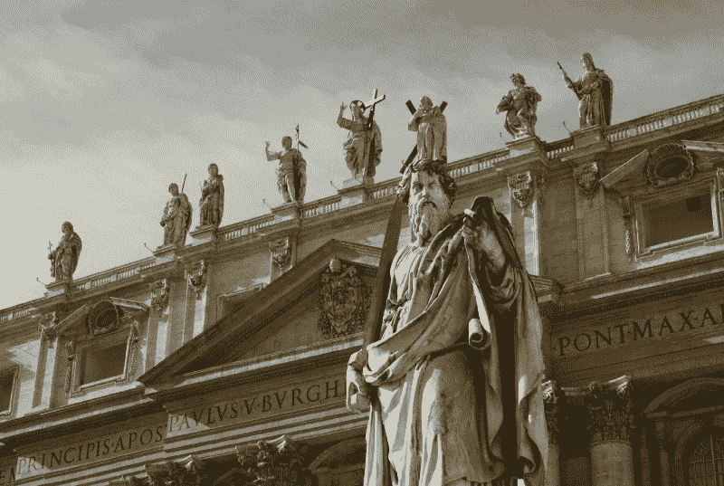

Photo by [Nils](https://unsplash.com/photos/kaEhf0eZme8?utm_source=unsplash&utm_medium=referral&utm_content=creditCopyText) on [Unsplash](https://unsplash.com/search/photos/roman-document?utm_source=unsplash&utm_medium=referral&utm_content=creditCopyText)

快进到 19 世纪，有些字体被设计成可以兼容不同的书写语言，如拉丁语、希腊语和西里尔语。这些是我们今天所知道和喜爱的超级家庭的一些最早的原型。

到了 20 世纪，无衬线字体种类激增，从而扩大了所有超级家族的变化可能性。在第二次世界大战之前的几年里(是的，我刚刚在一篇关于印刷术的文章中提到了第二次世界大战？)，世界著名的荷兰字体设计师 Jan van Krimpen 设计了第一套全面的具有内在兼容性的字体，这个项目叫做 R *omulus。*

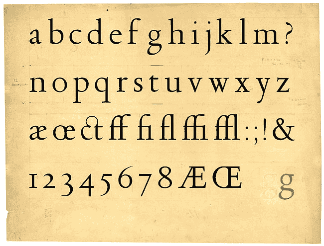

用他自己的话来说，他着手“创建一个完整的字体家族，首先包括罗马体、倾斜罗马体、半粗体和半粗体压缩体、至少四种无衬线字体、一种字体和一组希腊字符。”

这是迄今为止最雄心勃勃的字体设计项目，虽然他没有在战后完成，但这是现在字体设计中常见的东西的开始:超家族。

打哈欠。好吧，让我们来看看好东西。

### 这里有 10 个你应该知道的谷歌字体超级家族

我们已经讨论了它们是什么，它们来自哪里，以及为什么您应该使用它们。现在让我们来看看现实生活中的超级家庭。这里有一些来自[谷歌字体](https://fonts.google.com)超级家族的很棒的字体对，可以用于你的下一个设计项目！

#### 1) [四分之一秒](https://fonts.google.com/specimen/Quattrocento)和[四分之一秒](https://fonts.google.com/specimen/Quattrocento+Sans)

由[黑斑羚型](http://www.impallari.com/projects/overview/quattrocento-sans-family)设计

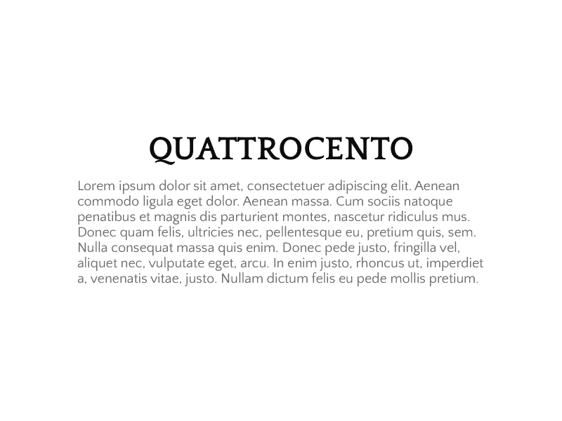

#### 2) [浓缩机器人](https://fonts.google.com/specimen/Roboto+Condensed)和[机器人](https://fonts.google.com/specimen/Roboto)

由克里斯蒂安·罗伯逊设计

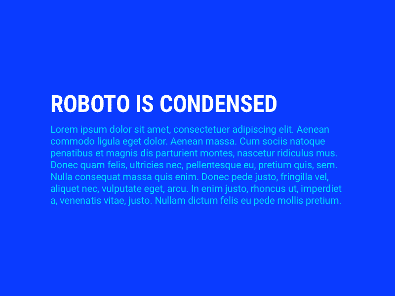

#### 3) [单声道机器人](https://fonts.google.com/specimen/Roboto+Mono)和[单声道机器人](https://fonts.google.com/specimen/Roboto)

由克里斯蒂安·罗伯逊设计

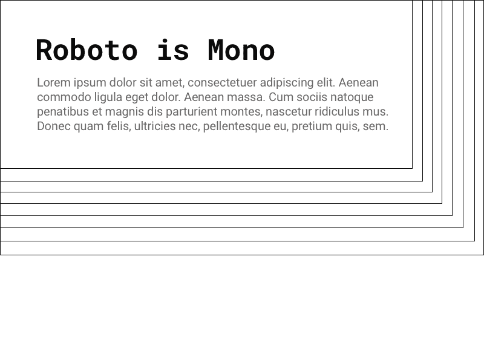

#### 4) [PT Sans](https://fonts.google.com/specimen/PT+Sans) 和 [PT Serif](https://fonts.google.com/specimen/PT+Serif)

由[副型号](https://www.paratype.com)设计

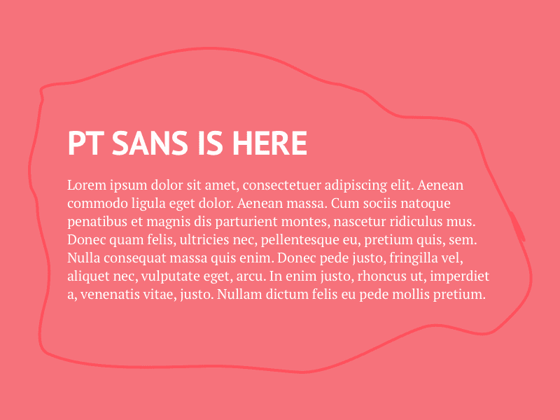

#### 5) [氧气单](https://fonts.google.com/specimen/Oxygen+Mono)和[氧气单](https://fonts.google.com/specimen/Oxygen)

弗农·亚当斯设计

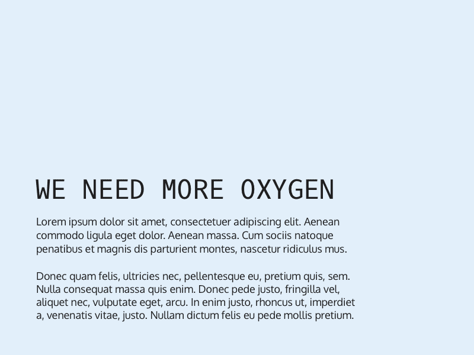

#### 6) [Source Sans Pro](https://fonts.google.com/specimen/Source+Sans+Pro) 和 [Source Serif Pro](https://fonts.google.com/specimen/Source+Serif+Pro)

由保罗·d·亨特和 T2 设计

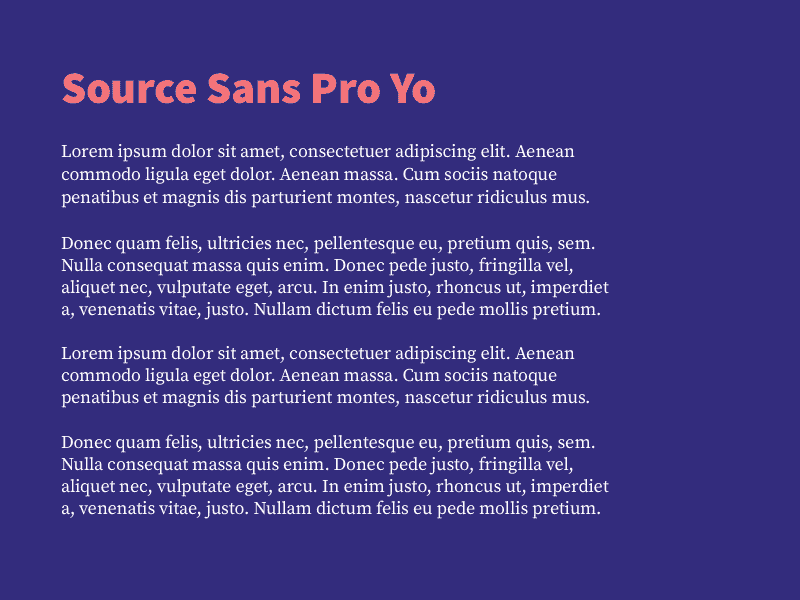

#### 7) [约瑟芬石板](https://fonts.google.com/specimen/Josefin+Slab)和[约瑟芬桑斯](https://fonts.google.com/specimen/Josefin+Sans)

由圣地亚哥·奥罗兹科设计

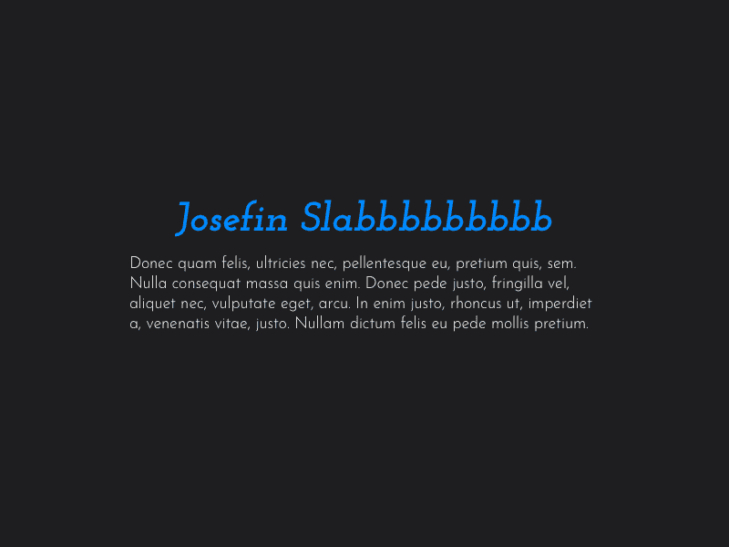

#### 8) [编码 Sans 半浓缩](https://fonts.google.com/specimen/Encode+Sans+Semi+Condensed)和[编码 Sans](https://fonts.google.com/specimen/Encode+Sans)

由[黑斑羚型](http://www.impallari.com/projects/overview/quattrocento-sans-family)设计

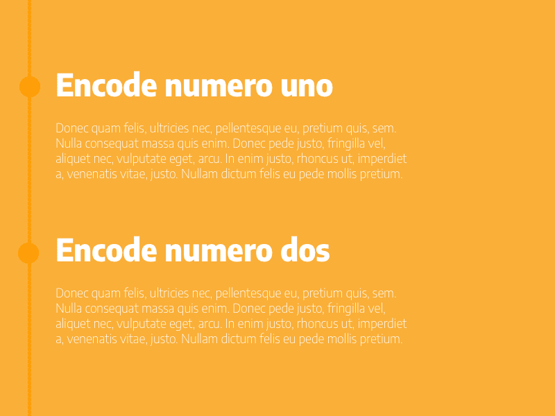

#### 9) [阿莱格雷亚](https://fonts.google.com/specimen/Alegreya)和[阿莱格雷亚桑斯](https://fonts.google.com/specimen/Alegreya+Sans)

指定由[排版花园](https://huertatipografica.com/en)【阿莱格雷】& [【胡安·巴勃罗·德尔佩拉尔】](https://huertatipografica.com/en)(阿莱加·桑)

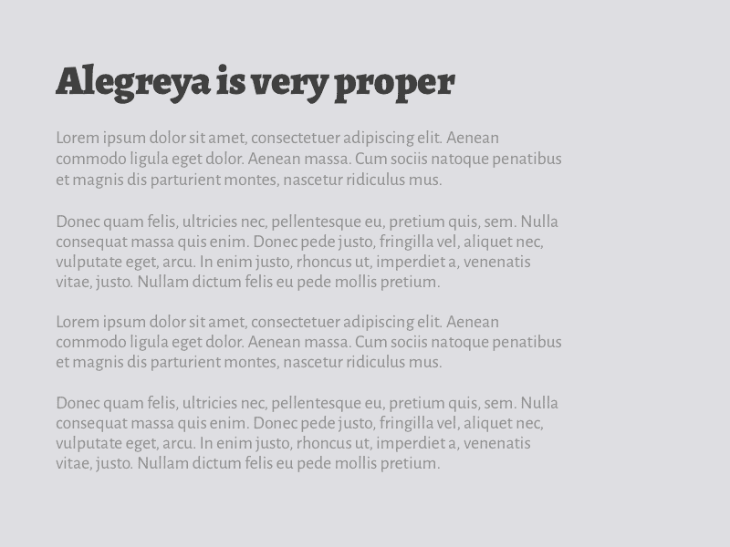

#### 10) [蒙特塞拉特](https://fonts.google.com/specimen/Montserrat)和[蒙特塞拉特候补](https://fonts.google.com/specimen/Montserrat+Alternates)

由朱丽叶·乌拉诺夫斯基设计

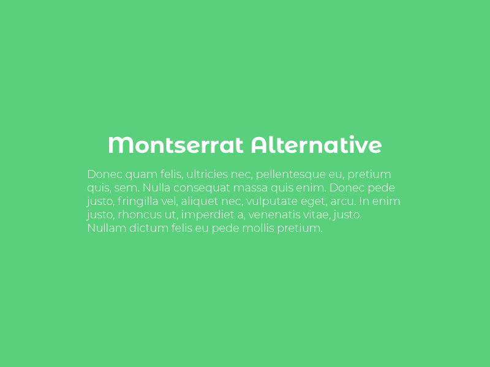

### 离别赠言

为你的下一个项目找到一个漂亮的字体对并不需要紧张、辛苦、耗时或者困难。超级家庭的设计是为了让你的网页看起来更漂亮，并创造视觉和谐。学会了解和热爱它们，你很快就会成为一名伟大的设计师！

请务必查看[字体配对](https://fontpair.co)，我们在那里帮助您将谷歌字体配对在一起，并为您的下一个项目提供一些非常棒的字体超家族建议！

### 额外阅读

如果你感兴趣，这里有更多关于超级家庭的资源:

*   Adobe Typekit 博客— [字体研究:配对字体](https://blog.typekit.com/2012/05/23/type-study-pairing-typefaces/)
*   Font lab videos—[Font super families 与萨姆纳·斯通的讲座](https://www.youtube.com/watch?v=lwqAbMhbLoQ)
*   Fonts.com—[超级家庭](https://www.fonts.com/content/learning/fyti/typefaces/super-families)
*   谷歌— [超级家族](https://fonts.google.com/featured/Superfamilies)
*   维基百科— [字体超家族](https://en.wikipedia.org/wiki/Font_superfamily)
*   Jan van Krimpen 设计的 Romulus

感谢海登和艾玛对本文的所有帮助。

欢迎在下面发表评论或在 Twitter 上联系我！